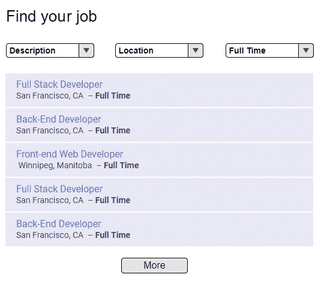
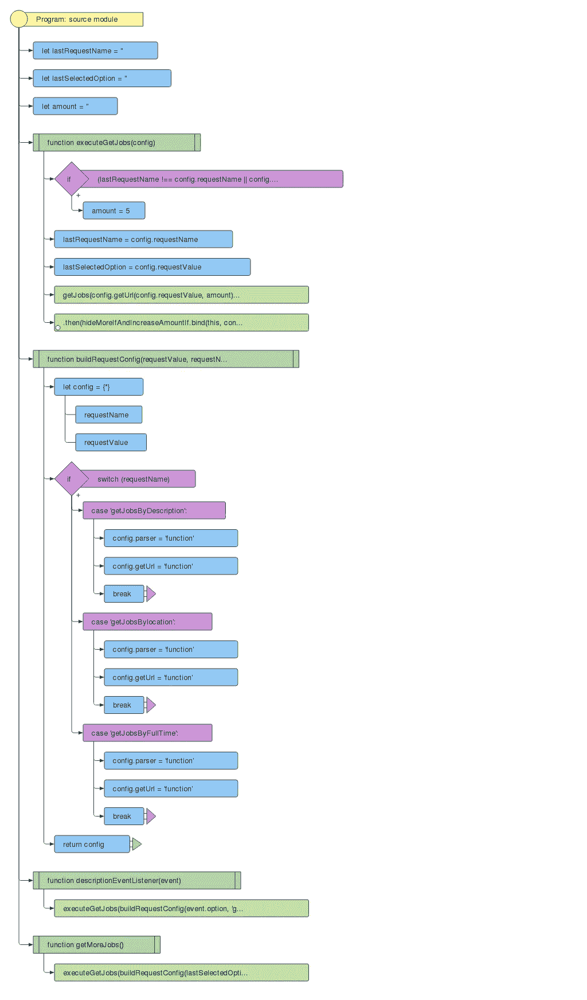

# 你要写一些代码吗？等一下，我看到了一个设计模式。

> 原文：<https://medium.com/hackernoon/are-you-going-to-write-some-code-wait-for-a-sec-i-see-a-design-pattern-here-783a9377cec6>


越来越多的时候，我看到一些工程师想要尽可能快地编写一个代码，解决一个问题，修复一个 bug，创建一个特性。最重要的目标是让你的代码运行起来，并按预期工作。从这里开始，我们面临一些挑战，如何**支持、维护、添加特性**到代码中，并希望没有魔法。

我过去和我工作的永久项目是长期项目。工程师可能来来去去，一个团队可以改变，但这里最重要的一点是动力。当一个新人加入一个团队，看到混乱的、不可理解的、没有文档记录的代码时，他们有两个选择。首先，接受它，与它一起工作，解决任务，因为我们有一个冲刺的终点。第二，控制局面，面对挑战，努力带领团队取得更好的成绩。

为了避免在团队中出现这种情况，让我们看看如何讨论、头脑风暴一个功能示例任务并解决两个主要问题，使一个功能工作起来，并为团队成员留下一些文档。

# 谁想实现“找工作”功能？



*对话中的一个团队。*

约翰:杰夫，你想拍一部新电影吗？
**杰夫:**当然！哪个，这个简单的有三个下拉名为“找工作”的？
**约翰:**对，“给你找工作”。我会给你的要求，请描述你将如何组织你的代码。记住，要求可能会改变。

## 要求

*   当从下拉菜单中选择一个选项时,**新任务**应出现在列表中，由所选选项过滤
*   默认情况下，列表中应该有 5 个作业
*   点击“更多”应提供另外 5 个职位，如果没有，然后隐藏按钮

约翰:杰夫，你准备好讨论了吗？
**杰夫:**确定。请看流程图*(是借助*[js-code-to-SVG-flow trade](https://github.com/Bogdan-Lyashenko/js-code-to-svg-flowchart)[命令模式](https://medium.com/u/d603b362727e#commandpatternjavascript)完全符合我们的需求。

> Command 模式旨在将方法调用、请求或操作封装到单个对象中，并为我们提供了参数化和传递方法调用的能力，这些方法调用可以根据我们的判断来执行。此外，它使我们能够将调用动作的对象从实现它们的对象中分离出来，从而在交换具体的类(对象)时为我们提供了更大程度的整体灵活性。 *~* [设计图案](https://addyosmani.com/resources/essentialjsdesignpatterns/book/)，Addy Osmani

更新后的流程图如下所示:



PRODUCTION

正如您从流程图中看到的，我们将有一种方法来获取作业。

```
executeGetJobs(config)
```

我们应该只在内部传递一个配置。config 有 **getUrl、parser、optionValue、selectName** 属性，方法 **executeGetJobs** 处理我们需要的所有逻辑。

# 让我们完成一项工作(自定义元素)

运行并检查存储库。

[](https://github.com/shystruk/command-pattern-in-web-components) [## shy struk/web 组件中的命令模式

### command-pattern-in-we b-components-在这里您可以找到带有 GitHub Jobs API (express 和 cors)的定制元素

github.com](https://github.com/shystruk/command-pattern-in-web-components) 

在我开始写代码之前，我一直在考虑使用哪种框架来获得更快的结果，这是常有的事。有角度的或者可能有反应的，Vue，哦该死的不，让我们用普通的 JS 风格用[自定义元素](https://developers.google.com/web/fundamentals/web-components/customelements)来做，并且保持组件方法。

> 有了[定制元素](https://html.spec.whatwg.org/multipage/scripting.html#custom-elements)，网络开发者可以**创建新的 HTML 标签**，增强现有的 HTML 标签，或者扩展其他开发者创作的组件。API 是 [web 组件](http://webcomponents.org/)的基础。它带来了一种基于 web 标准的方法，只使用普通的 JS/HTML/CSS 就可以创建可重用的组件。结果是更少的代码、模块化的代码，以及我们的应用中更多的重用。

这正是我们的应用程序所需要的。

由于我使用的是 GitHub Jobs API，所以 CORS 可能是个问题。Express 和 [cors](https://www.npmjs.com/package/cors) 也帮我解决了:

无论您有多少个下拉列表，侦听器都会发生变化，如下所示:

正如你在生产流程图中看到的，我们应该有一个方法`executeGetJobs`来完成所有的工作。

构建一个配置很简单。您需要了解在发出请求并返回 UI 作为响应的配置中必须包含什么。因此，如您所见，配置非常灵活，如果您需要添加更多选项，很容易做到。看一看:

最后一部分是 HTTP 请求，我称之为**资源。**我使用 ES6 模块(导入/导出),它们是单例的，实例是在模块加载时创建的。重要的是要记住，当你使用可重用的用户界面部件(组件)时，每个拥有可共享数据的对象/类都应该返回一个新的实例。

你问我为什么吗？答案很简单。Singleton 初始化一次，所以如果你有一个组件在两个地方，它们将使用相同的实例数据。因此，每个组件都将被修改并共享一个对象。在我的例子中，资源也不例外。因此，让我们在每次使用组件时获得一个新的实例:

最后，让我们看看资源 main GET 方法。正如你所看到的，`executeGetJobs`设置了我们需要用于`getMoreJobs`请求(lastSelectName，lastOptionValue)的所有数据。这些数据将帮助我们构建正确的配置。

# 结论

记住，解决任何问题的最好方法是向你的团队成员寻求帮助。不要忘记设计模式，它们使代码更具可读性、可伸缩性，这是软件设计中最著名的解决方案之一，所以每个人都会理解代码的作用。我喜欢 Web 组件的工作方式和创建方式。我一直在努力，很快会分享我的想法，并向你展示一个基于自定义元素的应用程序。是时候记住香草 JS 了:)

**感谢您的阅读。欢迎建议、评论、想法:)**

**如果你喜欢这个，鼓掌，跟我上** [**中**](/@shystruk) **，** [**推特**](https://twitter.com/shystrukk) **，**[**github**](https://github.com/shystruk)**跟你的朋友们分享一下** ✌️