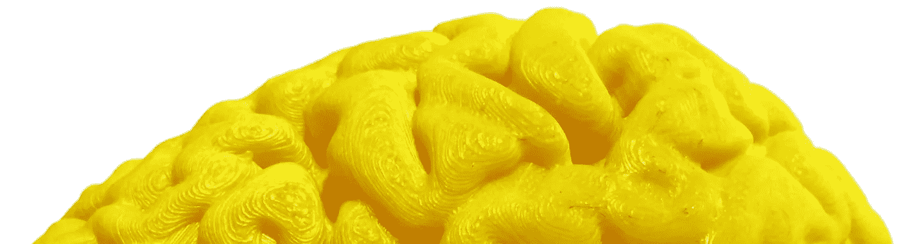
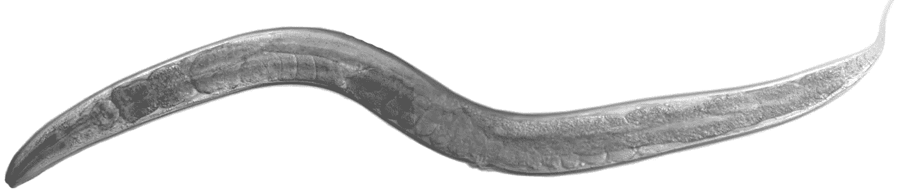
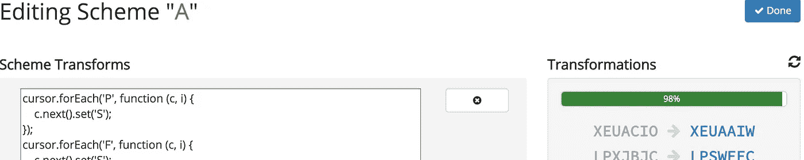
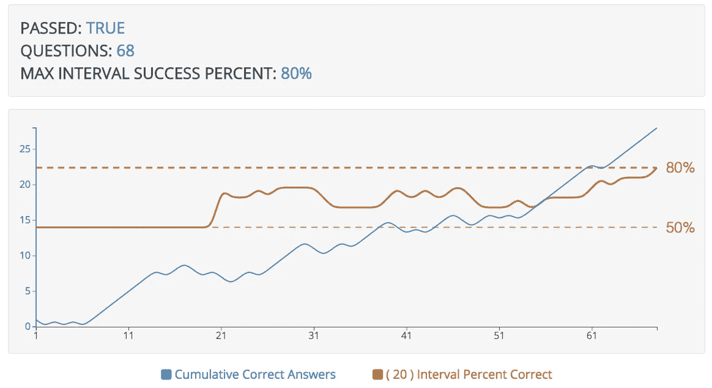
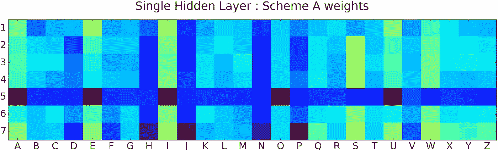
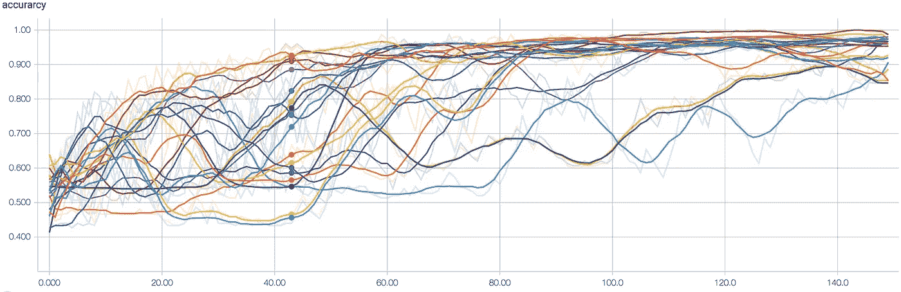
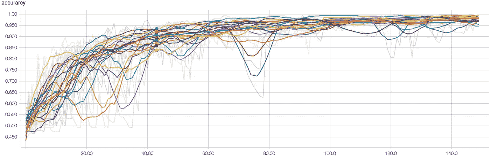

# 你直觉吗？挑战我的机器！

> 原文：<https://medium.com/hackernoon/are-you-intuitive-challenge-my-machine-82c3faed97da>

## 比较人类直觉和人工神经网络

# 计算机不可能有直觉…对吧？

“[直觉](https://hackernoon.com/tagged/intuition)这个词很少在人类语境之外使用，所以用在其他地方可能会显得**侮辱**。然而，现在可能是扩大这一术语的应用的时候了。

[机器学习](https://hackernoon.com/tagged/machine-learning)现在是现代生活不可或缺的一部分，它非凡的能力经常被拿来与人脑相提并论。直觉是否应该被列为人类和机器共有的特征？

机器比人类更有直觉吗？

# 什么是直觉？

为了对人类和机器进行有意义的比较，必须确定“直觉”的定义。思考一些活的有机体应该有助于启发一个有用的定义。

## “活”中的模式识别

秀丽隐杆线虫([一种被充分研究的小型蠕虫](http://features/CCCAS-3984-ui-a11y-review-changes))是一种对其环境模式反应良好的生物。总共只有 302 个神经元，它“知道”足够移动和进食。WTG 蠕虫！

[https://www.k-state.edu/hermanlab/images/elegans%20transparent.jpg](https://www.k-state.edu/hermanlab/images/elegans%20transparent.jpg)

相比之下，人类大约有 1000 亿个神经元(仅在大脑中)。这么多的神经元有助于产生紧急行为，比如使用语言的能力。

尽管差异很大，但人类和秀丽隐杆线虫有很多共同点。他们都无意识地识别模式。你不是有意识地解码你正在阅读的文字，秀丽隐杆线虫没有自我意识地对它们的环境作出反应。

## “直觉”的定义

“直觉”有许多定义，但下面的定义最适合本实验:

> 直觉是**无意识模式识别**的应用

首先，这个定义允许人类和秀丽隐杆线虫都被称为直觉的。最重要的是，由于神经网络还不被认为是有意识的，并且擅长模式识别，所以同样的定义可以应用于机器。

这个实验现在有了比较直觉的基础。

# 实验

这个实验的目标是比较人类和机器之间的**无意识模式识别**。如何在人类身上测试无意识模式识别？约翰·考尼奥斯和马克·比曼的《尤里卡因素》给出了答案(*我强烈推荐这本书给任何对自己的创造力和直觉感兴趣的人*)。

在“[尤里卡因素](https://www.amazon.com/Eureka-Factor-Moments-Creative-Insight/dp/1400068541)”中，有一个位于的[研究，是由“直觉研究的先驱”亚瑟·雷伯完成的在他的研究中，参与者被要求看像这样的字母串:](http://www.wjh.harvard.edu/~pal/pdfs/pdfs/reber67.pdf)

> RNIWKQ

每个字母字符串由两个规则集之一生成。规则集将模式引入到单词中。规则集中规则的一个例子是将字母“R”放在“N”的每个实例之前。

参与者被要求将每一串分成两个“家族”。他们被告知他们是对还是错，然后重复这个过程。Reber 发现，随着时间的推移，参与者可以比随机分组更好地对这些字符串进行分组。

Kounios 和 Beeman 指出，*真正有趣的是参与者无法解释他们在分类时使用的规则。直觉(又名模式识别)已经被开发出来了！*

如果一个神经网络可以被训练来对相同的字符串进行分类，那么衡量分类的准确性就可以成为比较的重点。

# 收集数据

人类和机器必须使用相同的字符串集进行分类，因此构建 web 应用程序是实现这一点的有效方式。

以下 web 应用程序是使用用于创建生成字符串的规则集的接口创建的:

Configuring the Rule Sets

一旦创建了规则集，该应用程序就可以向人类呈现 Reber 研究的在线变体:

Human presentation of the modified Arthur Reber Study

使用完全相同的规则集，应用程序可以导出用于训练人工神经网络的标记数据。

现在是分析数据的时候了。

# 人类的结果

使用机械土耳其人收集了 73 个人的结果[。](https://hackernoon.com/how-to-attract-turkers-and-be-the-ultimate-mechanical-turk-hero-75002da72c3d#.lkrw9t1zv)

在你看结果之前请随意 [**接受人类直觉挑战**](http://ec2-35-161-47-191.us-west-2.compute.amazonaws.com:3000/) 。平均需要 2.5 分钟左右。

当您达到预先设定的上限**或**时，测试停止，您在连续 20 串中达到 80%的准确度。对于每个参与者，web 应用程序记录 20 次连续尝试所达到的最高准确度(最大间隔成功百分比):

这是对 73 个人的分析:

*   连续 20 串的平均最好成绩是 69%。
*   只有 23.3%的参与者达到了 80%的门槛。
*   对于达到 80%准确率阈值的 23%的参与者来说，平均需要 43 个字符串。

和 Reber 的研究一样，平均来看，人们确实比运气做得更好(在这个实验中，50%是运气)。

此外，对于达到 80%准确率阈值的 23%的人，他们平均使用了 43 个字符串！对于那些击中目标的人来说，他们做得相对较快！

# 机器的结果

机器应该受到挑战，所以神经网络应该与最直观的 23%的人类参与者进行比较，他们达到了 80%的准确率。

为了匹配在平均 43 次尝试中达到 80%准确率的 17 名人类参与者，为人工神经网络创建了 43 个字符串的 17 个训练集。

神经网络需要有 69%的准确性来匹配整个人类群体，并且它必须超过 80%才能击败那些似乎特别直观的人类。

鼓声……

单隐层的神经网络**达到了 77%的准确率！**

它以 8%的优势击败了整个人类群体，但以 3%的优势输给了最优秀的人类。

那么什么是神经网络学习呢？看一看与方案“A”相关联的经过训练的神经网络中的权重:

注意网格第 5 行中元音出现的每一列的“热”(红色)权重。方案“A”有一个规则，强制每个单词中的第五个字母成为随机元音，所以很明显神经网络正在学习测试数据中的一些模式。

难道机器不应该做得更好吗？

# 扔给机器一块骨头

机器完全有机会注意到数据中的所有信息并做出反应，因此还有改进的空间。

调试一个神经网络是困难的，但是在训练时可视化精度的变化是一个很好的开始。下图显示了 150 次分类尝试中 20 次不同运行的准确性。

Accuracy of neural net (single hidden layer) during each step of training on a data set with 150 entries (x-axis)

在第 43 次尝试时，仍然有很多学习在进行。每次试验的准确性都在上下波动，而且试验之间有很大的差异。这种大的方差表明神经网络仍然是“模糊的”,没有像期望的那样快速收敛。

如果真的是**所有**可能的信息都能被神经网络看到，那么神经网络的结构一定不是最优的。

## 优化神经网络

第一个神经网络善于注意特定位置的字母，并检测字母的完全省略。

这是**而不是**擅长对创造角色之间“相对”关系的规则做出反应。例如，可能有一个规则说每个“N”都应该以“R”开头。这两个字母的组合可以出现在字符串中的任何位置。神经网络需要更好地使用这种模式。

调整神经网络以处理位置相关和位置不变模式([见技术分析](/p/c380ce5c595c) s)。这种方法获得了回报。

鼓声#2…

优化的神经网络**在 43 次尝试中达到了 87%的准确率**,并且与之前的神经网络相比差异更小。

为了进行比较，下面是 20 个不同数据集(150 个训练步骤)的精度图，这些数据集来自原始神经网络，然后是优化的神经网络。

FIRST NEURAL NET (single hidden layer)

OPTIMIZED NEURAL NET (single hidden channel + 2hidden layer channel)

第 43 次尝试的平均准确度提高了 13%,方差大幅降低了 66%。

总的来说，这个神经网络比整个人类样本的准确率高 **26%，比高性能人群的准确率高 **7%。****

机器赢了…他们发现了一条更好的学习曲线。

# 结论

**机器比人类更直观吗？**

这个实验表明，对于分类“随机”字符串的任务，答案似乎是“是”。最近还有许多其他突破表明，机器可以表现得和人类一样好，甚至更好。这里有几个例子:

*   [谷歌翻译接近人类水平的准确度](http://www.theverge.com/2016/9/27/13078138/google-translate-ai-machine-learning-gnmt)
*   [谷歌人工智能在围棋上击败人类](https://www.theatlantic.com/technology/archive/2016/03/the-invisible-opponent/475611/)
*   [机器学习诊断糖尿病视网膜病变](https://research.google.com/teams/brain/healthcare/)

**在所有可能的场景下，机器会在模式识别中占上风吗？**

大脑是一个高效的并行处理机器，它在学习时会发生物理变化。机器学习是强大的，但现在大多是静态的，仍然相对较慢。《连线》杂志最近的一篇文章说得好:“人工智能比智能更人工。”

所以放心吧。再过几年，你就不需要担心晚上把烤面包机锁起来了

**感谢阅读！**点击*中的*💚下面把这个推荐给别人！

# 相关故事和链接

*   [**神经网络设计对人类直觉的挑战**。](/p/c380ce5c595c)”
*   " [**如何吸引“Turkers”，做一个机械的 Turkers 英雄！**](/@JohnDavidFive/how-to-attract-turkers-and-be-the-ultimate-mechanical-turk-hero-75002da72c3d#.y9vhm2oy7)
*   [**人类直觉挑战的源代码**](https://github.com/gitsome/HumanIntuitionChallenge)

> [黑客中午](http://bit.ly/Hackernoon)是黑客如何开始他们的下午。我们是 [@AMI](http://bit.ly/atAMIatAMI) 家庭的一员。我们现在[接受投稿](http://bit.ly/hackernoonsubmission)，并乐意[讨论广告&赞助](mailto:partners@amipublications.com)机会。
> 
> 如果你喜欢这个故事，我们推荐你阅读我们的[最新科技故事](http://bit.ly/hackernoonlatestt)和[趋势科技故事](https://hackernoon.com/trending)。直到下一次，不要把世界的现实想当然！

