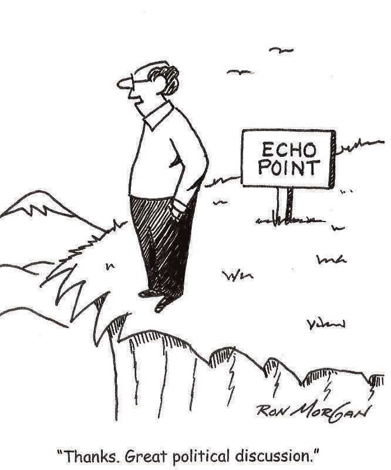
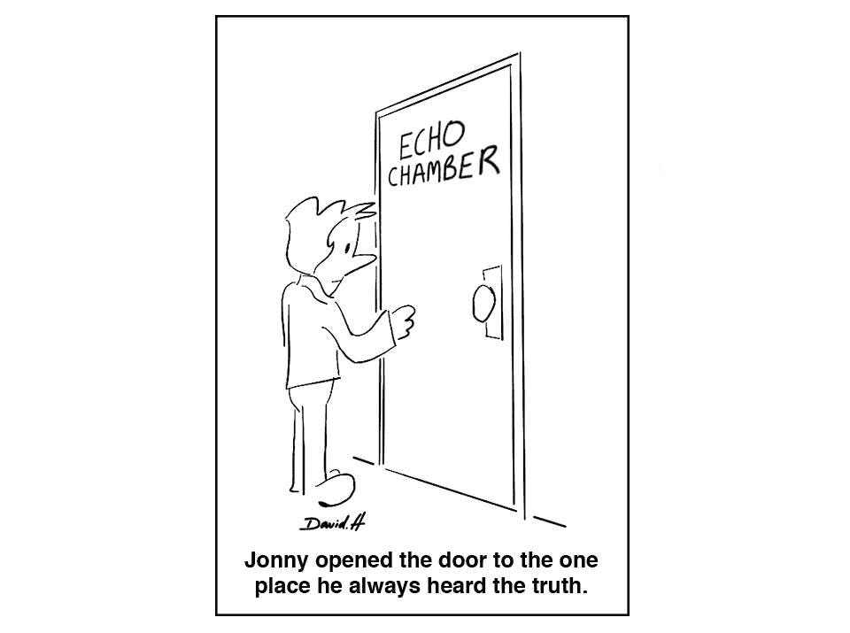

# 你住在回音室吗？

> 原文：<https://medium.com/hackernoon/are-you-living-in-an-echo-chamber-d25ed166c45f>

最近，我开始对我获取大部分信息的地方进行更严格的审视。作为年轻的千禧一代，这通常意味着互联网。但是，在很大程度上，我最终依赖于少数我“信任”的来源，或者我认为是最内省的来源。这可能是我选择访问的新闻媒体，我虔诚观看的深夜节目，我选择阅读的博客或我选择关注的社交媒体账户。这份清单上的大多数项目都带有自己的偏见。新闻媒体倾向于“自由派”或“保守派”。政治博客倾向于“左倾”或“右倾”(..或“极右”)。见鬼，即使是喜剧演员在重大政治问题上也有自己的立场。

当然，这本身并没有什么错。有意见是很自然的。几乎不可能产生任何形式的内容而不无意中让自己的观点和偏见渗透进来。

但另一方面，这也让人们极其容易在不知不觉中陷入自己的信息泡沫。它让一个人很容易不断地被灌输强化他或她现有信念的信息。这减少了那个人遇到任何挑战他们想法的论点的可能性，从而重新评估他们的想法。

例证:*2016 年美国大选。*整个 2016 年，我的新闻订阅不断被充斥着“抨击特朗普”的文章淹没(这一趋势尚未完全消退)。看到你身边的这种一致性，自然会让你相信这一定是大多数人的观点。这使得“另一方”的观点——相当大一部分人——完全无关紧要或看不见。即使是现在，美国社会似乎也存在两个完全独立的截然不同的部分——一个认为这个国家正在逐渐陷入混乱和无能，而另外 45%的人完全相信这个国家正朝着正确的方向前进。令人着迷的是，一个群体似乎很少与另一个群体有交集，更不用说理解他们了。

承认社交媒体平台在这方面发挥的作用也很重要。像脸书、谷歌、推特这样的网站有能力独特地识别你最有可能接触的内容(图片、视频、链接),然后只向你展示这些内容。Reddit 上也有成千上万的子编辑，每个子编辑又由成千上万的人组成，他们持有相同的观点，并广泛地相互认同(想想 r/SandersForPresident，r/conservative，r/liberal 等)。).

从某种意义上来说，这很棒，因为你在这些平台上的体验是根据你的口味量身定制的。但问题在于，越来越多的人依赖这些网站作为他们的主要新闻来源。如果你的订阅只给你看它已经知道你想看的新闻，而把它认为你觉得不愉快的东西都扔掉，我猜你的世界观*可能*有点*倾斜。*

*再加上社区的从众心理。很多时候，网络社区会发展出自己的思想。像 Medium 和 Quora 这样的地方，不管出于什么原因，都是由更左倾的作家主导的。这通常*

**

*但是像这样的回音室并不是互联网独有的。人类是一个社会物种。你的想法和观点受到周围人观点的强烈影响，反过来也会影响周围人的观点。我们都喜欢和有相似信仰和想法的人在一起，组成志同道合的群体。*

*当你考虑到你对任何给定问题的感受都受到几个不同因素的严重影响时，这种体验只会被放大，从你生活的城市，到你成长的家庭类型，到你工作的组织——并非所有这些都是你可以控制的。例如，生活在一个多元化、对移民友好的城市、从小接受多元文化的人，会对移民政策持有与生活在更偏远的农村地区的人截然不同的观点，这是因为这两个群体都没有错。这里的关键是没有分歧。每个群体中的一个人都被其他人包围着，这些人大多持有相同的观点，因此客观地认为他们的观点是“正确的”。*

*如果每个人都只是简单地为他们已经相信的东西寻求确认，就不太可能有任何深思熟虑的辩论。越来越多的人会被锁在自己的泡泡里，无法与任何不认同自己意识形态的人交往。为了更好地解决这个问题，重要的是要更加注意。让自己被来自不同领域的声音包围是很重要的。重要的是要有意识地确保你试图给辩论的不同方面一个公平的听证，而不是不断地强化你自己的假设。*

******

> *[黑客中午](http://bit.ly/Hackernoon)是黑客如何开始他们的下午。我们是 [@AMI](http://bit.ly/atAMIatAMI) 家庭的一员。我们现在[接受投稿](http://bit.ly/hackernoonsubmission)并乐意[讨论广告&赞助](mailto:partners@amipublications.com)机会。*
> 
> *如果你喜欢这个故事，我们推荐你阅读我们的[最新科技故事](http://bit.ly/hackernoonlatestt)和[趋势科技故事](https://hackernoon.com/trending)。直到下一次，不要把世界的现实想当然！*

**