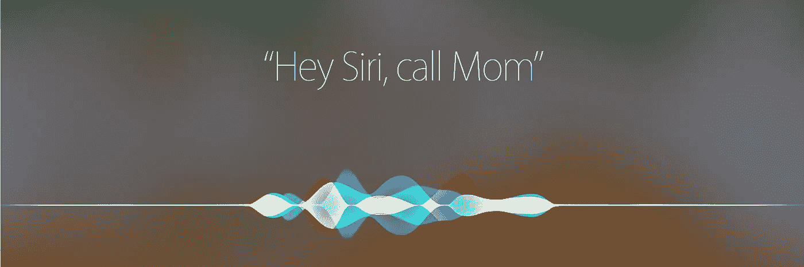

# 你对你的虚拟助理很粗鲁吗？

> 原文：<https://medium.com/hackernoon/are-you-rude-to-your-virtual-assistant-b4ee01ac302>

2017 年是智能音箱之年。亚马逊的 Echo Dot 和谷歌的 Home Mini 目前售价约为 30 美元，这使它们成为一种受欢迎的圣诞礼物。使用人工智能(AI)从未如此便宜，它终于达到了临界质量。

公司对人工智能的投资比以往任何时候都多:自然语言识别仍然需要改进很多，但目前的算法已经令人印象深刻。我最喜欢的例子:现在可以问“*去第 15 大街的星巴克要多长时间？*”并通过正确的假设获得准确的响应。活着是多么美好的时光啊！

所有这些进步都伴随着副作用:必须学会如何与机器对话。通常，人们在没有唤醒关键字的情况下开始说话，有时他们会忘记检查设备是否真的在听，当他们的询问没有响应时会感到困惑。与机器对话并不容易，而且通常很不令人满意。

也许正是这种不满让我们在面对人工智能时不太注意自己的举止。如果有人突然用“*停*”打断你的话，你会怎么想？如果有人不停地给你下命令，从不停下来感谢你，会怎么样？我们大多数人都是这样和 Alexa 或 Siri 这样的人工智能说话的，从来不说“*请*”或“*谢谢*”。

今天，我们已经可以与自动化客户服务、计算机和智能手机、电视和汽车对话。家里的智能音箱让我们间接与恒温器、灯、门等对话。很快，我们也将与电梯、自动化店员或商店收银员对话。简而言之，一整天不与机器对话将变得越来越困难。

当我们习惯于和越来越多的机器交谈时，我们的社会会变得越来越没有礼貌吗？如果我们不再有礼貌，我们会变得没有同情心吗？一旦机器看起来越来越像我们，我们是否能够调整自己的举止？

我想在我的 Google Home 中测试一种模式，只有当请求中包含单词“ *please* ”时才会有反应。如果我们被迫在技术中加入人性，也许我们与技术的关系会改变。或者[也许我们最终会爱上我们的虚拟助理](https://geekonrecord.com/2014/01/17/why-we-will-never-fall-in-love-with-our-virtual-assistant/)。

你呢？你如何称呼你的人工智能？你有没有说过“*请*”？请在评论中告诉我们。

你喜欢这篇文章吗？ [**每月订阅**](https://geekonrecord.com/subscribe/) **一篇新帖。**

*图片来自苹果*

*原载于 2017 年 12 月 30 日*[*【geekonrecord.com】*](https://geekonrecord.com/2017/12/30/are-you-rude-to-your-virtual-assistant/)*。*