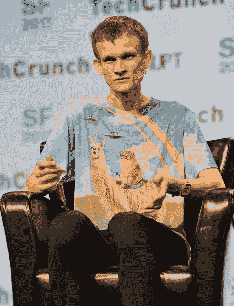

# 你是加密货币顾问吗？

> 原文：<https://medium.com/hackernoon/are-you-the-cryptocurrency-consigliere-7e21ada7eb46>

## **寻求帮助:寻找一种神秘的加密货币生物**

Vitalik Buterin and his unicorn-alpaca

*   每天早上醒来都有种穿得像 TechCrunch Disrupt 的[维塔利克·布特林](https://medium.com/u/587a00dbce51?source=post_page-----7e21ada7eb46--------------------------------)。
*   用一次性手机给 T4 和中本聪发短信(通常是关于天气的)。)
*   知道了萨默维尔的秘密，马将电话线转给了[普罗尼尔斯](https://medium.com/u/476fef41daf5?source=post_page-----7e21ada7eb46--------------------------------)人。
*   2003 年投资了一种[加密货币](https://hackernoon.com/tagged/cryptocurrency)。实际上，他在 1996 年创造了加密货币这个术语。见鬼，1964 年想到了加密货币。
*   背下了这个 [cburniske](https://medium.com/u/2a8f9285c9aa?source=post_page-----7e21ada7eb46--------------------------------) [估值方程](/@cburniske/cryptoasset-valuations-ac83479ffca7)，还能倒背如流。
*   是矿工。比如煤。戴着贴有贴纸的安全帽。
*   一提到杰米·戴蒙就发出蛇一样的嘶嘶声。
*   在黑暗网络上出售插图。
*   从第一次生命中化身为猫科动物。具体来说，[前 Mt. Gox CEO 的猫，Tibane](https://www.reuters.com/article/us-bitcoin-mtgox-karpeles-insight/at-mt-gox-bitcoin-hub-geek-ceo-sought-both-control-and-escape-idUSBREA3K01D20140421) 。
*   开发了完全冷藏的专有冷藏解决方案。
*   奥拉夫的头发。没有慕斯。

如果你合适，请通过在[以太坊](https://hackernoon.com/tagged/ethereum)中写入智能合同来联系我们…

> 或者发这个微博。

我将为媒体鼓掌做一个标记。如果您想参与预售，请点击下方。