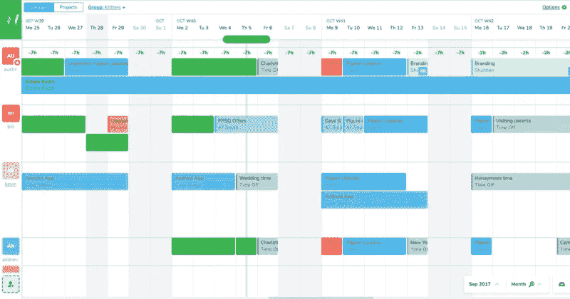
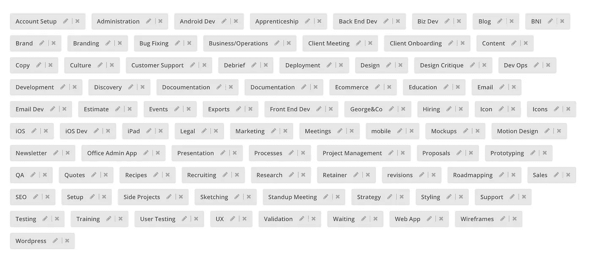
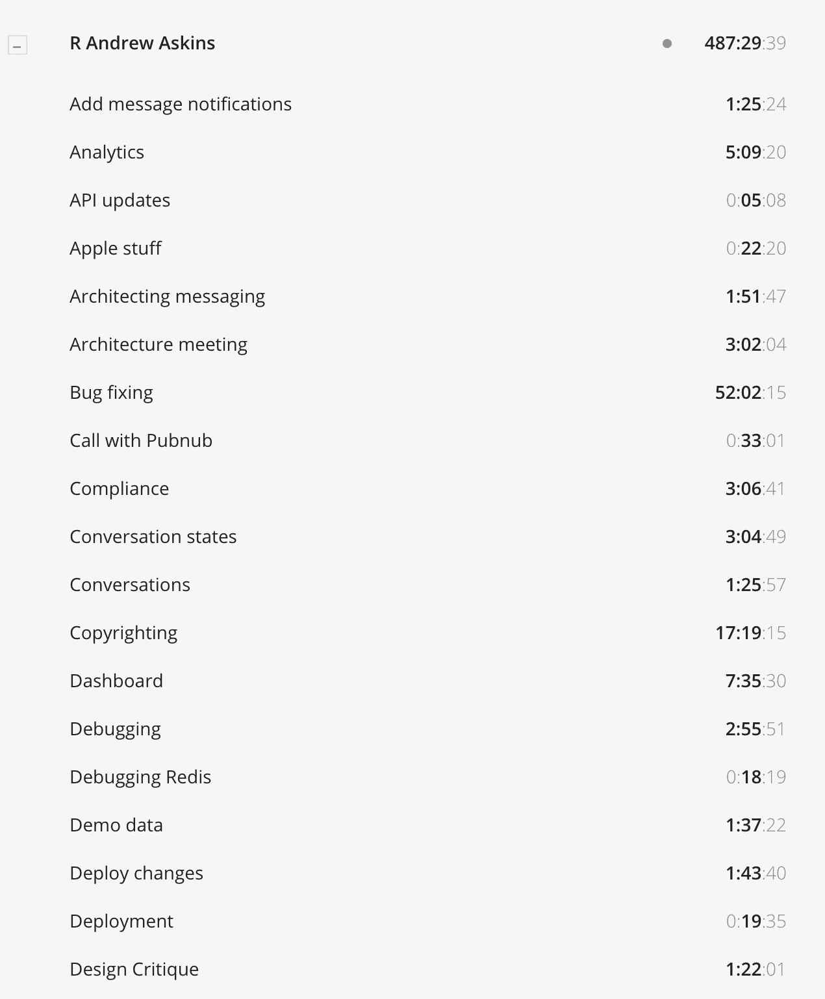
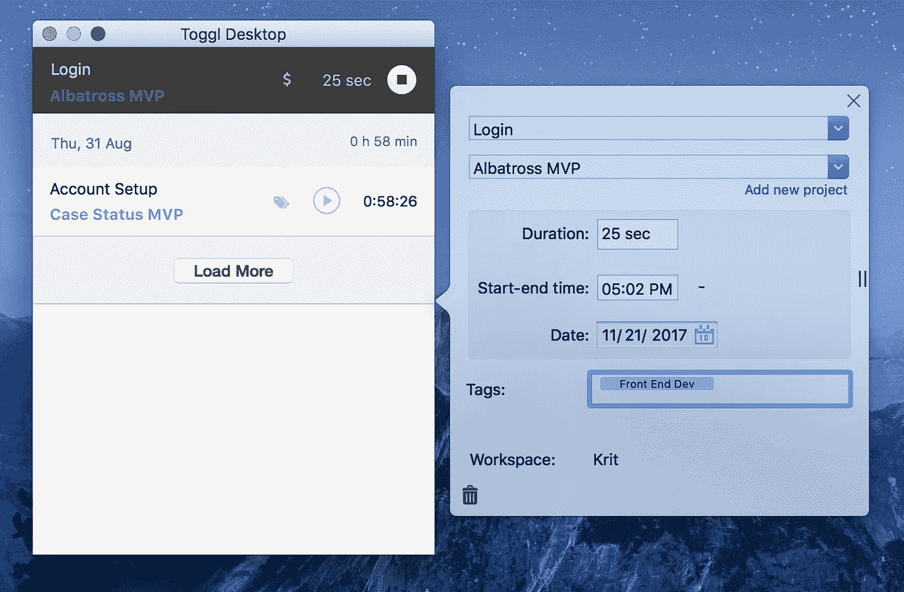
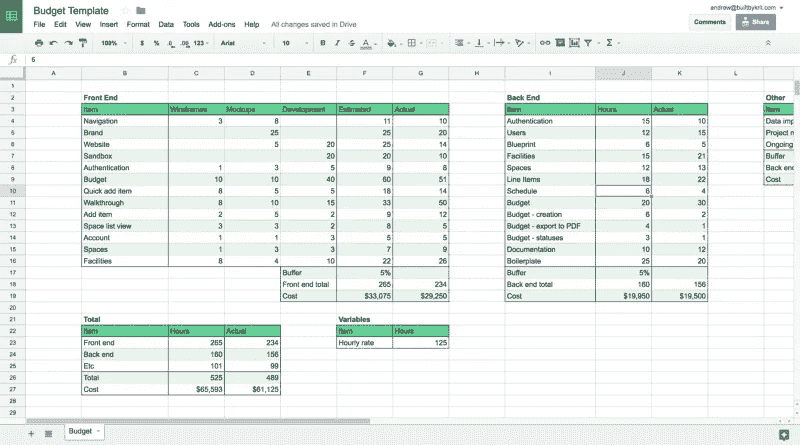
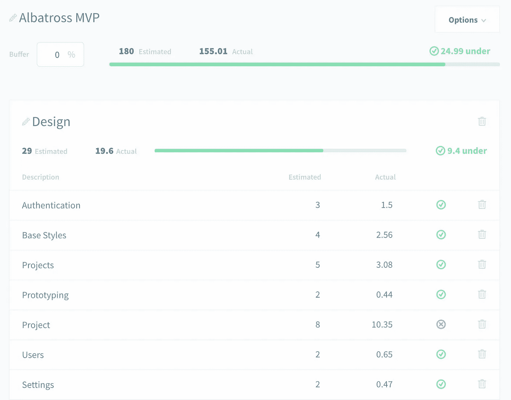

# 你追踪时间的方式正确吗？以下是如何避免我们的错误。

> 原文：<https://medium.com/hackernoon/are-you-tracking-your-time-the-right-way-heres-how-to-avoid-our-mistakes-5ae37b92fee1>

我以前写过如何[糟糕的时间估计几乎让我们的公司](https://hackernoon.com/how-we-improved-our-engineering-estimates-by-1082-4f31d3063a28)破产，以及我们如何改善它们超过 1000%。但是我仍然有很多问题，关于开发团队如何更好地跟踪他们的时间，或者什么时候开始有好处。

问题是，在这个行业工作的每个人都不断被告知要跟踪他们的时间。因此，人们本能地这样做——无论他们是否按小时计费——但却没有以任何实际产生有用数据的方式这样做。最终结果？他们工资过低，筋疲力尽，最终为了找工作而关门大吉。

对我们来说，当我们连续有两个项目，检查了我们对这两个项目的估计，然后不知道超出项目/时间估计的地方，我们知道我们必须改变事情。

## 我们过去常做的事

我们过去所做的是记录我们的时间，并在非常宽泛的标题下输入我们在每一个时间条目中所做事情的详细描述。实际的描述对任务来说是非常具体的……但是当你处理一个有两千个小时的项目，并且有成百上千的时间日志，你几乎不可能通过这些描述来分类，并且看到你正在进行的地方。

**这就是我们所改变的:**

## 更多类别和里程碑

我们总是将评估分为几大类，然后是更短的里程碑。顶级类别是设计、后端、iOS 应用程序等。—通常需要 4–8 周的大量工作。在它下面是里程碑，是评估下的子项。我们对它们的新的经验法则是它们不能超过 25 小时(我们经常把它们分解成更小的增量)。

对我们来说，25 个小时分解为大约一周，通过反复试验，我们发现如果我们的里程碑超过一周，我们就离开了，在回顾中很难找出是哪个具体的事情导致了估计的偏离。甚至不一定是范围蔓延干扰了我们的估算——大多数时候，当你估算一大块工作时，更容易出错。将它保持在一周内让我们很容易看到我们高估或低估了哪一部分，并使我们不太可能发生连锁低估的多米诺骨牌效应。

我们还确保记录这些里程碑的估计，并向我们的客户提供细分。以前，我们只给客户大项目的数字，也许是类别的数字。这些也是我们唯一会保存的数字。这意味着我们必须查看的唯一估计是 4-8 周的时间，这也使得我们无法看到是哪些具体的事情导致了我们的估计不准确。

最后但同样重要的是，所有的里程碑都在 Teamweek 的甘特图上显示出来，所以我们可以很容易地看到它们是如何排列的，以及我们所处的位置。

在我们的例子中，我们的每个团队成员都有不同的专长，并且倾向于做不同的事情，所以很容易将工作分开，让一个人负责一个里程碑。除此之外，这取决于个人——比尔，我们的后端开发人员，喜欢把他的里程碑分成更小的，非正式的 1-2 天的里程碑。

所有这些都意味着，当我们完成一个项目时，我们可以查看构建一个特定功能花费了多少时间，并准确地知道这些时间去了哪里，以及该功能的哪个部分花费了最长的时间。

我们必须做出大量改变的一个领域是确保没有人或流程的一部分成为瓶颈。

例如，我们现在首先为 API 编写文档。我们过去构建所有东西，并在进行过程中为其编写文档，或者在项目结束时编写文档，但这最终导致了前端和后端工作之间的延迟和沟通障碍。

但是，如果一开始就做好了文档，后端和前端都知道数据将如何传递，前端可以立即开始模拟，然后在构建时插入后端。

## 改变了我们的追踪方式

为了配合我们新的整体流程，我们还改变了在 Toggl 中跟踪事物的方式。我们在 Toggl 中有顶级类别的标签，如设计、前端、后端、iOS 和 Android。然后，当涉及到跟踪里程碑时，我们使用描述字段来跟踪它们。

所有这些变化意味着我们可以更容易地看到我们在项目的特定里程碑或部分上花了多少钱，而无需筛选数百个单独的条目。

以下是一些截图，展示了我们的团队 Toggl 过去是多么混乱:

Note the huge amount of tags — some of them overlapping!

Tasks ranging from 18 minutes (too small to be useful data) to 52 hours (which part of bug fixing took so long?)

下面是我们现在如何使用 Toggl 的一个例子:

标签“前端开发”对应于类别。该项目是信天翁 MVP。描述“登录”对应于较小的里程碑。如果我们在两个不同的时间记录“登录”工作，Toggl 将在他们的报告中合并它们。

## 创建了一个电子表格…然后建造了信天翁

我们需要做的最后一件事是找到一种方法，轻松地将所有这些指标与我们最初的估计进行比较，并查看我们超出或低于多少。我们创建了一个谷歌电子表格来方便地跟踪它([在这里下载你的副本](https://docs.google.com/spreadsheets/d/1OQjiHEbahS1UM_Fgnt5gXevZHTTtP2FqjNATjSYl610/edit?usp=sharing))。在每个周末，我们从 Toggl 中取出我们的日志，并更新电子表格，这给了我们一个项目脉搏的手指(如果我们开始偏离轨道，很容易纠正)。

电子表格给了我们一些我们一直非常缺少的东西:对我们数据的真正理解。我们第一次创建它时，在项目结束时更新了它，却发现我们已经检查了几项任务。不同的是，这一次我们确切地知道我们在哪里检查了，检查了多少，而不是仅仅知道我们的项目结束了，不知道如何确保这种情况不会再次发生。对于下一个项目(案例状态)，我们开始每周更新电子表格，我们仍然检查了几个类别，但在项目结束时，我们比计划提前了两周，并且在大多数类别上都低于预算。

它还帮助我们战胜了总体范围蔓延——在一个案例中，我们的客户想要向应用程序添加一种新的用户类型，但是看了电子表格，我们知道我们必须要么为这种添加收费，要么削减它，因为它不在估计之内。

**使用电子表格的缺点是什么？**更新它所花费的时间。每周花大约一个小时来整理 Toggl 和更新电子表格，这意味着在特别忙的几周很容易跳过这项任务。当我们跟上进度时，这个月损失的[生产力](https://hackernoon.com/tagged/productivity)仍然高达 500 美元。这是构建信天翁的部分动力:更新自动发生，我们一眼就能看出哪些项目有被超越的风险。

# 外卖:

*   将项目分成更多更小的里程碑，目标是 25 小时或更少。
*   在编写 API 之前先编写 API 文档，以使移交更加容易。
*   将您的时间跟踪条目与您最初估计的里程碑相匹配。仅在您的初始评估中使用里程碑进行跟踪，不创建新的描述。
*   定期更新你在每个里程碑上花费的实际时间。

我们正在构建一个工具来帮助您创建更准确的[软件](https://hackernoon.com/tagged/software)评估。**用** [**信天翁**](http://getalbatross.com/) **提高你的余量，重新掌控你的时间。**

MVP 是我们过去使用的时间跟踪电子表格的超级强大版本。随着它的发展，我们将做更多的工作来帮助您利用您的数据创建更好的评估。

*原载于***。**