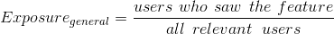
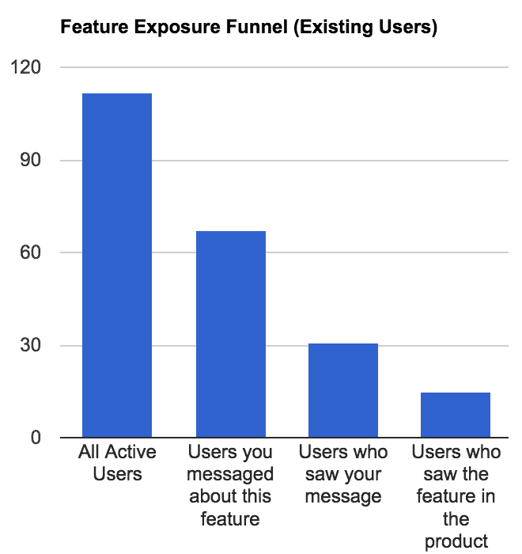
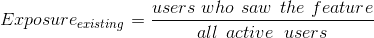
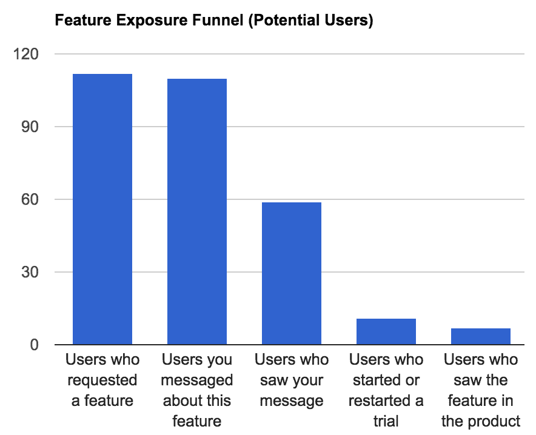
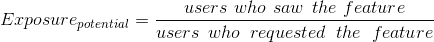

# 你的特性真的能改善你的产品吗？

> 原文：<https://medium.com/hackernoon/are-your-features-actually-improving-your-product-9344b8a90cf2>

*这是我为* [*Sysdig*](https://sysdig.com/?utm_source=medium&utm_medium=link&utm_campaign=cooks-blog-post) *做咨询时写的一篇文章，这是一个很棒的容器原生监控平台。*

理论上，新功能应该帮助用户从产品中获得更多价值。他们有无数种方法可以做到这一点。一个功能可以帮助高级用户利用更高级的功能，或者一个功能可以帮助新用户理解产品的基础。尽管存在这些差异，衡量它们如何影响产品使用的方法是相似的。

我喜欢把我的分析分成三个不同的类别:曝光率、使用率和留存率。

1.  曝光度:量化实际看到并使用该功能的用户数量/百分比。
2.  用法:确定这些人如何与功能交互。
3.  保留:着眼于特性可能对产品的长期使用产生的影响。

曝光和使用分析通常可以在发布后一周内进行，但真正理解保留需要更长的时间(通常是几个月)。

我将解释如何用适用于任何一种特性的足够宽泛的笔触来处理下面的每个类别。

# 暴露

如果他们不知道你刚刚花了几天，甚至几周或几个月的时间开发的功能，他们是不会使用的。不，仅仅发布一篇关于这个特性的博文是不够的。你的大多数用户都不读你的博客。不幸的是，特征发现经常被忽略，尽管它很容易做到。但这是另一篇文章的主题，所以我不会在这里深入讨论如何做。

曝光率基本上是看到你产品特性的人数与对该特性感兴趣的人数(相关用户)的比率。你试图测量的特征决定了你如何测量暴露程度。一般来说，功能是针对*新*用户、*现有*用户，或者*潜在*用户的。对于每种类型的特征，分母是唯一会改变的东西。

为了在这个计算中计入分子，用户必须打开你的应用程序，并看到他们将使用你的应用程序中的功能的屏幕。查看电子邮件或博客文章是不够的，因为人们可以在不实际阅读的情况下打开内容，但他们不太可能在你的应用程序中这样做。如果该功能是一个现有的、混乱的屏幕的一小部分，我会使用[工具提示](https://hackernoon.com/tagged/tooltip)或类似的东西来吸引他们的注意力，并将与该工具提示的交互视为该功能的视图。当然，任何与该功能交互的人都被视为看到该功能的用户。

## 面向新用户的功能

现有用户不会使用新的入职流程，您可能也不想告诉新用户。然而，曝光在这里仍然是相关的。它的主要目的是健全检查你的期望。不管功能的大小如何(全新的入职流程与改变它的一个方面)，您仍然希望确保您的期望与看到该功能的人数相符。如果您刚刚发布了一个新的入职流程，您可能期望 100%的用户都使用它，但是，如果用户可以跳过或退出流程，情况可能就不是这样了。换句话说，针对新用户的功能展示将会发现你的产品在通往 a-ha 时刻的道路上的缺口。

## 现有用户的功能

这些功能应该可以帮助你现有的用户从你的产品中获得更多的价值，但是如果没有[了解和使用这些功能，用户就无法释放这些价值。你可以把这个过程想象成一个漏斗。您从一组将受益于该特性的用户开始。希望这包括所有用户，但也可能不包括。然后你告诉他们你构建的可爱的新特性，并希望他们使用它。](https://hackernoon.com/tagged/learning)

很明显，一些用户可能看不到你的信息，但仍然会发现这个功能，所以漏斗可能没有一个完美的降序排列。

只需查看漏斗的第一步和最后一步，就可以简化某个功能的总体暴露度量:

## 面向潜在用户的功能

最后一类功能是给那些看了你的产品但声称他们不感兴趣的用户，因为它缺少 x 功能(你一直在跟踪这个，对吗？).对于这些功能，你要确保你接触到每个请求它们的人，然后跟踪有多少人真正回到这个产品并尝试这个功能。同样，漏斗在这里很好用:

# 使用

你可能认为使用分析是我们发现功能有多有用/多棒的地方，但是在功能推出后很难量化价值(什么是价值？更多的时间在产品上？在产品中花费更少但更有效的时间？).因此，我们等到分析的保留类别来评估一个特性的价值。使用是计算价值的中间步骤，目标是*了解人们如何与功能*交互。这应该给出一个特性有用性的一些指示。

我们在这里想知道的是，人们是否以预期的方式参与了该功能。换句话说，设计和实现表现如何？您可以从一般的观察开始，但是您可能想要跟踪单个用户的操作，以辨别某些用户选择了什么样的路径。探索性分析是其中很大的一部分。

这种分析非常依赖于特性，所以您必须对如何看待数据做出主观判断。以下是一些你可能会用到的方法以及它们擅长的方面:

*   漏斗:绘制用户从查看一个特性到成功完成该特性的使用的进度(成功可以是像创建一个警报/仪表板或在 Slack 中接收一个通知这样的事件)
*   树:追踪用户在应用中的移动(每个节点代表完成每一步的人数)
*   条形图:比较不同选项的受欢迎程度
*   折线图:显示行为随时间的变化(是否有更多的人使用该功能)

一旦你做了一些图表，确定了一些感兴趣的领域，就开始钻研吧。用户遇到任何错误了吗？他们是否在某个特定阶段放弃了产品或流程？这可能有助于接触特定用户，以获得更多关于他们为什么这样做的信息。

在继续保持之前，立即解决任何明显的问题可能是值得的。

# 保留

这是最具挑战性的，但通常也是分析特性使用最有启发性的部分。由于一项新功能不太可能让人们在使用后立即取消或升级，所以你必须等待很长时间，才能开始尝试理清一个功能与保留/收入的关系。然而，这种额外的时间使事情变得复杂:它让用户有更多的机会因为其他原因爱上或失去对产品的兴趣，这些原因模糊了特定功能对结果的贡献。

为了解释这一点，密切关注使用某个功能的人数非常重要。使用某个功能的人越多，就越有可能在他们中间形成一种趋势。这就是为什么衡量和最大化暴露是至关重要的。对于基准测试，在尝试计算保留率之前，我将使用 3 个月和 60 个用户作为最低标准。

一旦过了足够长的时间，或者有足够多的用户与某个功能进行了交互，那么你可以使用几种不同的方法来梳理使用和保留之间的相关性:群组报告和回归。

## 群组报告

你可以使用 SQL 创建一个时间群组报告，但是如果你不知道 SQL，Mixpanel 使得创建一些时间群组报告变得非常容易。它们允许您创建 3 种不同的群组报告:重复报告、首次报告和成瘾报告。重复对于跟踪一段时间内相同功能的使用情况非常有用。第一次很适合在两个行动之间建立联系。上瘾告诉你，随着时间的推移，人们使用你的产品是多了还是少了。每个群组报告都根据时间将人们分组。

你也可以根据使用情况将人们分组，尽管你必须在 Mixpanel 之外这样做。例如，您可能想要比较在试用期间没有创建提醒的人、创建了提醒的人以及创建了多个提醒的人。对于每个组，您可以计算在试验结束时转化的用户的百分比。你可能会发现，70%在试用期间创建提醒的用户会成为付费用户，相比之下，40%不创建提醒的用户会成为付费用户。这表明警报的产生有助于试验的成功。小心，这是相关性，不是因果关系，但它仍然是有用的信息。你应该设计并运行一个实验来确定一种关系是否是因果关系。

使用群组是揭示小群组规模关系的最简单方法。用柱状图直观地展示它们是一个很好的方法。

## 回归

回归是计算许多不同变量与结果(在本例中为保留率)之间关系的一种强大方法。查看我在 Quora 上的回答，学习如何建立和解释逻辑回归。线性回归与此类似，但用于非二元结果，如客户月数或每客户收入。像队列报告一样，回归只给你相关性。

# 把这一切联系在一起

完成所有这些分析后，你应该对有多少人在使用你的关键功能，他们如何使用这些功能，以及使用如何转化为收入有一个很好的了解。调查结果可能会提出一些需要改进的地方。以下是一些例子:

*   如果一个特性与保持度高度相关，但曝光率低，那么你应该找到一种方法，以一种上下文相关的方式将它介绍给更多的人
*   如果一个特性有很高的曝光率，但是很少有人成功地使用它，那么你可能想看看人们在哪里卡住了，并可能重新设计它
*   如果一个特性有很高的曝光率和使用率，但与保持率的相关性很小，那么它可能是一个仍然重要但不应该消耗大量开发/支持资源的表赌注特性

如果你发现数据似乎很难解释，试着将它与定性数据配对。询问那些似乎代表了更大群体的用户，他们对某个特定功能的感觉如何。数据有助于说明人们在做什么，但是谈话揭示了他们为什么做。在讲故事和做决定时，这两者都很重要。

> [黑客中午](http://bit.ly/Hackernoon)是黑客如何开始他们的下午。我们是 [@AMI](http://bit.ly/atAMIatAMI) 家庭的一员。我们现在[接受投稿](http://bit.ly/hackernoonsubmission)，并乐意[讨论广告&赞助](mailto:partners@amipublications.com)机会。
> 
> 如果你喜欢这个故事，我们推荐你阅读我们的[最新科技故事](http://bit.ly/hackernoonlatestt)和[趋势科技故事](https://hackernoon.com/trending)。直到下一次，不要把世界的现实想当然！

