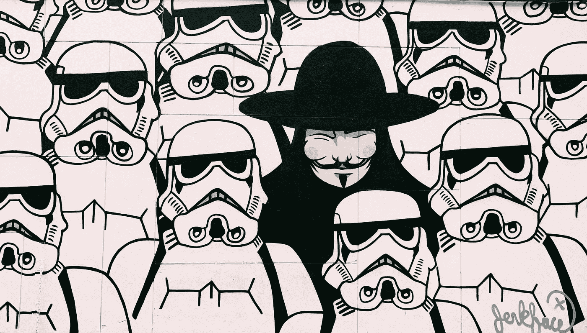

# 啊哈。公司做大的唯一途径。

> 原文：<https://medium.com/hackernoon/arrrr-time-to-be-a-pirate-the-only-way-companies-can-build-big-25a2c80aec5e>

Photo by [Jon Tyson](https://unsplash.com/photos/eIhH7RTlTZA?utm_source=unsplash&utm_medium=referral&utm_content=creditCopyText) on [Unsplash](https://unsplash.com/?utm_source=unsplash&utm_medium=referral&utm_content=creditCopyText)

几个月前，一种新的 YouTube 算法开始向我推荐非常准确的视频。我会和特雷弗·诺亚一起看每日秀，而且是在 YouTube 官方账户上看的。但是，突然之间，我得到了推荐，可以看完整集的每日秀，推荐人的名字都是随机的，比如“Maureen”。它们也被修剪过。简而言之——这些是盗版视频，出现在正式发布之前，偷走了广告费，也把我的注意力从“真实的东西”上转移开了。我当然会看——它们“足够好”，而且出现得更早。YouTube 也知道这一点，所以我会在新一集播出时收到推送通知——即使我不关注该频道！算法变得如此之好，谷歌会从我不知道存在的渠道向我推荐我想看的盗版内容。

这就是问题所在。对 YouTube 和谷歌来说，他们从托管盗版内容中获得的钱和任何东西一样多。

当然，脸书也是如此——难怪脸书以窃取(或允许窃取)数百万视频剪辑开始他们的视频服务，直接从 YouTube 上下载，因此要么诉诸直接盗版，要么全力捍卫它。当然，Instagram 也是如此——它不仅允许盗版内容，还积极鼓励盗版，同时让版权和权利的执行成为一件痛苦的事情。难怪会出现像理查德·普林斯这样可笑的小偷。

但事实是，巨头们这么做是因为这是他们做大的*唯一途径*:允许所有内容进入，并尽可能难以移除或监管内容。在这样一个封闭的环境中，小偷和公司以其他所有人——包括我们消费者——为代价获取利润。我猜，通过从合法渠道吸走广告收入，它迫使公司和艺术家们重新思考他们的出版策略。

当我建立公司的时候，我们致力于加强版权保护，提升摄影师的权利。发生的情况是，我们会删除或阻止大量内容——用户收集别人的材料比创建自己的材料容易得多(尽管随着智能手机的普及，消费与创作的比例仍然基本上是 100 比 1)。通过这样做，我们无法赶上大公司的水平，他们允许任何内容，鼓励窃取，重新混合，重新发布，等等。

事实上，如果不偷东西，似乎是绝对不可能建立一个强大的社交媒体公司的。所以，如果你想和“大家伙”较量，就像他们一样，做个海盗，去偷东西。

叶夫根尼·切博塔列夫(Evgeny Tchebotarev)是 1200 万摄影师组成的强大社区 [*500px*](https://medium.com/u/5075e6960d1?source=post_page-----25a2c80aec5e--------------------------------) *的创始人，背后有* [*安德森·霍洛维茨*](https://medium.com/u/df45fd4a749d?source=post_page-----25a2c80aec5e--------------------------------)；*和目前* [*帮助其他公司解锁 10x 潜力*](http://e15v.com/) *。他通常在台湾台北工作。*

## 如果你想帮助其他人发现这样的好故事，请在读完之后鼓掌👏