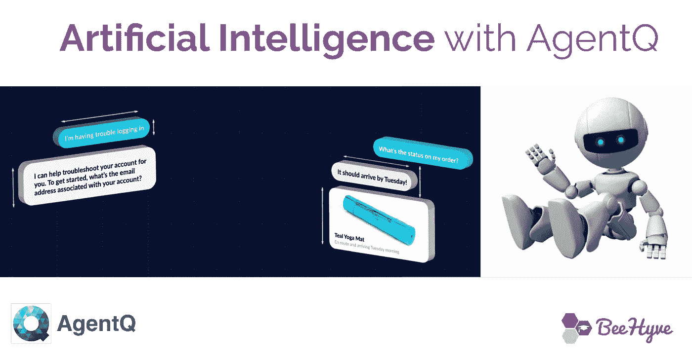
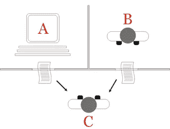

# 人工智能超越流行词#与 Q 探员的真实对话

> 原文：<https://medium.com/hackernoon/artificial-intelligence-beyond-by-the-buzzword-realtalk-with-agent-q-c0430675e616>

**TL；博士:**采访[经纪人 Q](http://www.agentq.ai) 创始人 [Remi Cossart](https://www.linkedin.com/feed/) 关于人工智能、创业公司和规模化有影响力的团队。面试[这里](https://www.youtube.com/edit?o=U&video_id=n9gzvJ7UoYY)。

你能分辨出你在和另一端的人还是电脑聊天吗？越来越多的人没有通过著名的图灵测试，我相信下一个十亿美元的生意正因此而建立。

也许[特工 Q](http://agentq.ai) 会是其中之一。代理人 Q 站在人工智能技术的最前沿——构建应用程序来帮助企业与客户联系。

我们和《特工 Q》的创始人 Remi Cossart 聊了很多关于人工智能的事情，他的公司是如何起步的，以及他们正在做什么，聊得很开心。除了科幻小说的可能性之外，Q 特工还专注于在当今的实际应用中使用人工智能。

[Turing Test](https://en.wikipedia.org/wiki/Turing_test)

Q 特工最迷人的一点是，这是一个小团队！他们不仅有一个复杂的人工智能聊天机器人，而且还有 iOS、Android、Web 和商业网站上的小工具应用程序。了解他们如何对一个小团队产生如此不可思议的影响。

#RealTalk with Remi Cossart

代理人 Q 正在通过 BeeHyve Careers 积极招聘人员！通过 BeeHyve 职业准备社区立即申请。

[http://www.beehyve.io](http://www.beehyve.io)/career-prep