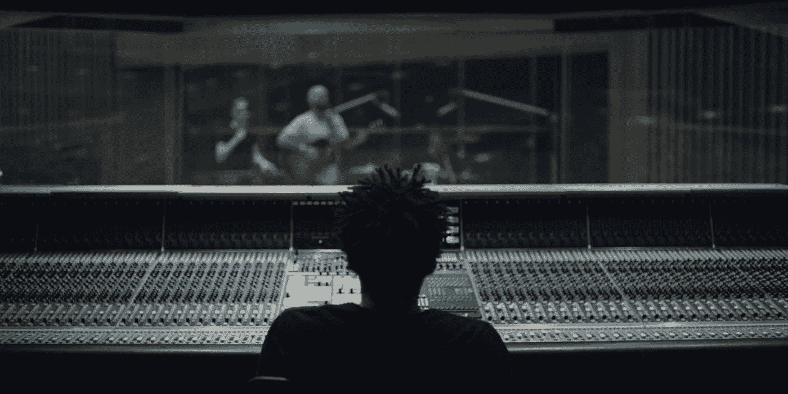

# 音乐行业的人工智能

> 原文：<https://medium.com/hackernoon/artificial-intelligence-in-the-music-industry-43e809ecbcde>

IBM Watson assists Alex Da Kid with his latest single “Not Easy”

到 2020 年，人工智能(AI)产业的价值预计将超过 700 亿美元，无疑将影响我们的生活方式和数据消费方式。简单地说，人工智能是计算机科学的一个领域，它使计算机能够做人类认为“智能”的事情。

但是这对[音乐产业](https://goo.gl/w8fLgi)意味着什么呢？

嗯，像 Shazam 这样的公司自成立以来就一直在使用人工智能，将其嵌入到他们的“指纹”技术中。Shazam 拥有一个广泛的歌曲目录，带有详细的“频谱图”，包含歌曲发出的各种频率。一旦用户给一首歌加了标签，应用程序就会接收这个信号，与他们的数据库进行交叉引用，然后返回一个匹配结果。在这种情况下，人工智能被用于获取本身无用的[数据](https://hackernoon.com/tagged/data)(歌曲信号)，提供上下文，并将其与他们的数据库进行匹配，以产生对用户有用的东西。

现在我们正处于一个时代，这些技术在全球范围内影响音乐创作的可能性一直存在。9 月，索尼发布了两首使用他们新开发的人工智能系统“Flow Machines”创作的歌曲。下面的歌曲“爸爸的车”是按照甲壳虫乐队的音乐主题创作的:

最近，格莱美获奖制片人 Alex Da Kid 与 IBM Watson 合作，创作了他的最新单曲“不容易”:

沃森筛选了五年的非结构化文化数据，以及五年内每周 100 首热门歌曲的歌词，以建立每首歌曲背后的情感情绪。沃森接着分析了乐器、节奏和音高，然后交给亚历克斯·达·基德进行实验。

这就引出了一个问题，随着人工智能音乐的大门打开，人类的原创性和创造力会消失吗？那要看你问谁了。与此同时，最合乎逻辑的反应是将机器视为只帮助生产的工具。毫无疑问，将人工智能应用于生产将节省大量时间，甚至为第一次写作或制作提供帮助。

就版权而言，问题是如果一台机器完整地创作了一首歌，谁拥有版权？这将会渗透到出版商、唱片公司和收藏协会的意识中，如果还没有的话。

但是，有一天我们会在歌曲演职员表上看到 IBM 或谷歌吗？这是值得思考的事情…

> [黑客中午](http://bit.ly/Hackernoon)是黑客如何开始他们的下午。我们是 [@AMI](http://bit.ly/atAMIatAMI) 家庭的一员。我们现在[接受投稿](http://bit.ly/hackernoonsubmission)，并乐意[讨论广告&赞助](mailto:partners@amipublications.com)机会。
> 
> 如果你喜欢这个故事，我们推荐你阅读我们的[最新科技故事](http://bit.ly/hackernoonlatestt)和[趋势科技故事](https://hackernoon.com/trending)。直到下一次，不要把世界的现实想当然！

