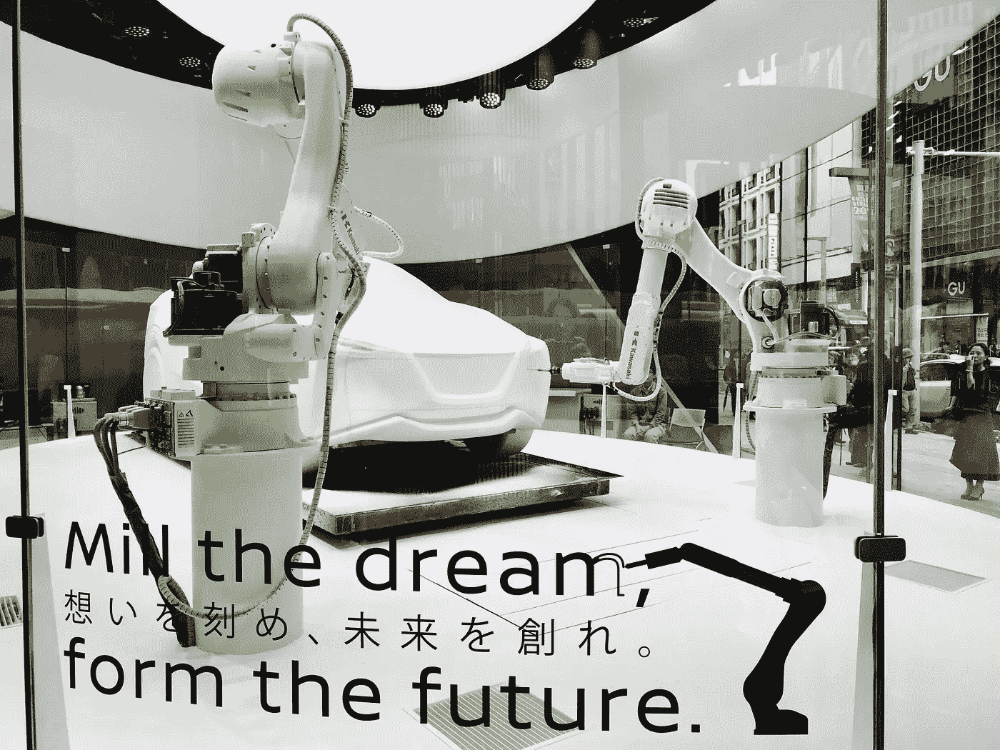

# 人工智能不仅仅是“一种技术”

> 原文：<https://medium.com/hackernoon/artificial-intelligence-is-more-than-just-a-technology-26d87774c011>

## 数字时代的“建立信任”

Dressed Humanoid “Pepper” at a shopping and dining center in Tokyo in October 2017

我想每个人都同意人工智能是一项“改变游戏规则的技术”。

当然，它仍处于发展的早期阶段，目前的期望往往被定得过高。奇点——人工超级智能超越人类智能的点——仍然“相对”遥远。

然而，人工智能已经改变了生活的许多领域，而且这种改变只会继续下去。上周我再次访问日本时，这一点变得非常明显:

*   日本软银机器人公司(Softbank Robotics)的人形机器人“Pepper”更频繁地出现在东京街头。
*   上周与我的日本朋友和同事关于人工超级智能和人工意识的讨论。
*   软银创始人孙正义领导人工智能投资的新闻。

 [## 软银已经管理着最大的科技投资基金，想要一个两倍于…

### 软银已经控制了 1000 亿美元的科技投资基金，现在它想要一个两倍大的基金。

qz.com](https://qz.com/index/1108237/softbank-which-already-runs-the-largest-tech-investment-fund-wants-a-new-one-thats-double-the-size/) 

根本没有回头路。

> **每个人都需要理解人工智能，并将关于人工智能的讨论融入自己特定的专业领域。**

但是我们做得够吗？

当我参加会议和活动时，我觉得这个问题的答案是:不，我们做得还不够。

让我通过分享我参加会议和其他活动的经历来解释一下。

# 会议是讨论人工智能的独特平台

在会议上发言总是很棒。

我喜欢与其他参与者交流，分享我关于数字革命对世界的影响的经验和见解。

即使在数字时代，与国际观众面对面交流的经历也能增加巨大的价值。

当分享个人经历或预测未来时尤其如此。这种展示可以鼓舞人心，激励人心，并且不容易被其他形式的交流所取代。

会议是一个独特的机会，让你思考，鼓励与其他参与者对话，激发创造力。

然而，我自己最近参加许多会议的经历令人失望。大多数主持人继续关注传统的辩论，而没有注意到新技术所带来的挑战和机遇。参与者希望留在他们的“舒适区”，这意味着专注于传统问题。

当我说“传统辩论”时，我指的是非常“传统”。例如，我参加了许多商业和法律相关的会议，如果我们建造一台时间机器，回到十年或更久以前，同样的问题也会被讨论。几乎不会有什么变化。

当然，也有例外，但总的来说，问题和争论都解决了，我们得到的只是重复表演。即使在讨论“新技术”时，也是用旧模型来构建讨论，理解和解释它们的实现和效果。

当然，这是一个遗憾。这是一个失去的机会，因为——即使在一个数字世界中——会议也有巨大的潜力成为一个独特的“平台”,来探讨重要新技术及其应用的意义和影响。

人工智能更是如此。

# **AI 远不止“只是一项技术”**

人工智能不仅仅是一种“工具”,比如说，它可以改善制造流程。这不仅仅是合规的下一步。它不仅仅是一个做出有利于行动的预测的系统。更普遍地说，它可能不仅仅是“知识工作”的破坏者。

> **人工智能有潜力改变我们生活、工作和做生意的方方面面**

 [## 每个公司现在都需要准备的改变游戏规则的技术

### 现在是 1890 年。你拥有一家小型保险公司，销售意外保护和海上保单。你的生意是…

www.inc.com](https://www.inc.com/magazine/201707/amy-webb/artificial-intelligence-reshaping-business.html) 

越想越确信 AI 会影响我们“信任”的方式。

随着人工智能越来越融入我们的日常生活，我们信任的*、*什么*和*如何*都在发生变化。*

*这听起来可能有点牵强，但已经有很多例子表明我们越来越信任算法、软件和计算机代码。*

*我们根据评论和推荐算法购买产品、预订住宿、预订餐厅。我们相信维基百科会给我们正确的信息。当我们问*谷歌*一个问题时，我们期望——并且相信——我们会得到正确的答案。*

*我们都可能对大型科技公司有一些残余的怀疑，但在我们的日常生活中，我们倾向于将这种怀疑放在一边，并“信任”技术。*

*因此，我们已经生活在一个所谓的“无处不在的计算”的世界里。*

*计算现在嵌入到我们日常生活的方方面面。*

*计算机代码提供了看不见的、不被注意的“架构”,构成了我们的整个存在。我们在工作、娱乐、交流、消费、旅行或教育中发现了大量的例子。所有这些生活领域，以及与这些活动相关的选择，越来越多地由数字技术组织起来。*

*想想我们生活中有多少时间是在与深层次上运行数字代码的设备进行交互。*

*这种互动可以是直接和近距离的，从与智能手机或电脑的互动，到以各种方式在自动化的地铁系统上工作的更远距离的互动。*

*在这两种情况下，都是计算机代码使这种体验成为可能，而计算机代码最终提供了与这种体验相关的结构和选择。*

*随着产品变得越来越智能和互联，很容易预测我们只会越来越“信任”机器。*

*事实上，结合区块链、物联网、传感器、自动驾驶和大数据等领域的其他快速技术发展，人工智能将在我们未来的生活中发挥主导作用是可以预期的。*

**

*Special event for the “Nissan Intelligent Mobility” project in Tokyo*

> *而且毫无疑问，我们都会信任 AI。一切都指向那个方向。*

*这就是事情变得有趣和重要的地方。*

# ***我们需要更多建立“信任”的“平台”***

> *我们真的可以信任 AI 吗？*

*我们应该听其自然，接受后果吗？*

*我交谈过的大多数人都倾向于同意:“我们不应该只相信人工智能”。*

*我们应该努力理解人工智能已经在如何影响我们的生活。毕竟影响会比引入互联网显著得多。*

*为了建立对人工智能的信任，我们需要在各个层面进行详细的讨论(不仅仅是在人工智能专家之间)。我们需要关注它意味着什么，它已经如何影响我们的生活，以及它将如何影响我们未来的生活。*

*最近，我越来越多地思考这个问题。每当我在国内或国外的会议上发言或参加会议，而 AI 不在议程上时，我认为我们正在错过一个机会。*

*毕竟，会议是一个绝佳的机会，可以开始讨论 AI 对“技术”以外领域的影响。*

*我们必须提出关于人工智能的问题，了解人工智能系统是如何训练的，数据来自哪里，等等。*

*特别是，我们需要思考构建人工智能如何运作的价值观或“伦理”。*

*例如，当遇到不可避免的事故时，我们希望自动驾驶汽车如何做出反应？它应该将生命损失最小化，即使这意味着牺牲车内乘客的生命，还是应该不惜任何代价优先考虑乘客的生命？或者，选择应该是随机的吗？*

*透明、开放和包容的对话似乎是对构建我们未来生活的系统建立真正信任的最佳方式。*

* [## 建立对人工智能的信任

### IBM 采访了 30 位人工智能专家，探讨我们如何建立对人工智能的信任。这是…

www.ibm.com](https://www.ibm.com/watson/advantage-reports/future-of-artificial-intelligence/building-trust-in-ai.html) 

# 那么，接下来是什么

我对日本的访问非常清楚地表明，我们需要就人工智能和数字化转型进行更广泛的公开讨论和对话。

我们应该明白，人工智能将产生比我们大多数人意识到的更广泛的影响。特别是，政策制定者和政府应该鼓励和参与关于人工智能的意义和影响的讨论。

召开会议是很好的，但是即使这个话题和数字技术没有任何联系，我们也要问问自己这个话题在未来是否会受到技术的影响。*