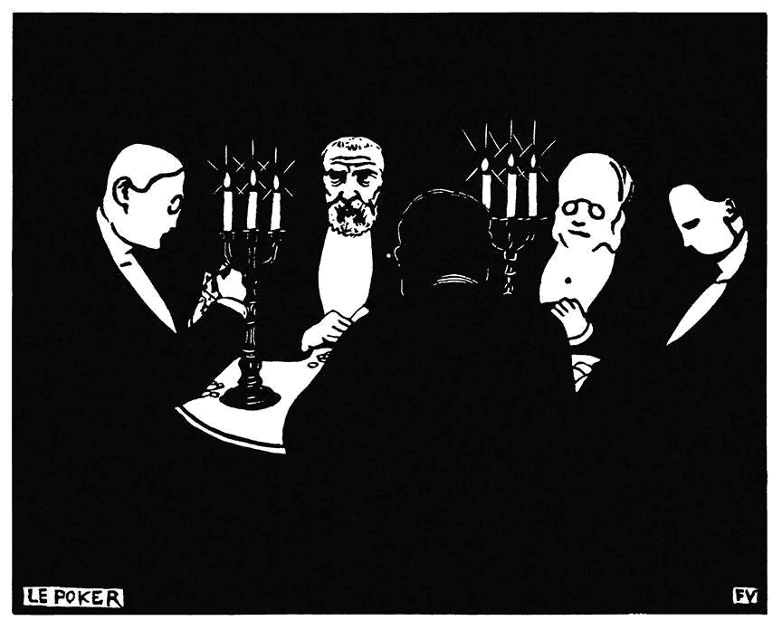
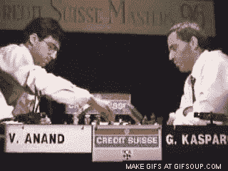
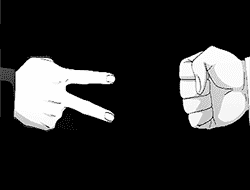
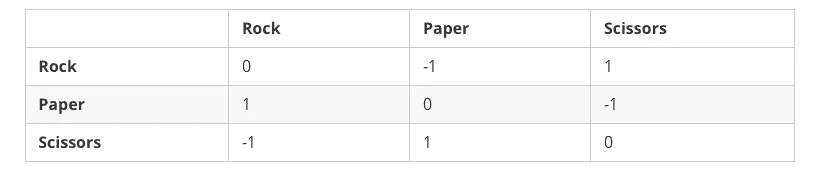
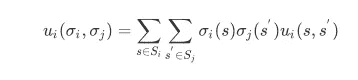
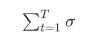

# 人工智能，扑克和后悔。第一部分

> 原文：<https://medium.com/hackernoon/artificial-intelligence-poker-and-regret-part-1-36c78d955720>

## 反事实后悔最小化和扑克介绍。

我们将推出一个由 3 部分组成的博客系列，介绍反事实后悔最小化(CFR)，这是一种强化学习算法，最近击败了一些职业扑克玩家。我们将首先介绍算法的更简单版本，后悔匹配(带代码)，然后在本系列的后面部分，分享我们自己研究的一些发现，最后分享一个玩扑克版本的 CFR 算法的例子。

反事实后悔算法是一个自我游戏人工智能模型。本质上是两个人工智能代理相互对抗，从零开始学习游戏。事实上，在许多情况下，它是一个与自己对抗的代理，所以它学习的速度是自己的两倍(重要的是要注意，虽然它确实与自己对抗，但它绝对不够聪明，无法从对手的角度理解自己的最后一步棋。)

与人工智能研究领域最近的许多重要突破不同，比如 Deepmind 的 AlphaGo，CFR 不依赖神经网络来计算概率或特定移动的价值。相反，通过玩数百万甚至数十亿次游戏，它可以开始为自己在特定位置采取的每一个行动总结后悔的总量。

这个算法令人兴奋的是，随着它的运行，它越来越接近游戏的最优策略。也就是朝向纳什均衡。它已经在许多游戏和领域中证明了自己，最有趣的是扑克，尤其是无限注德州扑克。在这个时候，这是我们最好的扑克人工智能算法。

# 后悔配。

后悔匹配(RM)是一种算法，它寻求在游戏的每一步/每一步中最小化对其决定的后悔。顾名思义，它从过去的行为中学习，通过支持以前后悔没有采取的行动来指导未来的决定。

在这个模型中，既有积极的后悔，也有消极的后悔。消极后悔的定义和你预期的一样。对在特定情况下采取特定行动的后悔。这意味着在这种情况下，如果代理没有选择这个动作，它会做得更好。

Garry Kasparov realises his mistake against Viswanathan Anand.

积极的后悔也如你所料；这是一种机制，通过这种机制，代理跟踪导致积极结果的行动。(我个人觉得应该叫别的，不过随便吧。)

在代理人与自己进行的每一场游戏之后，它在最近一场游戏中经历的消极和积极的后悔被添加到它已经进行的所有其他游戏的总和中，并且它的新策略被计算。

简而言之，通过概率，它倾向于过去导致积极结果的行动，而避免导致消极结果的行动。

除了其他学习机制，人类通过后悔来学习——我们会尝试一些事情，如果它失败了并引发了负面的情绪反应，我们会跟踪这种后悔并避免下次尝试。以“剪刀-布-石头(SPR)”游戏为例，如果我们在对手的手势是纸的时候给出石头，我们会后悔没有选择剪刀。

这个模型趋向于零和博弈中的纳什均衡，对于那些不精通博弈论的人来说，这只是一个博弈，其中每个代理人的输赢正好与另一个代理人的输赢相平衡。比如剪刀、布、石头，是一个零和游戏。当你击败你的对手，你赢了 1，他们输了-1，总共是零。

在接下来的部分中，我们将 SPR 形式化为一个数学问题，然后我们将在遍历一个 Python 程序时解释遗憾匹配，该程序通过 RM 在 SPR 中找到纳什均衡策略。遗憾匹配不是目前击败职业扑克玩家的整体算法，但它是该算法的基础。

# 剪刀石头布

在这里，我们将剪刀石头布(SPR)形式化为一个*范式的零和两人游戏*，其中存在*纳什均衡*。虽然这个句子包含了很多信息，但是让我们把它分成几个部分。首先，SPR 可以定义为元组 **< *N，A，u* >** ，正式称为范式:

*   ***N* = 1，…n** 是 n 个玩家的有限集合。在 SPR 中，通常 ***N* = {1，2}**
*   I 是一组有限的动作。这里每个玩家都有相同的行动选择，所以 ***S =* { *S，P，R* }**

是所有参与者同时行动的所有可能组合。比如 A = {( *R，R* )，……。，( *S，P* )}，每个组合称为一个*动作轮廓*。

*   *U* 是将每个行动轮廓映射到每个玩家的效用/收益的向量的函数。例如，( *R，P* ) = (-1，1)表示如果玩家 1 通过向对手的纸呈现石头而被玩家 2 击败，则玩家 1 的奖励为-1。因此，我们可以为玩家 1 定义如下的效用矩阵，假设行玩家是玩家 1:

此外，我们还将策略σᵢ( *s* 定义为参与人ᵢ选择行动 *s* ∈ *S* 的概率。当一个玩家使用后悔匹配来更新他的策略时，σᵢ( *s* 与 *s* 的累积后悔成正比。注意，每个效用向量的总和为 0，因此我们称之为*零和*游戏。在任何两人零和游戏中，当两人都坚持后悔匹配时，他们的平均策略收敛于纳什均衡，即两人都能够最大化自己的期望效用:

但是现在足够的数学抽象。事不宜迟，让我们获得后悔匹配在实践中如何工作的一些具体想法。在本教程中，我们将编写一个实现 RM 算法的简单程序来玩 SPR 游戏。我们假设读者具备 Python 编程语言的基础知识，最好对 Numpy 库有所了解。

我们从导入该程序所需的模块开始。

然后我们定义剪子布石头游戏的原语。“效用”是前面提到的效用函数，它确定了动作配置文件的效用值。按照惯例，我们定义行玩家是玩家 1，列玩家是玩家 2。因此，在给定行动剖面(s1 = *摇滚*，s2= *纸*)的情况下，要查询参与人 1 的效用值，我们调用`utilities.loc['ROCK', 'PAPER']`。

每个玩家负责维护自己的策略和遗憾统计。目前，我们只展示了一个类的框架，但是我们稍后会回来查看实现细节。有几个变量值得解释:

*   策略:对应 **σ(s)，**策略向量，代表当前采取行动的概率 ***s*** 。
*   策略总和:

是从游戏开始到现在的策略向量的总和。

*   后悔 _ 总和:是每次迭代时后悔向量的总和。
*   avg_strategy:标准化策略总和

游戏/环境的定义。我们有两个玩家，Alasdair 和 Calum，玩剪刀石头布 1000 回合，除非明确指定 max_game。“播放 _ 后悔 _ 匹配”函数充分描述了原始后悔匹配的过程:

1.  从累积的遗憾中计算出一个遗憾匹配策略配置文件。
2.  根据策略配置文件选择每个玩家动作配置文件
3.  计算玩家遗憾，并将它们添加到玩家累积遗憾中。

现在让我们实现未完成的玩家类，从‘后悔’和‘行动’函数开始。考虑一个动作剖面(石头，纸)，相应的没有采取动作的遗憾本质上是动作和对手动作之间的效用差，即(石头= -1，剪刀=1，纸= 0)，剪刀肯定是错过了。

“update_strategy”函数与后悔匹配算法的核心思想相一致:“选择行为与过去没有选择它们的正后悔成比例”，因此策略实际上是正后悔和的归一化。然而，请注意，当没有积极的遗憾时(即，最后一局是完美的)，我们采用随机策略，以最小化暴露对某个动作的偏见，因为这种偏见可能被对手利用。

现在我们可以开始派对了！尝试运行多次，您可能会观察到简单的后悔匹配并不总是产生均匀分布的赢家计数，而平均的后悔匹配却能。如果您在简单遗憾匹配的每个中间迭代中打印“num_wins ”,您甚至会注意到获胜者周期性地出现在 p1 和 p2 之间。这是由于简单后悔匹配的可利用性。假设你意识到对手更喜欢剪刀，那么在接下来的几轮中你可能会喜欢石头，而对手需要一段时间来后悔他的偏见。

然而，平均导致 SPR 中的完美策略——随机播放。这是对对手选择的任何固定策略的最佳反应，并且在每次行动选择中没有留下可利用的信息。

完整源代码可从以下网址获得:[https://gist . github . com/namoshizun/7a 3b 820 b 013 f8e 367 e 84 c 70 b 45 af 7c 34](https://gist.github.com/namoshizun/7a3b820b013f8e367e84c70b45af7c34)

本系列的下一篇博客将讨论 CFR 在拍卖中的使用，尤其是在付费搜索拍卖中。

作者:鲁迪，阿拉斯代尔·汉密尔顿和卡卢姆·汉密尔顿

[remi.ai](http://remi.ai)

想在生活中浪费更多的时间？请继续关注 [Remi AI 博客](https://www.remi.ai/blog)，因为我们建立了完整的供应链产品，或者你可以在这里注册我们的 Remi 推荐阅读简讯[。](https://www.remi.ai/signup)

或者，如果你已经准备好开始看到人工智能驱动的库存管理的好处，从这里开始旅程。

我们是谁？

*Remi AI 是一家人工智能研究公司，在悉尼和旧金山设有办公室。我们已经交付了横跨快速消费品、汽车、工业和企业供应等领域的库存和供应链项目。*