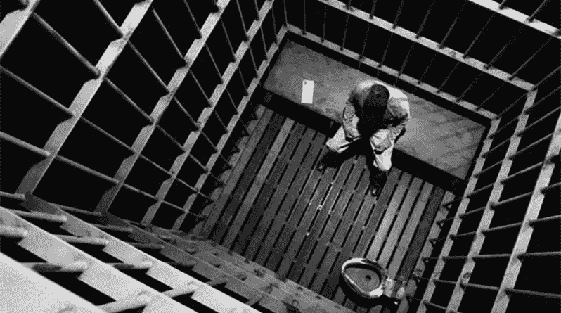
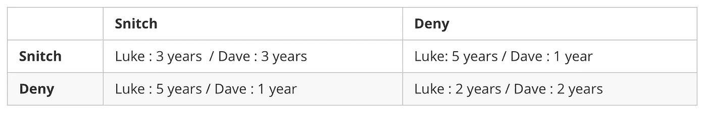
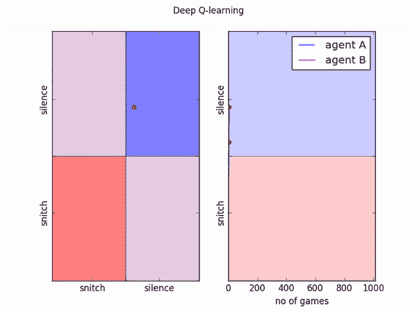
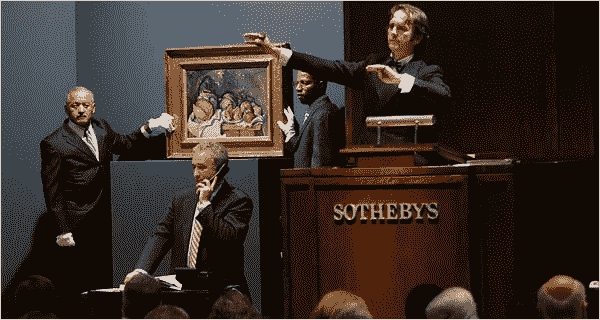
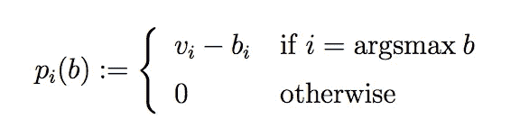

# 人工智能，扑克和后悔。第二部分

> 原文：<https://medium.com/hackernoon/artificial-intelligence-poker-and-regret-part-2-ee2e329d6571>

## 囚徒困境中的人工智能和纳什均衡介绍。

本系列的第二篇博客介绍了纳什均衡以及后悔匹配是如何优化均衡的。这是为系列的最后一篇文章做准备，在这篇文章中，我们将介绍德州扑克中的反事实后悔最小化，它朝着均衡方向优化，并且可以说实现了均衡。

Remi 的任务是开发受神经科学启发的人工智能。我们设计代理并在不同的环境中测试它们的能力。从人类擅长各种任务的方式中获得灵感，从驾驶、扑克到写博客，我们正在研究能够轻松无缝地从一项任务适应另一项任务的代理。这项研究中的一个关键工具是既定的心理学测试，以更好地了解我们开发的代理人与人类相比是如何行动的。随着我们的代理变得越来越复杂和自主，心理测试作为理解他们的行为和内部工作的手段将变得越来越重要。

我们想用一个简单的例子来说明心理测试的想法。囚徒困境是一个有趣而简单的测试，它已经成为博弈论和纳什均衡的同义词。我们想测试后悔匹配和另一种强化学习代理在囚徒困境中的表现，并说明这种测试在人工智能研究中的价值。

对于那些不熟悉囚徒困境的人，这里有一个叙述性的介绍。

# **囚徒困境**

一天，警察抓住了两个在城市两边贩卖非法物品的人。

他们逮捕了一位名叫戴夫的绅士，他在贩卖毒品时被当场抓获。在一个完全独立和无关的事件中，警察抓住了另一个名叫卢克的绅士，他也在贩卖毒品。他们都被带到警察局，并被关在单独的牢房里。

警察局长在他们各自的牢房里采访了这两位先生，向他们强调他们都面临两年的监禁——这是一个一目了然的案子。他们都将被指控非法持有毒品并意图分销。他们每个人都会被判两年监禁。

但是当他把这个消息传递给卢克的时候，局长开始意识到这两位先生看起来非常像几周前一起重大武装抢劫案的嫌疑人。尽管他强烈怀疑他们与早先的犯罪有联系，但专员没有任何有力的证据将他们联系起来，只有他们大致符合描述的事实。

因此，在没有足够的证据指控他们抢劫的情况下，他设想了一个计划，向他们提供单独的交易，激励他们告发对方。

他对戴夫和卢克做的交易如下:你会因为毒品交易被判两年，你被当场抓住，这两年是有保证的。

但是如果他们坦白而另一个没有，他们只会被监禁 1 年，另一个会被监禁 5 年。

如果他们都认罪，他们都会被判三年。

上面这个故事，详细描述了囚徒困境。这笔交易可以在下面的收益表中看到。

The Prisoner’s Dilemma Payoff Table

右下角的区域，双方都否认，是全局最优。这种选择是理性的选择，在这种情况下，双方都被判了最短的刑期。然而，这是一个不稳定的位置。一方无法保证另一方也会理性选择。另一个囚犯的这种可能的非理性导致了大多数人的非理性行为并选择告密。

# 人工智能特工也打小报告吗？

我们想测试人工智能和后悔匹配在同样的环境下会有什么反应。一个特工会坚持同样的告密偏好吗？从纳什均衡的角度来看，这样的测试是有趣的，但也可以用来说明人工智能研究中一个有趣的工具。

随着神经科学启发人工智能，特别是强化学习的继续发展，我们开始结合心理学的测试来研究我们正在构建的代理是否像人类和其他哺乳动物一样行为，这是非常重要的。这将有助于阐明我们的奖励结构和算法设计是否在输出与人类相当的行为。

因此，我们采用了上文详述的经典囚徒困境实验，并在实验中运行了后悔匹配和我们自己的 QRL 网络，发现这些代理人都有强烈的告密倾向——就像人类一样。双方都朝着纳什均衡优化。

Above is the QRL Network over 1000 iterations of the Prisoner’s Dilemma Experiment showing a strong bias toward snitching.

那么这个纳什均衡是什么？简而言之，纳什均衡是指游戏陷入僵局，没有一个参与者可以通过改变策略来达到更好的结果。数学家约翰·纳西正式提出了这个概念。

> 简而言之，纳什均衡是指游戏陷入僵局，没有一个参与者可以通过改变策略来达到更好的结果。

例如，在囚徒困境这样的双人博弈中，纳什均衡是这样一种结果:参与人 2 的策略是参与人 1 策略的最佳对策，参与人 1 的策略是参与人 2 策略的最佳对策。

在这个人工智能囚徒困境的背景下，如果卢克告密，戴夫的最佳对策是告密，因为 3 年总比 5 年好。如果卢克不告密，戴夫的最佳对策是告密，因为 1 年比 2 年好。

一般来说，有可能有多个纳什均衡或者根本没有。

# **现实世界应用**

假设你现在没有被监禁，有人给你提供了一个条件去告发你的一个狱友。这将有助于探索纳什均衡和强化学习者的实际应用。囚徒困境是一个微不足道的构造例子，但是纳什均衡(以及 CFR 和其他人工智能强化学习者)在现实世界中有许多应用。在任何游戏或商业环境中，如果有许多竞争对手和各种策略——比如扑克和付费搜索拍卖——都受制于纳什均衡。我们已经在我们的谷歌 Adwords 人工智能平台 [Remi AO](http://www.remi.ai/advertising-a-i) 中部署了我们自己的反事实后悔最小化改编，取得了有趣的成功。

为了简洁起见，我们不会详述完整的 Google Adwords 拍卖机制。但是探索一种更简单的第一价格拍卖，它仍然保留了付费搜索拍卖的许多功能。

我们在这里讨论的拍卖涉及隐藏出价。更准确地说，投标人同时私下提交他们的投标，而不知道竞争对手的投标。

对象(或者在 Adwords 的情况下，广告位置)被分配给出价最高的投标人，以换取支付。在这个例子中，为了简单起见，我们假设当不止一个投标人提交最高投标时，对象/广告位置被分配给具有最低指数的最高投标人。为了将拍卖表述为一个战略博弈，我们将每个投标人都视为一个参与者，就像每个囚犯都是一个参与者一样。然后我们把参与人 I 的每个出价都看作是他可能的策略。

在这个例子中，我们假设 vᵢ的估值是受约束的，并且为竞争者所知。在现实中，这种情况很少发生。不同的公司在在线广告拍卖中对广告位置的估价可能不同，这是因为它们所广告的产品的利润率不同。

然而，这个假设是必要的，因为在收益表中使用了估值，因此玩家了解彼此的收益函数。

秘密出价拍卖的标准规则是，获胜者 I 向拍卖人支付其出价的全部价值。(尽管这在许多在线广告拍卖中并不十分准确)。由此产生的机制被称为首价拍卖。假设中标者是投标人 I，其中标者是 bᵢ.因为物体/广告位置的创造价值是 vᵢ，收益(换句话说，利润)是 vᵢ −bᵢ。其他投标人的收益是 0。

值得注意的是，在这种情况下和在线广告拍卖中，赢家的利润可能是负数。这发生在投标人提交的出价高于被拍卖的对象/广告位置的估价时。

概括地说，第一价格拍卖中的参与者 *i* 的收益函数 pᵢ定义如下，其中 b 是提交出价的向量:

考虑与第一价格拍卖相关的博弈，参与者的估价为 v，那么 b 是纳什均衡，如果 i = argsmax b

1.  bᵢ ≤ vᵢ

简而言之，获胜者不会出价太高——出价低于对象/广告位置的价值。

2.最大𝚓≠ᵢ v𝚓 ≤ bᵢ

简而言之，获胜者提交了足够高的出价才能获胜。

3.bᵢ =马克斯·𝗃≠ᵢb𝗃

另一位玩家提交了与玩家 I 相同的出价

在上面，1 和 2 表示 vᵢ =最大值 v，这简单地意味着在每个纳什均衡中，具有最高估价的投标人是赢家。这是一个相当明显但被低估的假设，拥有最高估价的投标人有能力出价最高，因此赢得拍卖。

假设拍卖中出价 b 的向量满足 1 到 3。投标人 I 是赢家，通过满足 1 他们的利润是积极的。如果他们出价更低，他们的利润会增加，但根据陈述 3，另一个出价第二高的玩家成为赢家，而玩家 I 的收益变为 0。相反，任何其他玩家 j 的收益都是 0，只有他们出价更高成为赢家，收益才会增加。但是到了陈述 2，他们的收益变成了负数。

***所以 b 是纳什均衡。***

在本系列的最后一部分，我们将探讨扑克中的 CFR，尤其是在德州扑克中。

作者:Shahrad Jamshidi 和 Alasdair Hamilton

[remi.ai](http://remi.ai)

对于本系列的第 1 部分:[https://hackernoon . com/artificial-intelligence-poker-and-revenue-Part-1-36 c78d 955720](https://hackernoon.com/artificial-intelligence-poker-and-regret-part-1-36c78d955720)

囚徒困境的密码:[https://gist . github . com/shahradj/ebe 9160 ba 3a 996142 E3 b 225d 0 f1 ed 5 f 6](https://gist.github.com/shahradj/ebe9160ba3a996142e3b225d0f1ed5f6)

还有这里:

[https://gist . github . com/shahradj/DBC 08 f 7d 6 cbb 5264244d 9 Dade 66 cdefc](https://gist.github.com/shahradj/dbc08f7d6cbb5264244d9dade66cdefc)

想在生活中浪费更多的时间？请继续关注 Remi AI 博客，因为我们正在构建完整的供应链产品，或者你可以在这里注册我们的 Remi 推荐阅读简讯[。](https://www.remi.ai/signup)

或者，如果你准备好开始看到人工智能驱动的库存管理的好处，从这里开始旅程。

我们是谁？

Remi AI 是一家人工智能研究公司，在悉尼和旧金山设有办事处。我们已经交付了横跨快速消费品、汽车、工业和企业供应等领域的库存和供应链项目。