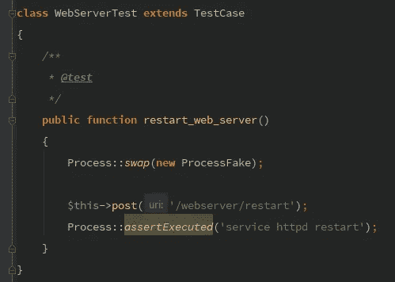

# 断言流程已执行— Laravel 5.5

> 原文：<https://medium.com/hackernoon/assert-process-was-executed-laravel-5-5-72228a8f6322>



我最近开始从事一个项目，这个项目非常依赖于在终端上运行命令。它很快妨碍了我进行 TDD，所以我不得不实现某种过程 Fake。这篇文章讲述了这有多简单。

## 背景

我用来写一个`Process::fake()`的心理过程是基于`Mail::fake()`、`Storage::fake()`和`Queue::fake()`的相同逻辑。它基本上是你的系统和一些外部服务之间的桥梁。

## 1-流程外观

流程外观非常简单:它执行一个流程。这是 Symfony 流程的简单包装。

## 2-TDD 示例

假设我们想写一个`WebServerController`,公开重启 Web 服务器的能力。遵循 TDD 方法，我想编写一个如下所示的测试:

为了通过测试，我们需要编写`ProcessFake`类以及`Controller`的实际实现。

## 3-web 服务器控制器

特别注意`use Facades\App\Process`。这是一个实时的门面。这意味着 Laravel 将动态地为这个类生成一个 Facade。你可以在这里了解更多信息[。](/@taylorotwell/expressive-code-real-time-facades-41c442914291)

## ProcessFake 类

为了完成(2)中要求的细节，一个能够断言命令已执行的`ProcessFake`工具。

运行测试之前，不要忘记注册路线:

```
Route::post('/webserver/restart', 'WebServerController@restart');
```

## 4-结论

总的来说，一个非常简单的 Symfony Process 包装器将允许我们执行应用程序提供的命令。因为我们使用的是实时 Facade，所以我们可以用一个`Fake`来交换我们的特性测试的实现。

有人可能会问:什么能保证`Process`的外观真的能工作？一个测试覆盖报告可以告诉你实际的`Process`实现没有覆盖。一个解决方案是编写一个简单的集成测试。

## 5-[奖金]集成测试

对于集成测试，我们可以编写一个简单的`bash`脚本，它可以在任何持续集成平台(比如 TravisCI)中执行。为此，我们为 bash 文件提供了测试，并编写了运行它的测试。

和简单的 bash 脚本

```
#!/bin/bash
echo 'process output'
```

对于 Travis，向脚本添加执行权限:

```
**script:** chmod a+x ./tests/Integration/process.sh && vendor/bin/phpunit --verbose
```

搞定了。

欢迎在 Medium 上关注我，获取更多类似本文的文章。