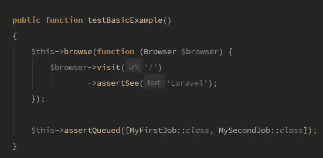
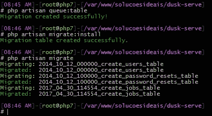

# 断言具有 Laravel 黄昏的队列中的作业

> 原文：<https://medium.com/hackernoon/asserting-jobs-in-queue-with-laravel-dusk-adb03654ca43>



当使用 Laravel Dusk 编写端到端测试时，您不能像在 Laravel 5.3 中那样模仿您的作业调度，因为浏览器是一个独立的进程，当浏览器访问应用程序时，您在测试中所做的任何调整都不存在。浏览器将再次引导整个应用程序。我的解决方法是通过一些简单的步骤简单地断言该作业在队列中等待调度。

## 设置使用数据库的黄昏队列

打开您的 **config/queue.php** 文件，专门为 Dusk 设置一个队列。将焦点放在数组的`key`中定义的**连接名**和`queue`索引中定义的**队列名**上。

```
'connections' => [

    'database' => [
        'driver' => 'database',
        'table' => 'jobs',
        'queue' => 'default',
        'retry_after' => 90,
    ],

 **'dusk-connection' => [
        'driver' => 'database',
        'table' => 'jobs',
        'queue' => 'dusk-queue',
        'retry_after' => 90,
    ],**
]
```

## 黄昏环境

在您的`.env.dusk.local`文件中，将`QUEUE_DRIVER`设置为`dusk-connection`。特别关注黄昏如何交换环境。

## 确保作业表存在

如果还没有，运行`php artisan queue:table`为**作业**表创建一个迁移，然后运行`php artisan migrate`对数据库运行新创建的迁移。



## 向 DuskTestCase.php 添加自定义断言

如果你已经安装了 Dusk，你会注意到它创建了文件 **tests/DuskTestCase.php** 。让我们在这个文件中添加一个自定义断言。
**注:**我们希望弹出**黄昏队列**中的下一个可用作业，这是在设置步骤中选择的**队列**名称。

```
*/**
 * Asserts that Jobs are in Queue to be dispatched.
 *
 ** ***@param*** *array|string $queued
 */* **public function** assertQueued($queued) {
    **if** (!is_array($queued))
        $queued = func_get_args();

    $repository = app()->make(
        \Illuminate\Contracts\Queue\Queue::*class* );

    **foreach** ($queued **as** $item) {
        $job = $repository->pop('dusk-queue');
        $this->assertTrue($job->resolveName() == $item);
    }
}
```

# 测试你的工作！

对于这个例子，我通过运行`php artisan make:job MyFirstJob`和`php artisan make:job MySecondJob`创建了两个示例作业，分别名为`MyFirstJob`和`MySecondJob`。`assertQueued`将接受多个参数、一个参数数组或仅仅一个合格的类。

```
Route::*get*('/', **function** () {
    dispatch(**new** \App\Jobs\MySecondJob);
    dispatch(**new** \App\Jobs\MyFirstJob);
    **return** view('welcome');
});**public function** testBasicExample()
{
    $this->browse(**function** (Browser $browser) {
        $browser->visit('/')
                ->assertSee('Laravel');
    });

    $this->assertQueued([MyFirstJob::*class*, MySecondJob::*class*]);
}
```

# 结论

Dusk 将导航到您的应用程序，触发一些事件，使用`QUEUE_DRIVER=dusk-connection`将作业在`jobs`表中排队。然后，您可以断言这个作业在 Dusk 本身的数据库中。但是请注意:您需要确保您的测试构建了一个干净的数据库，并在每次测试时都将其拆除，否则弹出下一个作业可能不会像预期的那样工作。

[](http://bit.ly/HackernoonFB)[](https://goo.gl/k7XYbx)[](https://goo.gl/4ofytp)

> [黑客中午](http://bit.ly/Hackernoon)是黑客如何开始他们的下午。我们是 [@AMI](http://bit.ly/atAMIatAMI) 家庭的一员。我们现在[接受投稿](http://bit.ly/hackernoonsubmission)，并乐意[讨论广告&赞助](mailto:partners@amipublications.com)机会。
> 
> 如果你喜欢这个故事，我们推荐你阅读我们的[最新科技故事](http://bit.ly/hackernoonlatestt)和[趋势科技故事](https://hackernoon.com/trending)。直到下一次，不要把世界的现实想当然！

