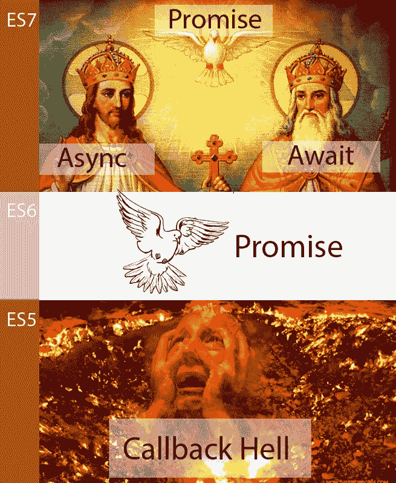

# 异步等待圣经:Javascript 中的顺序、并行、嵌套、动态和错误处理

> 原文：<https://medium.com/hackernoon/asycn-await-bible-sequential-parallel-and-nest-4d1db7b8b95c>


> 在 ES5 之前，JavaScripters 开发者生活在回调地狱中。调试是一个疯狂的控制台。在数千个回调函数中登录。然后，拯救 JavaScripters 开发者的承诺出现了。承诺的魔力把那个地狱变成了一个扁平的结构，它是隧道尽头的光。Async Await 是这个承诺的化身。ES7。

## 8 个必须知道的例子:

1.  异步函数对象
2.  承诺函数
3.  异步功能
4.  依次等待
5.  并行等待
6.  等待嵌套
7.  动态等待
8.  错误句柄

## 注意

这个故事只关注异步问题。
—致 Nodejs 开发者，要运行 ES7 请阅读: [BBB，巴别塔汉堡样板](https://hackernoon.com/nodejs-bbb-babel-burger-boilerplate-b74107eff049#.5x9fvu8ji) e



Chronological Picture

# 1-异步:[异步函数](https://developer.mozilla.org/en-US/docs/Web/JavaScript/Reference/Global_Objects/AsyncFunction)的构造函数

AsyncFunction 构造函数创建一个新的异步函数对象。在 JavaScript 中，每个异步函数实际上都是一个 Async function 对象。来自 Mozilla :

```
console.log(async function () {});
```

谁知道非功能性和承诺的兄弟姐妹？如果不是，则不允许跳过，因为这是 ES6 的承诺函数支持 await 的原因，也是 Async await 如何应用承诺特性的原因，例如*解析并行*和*错误处理*:

```
function(){
  ...
  return new ***Promise***(function(resolve, reject) {
    ...
  })
  ...
}
```

# 2-构造承诺函数

为什么我们在这里讨论承诺函数？因为人们可能忽略了 Async await 的基础是承诺，所以我们创建的每一个 Async 函数和我们等待的每一件事都会自然而然地成为承诺。

示例(感谢[https://medium . com/@ Peter Chang _ 82818/JavaScript-es7-async-await-bible-tutorial-example-32294 f 6133 ab # . m 33 vwg1 yx](https://medium.com/u/423e5feec011#.m33vwg1yx)

Mozilla:
[https://developer . Mozilla . org/en-US/docs/Web/JavaScript/Reference/Global _ Objects/async function](https://developer.mozilla.org/en-US/docs/Web/JavaScript/Reference/Global_Objects/AsyncFunction)

尼古拉斯·贝瓦夸
[https://pony foo . com/articles/understanding-JavaScript-async-await](https://ponyfoo.com/articles/understanding-javascript-async-await)

[诺兰·劳森](https://twitter.com/nolanlawson)
[https://pouchdb . com/2015/05/18/we-have-a-problem-with-promises . html](https://pouchdb.com/2015/05/18/we-have-a-problem-with-promises.html)