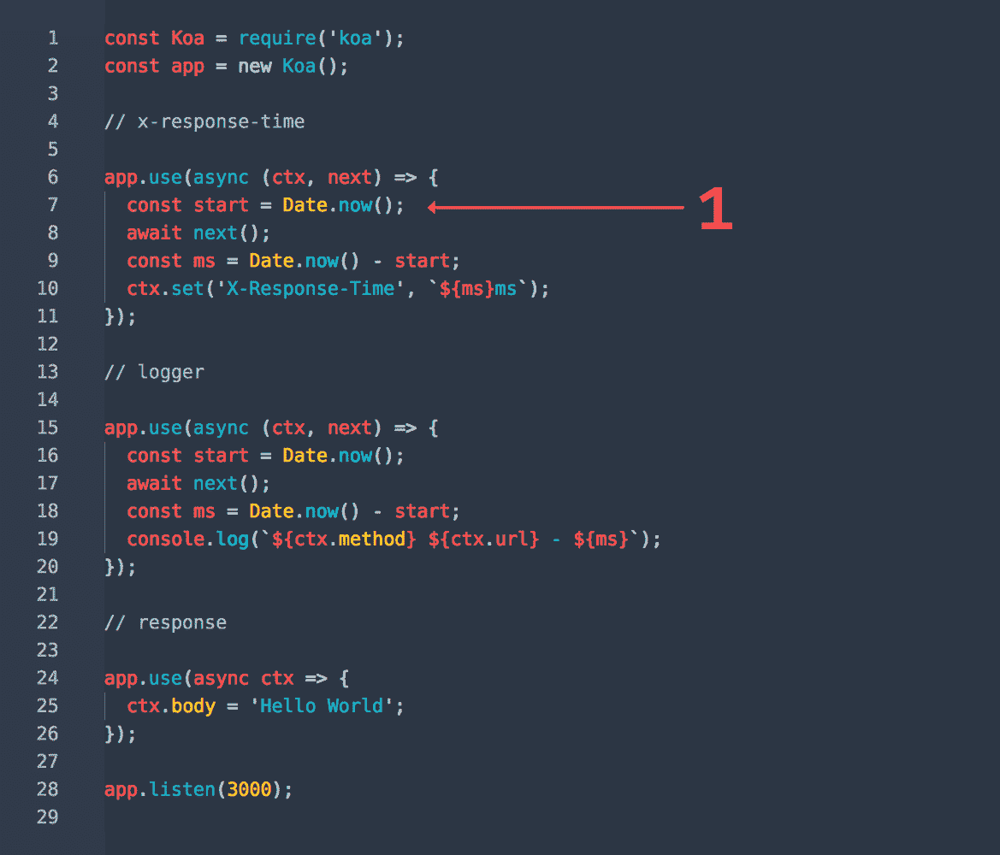

# 用 Jest 异步测试 Koa

> 原文：<https://medium.com/hackernoon/async-testing-koa-with-jest-1b6e84521b71>


*Koa* is a species of tree on Hawaii (not pictured). Photo by [Ozark Drones](https://unsplash.com/photos/wdo4V0sBoZE).

## 利用鲜为人知的特性简化 API 和中间件测试

> 这是一份在柏林会议上所做报告的文字记录。

# 什么是 Koa，什么是 Jest

让我们简单描述一下我们将要使用的库。

**Koa**([koajs.com](http://koajs.com/))是一个 JavaScript web 服务器框架。它是由一个更著名的 Express 背后的人开发的，作为一个轻量级和富有表现力的“精神继承者”。

它也是基于中间件的。但是，它没有附带任何功能。是的，没有路由器，没有主体解析器，也没有代理。利用 ES2017 *异步/等待*功能带来用户友好的功能和端到端流量控制。(你不熟悉 *async/await* ？阅读[穆斯塔法·加法尔](https://hackernoon.com/6-reasons-why-javascripts-async-await-blows-promises-away-tutorial-c7ec10518dd9)的这篇有用的介绍。我们会经常使用它们。)这意味着我们可以对回调地狱说‘拜拜’了，我们从 Express 了解到。我们将使用第二个版本；在 Koa v1 发电机提供了流量控制。

Jest 是一个来自脸书的现代单元测试框架。它给主流 JavaScript 测试带来了几个概念:零配置、一流的模仿和快照。

如果说 Koa 是 Express 的(精神)继承者，Jest 可谓是 Jasmine 和 Expect(后来[捐赠给 Jest](https://github.com/facebook/jest/issues/1679) )的(精神)继承者。

五月发布的包含了一个更好的异步/承诺支持，我认为它还没有得到应有的关注。我希望它是清楚的，那是我们以后将使用的。

就个人而言，我对 Jest 更有经验，我每天都用它来测试基于 React 的应用。另一方面，Koa 是我的爱好，我只把它用在私人项目上。

# 测试中间件

Koa 中间件通常具有以下形式:

```
const greetings = async (ctx, next) => {
  ctx.body = 'Hello.' await next() ctx.body += ' Remember to subscribe.'
}const app = new Koa()
app.use(greetings)
app.listen(3000)
```

它接收包含请求和响应信息的上下文`ctx`。改变这个对象是中间件通信的唯一方式。没有返回值；如果有，它将被忽略。因此，测试中间件意味着观察上下文的变化。

第二个参数是回调，它挂起当前的中间件，并将控制权传递给下一个中间件。这个回调要么被等待，要么根本不被调用——启动中间件订单执行。当然，可能不会调用多次。



Read more details in the well-written [guide](https://github.com/koajs/koa/blob/master/docs/guide.md), from where I borrowed this animation

## 简单测试

上面的`greeting`中间件的一个简单测试如下所示:

```
test('greetings works', async () => {
  const ctx = {} await greetings(ctx, () => {}) expect(ctx.body).toBe(
    'Hello. Remember to subscribe.'
  )
})
```

首先，是的，你可以开玩笑地使用 *async* 。框架将等待所有异步操作完成。

`next`回调是一个空函数——这是最低要求。它只是将流立即返回给我们的函数。

上下文对象是一个模拟对象。我们可以提供其他数据，如请求的网址或标题。

当整个中间件完成时，我们在上下文对象上运行断言。

如您所见，我们无法区分变化是何时发生的——“之前”还是“之后”`await next()`，我们只知道结果。然而，对于许多中间件来说，这已经足够了。尤其是那些只在下一个中间件之前或之后运行小程序的应用程序。

如果我们需要更多呢？

## 前后测试

如果在传递到下一个中间件之前或之后运行，读取文件、记录时间和生成 ETag 是必要的。

此类测试可能如下所示:

```
test('greetings works before-and-after', async () => {
  const ctx = {} const next = jest.fn(() => {
    expect(ctx.body).toBe('Hello.')  // (1)
    ctx.body += ' I am content.'
  }) await greetings(ctx, next) expect(next).toHaveBeenCalledTimes(1) expect(ctx.body).toBe(             // (2)
    'Hello. I am content. Remember to subscribe.'
  )
})
```

哇，长高了一点。但是不要害怕，这很容易。

最重要的变化是`next`内部的回调。它不再是 noop 了。这是用(1)标记的地方，我们在这里测试`ctx`如何“以前”改变。在这里，我们也可以为在(2)断言的“之后”部分做准备。

请注意，我们将`next`包装在`jest.fn`中，这样我们可以检查它的运行以及其中的断言是否通过。否则，可以通过不调用`await next()`来跳过它们。如果您在单独的测试中测试它，则可以移除它。或者，我们可以在顶部添加`expect.assertions(2)`——并保持更新。

一个小小的警告:我见过有人试图通过调用中间件而不等待*来将测试分成两部分。这是错误和危险的，因为“之后”部分也可能被调用。此外，如果在“以前”中有异步操作，它将不起作用*

## 完整的中间件测试

下面是一个使用快照测试的更新示例。额外的好处是，它将捕捉额外的变化，否则你可能会错过。

它还展示了如何在 Koa 提供的工具上测试函数调用，在我们的例子中是`response.set`。它使用了一个简短的版本来测试调用次数和每个调用中的参数，顺序敏感。

```
test('greetings works complete', async () => {
  const ctx = {
    response: { set: jest.fn() }
    /* ADD OTHER MOCKS */
  } const next = jest.fn(() => {
    expect(ctx).toMatchSnapshot()
  }) await expect(greetings(ctx, next))
    .resolves.toBeUndefined() expect(next).toHaveBeenCalledTimes(1) expect(ctx).toMatchSnapshot()
  expect(ctx.response.set.mock.calls).toMatchSnapshot()
})
```

你可以看到，最后一个增强是在 Jest 20 中添加的`.resolves` matcher。它做两件事:检查中间件不返回任何东西，并在出现问题时提供更好的消息。比较:

之前:

```
Read error
```

之后:

```
Expected received Promise to resolve, instead it rejected to value
 [Error: Read error]
```

当我们预计会出现错误时，这种差异会更加明显。更多内容，请看我的演示示例:[玩笑式异步测试](https://www.youtube.com/watch?v=bw10S2BK-5w)。

## 接下来呢？

测试小单元。这是不是意味着我们结束了？不。我喜欢这个 GIF:


Still love this one. Unit testers be like: “Looks like it’s working” — [expect.anything()](https://medium.com/u/db72389e89d8#expectanything)、`[expect.any(constructor)](http://facebook.github.io/jest/docs/en/expect.html#expectanyconstructor)`、`[expect.stringContaining(string)](http://facebook.github.io/jest/docs/en/expect.html#expectstringcontainingstring)`、`[expect.stringMatching(regexp)](http://facebook.github.io/jest/docs/en/expect.html#expectstringmatchingregexp)`，还有一些[其他的](http://facebook.github.io/jest/docs/en/expect.html#methods)。

Jest 将尝试匹配整个对象。所以当我们添加字段`nationality`时，它会失败。要忽略其他属性，使用`expect.objectContaining`，就像我们处理整个主体一样(记住它也包括字段`data`)。

## 快照

还有一个替代方案:快照。可能已经注意到，它们与 TDD 相反。人们无法合理地遵循 TDD 并使用快照。当我们在观察模式下一点一点地逐步构建 API 时，或者当我们为已经工作的服务器添加测试时，它们显示了它们的力量。

从快照开始再简单不过了:

```
expect(response.body).toMatchSnapshot()
```

并且保存了快照:

```
// test/__snapshots__/root.spec.js.snapexports[`root route with snapshots 1`] = `
Object {
  "data": "Sending some JSON",
  "person": Object {
    "age": 42,
    "lastname": "Vaněk",
    "name": "Ferdinand",
    "role": "Brewery worker",
  },
}
`;
```

我要重复一遍:这再简单不过了。

然而，它确保我们返回我们需要的东西，而不是额外的东西——这同样重要。

# 不仅是 Koa

当然，我们展示的一切也适用于其他框架。例如，API 测试对于 Express 来说是一样的——对于重构来说是多么的方便！

> 所有代码在 GitHub 上都有:[robinpokorny/jest-example-KOA](https://github.com/robinpokorny/jest-example-koa)。

如果您有任何意见或建议，请联系我。我喜欢解谜，所以我会看你发给我的任何关于 Jest 的问题。

## 幻灯片:

Slides from the presentation in Berlin

## 相关:

*   [用 Jest 和 Supertest 测试 Koa 的简明介绍](https://www.valentinog.com/blog/testing-api-koa-jest/)作者[瓦伦蒂诺·加利亚迪](https://medium.com/u/18e37911137f?source=post_page-----1b6e84521b71--------------------------------)
*   用 Koa 2、Mocha 和 Chai 构建 TDD RESTful APIs 的介绍
*   [Koen van Gilst](https://hackernoon.com/api-testing-with-jest-d1ab74005c0a)用 Jest 进行 API 测试
*   [测试异步/等待中间件？](https://github.com/koajs/koa/issues/1017) (GitHub 问题)
*   [玩笑异步测试](https://www.youtube.com/watch?v=bw10S2BK-5w)(演示记录)
*   [用 Jest 对 API 进行快照测试](https://daveceddia.com/snapshot-testing-apis-with-jest/)作者[戴夫·塞迪亚](https://medium.com/u/3f6706a859f8?source=post_page-----1b6e84521b71--------------------------------)
*   [玩笑快照测试](https://www.youtube.com/watch?v=yUlfFMhVfZo)(演示记录)

*如果你喜欢这个帖子，请别忘了给个*👏*下面的*。每一个鼓掌通知对我来说都是一种激励。

如果你想了解更多，我最近在 YouTube 上开了一个关于 JavaScript 的频道。我每周都会发布新视频，所以可以考虑订阅。从一开始就在那里，帮助我变得更好。

[](https://www.youtube.com/c/robinpokorny?sub_confirmation=1) [## YouTube 上的罗宾·波科尔尼

### JavaScript 是我的激情所在:我喜欢写 JavaScript，我喜欢读 JavaScript，我喜欢说 JavaScript。

www.youtube.com/c/robinpokorny](https://www.youtube.com/c/robinpokorny?sub_confirmation=1)