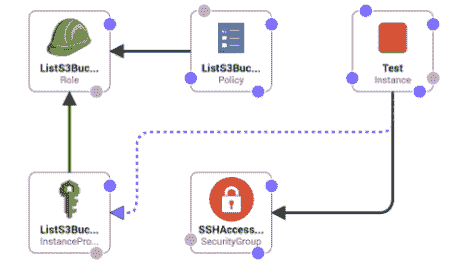
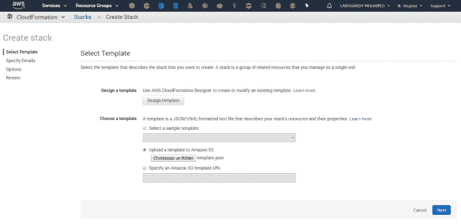
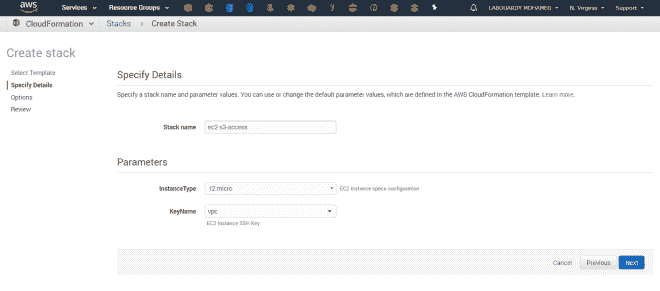
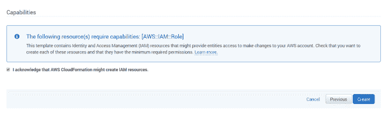
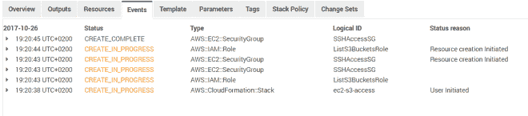
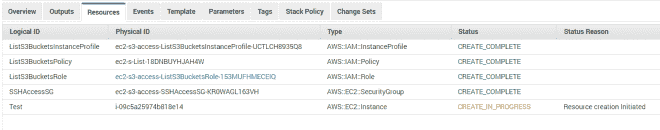
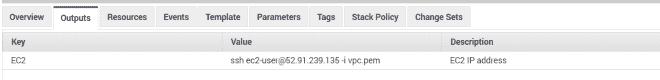
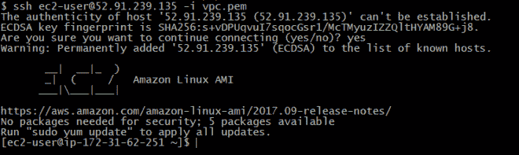
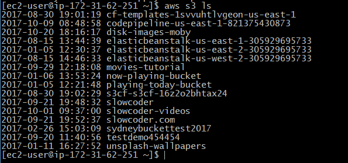
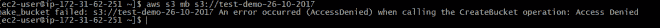

# 使用 CloudFormation 将 IAM 角色附加到 EC2 实例

> 原文：<https://medium.com/hackernoon/attach-an-iam-role-to-an-ec2-instance-with-cloudformation-33c517a8d4c3>

> CloudFormation 允许您通过在代码中定义 AWS 基础设施来管理它。

在这篇文章中，我将向你们展示如何创建一个 **EC2** 实例，并为其附加一个 **IAM** 角色，这样你们就可以访问你们的 **S3** 桶。

首先，您需要一个模板来指定您希望在堆栈中包含的资源。对于这一步，您使用我已经准备好的样本[模板](https://github.com/mlabouardy/aws-cloudformation-templates):

该模板创建一个基本的 **EC2** 实例，该实例使用一个 **IAM 角色**和 **S3 列表**策略**。它还创建了一个安全组，允许从任何地方进行 SSH 访问。**

注意:我还使用了*参数*部分来声明在创建堆栈时可以传递给模板的值。

现在我们定义了模板。登录 [AWS 管理控制台](https://console.aws.amazon.com/)，然后导航到 **CloudFormation** ，点击 **Create Stack** 。上传 **JSON** 文件:

您需要为这个栈指定一个名称，并选择您的 EC2 规范配置& SSH 密钥对:

确保选中“我确认 AWS 云信息可能会创建 IAM 资源”复选框，以便创建 **IAM 策略** & **角色**:

启动后，您将看到以下启动流程事件的屏幕:

过一会儿，您会在状态选项卡中看到 **CREATE_COMPLETE** 消息:

完成后，在 output 选项卡上，您应该看到如何通过 **SSH** 连接到您的实例:

如果您将终端指向 output 选项卡中显示的值，您应该能够通过 SSH 连接到服务器:

宋承宪 ec2-user@52.91.239.135-I VPC . PEM

让我们检查一下是否可以使用 **AWS CLI** 列出 S3 存储桶:

aws s3 ls

厉害！因此，我们能够列出存储桶，但是如果我们想要创建一个新的存储桶，该怎么办呢:

没有成功，这很正常，因为附加到实例的 **IAM 角色**没有足够的权限( *CreateBucket* action)。