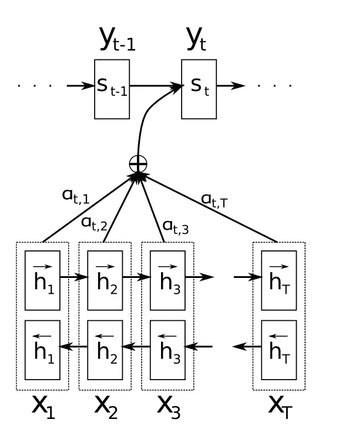
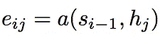
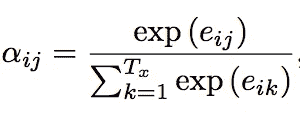
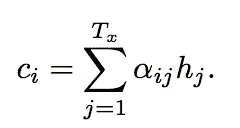

# 神经网络中的注意机制

> 原文：<https://medium.com/hackernoon/attention-mechanism-in-neural-network-30aaf5e39512>

一个**编码器**读取源语句并编码成一个**定长向量**。

一个**解码器**然后输出来自编码矢量的翻译。

## **限制**

这种编码器-解码器方法的一个潜在问题是，神经网络需要能够将源句子的所有必要信息压缩到一个**固定长度向量**中。

## **注意力如何解决问题？**

注意机制允许解码器在输出生成的每一步都注意源句子的不同部分。

我们让模型学习**如何为每个输出时间步长生成上下文向量**，而不是将输入序列编码到**单个固定上下文向量**中。也就是说，我们让模型**学习**根据输入的句子和它到目前为止产生的结果来处理什么。

# 注意机制

Attention Mechanism

这里，**编码器**产生 **h1、h2、h…hT** 来自输入 **X1，X2，X3…XT**

然后，我们必须为每个输出时间步长找出**上下文向量 ci** 。

## **如何计算每个输出时间步长的上下文向量？**

**a** 是**校准模型**，它是一个**前馈神经网络**，用所提出的系统的所有其他组件进行训练

**对准模型**对每个编码输入(h)与解码器(s)的当前输出的匹配程度进行评分(e)。

使用 **softmax 函数对比对分数进行标准化。**

上下文向量是**注释** (hj)和**归一化比对分数的加权和。**

# 解码

解码器通过查看第 I 个上下文向量和先前的隐藏输出 s(t-1)来生成第 I 个时间步长的输出。

## 参考

— [联合学习对齐和翻译的神经机器翻译](https://arxiv.org/abs/1409.0473)，2015。