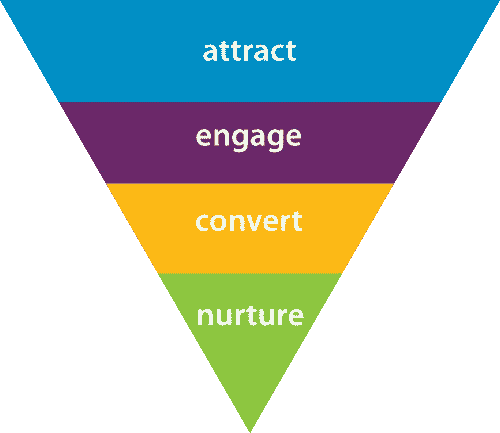
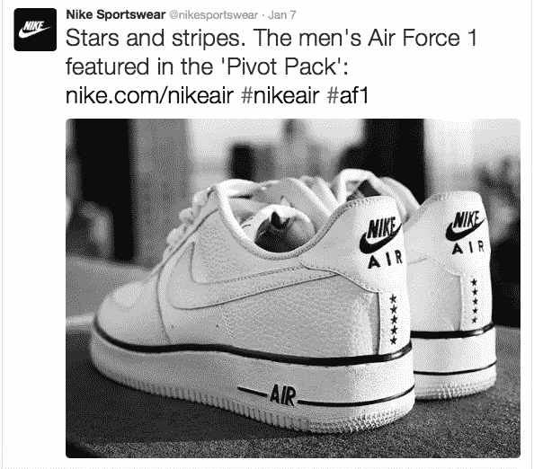
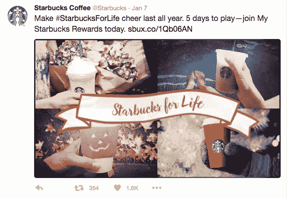

# 吸引、参与、转化、培养——为你的社交媒体粉丝创造一个网站转化漏斗

> 原文：<https://medium.com/hackernoon/attract-engage-convert-nurture-create-a-website-conversion-funnel-with-your-social-media-fans-de9d4c6aa096>

如果你有机会阅读我之前关于[通过脸书和推特活动](http://www.avalon.host/blog/how-to-generate-traffic-to-your-website-with-brisk-facebook-and-twitter-activities/)提高网站流量的博客，也许我让你更多地思考如何**优化你的网站**以获得更好的表现、强大的在线影响力和[营销](https://hackernoon.com/tagged/marketing)的成功。

今天，我想向你展示几个例子，告诉你无论你选择哪种社交媒体平台，如何创造转化漏斗。

## 什么是转化漏斗？

**转化漏斗**是指在线消费者/访问者通过互联网广告或搜索系统进入你的网站以转化为销售的旅程。

> 转换漏斗是一项持续的任务，即在利用技术和其他可用工具更有效地满足客户需求的同时，获取、保持和扩大您的客户群。这是潜在客户培育、行为目标、保留和推荐集于一身。
> 
> –企业家、投资者和影响者尼尔·帕特尔

有三种转换漏斗**类型**，一旦你决定参与其中，决定正确的转换漏斗模型是你的第一步。

1.  **获取漏斗** —帮助企业获取尽可能多的新访客和客户。如何实现这一点？创造一个有趣的提议，让你的潜在访客对你感兴趣。(例如，提供免费的电子书)
2.  **激活漏斗** —帮助企业将新访客和客户转化为买家。例如，你可以提供一个吸引人的博客，内容是你的访问者/客户会觉得有用的。
3.  **货币化漏斗** —帮助企业从活跃买家和/或订户那里获得收入。这种类型的漏斗可能需要更复杂的报价，如现场活动或网上研讨会。

漏斗实际上是吸引力、兴趣、欲望和行动(T21)的混合体。然而，事情并不像看起来那么简单。你的主要关注点必须是你的客户的行为。说起来，吸引他们确实是一件很辛苦的事情，但是培养他们就更辛苦了。

## 通过社交媒体成功转化漏斗的例子

## 吸引

毫无疑问，Nike 是转换漏斗所有 4 个部分的主宰。这是一个如何通过使用[富媒体推文](http://www.avalon.host/blog/how-to-generate-traffic-to-your-website-with-brisk-facebook-and-twitter-activities/)来**吸引**访客的绝妙例子:

这条推文的组成部分包括**一张吸引人的图片，链接到网站**，以及一个或多个代表业务、产品或服务的特定**标签**。

## 从事

**澳发**在脸书上发布了一个面向订婚的帖子，邀请粉丝赢得一份有趣的礼物。

该帖子包括一张**吸引人的与季节相关的图片、一个网站链接、一个关键词**(在本例中为“Win”)，以及一个与产品相关的标签。

## 皈依者

一旦你成功地让你的访问者感兴趣，并且他们中的一些已经与你接触，使用[脸书重新定位](http://www.avalon.host/blog/how-to-generate-traffic-to-your-website-with-brisk-facebook-and-twitter-activities/)将他们转化为买家。

在 MVMT 手表的案例中(上图)，使用强大的关键词会产生巨大的差异。关键字的组合，如“免费”和“购买”，包括一个吸引人的图像，为访问者创造了一个更高的可能性，使之采取行动，并购买您的产品或服务。

## 培育

这可能是最困难的部分。培养你现有的访客/客户是一项艰巨的任务，因为你需要同时具有创造性、趣味性和实用性。

我举了星巴克的例子，虽然我明白像这样受欢迎的品牌不必担心这些。他们总是很有创造力，有趣而且有用。然而，以上是星巴克通过社交媒体培养顾客的例子。关键词是“**奖励**”！

这正是你赢得的客户对你的期望。他们希望因为他们的忠诚和与你分享他们的细节而得到回报。这类顾客/访客对你的生意非常重要，因为他们可以成为你的大使，分享关于你的(好)话。对你的企业来说，制定培育现有客户的策略非常重要，否则之前采取的所有步骤都没有意义，因此你的漏斗策略将成为一个错误的循环。

## 如何开始你的转化漏斗活动？

你会从各种不同的专业人士那里听到许多不同的建议。但是，需要采取三个简单的步骤，这三个步骤都建立在第一个步骤的基础上:

*   [找一个高质量的主机服务提供商](http://www.avalon.host/blog/entrepreneurs-freelancers-startups-why-a-web-hosting-service-is-your-first-smart-investment-in-2016/)来优化你的网站
*   [选择你的在线营销策略](http://www.avalon.host/blog/growth-hacking-or-inbound-marketing-which-is-better-for-your-online-business/)
*   [让你的社交媒体活动变得聪明而有用](http://www.avalon.host/blog/how-to-generate-traffic-to-your-website-with-brisk-facebook-and-twitter-activities/)

对于那些刚刚开始忙于将网站活动与社交媒体平台结合起来的人来说，Avalon(Avalon)在这里为你的发布做准备，从而让你赢得广阔的网络世界。

你准备好提升你的在线业务了吗？

*本文原载于* [*阿瓦隆博客*](http://www.avalon.host/blog/attract-engage-convert-nurture-create-a-website-conversion-funnel-with-your-social-media-fans/) *。*

> [黑客中午](http://bit.ly/Hackernoon)是黑客如何开始他们的下午。我们是 T21 家庭的一员。我们现在[接受投稿](http://bit.ly/hackernoonsubmission)并乐意[讨论广告&赞助](mailto:partners@amipublications.com)机会。
> 
> 如果你喜欢这个故事，我们推荐你阅读我们的[最新科技故事](http://bit.ly/hackernoonlatestt)和[趋势科技故事](https://hackernoon.com/trending)。直到下一次，不要把世界的现实想当然！

