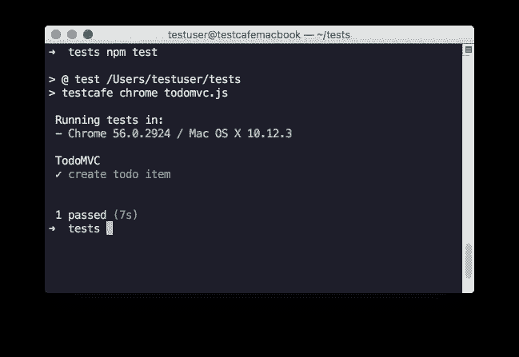
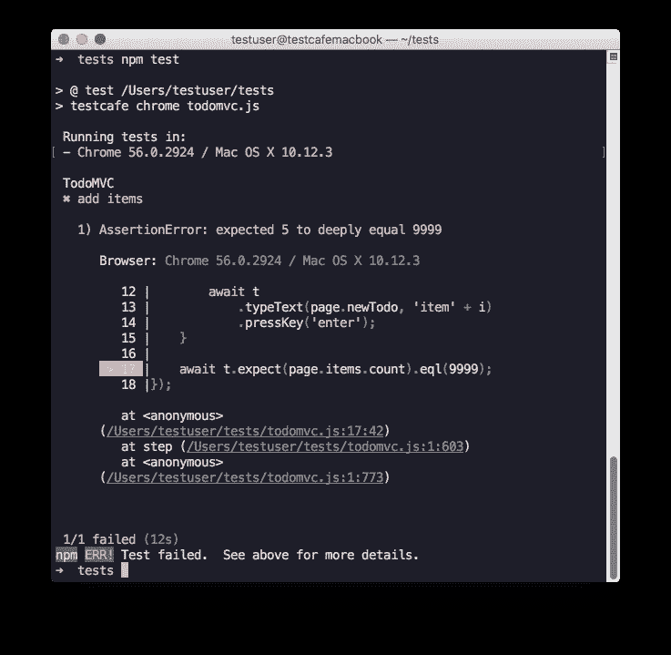

# 奥雷利亚·e2e 用 TestCafe 测试

> 原文：<https://medium.com/hackernoon/aurelia-e2e-testing-with-testcafe-b4fb19bcb0c9>

# **简介**

[Aurelia](http://aurelia.io/) 是一个 [JavaScript](https://hackernoon.com/tagged/javascript) 下一代移动、桌面和网络客户端框架。它是用 ECMAScript 2016 从头开始编写的，并作为一系列协作库来构建。这使得该框架具有前瞻性、功能强大且健壮。

随着 Aurelia 的流行，越来越多的人需要为他们的应用选择一个测试框架。他们希望它简单、功能强大，并且是 Aurelia 应用程序的原生产品。这就是为什么我们在 [TestCafe](https://github.com/devexpress/testcafe) 团队制作了一个插件，将本地 Aurelia 选择器引入 TestCafe 测试:[test cafe-Aurelia-选择器](https://github.com/miherlosev/testcafe-aurelia-selectors)。

在本文中，我们将使用它来测试 [Aurelia TodoMVC 应用程序](http://todomvc.com/examples/aurelia/)。

# 设置

要开始使用 TestCafe，您需要通过`npm`安装它。

```
npm install testcafe
```

之后，为 TestCafe 安装 Aurelia 专用的选择器。

```
npm install testcafe-aurelia-selectors
```

这个模块包含了最常用的 Aurelia 绑定的选择器。更多细节，请参见 [testcafe-aurelia-selectors 库](https://github.com/miherlosev/testcafe-aurelia-selectors)。

# 创建测试

创建一个新的`todomvc.js`文件，并编写`fixture`和`test`定义。

接下来，指定设备的启动页面。

# 页面模型、测试动作和断言

我们将在一个名为[页面模型](http://martinfowler.com/bliki/PageObject.html)的对象中组织关于页面结构的信息。这意味着我们将在一个单独的类中为不同的页面元素分组选择器。TestCafe 支持 ES2016 JavaScript 特性，所以我们的页面对象是简单的 ES6 类。

让我们定义页面模型。

我们使用`byValueBind` Aurelia 选择器来识别一个新的 todo 项输入，它被绑定到`newTodoTitle`值。为了识别待办事项列表，我们使用 TestCafe CSS [选择器](https://devexpress.github.io/testcafe/documentation/test-api/selecting-page-elements/selectors.html)。

你可以一起使用 Aurelia 特有的选择器和内置的 TestCafe 选择器。这些选择器返回相同的 [DomNodeState](https://devexpress.github.io/testcafe/documentation/test-api/selecting-page-elements/dom-node-state.html) 对象。所以，你甚至可以把它们结合起来。

接下来，将页面模型类作为一个常规依赖项添加到测试文件中，并创建它的一个实例。

然后，添加测试动作和断言。

该测试创建一个新的 todo 项目:在“new todo”输入中键入其名称，按 Enter 并检查项目是否存在。

不需要调用等待方法。TestCafe 自动等待，直到页面准备好执行测试操作。

还要注意，您可以按任何顺序放置动作、断言和其他 JavaScript 代码。

# 运行测试

创建一个新的`package.json`文件，并向其中添加一个测试运行命令。

现在您已经准备好运行您的第一个测试了。

```
npm test
```

或者，您可以指定测试应该在几个浏览器中运行。

```
testcafe chrome,firefox todomvc.js
```

或者您可以在本地机器上安装的所有浏览器中运行您的测试。

```
testcafe all todomvc.js
```

更多细节请参见 [TestCafe 命令行界面](https://devexpress.github.io/testcafe/documentation/using-testcafe/command-line-interface.html)

当您运行`npm test`命令时，TestCafe 打开 Google Chrome，执行测试，收集输出，关闭浏览器并将输出发送到您的 shell。



如果您的断言失败或者测试代码包含语法错误，TestCafe 会报告包括调用点在内的问题。

让我们将断言代码改为

再做一次测试。您将看到以下报告。



# 扩展 TestCafe 功能

如果 TestCafe 没有提供你需要的某些功能或者浏览器支持怎么办？由于 TestCafe 是一个 [node.js](https://hackernoon.com/tagged/nodejs) 应用程序，您可以使用 node.js 生态系统中的任何模块。还有，TestCafe 有两个扩展点:可以编写自己的[浏览器插件](https://devexpress.github.io/testcafe/documentation/extending-testcafe/browser-provider-plugin/)和[记者插件](https://devexpress.github.io/testcafe/documentation/extending-testcafe/reporter-plugin/)。

# 完成的

仅此而已。如果你有关于 TestCafe 的问题——欢迎在我们的[论坛](https://testcafe-discuss.devexpress.com/)或 [GitHub 页面](https://github.com/DevExpress/testcafe)提问！

[](http://bit.ly/HackernoonFB)[](https://goo.gl/k7XYbx)[](https://goo.gl/4ofytp)

> [黑客中午](http://bit.ly/Hackernoon)是黑客如何开始他们的下午。我们是 [@AMI](http://bit.ly/atAMIatAMI) 家庭的一员。我们现在[接受投稿](http://bit.ly/hackernoonsubmission)，并乐意[讨论广告&赞助](mailto:partners@amipublications.com)机会。
> 
> 如果你喜欢这个故事，我们推荐你阅读我们的[最新科技故事](http://bit.ly/hackernoonlatestt)和[趋势科技故事](https://hackernoon.com/trending)。直到下一次，不要把世界的现实想当然！

