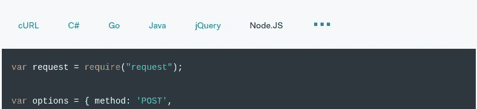
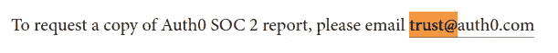
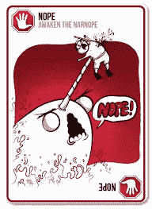
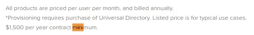

# 身份验证即服务，对 Auth0 的诚实回顾

> 原文：<https://medium.com/hackernoon/authentication-as-a-service-an-honest-review-of-auth0-315277abcba1>

## 远非完美。(可能)比自己滚要好。

身份验证很难。从智力上来说并不难——像 OAuth2 这样定义明确的标准是完整的，有大量的文档记录，并得到工具生态系统的支持。

相反，认证很难获得 [**对**](https://hackernoon.com/your-node-js-authentication-tutorial-is-wrong-f1a3bf831a46) 。没有对一次性请求使用状态变量或现时值——哎呀。将您的密码存储为 MD5 哈希，而不是使用 bcrypt —哎呀。没有强制 HTTP 严格传输安全(HSTS)并受到低级别的攻击—哎呀。菜鸟的错误，所有的。[点击此处获取更详细的咆哮。](/@rmharrison/dev-rant-stop-reinventing-user-auth-1193b138772)

好消息是，即使是一个不太称职的开发人员也可以阅读规范，制定清单并实施。对于我们这些喜欢重写已被广泛使用的非特定于应用程序的代码的人来说，坏消息是为什么要麻烦。

在评估了“推出我们自己的”和许多第三方供应商之后，我们选择了 Auth0。我们不会在技术堆栈的其他非差异化方面“重新发明轮子”。我们没有推出我们自己的单页 java 脚本框架，我们使用的是 Ember。我们没有设置自己的服务器，而是使用 AWS。那么，为什么这么多组织要冒技术风险，花费时间和成本来推出自己的授权呢？

没有区别。很容易付巴。我是**而不是**auth 0 粉丝([树脂！？](https://hackernoon.com/im-a-resin-io-fanboy-and-you-should-be-too-2b70e90b0710))；但是，对于大多数小公司来说，small 奥特是一个比自己申请授权更好的选择。

# 道具(做得好)

## 即插即用集成

作为一个 Ember 和 node.js 商店，拥有一个能够很好地处理我们的堆栈的 Auth 提供程序是很重要的。

嗯，我们很幸运。有一个[社区支持的 ember-simple-auth 集成](https://github.com/auth0-community/ember-simple-auth-auth0)(在“雄心勃勃的 web 应用程序”中 auth 的事实标准)。

[Auth0 正式支持护照策略。](https://github.com/auth0/passport-auth0)

冷静点。

## 下滑道

Auth0 的 [lock.js](https://github.com/auth0/lock) 是一款内置电池的解决方案，非常适合简单的用例。他们还允许从他们的网络控制台定制回调页面。

为了推出自己的版本，您可以随时返回到他们的客户端 SDK。

对于高度“非快乐路径”的需求，底层 API 是可用的。

一、二、三拳滑行路径，满足所有注册/签约需求。

## 无服务器组件的版本控制

Auth0 包括现成的定制支持，包括一个用于锁的[托管页面](https://auth0.com/docs/hosted-pages/login)和一个[规则引擎](https://auth0.com/docs/rules/current)。

两者都不支持现成的版本控制；在 base Auth0 中，一旦你对托管页面进行了规则更改或更新，之前的版本就永远消失了。

幸运的是，有一个 [Github 扩展](https://auth0.com/docs/extensions/github-deploy)可以直接从回购中推送。

## 大量文档

B2B SaaS 提供商的一个基本前提是，你和你的公司不是一片特殊的雪花。有无差别的开销——日志分析、代码部署、授权/单点登录——外包比内部构建要好。

Auth0 有几十个[教程](https://auth0.com/docs/tutorials)和快速入门，以及多语言 API 文档，带有使用您预先填充的凭据/设置的内置示例。

Multi-language support, e.g. in [token management API docs](https://auth0.com/docs/api/management/v2/tokens#1-get-a-token)

有些公司“用手册杀了你”，但 Auth0 的技术写作团队知道他们的手艺。这些文档写得很好，易于浏览(所有正确位置的内部参考)并且是最新的([包括 github 上的完整版本历史](https://github.com/auth0/docs/tree/master/articles))。

# 下降(可以做得更好)

自然，每个公司都可以做得更好…

## 合规透明度:SOC2 和 HIPAA

最大的区别在于，他们只将 SOC2 覆盖范围扩展到企业客户。为了窥视引擎盖下的情况，我按照说明要求了报告[。](https://auth0.com/blog/auth0-achieves-soc-2-certification/)

[O.k…request away](https://auth0.com/blog/auth0-achieves-soc-2-certification/)

我觉得不合理的是，Auth0 拒绝了**分享报告的请求。**

Exploding Kittens reserves all rights, presumably. Fair use.

完整报告仅提供给他们的企业客户，起价为每年 2 万美元以上。Developer 和 Developer Pro 的客户根本不够好，无法窥见其本质。但是没关系，只要“相信我们”细节决定成败，对于 auth 这样重要的东西来说，细节很重要。SOC2 不是 ISO27001。证明不是认证

例如，Auth0 仅选择[在 2/5 的可用信任领域获得 SOC2 证明](https://auth0.com/blog/how-to-build-your-customer-trust-through-soc-2/):安全性和可用性。我的假设是，随着时间的推移，其他 3 个信任领域(处理完整性、机密性和隐私)将会出现。

由于 HIPAA [BAA(业务伙伴协议)](https://www.hhs.gov/hipaa/for-professionals/covered-entities/sample-business-associate-agreement-provisions/index.html)是可用的，同样只对企业客户可用，我的假设是他们在隐私方面基本上是这样的。

## 配额和服务限制透明度

Auth0 是一家建立在信任基础上的公司。对于一家初创公司来说，将王国的钥匙交给授权和单点登录供应商是一个巨大的进步，更不用说企业了。它们在某些地方是透明的，比如[限速](https://auth0.com/docs/policies/rate-limits)。

在其他情况下，完全缺乏透明度。比如定价是基于用户的；但是，允许客户使用多少非交互式客户端:[与销售人员交谈！？](https://community.auth0.com/questions/4967/maximum-number-of-non-interactive-clients-in-free)

从 [AWS 剧本](http://docs.aws.amazon.com/general/latest/gr/aws_service_limits.html)中吸取教训，在服务限制和使用配额的透明度方面犯错误。

## 细粒度授权控制

尽管有一些奇怪的遗漏——例如，不能编辑用户信息，如 Auth0 数据库连接中的电子邮件——auth 0 管理面板还是非常强大的。事实上，它允许非开发人员担任管理员，因为不需要 SQL 和终端知识。

不幸的是，与非常细粒度的 AWS IAM 不同，Auth0 中基于角色的委托止于 admin + client。您可以为您的交互式客户端 vs API 委派不同的管理员，但是他们将完全控制各自的域。不，人 A 可以管理用户，人 B 可以接触高级设置。要么全有，要么全无。

# 竞争对手

## 天空的八分之一

奥克塔是大认证烘烤赛的亚军。我们喜欢 StormPath API，但在我看来，Okta FBAR 公司收购了。sun-setting API 没有清晰的过渡路径。没有从沙盒试验→开发→生产的滑行路径。放弃丰富的插件生态系统(向 HiveMQ 大喊)。

Stormpath 和 Okta 套件的其他产品在定价模式上也有很大差距。

Stormpath 的全包块定价从 1k 用户每月 20 美元起，非常合理。不合理的是[把他们的定价计划](https://okta.github.io/pricing-preview/)埋在 github.io 页面上，而不是对他们的客户诚实。

Okta 有 la cart 的定价，这对于小型内部 SSO 用户来说很好。不好的是在细则中写着**每年最低 1500 美元。大概惊了几个小公司。**

[Caveat emptor](https://www.okta.com/pricing/#product-platform)

对于超小型起步来说不太理想，但我可以接受这个价格。我有点恼火，他们试图把我推到一个销售+销售工程师二重奏的“订婚会议”上。LinkedIn 尽职调查显示，销售和工程之间的比例大约为 3:1，所以这并不奇怪。

以积极的方式结束，不像 Auth0(可耻！)，他们愿意和一个 NDA 人分享他们的足球(遮屁股，尽管可能无法执行)。

也许，仅仅是也许，Okta 开发者关系团队会把这些建议记在心里。毕竟，他们在最近的帖子中提到了[“反馈”5 次，关于 DevRel 香肠是如何从 Stormpath 的残余物中制作出来的。](https://developer.okta.com/blog/2017/08/21/what-is-developer-relations-at-okta)

## 使中心化

企业 SSO。完全不合适。

# 公开

我是**而不是**隶属于 [Auth0](https://auth0.com/guest-authors) 或 [Okta](https://www.okta.com/blog/2013/06/partnering-with-okta-just-got-easier-with-the-okta-partner-program/) 影响者计划。*代替*影响者计划费用，请随意赞助[自由软件基金会](https://www.fsf.org/patrons)、[电子前沿基金会](https://www.eff.org/thanks)或类似组织。

# 脚注

1.  但在个人和职业环境中，我发现层级最少的组织，以围绕授权、集体决策和自下而上的权力== win 的强大群体规范为后盾。团队(不知不觉地)使用了[谨慎决策](https://www.roundskysolutions.com/deliberative-decision-making-and-why-you-need-it/)的变体。
2.  不幸的是，托管登录页面不支持最低定价层的自定义域。你被困在一个不太理想的 <org>.auth0.com</org>
3.  例如，如果你想建立一个 IP 白名单，有一个[预建的片段](https://auth0.com/rules/ip-address-whitelist)用于此目的，还有许多其他花哨的功能，所有这些都是无服务器运行的。

别见外。如果你认为我能帮助你的组织，请随时联系 LinkedIn 或类似网站。