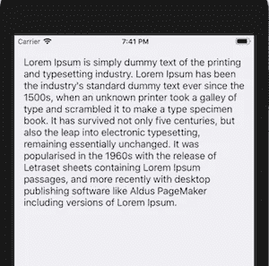
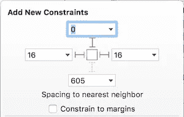
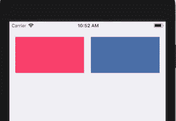
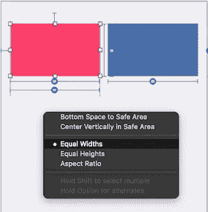
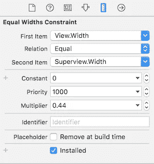
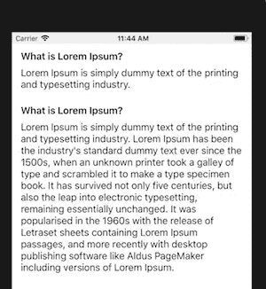

# 自动布局 UI 示例

> 原文：<https://medium.com/hackernoon/auto-layout-ui-examples-2517c7efca25>

## 在各种情况下使用约束

如果你想成为一名优秀的 iOS 开发者，正确使用自动布局是非常重要的。这就是为什么我想写另一个故事，向你展示一些 UI 场景，以及如何用自动布局*约束*处理它们。我知道有很多不同的情况，但是我将介绍一些常见的情况。

## 首先，确定你看过我之前的《了解自动布局》的故事。👇👇👇

[](https://hackernoon.com/understanding-auto-layout-in-xcode-9-2719710f0706) [## 了解 Xcode 9 中的自动布局

### 所有你需要知道的关于自动布局

hackernoon.com](https://hackernoon.com/understanding-auto-layout-in-xcode-9-2719710f0706) 

# 用户界面示例

我会从简单的开始。假设您需要创建一个具有动态高度的 UILabel，它将跟随文本的长度。



为了实现这个场景，我们只需要 3 个约束。*前导*、*拖尾*和*顶端*。另外，如果您希望您的 UILabel 拥有无限的行数，不要忘记将行数属性设置为 0。我们不需要为组件设置任何高度约束，因为这样我们就告诉它根据内容定义自己的高度。



2 让两个宽度和高度相等的视图组件相邻怎么样？



为了实现这个共同的场景，我想先用**比例大小**给大家介绍一下。

# 比例尺寸

通过定义比例大小，我们告诉组件获取目标视图的精确百分比。例如，在我们的例子中，粉色视图将包含超级视图宽度的 44%。这意味着，该视图将始终占据 44%的宽度(在任何屏幕尺寸上)。我们也可以在高度上应用比例尺寸。

要添加比例大小，请按住 CTRL 并从自定义视图向超级视图拖动。将出现以下菜单，您可以添加相等的宽度或高度。



选择后，点击创建的约束并将*乘数*设置为 0.44。*乘数*定义第一个项目应该从第二个项目中抽取多少百分比。如果您使用比例尺寸，请务必将*常量*设为 0，将*优先级*设为 1000。



现在，当您知道什么是比例大小时，让我们回到添加所有必需的约束到粉色和蓝色视图。

## **粉色视图**

1.  定义位置的顶部和前导约束。
2.  静态高度约束。
3.  **比例宽度**以 44%的乘数监督约束。

## 蓝色视野

1.  定义位置的顶部和尾部约束。
2.  与粉色视图等高
3.  与粉红色视图等宽

在蓝色视图上，我们将大小设置为等于粉色视图的大小。在这种情况下，乘数应该保持为 1，因为我们希望获得 100%精确的宽度和高度作为粉红色视图。

3 根据每个单元格中的内容，在 UITableViewCell 上创建动态高度。

我认为这是一个非常令人兴奋的例子，因为在自动布局的帮助下，几乎不需要任何编码，你就可以告诉 UITableView 自动计算高度。

在 Auto Layout 出来之前在 [Xcode](https://hackernoon.com/tagged/xcode) 工作的人，会理解这种痛苦。创建一个具有动态高度的单元需要很大的努力。😃



正如我上面提到的，这很容易通过自动布局来实现。我有一个 UITableViewCell，它有两个 UILabels，一个在另一个下面，它们都被设置为遵循它的内容大小。

*   在**顶部标签**上，您应该添加前导、尾随和顶部约束。
*   在**底部标签**上，您应该添加前导、尾随、顶部和底部约束。

请始终记住将每个组件与其上方的组件连接起来，并在单元末端的最后一个组件上添加底部约束。这个组件链非常重要，因为这是细胞被它们“推动”并计算总高度的方式。

## UITableViewDelegate

我们还应该编写一些代码，这将触发 UITableView 自动计算单元格高度。

```
func tableView(_ tableView: UITableView, heightForRowAt indexPath: IndexPath) -> CGFloat { return UITableViewAutomaticDimension}func tableView(_ tableView: UITableView, estimatedHeightForRowAt indexPath: IndexPath) -> CGFloat { return 75}
```

在`heightForRowAt`委托方法中添加`UITableViewAutomaticDimension`，并添加一个您期望单元格在`estimatedHeightForRowAt`内开始的高度。我总是添加界面构建器中设置的当前单元格高度。**搞定！**😃

4 在 [NSLayoutConstraints](https://developer.apple.com/documentation/uikit/nslayoutconstraint) 的帮助下在自动布局中做约束动画。

首先连接一个 *NSLayoutConstraint* 出口，用于您想要制作动画的约束。例如，假设您需要为某个视图的位置制作动画。

```
@IBOutlet fileprivate var topConstraint: NSLayoutConstraint!
@IBOutlet fileprivate var customView: UIView!
```

现在，为了动画化约束，我们需要使用本地 UIView 方法`animate()`。

```
UIView.animate(withDuration: 0.5) {self.topConstraint.constant = 100
self.customView.layoutIfNeeded()}
```

这里发生的事情是，我们给我们希望它去的约束赋予一个新的值，然后我们通过使用`layoutIfNeeded`让视图重新加载它的内容。

## 这就是本教程的内容，如果对你有帮助，请👏或者分享这个故事，让其他像你一样的人也能找到它。感谢您的关注！🚀

[](http://bit.ly/2KkkwGL)

## 查看我的最新项目:

[](https://apps.apple.com/app/football-score-prediction-bets/id1517623538) [## 足球比分预测赌注

### 我们提供专业的足球比分预测投注提示，胜率高。每个比赛模拟包含一个…

apps.apple.com](https://apps.apple.com/app/football-score-prediction-bets/id1517623538) [](https://play.google.com/store/apps/details?id=betting.tips.goals) [## 足球博彩技巧和比分——赌进球 Google Play 上的应用程序

### 我们提供高胜率的专业足球技巧。每个比赛模拟包含一个预测，代表…

play.google.com](https://play.google.com/store/apps/details?id=betting.tips.goals) [](https://apps.apple.com/app/zoom-profile-picture-stories/id1514925024) [## 缩放个人资料图片和故事

### ZoomPic for Instagram 是匿名查看大型高清个人照片和故事的最简单、最方便的方式…

apps.apple.com](https://apps.apple.com/app/zoom-profile-picture-stories/id1514925024) [](https://apps.apple.com/app/long-video-story-for-instagram/id1511499427) [## Instagram 的长视频故事

### Instagram 的 Long Story 是一个非常棒的工具，允许您录制或选择任意长度的视频并进行转换…

apps.apple.com](https://apps.apple.com/app/long-video-story-for-instagram/id1511499427) 

## 阅读更多我在媒体上的作品:

[](https://hackernoon.com/introducing-clean-swift-architecture-vip-770a639ad7bf) [## 引入干净的 Swift 架构(VIP)

### 忘了 MVC 吧，现在！

hackernoon.com](https://hackernoon.com/introducing-clean-swift-architecture-vip-770a639ad7bf) [](https://medium.freecodecamp.org/how-you-can-use-the-google-maps-sdk-with-ios-using-swift-4-a9bba26d9c4d) [## 使用 Swift 4 在 iOS 上使用 Google Maps SDK 的终极指南

### 许多 iOS 应用程序使用谷歌地图。这是一个非常普遍的特点，所以我决定准备一个终极指南…

medium.freecodecamp.org](https://medium.freecodecamp.org/how-you-can-use-the-google-maps-sdk-with-ios-using-swift-4-a9bba26d9c4d) [](/theappspace/swift-custom-uiview-with-xib-file-211bb8bbd6eb) [## SWIFT —带有 XIB 文件的自定义 UIView

### 用 XIB 文件定制 UIView 是 iOS 开发中非常常见的做法。自定义 UIView 类不包含 XIB 文件…

medium.com](/theappspace/swift-custom-uiview-with-xib-file-211bb8bbd6eb) [](https://hackernoon.com/how-to-add-spotlight-support-to-your-ios-app-4a89054aff89) [## 如何将 Spotlight 支持添加到您的 iOS 应用程序

### Swift 教程将使您的应用程序在 Spotlight search 中可用

hackernoon.com](https://hackernoon.com/how-to-add-spotlight-support-to-your-ios-app-4a89054aff89) [](https://hackernoon.com/core-data-relationships-d813ed66ba8c) [## 核心数据关系

### 理解一对一和一对多关系

hackernoon.com](https://hackernoon.com/core-data-relationships-d813ed66ba8c) [](https://hackernoon.com/understanding-auto-layout-in-xcode-9-2719710f0706) [## 了解 Xcode 9 中的自动布局

### 所有你需要知道的关于自动布局

hackernoon.com](https://hackernoon.com/understanding-auto-layout-in-xcode-9-2719710f0706) 

## 订阅我的时事通讯: