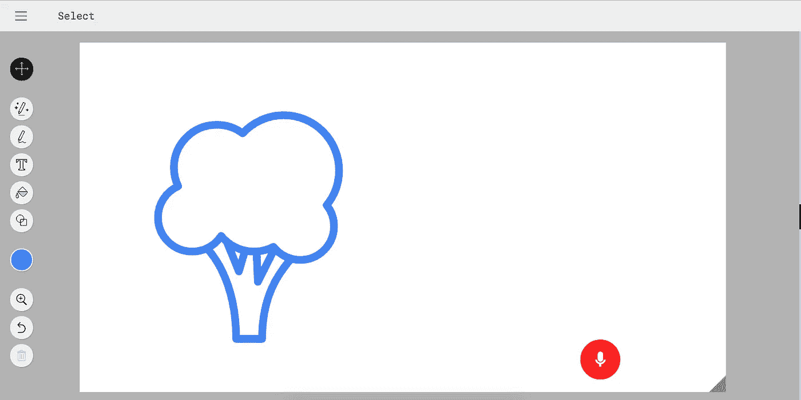
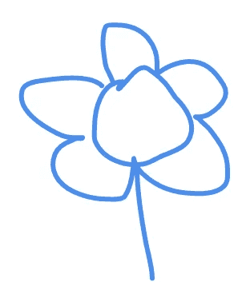
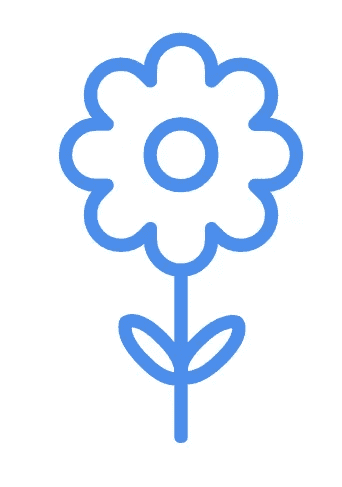

# 使用 Google Now 自动绘图

> 原文：<https://medium.com/hackernoon/autodraw-with-google-now-6c1d0d08abd5>

AutoDraw 是一款出色的工具。但是，用了多次之后。我想到了一些可能有用的东西。如果我想要一朵花，我必须画一张草图。

我要这个。

太好了！

如果我想要一棵树。我得再画一张草图。这将需要很少的努力和几秒钟。想象一下，如果我们有 google now 集成，我可以只说*“我需要一棵树”*。

自动绘制仍然有意义，因为不是所有时候我都知道我想画的东西的名字。如果我想让建议接近我画的东西。

从开发人员的角度来看，不这样做是有意义的，因为你会错过很多训练数据。

从用户的角度来看，这很有帮助。

> [黑客中午](http://bit.ly/Hackernoon)是黑客如何开始他们的下午。我们是 [@AMI](http://bit.ly/atAMIatAMI) 家庭的一员。我们现在[接受投稿](http://bit.ly/hackernoonsubmission)并乐意[讨论广告&赞助](mailto:partners@amipublications.com)机会。
> 
> 如果你喜欢这个故事，我们推荐你阅读我们的[最新科技故事](http://bit.ly/hackernoonlatestt)和[趋势科技故事](https://hackernoon.com/trending)。直到下一次，不要把世界的现实想当然！