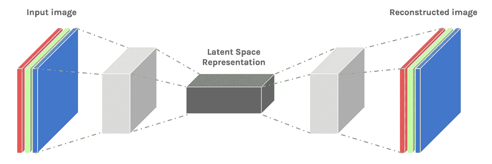
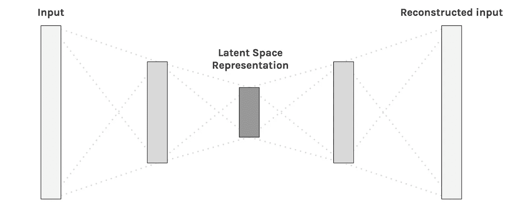
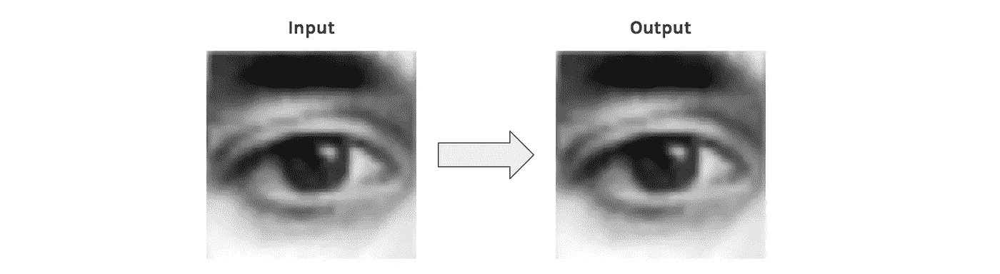
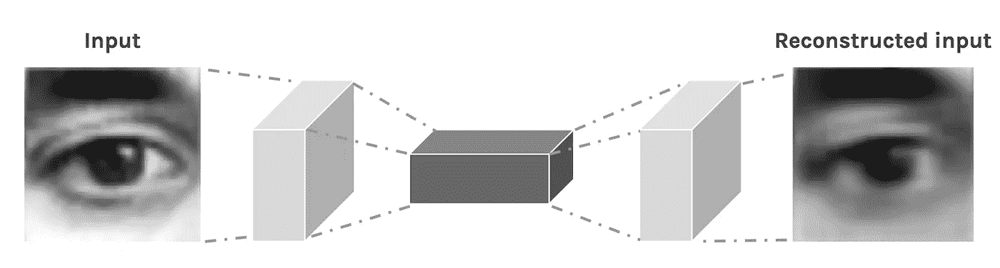
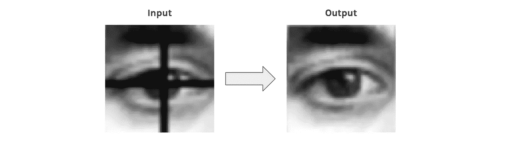
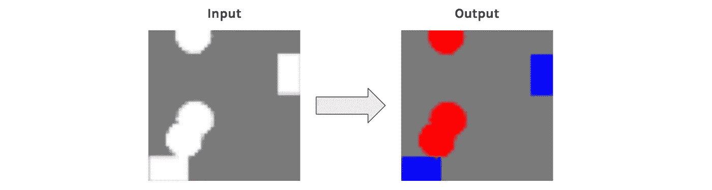
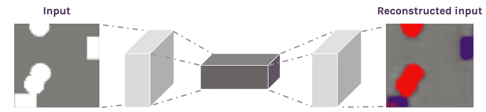
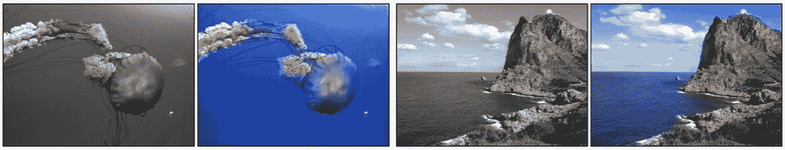
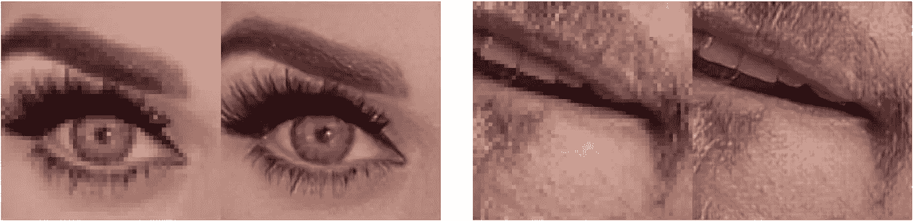

# 自动编码器—深度学习比特#1

> 原文：<https://medium.com/hackernoon/autoencoders-deep-learning-bits-1-11731e200694>

*特色*:数据压缩、图像重建和分割(附实例！)

在“*深度学习 bits* ”系列中，我们将**而不是**看到如何像我们在[***a . I . Odyssey***](/@juliendespois/talk-to-you-computer-with-you-eyes-and-deep-learning-a-i-odyssey-part-2-7d3405ab8be1)***中所做的那样，端到端地使用深度学习来解决复杂问题。*** 我们更愿意看看不同的技术，以及一些**例子和应用。**

> ***如果你喜欢人工智能，一定要去*** [***订阅时事通讯***](http://eepurl.com/cATXvT) ***来接收关于文章和更多的更新！***

# 介绍

## 什么是自动编码器？

神经网络以各种形状和大小存在，并且通常以它们的**输入**和**输出数据类型来表征。**例如，使用*卷积神经网络构建图像分类器。*它们将**图像**作为输入，并输出类别的概率分布**。**

*自动编码器(AE)* 是一类神经网络，其**输入与输出相同*** 。它们的工作原理是将输入压缩成一个*潜在空间表示，*然后从这个表示中重建输出。

**我们将看到如何使用输入的修改版本会更加有趣*

Simple Autoencoder architecture — The input is compressed and then reconstructed

## **卷积自动编码器**

自动编码器真正流行的用途是将它们应用于图像。**的诀窍**就是用*卷积*层代替*全连接*层。这些图层与合并图层一起，将输入从**宽**和**薄**(假设 100 x 100 px，3 个通道— RGB)转换为**窄**和**厚**。这有助于网络从图像中提取**视觉特征**，从而获得更加准确的潜在空间表示。重建过程使用*上采样*和卷积。

由此产生的网络被称为*卷积自动编码器* ( *CAE* )。

Convolutional Autoencoder architecture — It maps a wide and thin input space to narrow and thick latent space

## 重建质量

输入图像的*重建*通常是**模糊**和**低质量的。**这是*压缩*的结果，在此期间**丢失了一些信息**。

The CAE is trained to reconstruct its input

The reconstructed image is blurry

# CAEs 的使用

## 示例 1:超基本图像重建

卷积自动编码器可以用于重建。例如，他们可以学习[从图片](http://www.jmlr.org/papers/volume11/vincent10a/vincent10a.pdf)中去除噪声，或者重建丢失的部分。

为此，我们不使用相同的图像作为输入和输出，而是使用**噪声版本作为输入**和**干净版本作为输出**。通过这个过程，网络学会填补图像中的空白。

让我们看看 CAE 能做什么来替换眼睛图像的一部分。*假设有一个十字准线，我们想移除它*。我们可以手动创建数据集，这非常方便。

The CAE is trained to remove the crosshair

Even though it is blurry, the reconstructed input has no crosshair left

> *现在我们的自动编码器已经训练好了，我们可以用它来移除我们从未见过的眼睛***图片上的十字准线！**

## *示例 2:超基本图像彩色化*

*在本例中，CAE 将学习*将*从圆形和正方形的图像映射到同一图像，但是**圆形**被着色为**红色**，而**正方形**被着色为**蓝色**。*

**

*The CAE is trained to colorize the image*

**

*Even though the reconstruction is blurry, the color are mostly right*

*CAE 在给图像的**右边**部分*上色*上**做得很好**。据了解*圆圈*为*红色*方形*为*蓝色*为*。紫色来自蓝色和红色的混合，网络在圆形和方形之间犹豫不决。*

> **现在我们的 autoencoder 已经训练好了，我们可以用它来给我们从未见过的***的图片上色！***

# ****高级应用****

**上面的例子只是概念的证明，用来展示卷积自动编码器能做什么。**

**更令人兴奋的应用包括[全图像彩色化](http://richzhang.github.io/colorization/)、[潜在空间聚类](http://proceedings.mlr.press/v48/xieb16.pdf)，或者[生成更高分辨率的图像](https://arxiv.org/pdf/1501.00092v3.pdf)。后者通过使用低分辨率作为输入和高分辨率作为输出来获得。**

****

**Colorful Image Colorization by Richard Zhang, Phillip Isola, Alexei A. Efros**

****

**Neural Enhance by [Alexjc](https://github.com/alexjc/neural-enhance)**

# **结论**

**在这篇文章中，我们看到了如何使用*自动编码神经网络*来压缩、重建和清理数据。获取图像作为输出是一件非常激动人心的事情，玩起来也非常有趣。**

*****注意:*** *有一个 AEs 的修改版本叫做* ***变分自动编码器*** *，用于图像生成，不过我留着以后用。***

> *****如果你喜欢人工智能，一定要去*** [***订阅时事通讯***](http://eepurl.com/cATXvT) ***来接收关于文章和更多的更新！*****

**你可以玩那边的代码:**

** [## GitHub-despisj/convolutionalautoencer:快速而肮脏的应用实例…

### 此时您不能执行该操作。您已使用另一个标签页或窗口登录。您已在另一个选项卡中注销，或者…

github.com](https://github.com/despoisj/ConvolutionalAutoencoder) 

感谢阅读这篇文章，敬请关注！

> [黑客中午](http://bit.ly/Hackernoon)是黑客如何开始他们的下午。我们是 [@AMI](http://bit.ly/atAMIatAMI) 家庭的一员。我们现在[接受投稿](http://bit.ly/hackernoonsubmission)并乐意[讨论广告&赞助](mailto:partners@amipublications.com)机会。
> 
> 如果你喜欢这个故事，我们推荐你阅读我们的[最新科技故事](http://bit.ly/hackernoonlatestt)和[趋势科技故事](https://hackernoon.com/trending)。直到下一次，不要把世界的现实想当然！

**