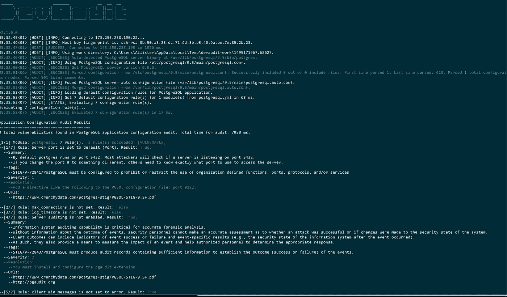
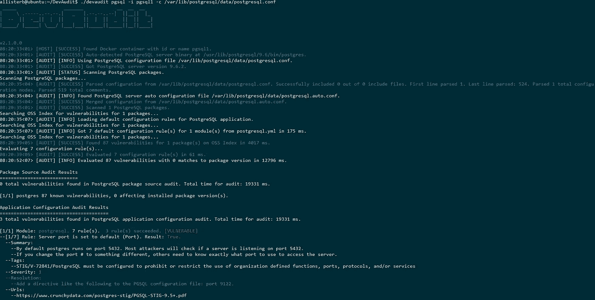

# 为 PostgreSQL 自动实现 DISA STIG

> 原文：<https://medium.com/hackernoon/automate-implementing-the-disa-stig-for-postgresql-a7e3267c83d0>



Audit of a PostgreSQL server configuration

在本文中，我将展示如何使用 [DevAudit](https://github.com/OSSIndex/DevAudit) 对 PostgreSQL 服务器的配置进行安全审计，DevAudit 是一个开源的跨平台多用途安全审计程序，具有一个审计规则集，可以自动检查服务器是否符合美国国防信息系统局(DISA)发布的 [PostgreSQL 9.x 安全技术实施指南](https://www.crunchydata.com/postgres-stig/PGSQL-STIG-9.5+.pdf)。

## 介绍

这是我关于开源审计项目 DevAudit 的系列文章的第 2 篇。在第一篇文章的[中，我介绍了审计 ASP.NET web 应用程序的库依赖、应用程序配置和代码。在这里，我将讨论根据一组众所周知的安全和强化规则来审计您的 web 或其他应用程序可能依赖的应用服务器的配置。该步骤可以是持续集成或部署管道的一部分，用于验证应用程序操作环境或基础设施的配置和安全状况。在本文中，我将具体介绍:](https://hackernoon.com/security-auditing-asp-net-applications-using-devaudit-ee31873be364)

*   通过 SSH 远程审计 Linux PostgreSQL 服务器。
*   将 PostgreSQL STIG 规则实现为审计规则。
*   未来的 DevAudit 服务器审计功能。
*   通过 WinRM 远程审核 Windows PostgreSQL 服务器。
*   审计 PostgreSQL 服务器 [Docker](https://hackernoon.com/tagged/docker) 容器。

## 关于 DevAudit

DevAudit 是一个跨平台的多用途[安全](https://hackernoon.com/tagged/security)审计工具，旨在审计应用程序开发安全的所有方面。应用程序通常运行在环境中部署的服务器上，并依赖于这些服务器来提供所需的服务，如身份验证、web 应用程序托管和服务、数据存储等。应用服务器也可以作为微服务[部署，微服务](https://www.nginx.com/blog/microservices-at-netflix-architectural-best-practices/)可以利用容器化技术，比如 Docker。保护像 PostgreSQL 这样的数据库服务器是应用程序安全的一个关键部分，因为配置不当的数据库服务器是应用程序漏洞和潜在的大规模泄露敏感数据(如用户帐户)的主要载体。

DevAudit 可以根据 YAML 文本文件中定义的可配置审计规则来审计 MySQL 和 PostgreSQL 等数据库服务器的配置，这些规则实现了安全检查和强化准则的集合。用于保护应用服务器的安全指南和配置标准的最佳集合之一是来自美国国防部国防信息系统局(DISA)的安全技术实施指南(STIG) [文档集合](http://iase.disa.mil/stigs/Pages/index.aspx)。来自维基百科:

> 安全技术实施指南(STIG)是一种网络安全方法，用于标准化网络、服务器、计算机和逻辑设计中的安全协议，以增强整体安全性。这些指南一旦实施，将增强软件、硬件、物理和逻辑架构的安全性，从而进一步减少漏洞。

STIGs 针对各种服务器、操作系统和应用程序发布。DevAudit 可以根据 STIGs 提供的规则和其他已发布的安全准则来审核服务器、操作系统和应用程序。目前，DevAudit 为以下服务器提供配置审核:

*   OpenSSH sshd
*   Apache httpd
*   MySQL 和衍生品
*   Nginx
*   一种数据库系统

您可以在每次部署或测试应用程序时运行 DevAudit 服务器审核，以确保没有对服务器配置进行可能会影响应用程序安全状态的更改。

## 入门指南

开始使用 DevAudit 最简单的方法是从项目[发布](https://github.com/OSSIndex/DevAudit/releases)页面下载 Windows 或 Linux 的二进制版本。你所需要的是。Windows 上的 NET Framework 4.6+或 Linux 上的 Mono 4.4+。在 Linux 上，你也可以从 Docker Hub 中提取`ossindex/devaudit` [Docker 镜像](https://hub.docker.com/r/ossindex/devaudit/)。您也可以在 Windows 或 Linux 上从源代码构建项目。请参见 DevAudit wiki 的[安装](https://github.com/OSSIndex/DevAudit/wiki#installation)部分，了解完整的安装选项。

只要您能够访问打算用于服务器实例的 PGSQL 二进制文件和配置文件，就不需要为审计安装 PostgreSQL 的运行实例。您还可以审核正在运行的 PostgreSQL Docker 容器。从您的 DevAudit 项目文件夹中，您可以使用以下命令在本地计算机上启动审计:

`devaudit pgsql -c <path to PGSQL config file> -b <path to PGSQL binary>`

如果不指定`-c` 或`-b` 参数，那么 DevAudit 将尝试自动检测 PostgreSQL 服务器配置文件和二进制文件。例如，在 Linux 主机上，我们可以:

```
allisterb@ubuntu:~/DevAudit$ ./devaudit pgsql -c /etc/postgresql/9.5/main/postgresql.conf                                                                                                                     

 _____                 _______            __  __  __                                                                                                                                                          
|     \ .-----..--.--.|   _   |.--.--..--|  ||__||  |_                                                                                                                                                        
|  --  ||  -__||  |  ||       ||  |  ||  _  ||  ||   _|                                                                                                                                                       
|_____/ |_____| \___/ |___|___||_____||_____||__||____|                                                                                                                                                       

v2.1.0.0                                                                                                                                                                                                      
04:09:04<01> [AUDIT] [SUCCESS] Auto-detected PostgreSQL server binary at /usr/lib/postgresql/9.5/bin/postgres.                                                                                                
04:09:04<01> [AUDIT] [INFO] Using PostgreSQL configuration file /etc/postgresql/9.5/main/postgresql.conf.                                                                                                     
04:09:04<01> [AUDIT] [SUCCESS] Got PostgreSQL server version 9.5.6\.                                                                                                                                           
04:09:04<01> [AUDIT] [STATUS] Scanning PostgreSQL packages.                                                                                                                                                   
Scanning PostgreSQL packages...                                                                                                                                                                               
04:09:05<05> [AUDIT] [SUCCESS] Parsed configuration from /etc/postgresql/9.5/main/postgresql.conf. Successfully included 0 out of 0 include files. First line parsed 1\. Last line parsed: 623\. Parsed 1 total 
configuration nodes. Parsed 501 total comments.                                                                                                                                                               
04:09:06<05> [AUDIT] [INFO] Found PostgreSQL server auto configuration file /var/lib/postgresql/9.5/main/postgresql.auto.conf.                                                                                
04:09:06<05> [AUDIT] [SUCCESS] Merged configuration from /var/lib/postgresql/9.5/main/postgresql.auto.conf. 
```

在这种情况下，DevAudit 会自动检测 PostgreSQL server 二进制路径，并使用配置文件中指定的路径来加载服务器配置。

使用 DevAudit Docker 映像，在 Linux 主机上执行 PostgreSQL 审计的命令如下所示:

```
docker run -it -v /:/hostroot ossindex/devaudit pgsql -c /etc/postgresql/9.5/main/postgresql.conf
```

我们需要运行带有`-it`选项的 Docker 容器来启用交互式输出，并在`/hostroot`将我们的本地根目录挂载为一个卷，以便让 DevAudit Docker 容器访问审计所需的文件。一旦为 Docker 容器设置了所需的选项，就可以使用与常规命令行版本相同的 DevAudit 程序选项。

## 通过 SSH 远程审计 Linux PostgreSQL 服务器

通常情况下，您的应用程序在部署、测试或运行时将与之对话的服务器不是您开发应用程序的机器。我们可以使用 DevAudit 的远程审计功能来审计网络上运行 PostgreSQL server 的任何机器。在这里，我将使用以下命令行选项创建一个 SSH 审核环境，开始对远程 Linux PostgreSQL 服务器进行审核:

`-s`指定要通过 SSH 连接的远程计算机的 IP 或主机名。

`-u`指定连接到远程计算机的用户。

`-k`指定用于验证用户的 OpenSSH 格式私钥文件。

`-p`指定我们想要使用一个交互提示(禁用本地回显)来输入密钥文件的密码短语。

```
> devaudit pgsql -s 173.xxx.xxx.xxx -u richard.foo -k C:\bar.key -p -c /etc/postgresql/9.5/main/postgresql.conf                                                   
Password:                                                                                                 
 _____                 _______            __  __  __                                                      
|     \ .-----..--.--.|   _   |.--.--..--|  ||__||  |_                                                    
|  --  ||  -__||  |  ||       ||  |  ||  _  ||  ||   _|                                                   
|_____/ |_____| \___/ |___|___||_____||_____||__||____|                                                   

v2.1.0.0                                                                                                  
07:44:17<01> [HOST] [INFO] Connecting to 173.xxx.xxx.xxx:22...                                            
07:44:18<05> [HOST] [INFO] Host key fingerprint is: ssh-rsa 0b:50:xx:xx:xx:xx:xx:xx:xx:xx:xx:xx:xx:xx:xx:xx.                                                                                                        
07:44:19<01> [HOST] [SUCCESS] Connected to 173.xxx.xxx.xxx in 1954 ms.                                    
07:44:19<01> [HOST] [INFO] Using work directory: C:\Users\Allister\AppData\Local\Temp\devaudit-work\149535
2659.80851\.                                                                                               
07:44:21<01> [AUDIT] [SUCCESS] Auto-detected PostgreSQL server binary at /usr/lib/postgresql/9.5/bin/postg
res.                                                                                                      
07:44:21<01> [AUDIT] [INFO] Using PostgreSQL configuration file /etc/postgresql/9.5/main/postgresql.conf. 
07:44:21<01> [AUDIT] [SUCCESS] Got PostgreSQL server version 9.5.6\.                                       
07:44:21<01> [AUDIT] [STATUS] Scanning PostgreSQL packages.                                               
Scanning PostgreSQL packages...                                                                           
07:44:22<08> [AUDIT] [SUCCESS] Parsed configuration from /etc/postgresql/9.5/main/postgresql.conf. Success
fully included 0 out of 0 include files. First line parsed 1\. Last line parsed: 623\. Parsed 1 total config
uration nodes. Parsed 501 total comments.                                                                 
07:44:23<08> [AUDIT] [INFO] Found PostgreSQL server auto configuration file /var/lib/postgresql/9.5/main/p
ostgresql.auto.conf.                                                                                      
07:44:24<08> [AUDIT] [SUCCESS] Merged configuration from /var/lib/postgresql/9.5/main/postgresql.auto.conf
. 
```

DevAudit 将连接到远程机器，并并行执行 PostgreSQL 审计所需的任务。自动检测服务器二进制路径，并读取和解析指定的配置文件。读取并执行所需的任何附加文件或配置任务，以便为审计任务收集尽可能多的服务器信息。

```
07:44:24<01> [AUDIT] [SUCCESS] Scanned 1 PostgreSQL packages.                                             
Searching OSS Index for vulnerabilities for 1 packages...                                                 
07:44:24<08> [AUDIT] [INFO] Loading default configuration rules for PostgreSQL application.               
Searching OSS Index for vulnerabilities for 1 packages...                                                 
07:44:24<08> [AUDIT] [INFO] Got 7 default configuration rule(s) for 1 module(s) from postgresql.yml in 77 
ms.                                                                                                       
Searching OSS Index for vulnerabilities for 1 packages...                                                 
07:44:26<06> [AUDIT] [SUCCESS] Found 87 vulnerabilities for 1 package(s) on OSS Index in 2321 ms.         
Evaluating 7 configuration rule(s)...                                                                     
07:44:26<06> [AUDIT] [SUCCESS] Evaluated 7 configuration rule(s) in 21 ms.                                
07:44:27<08> [AUDIT] [INFO] Evaluated 87 vulnerabilities with 0 matches to package version in 515 ms.
```

DevAudit 将根据由 [OSS Index](https://ossindex.net) 汇编的漏洞数据，对其检测到的 PostgreSQL“包”或应用程序模块和组件的版本进行审计。目前，只有核心服务器二进制文件被 DevAudit 注册为“包”或模块/组件。PostgreSQL [漏洞](https://www.postgresql.org/support/security/)仅针对特定的 PGSQL server 版本报告，而不是针对特定的模块，如 pgcrypto。但是 DevAudit 确实能够扫描特定应用程序模块、插件、扩展等的漏洞。在这种情况下，我们没有发现 PGSQL 9 . 5 . 6 版的任何索引漏洞。

但是，关于 PostgreSQL 服务器配置有 3 个发现:

```
Application Configuration Audit Results                                                                   
=======================================                                                                   
3 total vulnerabilities found in PostgreSQL application configuration audit. Total time for audit: 9398 ms
.                                                                                                         

[1/1] Module: postgresql. 7 rule(s).  3 rule(s) succeeded. [VULNERABLE]                                   
--[1/7] Rule: Server port is set to default (Port). Result: True.                                         
  --Summary:                                                                                              
    --By default postgres runs on port 5432\. Most attackers will check if a server is listening on port 54
32\.                                                                                                       
    --If you change the port # to something different, others need to know exactly what port to use to access the server.                                                                                           
  --Tags:                                                                                                 
    --STIG/V-72841/PostgreSQL must be configured to prohibit or restrict the use of organization defined f
unctions, ports, protocols, and/or services                                                               
  --Severity: 1                                                                                           
  --Resolution:                                                                                           
    --Add a directive like the following to the PGSQL configuration file: port 9122\.                      
  --Urls:                                                                                                 
    --[https://www.crunchydata.com/postgres-stig/PGSQL-STIG-9.5+.pdf](https://www.crunchydata.com/postgres-stig/PGSQL-STIG-9.5+.pdf)                                       

--[2/7] Rule: client_min_messages is set to log or debug. Result: False.                                  
--[3/7] Rule: max_connections is not set. Result: False.                                                  
--[4/7] Rule: log_timezone is not set. Result: False.                                                     
--[5/7] Rule: Server auditing is not enabled. Result: True.                                               
  --Summary:                                                                                              
    --Information system auditing capability is critical for accurate forensic analysis.                  
    --Without information about the outcome of events, security personnel cannot make an accurate assessme
nt as to whether an attack was successful or if changes were made to the security state of the system.    
    --Event outcomes can include indicators of event success or failure and event-specific results (e.g., 
the security state of the information system after the event occurred).                                   
    --As such, they also provide a means to measure the impact of an event and help authorized personnel t
o determine the appropriate response.                                                                     
  --Tags:                                                                                                 
    --STIG/V-72843/PostgreSQL must produce audit records containing sufficient information to establish th
e outcome (success or failure) of the events.                                                             
  --Severity: 2                                                                                           
  --Resolution:                                                                                           
    --You must install and configure the pgaudit extension.                                               
  --Urls:                                                                                                 
    --[https://www.crunchydata.com/postgres-stig/PGSQL-STIG-9.5+.pdf](https://www.crunchydata.com/postgres-stig/PGSQL-STIG-9.5+.pdf)                                       
    --[http://pgaudit.org](http://pgaudit.org)                                                                                  

--[6/7] Rule: client_min_messages is not set to error. Result: True.                                      
  --Summary:                                                                                              
    --Any PostgreSQL or associated application providing too much information in error messages on the scr
een or printout risks compromising the data and security of the system.                                   
    --The structure and content of error messages need to be carefully considered by the organization and 
development team.                                                                                         
  --Tags:                                                                                                 
    --STIG/V-72851/PostgreSQL must provide non-privileged users with error messages that provide informati
on necessary for corrective actions without revealing information that could be exploited by adversaries. 
  --Severity: 2                                                                                           
  --Resolution:                                                                                           
    --Set the client_min_messages directive in the PGSQL configuration file to error.                     
  --Urls:                                                                                                 
    --[https://www.crunchydata.com/postgres-stig/PGSQL-STIG-9.5+.pdf](https://www.crunchydata.com/postgres-stig/PGSQL-STIG-9.5+.pdf)                                       
    --[https://www.postgresql.org/docs/9.1/static/runtime-config-logging.html](https://www.postgresql.org/docs/9.1/static/runtime-config-logging.html)                              

--[7/7] Rule: Server log files are not mode 0600\. Result: False.
```

我们发现:

*   被审计的 PostgreSQL 服务器被配置为在默认端口上运行。
*   未安装 pgaudit 扩展。
*   `client_min_message`配置文件指令未设置为“错误”。

这些发现中的每一个都对应于`Rules/postgresql.yml` YAML 文件中的一个审计规则，每个 DevAudit 审计规则都实现了 PostgreSQL STIG 中的一个规则。例如，PostgreSQL STIG 文档中的第一条规则如下所示:

```
Group ID (Vulid): V-72841
Group Title: SRG-APP-000142-DB-000094
Rule ID: SV-87493r1_rule
Severity: CAT II
Rule Version (STIG-ID): PGS9-00-000100
Rule Title: PostgreSQL must be configured to prohibit or restrict the use of organization-defined functions, ports, protocols, and/or services, as definedin the PPSM CAL and vulnerability assessments....To support the requirements and principles of least functionality, the application must support the organizational requirements providing only essential capabilities and limiting the use of ports, protocols, and/or services to only those required, authorized, and approved to conduct official business or to address authorized quality of life issues.Database Management Systems using ports, protocols, and services deemed unsafe are open to attack through those ports, protocols, and services. This can allow unauthorized access to the database and through the database to other components of the information system.Check Content:
As the database administrator, run the following SQL:
$ psql -c "SHOW port"
If the currently defined port configuration is deemed prohibited, this is a finding.
Fix Text: Note: The following instructions use the PGDATA environment variable. See supplementary content APPENDIX-F for instructions on
configuring PGDATA.
To change the listening port of the database, as the database administrator, change the following setting in postgresql.conf:
$ sudo su - postgres
$ vi $PGDATA/postgresql.conf
Change the port parameter to the desired port.
```

这在`postgresql.yml`中作为审计规则实施，如下所示:

```
-   id: 1
        title:  Server port is set to default (Port)
        tags:
            -   STIG/V-72841/PostgreSQL must be configured to prohibit or restrict the use of organization defined functions, ports, protocols, and/or services
        severity: 1
        xpathtest:  not(boolean(/PGSQL/Values/port)) or boolean(/PGSQL/Values/port='5432') 
        summary: |
        By default postgres runs on port 5432\. Most attackers will check if a server is listening on port 5432.
        If you change the port # to something different, others need to know exactly what port to use to access the server.  
        resolution: |
        Add a directive like the following to the PGSQL configuration file: port 9122\. 
        urls:
            -   https://www.crunchydata.com/postgres-stig/PGSQL-STIG-9.5+.pdf
```

该审计规则查询 PostgreSQL 配置文件，以确定`port`配置指令是未设置还是设置为默认值。

## 将 PostgreSQL STIG 规则实施为审计规则

DevAudit 使用 [Alpheus](https://github.com/allisterb/Alpheus) 库来解析和查询服务器配置文件。Alpheus 将配置文件创建为 XML 文档，并允许您使用 [XPATH](https://www.w3schools.com/xml/xpath_intro.asp) 查询来查询这个文档。除了理解配置文件的语法，Alphues 还试图理解像包含文件这样的元素的语义。如下所示的 PostgreSQL 配置文件:

```
# -----------------------------                                                                            
# PostgreSQL configuration file                                                                            
# -----------------------------                                                                            
#                                                                                                          
# This file consists of lines of the form: ...

# The default values of these variables are driven from the -D command-line                                
# option or PGDATA environment variable, represented here as ConfigDir.                                    

data_directory = '/var/lib/postgresql/9.5/main'         # use data in another directory                    
                                        # (change requires restart)                                        
hba_file = '/etc/postgresql/9.5/main/pg_hba.conf'       # host-based authentication file                   
                                        # (change requires restart)
...
```

将被表示为如下所示的 XML

```
<PGSQL>
  <Values File="postgresql.conf">
    <Line_1_Comment File="postgresql.conf">
      <Value Position="1" Column="2" Line="1" Length="30" File="postgresql.conf"> -----------------------------</Value>
    </Line_1_Comment>...<hba_file Position="1851" Column="1" Line="43" Length="8" File="postgresql.conf">
     <Value Position="1863" Column="13" Line="43" Length="36" File="postgresql.conf">/etc/postgresql/9.5/main/pg_hba.conf</Value>
</hba_file>
<Line_43_Comment File="postgresql.conf">
      <Value Position="1902" Column="52" Line="43" Length="31" File="postgresql.conf"> host-based authentication file</Value>
</Line_43_Comment>
<Line_44_Comment File="postgresql.conf">
      <Value Position="1940" Column="7" Line="44" Length="26" File="postgresql.conf"> (change requires restart)</Value>
</Line_44_Comment>
<ident_file Position="1967" Column="1" Line="45" Length="10" File="postgresql.conf">
      <Value Position="1981" Column="15" Line="45" Length="38" File="postgresql.conf">/etc/postgresql/9.5/main/pg_ident.conf</Value>
```

配置文件的每个注释和指令都表示为一个 XML 元素，该元素具有声明指令或注释在配置文本文件中的精确位置的属性。通过将配置文件的内容和结构表示为 XML，Alpheus 可以对配置文件执行复杂的查询，这远远超出了使用正则表达式的典型`grep`搜索。Alpheus 还可以解释包含文件的语法元素，并将从任何包含文件中解析的 XML 内容插入到父文档的根元素中。

对于第一个审计规则，我们使用 XPATH 查询来检查复杂的条件:

端口指令不存在

或者

端口指令设置为 5432。

```
not(boolean(/PGSQL/Values/port)) or boolean(/PGSQL/Values/port='5432')
```

如果满足此条件，则 DevAudit 会将其标记为一个查找。每个审核规则都有附加属性，如标题、摘要、标签，这些属性会在应用程序配置审核结果报告中打印出来。

目前只有大约 7 个 PostgreSQL 的 STIG 规则由 DevAudit 实现。我们目前正在为每个受支持的服务器审计目标构建规则集，并添加所需的额外审计功能(如在目标数据库服务器上运行 SQL 查询)，这将允许为每个服务器 STIG 全面实现规则。您还可以添加 PostgreSQL 服务器部署所需的任何定制配置审计规则，方法是将它们附加到`Rules/postgresql.yml`文件中。

## 未来的 DevAudit 服务器审计功能

目前，DevAudit 仅限于服务器配置文件的语法分析。实施服务器审计需要额外的功能，如:

*   在目标数据库服务器上执行 SQL 查询，以检索配置设置、数据库元数据和模式信息。
*   在目标服务器的操作环境中执行 shell 命令，以检索环境变量、文件系统权限和所有权以及其他系统信息。

最终，DevAudit 审计规则将包含如下测试

```
%env(PGPORT)='5432' or %sql(SHOW port)='5432'
```

这将允许全面实施服务器 STIG 规则。

## 远程审核 Windows PostgreSQL 服务器

我们还可以通过 WinRM 使用 DevAudit 的远程审计功能来审计 Windows 机器。在这里，我将使用以下命令行选项创建一个 WinRM 审核环境，从另一台 Windows 计算机开始审核远程 Windows PostgreSQL 服务器:

`-w`指定我们想要使用 WinRM 协议进行审计。

`-s`指定要连接的 Windows 计算机的 IP。

`-u`指定连接到 Windows 机器的用户。

`-p`指定连接到 Windows 机器的用户的密码。

```
> devaudit pgsql -w -s 192.168.56.103 -u Administrator -p -r C:\Apps\pgsql -c [@postgresql](http://twitter.com/postgresql).conf                                                                                                                
Password:                                                                                                                                                                                                     
 _____                 _______            __  __  __                                                                                                                                                          
|     \ .-----..--.--.|   _   |.--.--..--|  ||__||  |_                                                                                                                                                        
|  --  ||  -__||  |  ||       ||  |  ||  _  ||  ||   _|                                                                                                                                                       
|_____/ |_____| \___/ |___|___||_____||_____||__||____|                                                                                                                                                       

v2.1.0.0                                                                                                                                                                                                      
05:16:11<01> [HOST] [STATUS] Connecting to Windows host address 192.168.56.103                                                                                                                                
Connecting to Windows host address 192.168.56.103..                                                                                                                                                           
05:16:13<01> [HOST] [SUCCESS] Connected to Windows host address 192.168.56.103\. Computer name: WIN-H1LOJM1A4GD. Windows version: Microsoft Windows Server 2008 R2 Standard .                                  
05:16:14<01> [AUDIT] [SUCCESS] Auto-detected PostgreSQL server binary at C:\Apps\pgsql\bin\postgres.exe.                                                                                                      
05:16:15<01> [AUDIT] [INFO] Using PostgreSQL configuration file C:\Apps\pgsql\postgresql.conf.                                                                                                                
05:16:15<01> [AUDIT] [SUCCESS] Got PostgreSQL server version 9.1.24\.                                                                                                                                          
Scanning PostgreSQL packages...                                                                                                                                                                               
05:16:16<11> [AUDIT] [SUCCESS] Parsed configuration from C:\Apps\pgsql\postgresql.conf. Successfully included 0 out of 0 include files. First line parsed 1\. Last line parsed: 557\. Parsed 1 total configurati
on nodes. Parsed 453 total comments. ...                                                                                                                

Application Configuration Audit Results                                                                                                                                                                       
=======================================                                                                                                                                                                       
4 total vulnerabilities found in PostgreSQL application configuration audit. Total time for audit: 8370 ms.                                                                                                   

[1/1] Module: postgresql. 7 rule(s).  4 rule(s) succeeded. [VULNERABLE]                                                                                                                                       
--[1/7] Rule: Server port is set to default (Port). Result: True.                                                                                                                                             
  --Summary:                                                                                                                                                                                                  
    --By default postgres runs on port 5432\. Most attackers will check if a server is listening on port 5432\.                                                                                                 
    --If you change the port # to something different, others need to know exactly what port to use to access the server.                                                                                     
  --Tags:                                                                                                                                                                                                     
    --STIG/V-72841/PostgreSQL must be configured to prohibit or restrict the use of organization defined functions, ports, protocols, and/or services                                                         
  --Severity: 1                                                                                                                                                                                               
  --Resolution:                                                                                                                                                                                               
    --Add a directive like the following to the PGSQL configuration file: port 9122\.                                                                                                                          
  --Urls:                                                                                                                                                                                                     
    --[https://www.crunchydata.com/postgres-stig/PGSQL-STIG-9.5+.pdf](https://www.crunchydata.com/postgres-stig/PGSQL-STIG-9.5+.pdf)                                                                                                                                           

--[2/7] Rule: log_timezone is not set. Result: True.                                                                                                                                                          
  --Summary:                                                                                                                                                                                                  
    --Time stamps generated by PostgreSQL must include date and time. Time is commonly expressed in Coordinated Universal Time (UTC),                                                                         
    --a modern continuation of Greenwich Mean Time (GMT), or local time with an offset from UTC.                                                                                                              
  --Tags:                                                                                                                                                                                                     
    --STIG/V-72887/PostgreSQL must record time stamps, in audit records and application data, that can be mapped to Coordinated Universal Time (UTC, formerly GMT)..                                          
  --Severity: 2                                                                                                                                                                                               
  --Resolution:                                                                                                                                                                                               
    --Set the log_timezone directive in the PGSQL configuration file to the current timezone.                                                                                                                 
  --Urls:                                                                                                                                                                                                     
    --[https://www.crunchydata.com/postgres-stig/PGSQL-STIG-9.5+.pdf](https://www.crunchydata.com/postgres-stig/PGSQL-STIG-9.5+.pdf)                                                                                                                                           

--[3/7] Rule: Server auditing is not enabled. Result: True.                                                                                                                                                   
  --Summary:                                                                                                                                                                                                  
    --Information system auditing capability is critical for accurate forensic analysis.                                                                                                                      
    --Without information about the outcome of events, security personnel cannot make an accurate assessment as to whether an attack was successful or if changes were made to the security state of the syste
m.                                                                                                                                                                                                            
    --Event outcomes can include indicators of event success or failure and event-specific results (e.g., the security state of the information system after the event occurred).                             
    --As such, they also provide a means to measure the impact of an event and help authorized personnel to determine the appropriate response.                                                               
  --Tags:                                                                                                                                                                                                     
    --STIG/V-72843/PostgreSQL must produce audit records containing sufficient information to establish the outcome (success or failure) of the events.                                                       
  --Severity: 2                                                                                                                                                                                               
  --Resolution:                                                                                                                                                                                               
    --You must install and configure the pgaudit extension.                                                                                                                                                   
  --Urls:                                                                                                                                                                                                     
    --[https://www.crunchydata.com/postgres-stig/PGSQL-STIG-9.5+.pdf](https://www.crunchydata.com/postgres-stig/PGSQL-STIG-9.5+.pdf)                                                                                                                                           
    --[http://pgaudit.org](http://pgaudit.org)                                                                                                                                                                                      

--[4/7] Rule: Server log files are not mode 0600\. Result: False.                                                                                                                                              
--[5/7] Rule: max_connections is not set. Result: False.                                                                                                                                                      
--[6/7] Rule: client_min_messages is not set to error. Result: True. ... 
```

在这里，我们使用远程计算机上的 PostgreSQL 根目录 C:\Apps\pgsql 和指定根目录中的配置文件 postgresql.conf 来审核位于 192.168.56.103 的 Windows 计算机。DevAudit 检测到 PGSQL 版本为 9.1.24，并发现 4 个违反 STIG 审核规则的配置问题。

## 审核 PostgreSQL server Docker 容器



PostgreSQL 9.6 Docker container audit

应用程序部署的一个常见场景是作为 Docker 容器运行。我们可以通过用运行 Docker 容器的名称或 id 指定`-i`选项来创建一个 DevAudit Docker 容器审计环境。这里我们连接到一个名为 pgsql1 的正在运行的 Docker 容器。所有后续的 DevAudit 程序选项保持不变，服务器审计照常进行:

```
allisterb@ubuntu:~/DevAudit$ ./devaudit pgsql -i pgsql1 -c /var/lib/postgresql/data/postgresql.conf
 _____                 _______            __  __  __
|     \ .-----..--.--.|   _   |.--.--..--|  ||__||  |_
|  --  ||  -__||  |  ||       ||  |  ||  _  ||  ||   _|
|_____/ |_____| \___/ |___|___||_____||_____||__||____|v2.1.0.0
08:20:33<01> [HOST] [SUCCESS] Found Docker container with id or name pgsql1.
08:20:33<01> [AUDIT] [SUCCESS] Auto-detected PostgreSQL server binary at /usr/lib/postgresql/9.6/bin/postgres.
08:20:33<01> [AUDIT] [INFO] Using PostgreSQL configuration file /var/lib/postgresql/data/postgresql.conf.
08:20:33<01> [AUDIT] [SUCCESS] Got PostgreSQL server version 9.6.2.
08:20:33<01> [AUDIT] [STATUS] Scanning PostgreSQL packages.
Scanning PostgreSQL packages...
08:20:35<04> [AUDIT] [SUCCESS] Parsed configuration from /var/lib/postgresql/data/postgresql.conf. Successfully included 0 out of 0 include files. First line parsed 1\. Last line parsed: 524\. Parsed 1 total configuration nodes. Parsed 519 total comments.
08:20:35<04> [AUDIT] [INFO] Found PostgreSQL server auto configuration file /var/lib/postgresql/data/postgresql.auto.conf.
08:20:35<04> [AUDIT] [SUCCESS] Merged configuration from /var/lib/postgresql/data/postgresql.auto.conf.
08:20:35<01> [AUDIT] [SUCCESS] Scanned 1 PostgreSQL packages.
Searching OSS Index for vulnerabilities for 1 packages...
```

DevAudit 可以在容器部署之前提供对特定应用服务器配置问题的扫描，是对专用 Docker image [安全扫描](https://docs.docker.com/datacenter/dtr/2.2/guides/user/manage-images/scan-images-for-vulnerabilities/#view-security-scan-results)的很好补充。审计规则不限于安全性，还可以包括性能、复制、集群、服务器故障转移等规则。

## 结论

DevAudit 可以根据 DISA PostgreSQL STIG 的安全规则以及任何其他来源的安全和强化准则，审核多个环境中 PostgreSQL 服务器的服务器配置。我们正在构建项目的功能，以审计越来越多的服务器(如 MongoDB ),以及可用于每个服务器审计的审计功能。对于采用 DevOps 和 DevSecOps 的 DBA、开发人员和团队来说，DevAudit 是一个很好的平台，可以将自动化安全检查集成为开发和部署流程中一致且定义良好的部分。

## 链接

*   [GitHub 项目 pag](https://github.com/OSSIndex/DevAudit) e
*   [DevAudit 上的简短演示](https://gitpitch.com/OSSIndex/DevAudit)。
*   [OSS 指数:](https://ossindex.net/)开源包和漏洞数据的指数。
*   [VR Security](https://vorsecurity.com/):联系商业支持选项。

[](http://bit.ly/HackernoonFB)[](https://goo.gl/k7XYbx)[](https://goo.gl/4ofytp)

> [黑客中午](http://bit.ly/Hackernoon)是黑客如何开始他们的下午。我们是 [@AMI](http://bit.ly/atAMIatAMI) 家庭的一员。我们现在[接受投稿](http://bit.ly/hackernoonsubmission)，并乐意[讨论广告&赞助](mailto:partners@amipublications.com)机会。
> 
> 如果你喜欢这个故事，我们推荐你阅读我们的[最新科技故事](http://bit.ly/hackernoonlatestt)和[趋势科技故事](https://hackernoon.com/trending)。直到下一次，不要把世界的现实想当然！

