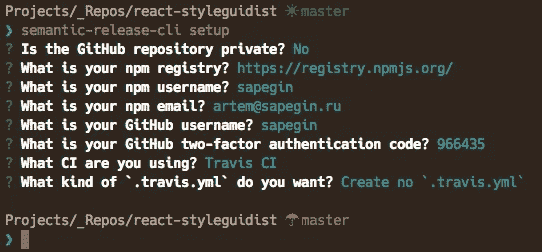
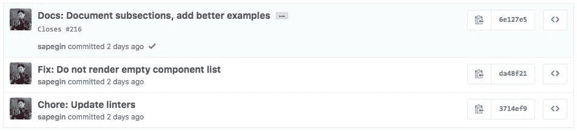

# 通过语义发布和人工编写的变更日志实现 npm 发布的自动化

> 原文：<https://medium.com/hackernoon/automate-npm-releases-with-semantic-release-and-human-written-change-logs-2adb1dce487>

在开源软件中，发布新版本是最枯燥乏味的任务之一。

有很多工具尝试自动化发布，其中最有趣的是语义发布。我很长一段时间都在避免使用它，因为它使提交消息生成的变更日志的发布完全自动化，并且我相信[变更日志必须由人类](http://blog.sapegin.me/all/changelog)编写。

但实际上它非常灵活，我能够对它进行定制，以完全满足我的需求:

*   一旦修复提交合并到主分支，就向 npm 发布新的修补程序版本，从提交消息生成 changelog。
*   推迟次要版本和主要版本，直到项目维护人员编写出合适的变更日志。
*   生成 changelog 草案:Markdown 文件，将最新版本以来的所有重要提交分为三个部分:重大更改、新功能和错误修复。

下面我将描述我自己实现这个工作流的脚本集。

## 它是如何工作的

1.  语义发布在 CI 服务器上运行。
2.  每次成功构建后，它都会分析新的提交，并查看是否有要发布的内容。
3.  它通过分析提交消息来确定发布类型(补丁、小版本或大版本)(稍后将详细介绍)。
4.  它生成一个 changelog:
    a .如果发布类型是 PATCH: from commit messages。
    b .如果发布类型是次要或主要，并且最新提交是一个变更日志:使用该提交的主体作为一个变更日志。
5.  向 npm 发布新版本。
6.  将 changelog 发布到 GitHub 发布页面。

## 安装语义发布

首先安装语义发布命令行工具:

```
npm install -g semantic-release-cli
```

然后在您的项目文件夹中运行它:

```
semantic-release-cli setup
```

输入您的 npm 和 GitHub 凭据。如果你已经有一个，选择“创建 no .travis.yml ”,否则它将被覆盖。



将这几行添加到您的 travis.yml 中:

```
after_success:
  - npm run semantic-release
branches:
  except:
    - /^v\d+\.\d+\.\d+$/
```

## 定制语义发布

你可以用插件改变语义发布行为:检测发布类型，检查发布需求(像一个变更日志)，生成变更日志，等等。我做了一个[包，里面有我需要的所有插件](https://github.com/tamiadev/semantic-release-tamia)来支持我的工作流程。

首先安装插件:

```
npm install --save-dev semantic-release-tamia
```

然后添加到您的 package.json:

```
"release": {
  "analyzeCommits": "semantic-release-tamia/analyzeCommits",
  "generateNotes": "semantic-release-tamia/generateNotes",
  "verifyRelease": "semantic-release-tamia/verifyRelease"
}
```

运行 *npm 安装*和 *npm 运行语义发布*来测试是否一切正常。你会看到这样的东西:

```
semantic-release WARN pre semantic-release didn’t run on Travis CI and therefore a new version won’t be published.
semantic-release WARN pre You can customize this behavior using "verifyConditions" plugins: git.io/sr-plugins
semantic-release ERR! pre Failed to determine new version.
semantic-release ERR! pre ENOCHANGE There are no relevant changes, so no new version is released.
```

这很好，意味着两件事:语义发布不会发布，直到它在 CI 环境中运行，并且您没有可以发布的更改。

## 使用 Git 提交消息约定

默认情况下，semantic-release 使用了 [AngularJS 约定](https://docs.google.com/document/d/1QrDFcIiPjSLDn3EL15IJygNPiHORgU1_OOAqWjiDU5Y/edit#)，我不喜欢这种美学上的约定。所以我用[稍微修改了一下约定](https://github.com/tamiadev/semantic-release-tamia/blob/master/Convention.md):



每个提交消息包括:

1.  类型:新特性专长，错误修正等等。
2.  主题:简短的更改描述。
3.  Body(可选):长变更描述。
4.  页脚(可选):重大变更、GitHub 发布引用等。

Semantic-release 使用这个标签来查找发布的所有重要提交(修复很重要，文档不重要)，并确定应该发布哪个版本(主要版本、次要版本或补丁)。

## 为次要或主要版本编写变更日志

我给[写了一个脚本](https://github.com/tamiadev/semantic-release-tamia#release-process)来帮助我修改日志。

首次运行 *sr-changelog* 。它将创建一个文件，其中包含该版本所有重要的提交，按类型分组(重大更改、新特性和错误修复)，并在您的默认编辑器中打开它。

现在，您可以重写您的变更日志，使其对您的用户有用且易于阅读。

然后运行 *sr-changelog 提交*。它将在提交消息正文中不更改类型 changelog 和 Changelog 的情况下进行提交(git commit — allow-empty)。

## 发布新版本

现在你需要 *git 推送*你的改变，煮点咖啡。


## 链接

*   [语义发布](https://github.com/semantic-release/semantic-release)
*   [我的语义发布插件和脚本](https://github.com/tamiadev/semantic-release-tamia)
*   [我的提交消息约定](https://github.com/tamiadev/semantic-release-tamia/blob/master/Convention.md)
*   [AngularJS 提交消息约定](https://docs.google.com/document/d/1QrDFcIiPjSLDn3EL15IJygNPiHORgU1_OOAqWjiDU5Y/edit#)
*   [如何写一个开源 JavaScript 库 Egghead 教程](https://egghead.io/lessons/javascript-how-to-write-a-javascript-library-automating-releases-with-semantic-release)
*   [为什么你需要自己写变更日志](http://blog.sapegin.me/all/changelog)
*   保持一个变更日志:不要让你的朋友将 git 日志转储到变更日志中
*   [语义版本化](http://semver.org/)

[](http://bit.ly/HackernoonFB)[](https://goo.gl/k7XYbx)[](https://goo.gl/4ofytp)

> [黑客中午](http://bit.ly/Hackernoon)是黑客如何开始他们的下午。我们是 [@AMI](http://bit.ly/atAMIatAMI) 家庭的一员。我们现在[接受投稿](http://bit.ly/hackernoonsubmission)，并乐意[讨论广告&赞助](mailto:partners@amipublications.com)机会。
> 
> 如果你喜欢这个故事，我们推荐你阅读我们的[最新科技故事](http://bit.ly/hackernoonlatestt)和[趋势科技故事](https://hackernoon.com/trending)。直到下一次，不要把世界的现实想当然！

[](https://goo.gl/Ahtev1)