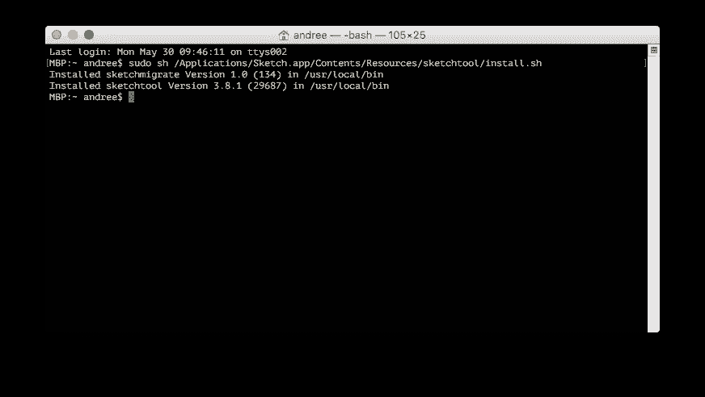
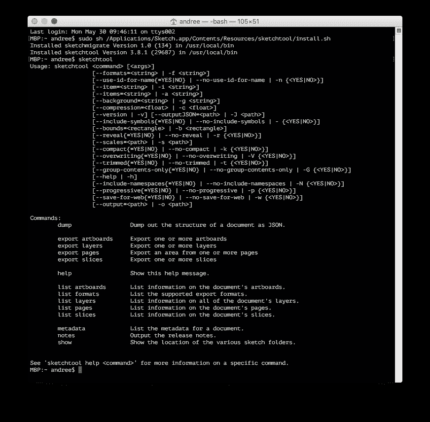
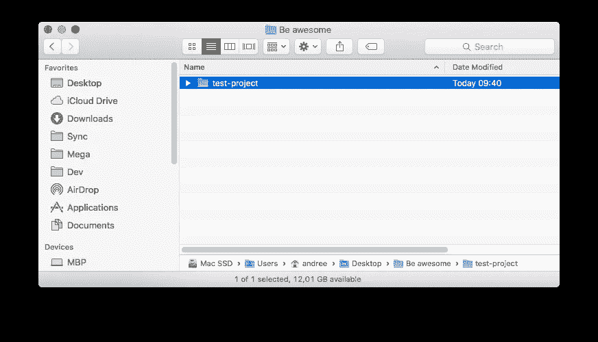
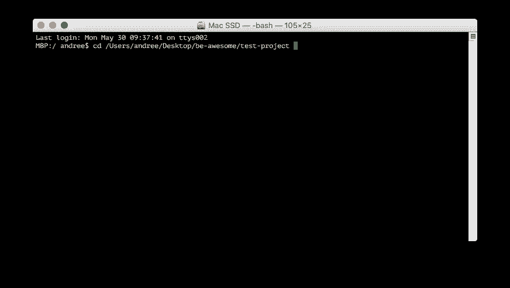
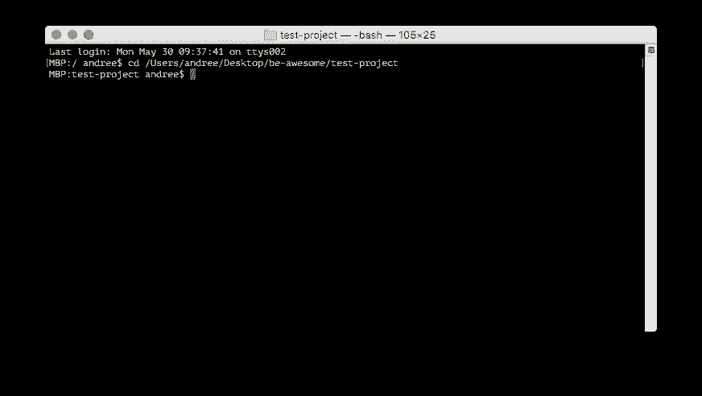

# 自动化:导出不带草图的草图画板

> 原文：<https://medium.com/hackernoon/automate-sketch-a8f66d8d13ec>

多花点时间在创意设计工作上。

今天我将向您展示如何使用 Sketch 附带的一个小工具(您可以使用它来做更高级的事情)来自动化日常任务，如频繁的画板导出。

( **Pssst:** blended.io 将推出两个工作坊:[版本控制草图给有技巧的设计师&设计团队](http://blended.io/sketch-workshop.html?ref=medium)和 [Git 给了不起的设计师](http://blended.io/git-workshop.html?ref=medium))

# **问题**

一旦你用草图建立了你的布局和视觉设计，你可能有超过一打的画板。所有涉及的步骤，即。最小化图层树、选择画板、分别导出 1x、2x 和 3x 会花费太多时间，尤其是如果你经常重复这个过程。

# **一种可能的解决方案**

幸运的是，流行设计工具 Sketch 的创作者们 [@bohemiancoding](http://www.twitter.com/bohemiancoding) 从“心中的终点”开始。其实 Sketch 有一个 CLI(dev 界命令行界面的简称)叫做 Sketchtool。

如果您已经安装了 Sketch，请跳到下一段。否则[先下载](http://www.sketchapp.com/tool/)草图，然后继续下一步。

**如何安装草图命令行工具 Sketchtool**

无法像通常安装程序一样安装 CLI。但是，嘿，我们想在这里学到东西，对不对？因此，让我们来关注一下开发领域。会很酷的。

关于上下文和理解的一些事情

*   终端应用程序(安装在每台 Mac 上)是一种简单的基于文本的命令执行方式，基于 windows 的应用程序在后台执行。
*   一旦你打开终端窗口，你基本上自动进入你的 Mac 的根文件夹，通常是你的 Mac“用户名”文件夹(就像你通过 Finder 进入相同的文件夹一样)。

进行安装

1.  在 Mac 上，要打开原生终端应用程序，请按下 CMD+Space，然后输入“终端”，按下 RETURN 键或在“应用程序”文件夹中找到该应用程序。应该会打开一个空白窗口，您会在左上角看到类似这样的内容:`MBP:/ andree$`或`MBP:~ andree$`。`MBP`是指您的 Mac 的名称，`andree`是您的 Mac 帐户的用户名(您登录时使用的帐户)
2.  要安装 CLI，请键入`sudo sh /Applications/Sketch.app/Contents/Resources/sketchtool/install.sh`并按回车键(请记住，在更高版本中，上面的文件路径(`/Applications/…`)可能已经更改)
3.  如果询问您的 Mac 帐户密码，请输入它(与您登录 Mac 时一样)。注意:您将看不到每个字符的外观

您现在应该会看到如下文本输出(从版本 3.8.1 开始):

*截图一:安装 Sketchtool 后。*

一旦完成，在终端输入`sketchtool`,然后按回车键。您应该会看到如下所示的内容。

*截图 2: Sketchtool 安装成功，显示可以执行哪些命令。*

Sketchtool 现已安装，您可以从机器上的任何文件夹使用它。让我们从酷的东西开始吧！

# **每天使用 Sketchtool 节省时间**

你将需要

*   终端应用程序
*   当前项目的 Finder 窗口
*   项目文件夹中有超过 4-5 个画板的`.sketch`文件(Finder 可能不会显示文件扩展名`.sketch`

*注*:如有问题，请通过 [Twitter @andreehuk](http://www.twitter.com/andreehuk) 联系我

终端窗口打开时，闪烁的光标表示您基本上“坐”在 Mac 上的某个文件夹中。您可以使用命令`cd %folderName%`切换到其他文件夹。`%folderName%`代表 Finder 中显示的文件夹名称。现在，为了保持简单明了，Mac 为非开发人员提供了一个技巧，让他们可以在终端的文件夹之间轻松切换:

*   键入`cd`并添加一个空格
*   前往 Finder 并找到当前项目的文件夹，以便在 Finder 中看到文件夹名称，但不要打开该文件夹
*   将文件夹拖到终端应用程序中，文件夹路径会自动完成
*   按 RETURN 键在终端窗口中打开文件夹

*截图 3:点击并拖动文件夹到终端。*

*截图 4:我把文件夹拖到终端，文件夹路径出现在* `*cd*` *之后。*

截图 5:点击返回后，我现在位于“测试项目”中，如“MBP:测试项目安德里$”所示。

*注意*:每当你看到`$`，基本上意味着接下来的是一个需要在[终端](https://www.git-tower.com/learn/git/ebook/en/command-line/appendix/command-line-101)输入的命令。

**Pro 提示:**在终端中，点击光标上移将显示上一条命令。

通过执行`sketchtool`，终端将通过显示关于`Sketchtool`的帮助进行回复，例如:

*   `Export artboards`
*   `Export layers`
*   `Export pages`
*   `Export slices`

导出所有画板的命令(默认为:`.sketch`文件所在的目录)如下:

`$ sketchtool export artboards %fileName%`

用您的草图文件的名称替换`%fileName%`，在我的例子中:

`$ sketchtool export artboards layouts.sketch`

前面的命令将导出 1x(默认)中的所有画板，并将在“终端”中列出每个名称。

*专业提示*:如果你想键入一个文件或文件夹，键入第一个字符并按 TAB 键。终端将自动完成文件名。如果您有以相同首字母开头的> 1 个文件，终端不会做任何事情，因为它不知道您指的是什么文件。继续输入下一个字符，然后再按 TAB 键。瞧。

出口 2 倍或 3 倍呢？是的，这也是可能的。类型:

`$ sketchtool export artboards layouts.sketch --scales=2x`

`$ sketchtool export artboards layouts.sketch --scales=3x`

您可以将`2`或`3`更改为任意数字，Sketchtool 会自动将刻度添加到文件名的末尾。太棒了。我自己没有尝试过任何高于`10`的东西，因为这已经花了很长时间才能导出。

如果您不想在画板尺寸内导出画板，而只想导出位于这些画板上的对象，您可以运行下面的命令。它会将所有画板修剪到尽可能最小的矩形，有点像在 Photoshop 中双击一个层(然后在文档中的对象周围设置选框)。

`$ sketchtool export artboards layouts.sketch --trimmed=YES`

如果您希望画板具有背景颜色，只需运行:

`$ sketchtool export artboards layouts.sketch --background=white`

你可以用其他颜色代替`white`，比如`black`或者其他。其实 Sketchtool 导出的画板可以是你想要的任何背景色，但是要用十六进制代码描述，见[这个](http://www.color-hex.com/)。

**Pro 提示:**可以组合`--scales`、`--background`或 else 的命令。

# **一次导出所有画板**

为了节省更多的时间，我写了一个超级轻量级的脚本“e.sh ”,用透明背景(默认)以 1x、2x 和 3x 格式导出所有画板。在这里下载脚本[并将其复制到你的 Sketch 项目文件夹中(通过终端或 Finder)。](https://cl.ly/3h3E3b1k3g0n/download/e.sh)

一旦脚本在您的项目文件夹中，只需运行

`$ sh e.sh %fileName%`

为了减少输入，我将脚本名称保持得很短。

**专业提示:**一次性导出所有画板

如果您甚至不想每次都将文件名添加到命令中，请在任何编辑器(如“文本编辑”)中或通过“终端”(下面的命令)打开脚本，并将`$1`与您的`.sketch`文件名交换。假设您在“终端”的项目文件夹中，您可以简单地运行以下命令，为当前项目导出 1-3x 画板。如果您有> 1 `.sketch`文件，只需打开脚本并复制+粘贴 Sketchtool 命令，并相应地更改文件名。

**感谢阅读。**我们在 [blended.io](https://www.blended.io/?ref=medium) 对 fintech、investtech 和 industry 4.0 中软件设计和工程的潜在创新飞跃感到无比兴奋和热情。[取得联系！](http://www.blended.io/contact.html?ref=medium)

## 保持在边缘

获取关于创新、体验设计或工程的实用文章！没有垃圾邮件和**有价值的内容** **只有**。

( **Pssst:** blended.io 将推出两个工作坊:[熟练设计师版本控制草图&设计团队](http://blended.io/sketch-workshop.html?ref=medium)和[了不起的设计师 Git](http://blended.io/git-workshop.html?ref=medium))

*原载于 2017 年 2 月 20 日*[*blog . blended . io*](https://blog.blended.io/automate-export-sketch-artboards-without-sketch/?ref=medium)*。*

> [黑客中午](http://bit.ly/Hackernoon)是黑客如何开始他们的下午。我们是 [@AMI](http://bit.ly/atAMIatAMI) 家庭的一员。我们现在[接受投稿](http://bit.ly/hackernoonsubmission)，并乐意[讨论广告&赞助](mailto:partners@amipublications.com)机会。
> 
> 如果你喜欢这个故事，我们推荐你阅读我们的[最新科技故事](http://bit.ly/hackernoonlatestt)和[趋势科技故事](https://hackernoon.com/trending)。直到下一次，不要把世界的现实想当然！

