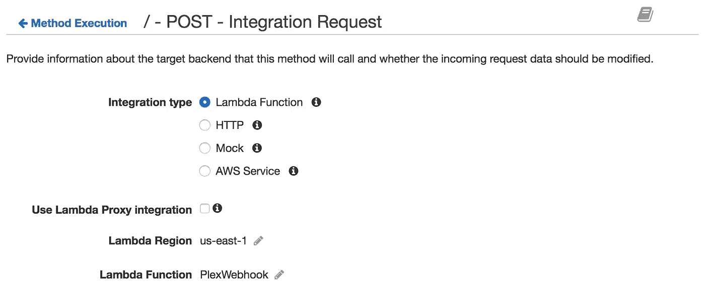
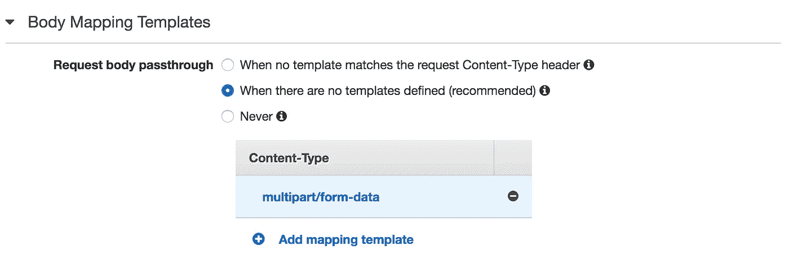

# 从云中自动化您的家庭影院灯光

> 原文：<https://medium.com/hackernoon/automate-your-home-theater-lights-from-the-cloud-cdb29a8685a6>

## 使用 AWS API 网关和 Lambda 将 Plex 媒体服务器连接到色调照明系统

这个周末，我开始用我安装在地下室家庭影院里的菲利普斯色调灯做一些很酷的事情。目标:**当我播放电影时，自动将灯光调至“影院模式”。**


# 设置

我住在芝加哥的一套错层公寓里，有一个完工的地下室区域，我把它用作家庭影院。去年 10 月，我在地下室安装了 [6 色色调罐灯](https://www.amazon.com/Philips-432690-Equivalent-Single-Light/dp/B00HNLQQ7K)、一个[色调开花](https://www.amazon.com/Philips-Bloom-Works-Amazon-Alexa/dp/B00I12YFP0)和一个[色调 led 灯](https://www.amazon.com/Philips-Lightstrip-Generation-Works-Amazon/dp/B014H2OXYU/ref=pd_sim_60_3?_encoding=UTF8&pd_rd_i=B014H2OXYU&pd_rd_r=QJMSJY8Q5NMEMEK5P964&pd_rd_w=ZXNkp&pd_rd_wg=Y4e6J&psc=1&refRID=QJMSJY8Q5NMEMEK5P964)，我可以用我的 iPhone 或亚马逊 Echo Dot 来控制它们。我设置了几个色调照明“场景”,以便我可以轻松地改变地下室灯光的亮度和颜色，包括一个“剧院模式”,它可以关闭除了作为电视柜背后背光的 LED 灯以外的所有灯光。

对于电影流媒体，我办公室里有一台运行 [Plex 媒体服务器](https://www.plex.tv/)的电脑，我用它向本地网络内外的各种设备传输流媒体。我还有一台苹果电视，连接在地下室的电视上，安装了 [Plex 应用](https://www.plex.tv/apps/streaming-devices/apple-tv/)。

这种设置已经很好地工作了一段时间，我特别喜欢我可以告诉 Alexa 打开/关闭灯，甚至不用离开沙发，但我觉得我们可以更懒。


> "如果需要是发明之母，那么懒惰就是发明之父."

# 这个计划

我想要一种方法，让灯光在播放电影时自动进入影院模式(关灯)，然后在电影结束时或者在我暂停使用浴室或制作更多爆米花时返回调光模式(开灯)。(未来，爆米花将从云端自动送达。)

Plex 最近为几个事件添加了 webhooks ，包括播放/暂停。Hue lights 的销售总是考虑到业余程序员，并且包括一个[健壮的 API](https://developers.meethue.com/) (尽管它可以好得多——稍后会详细介绍)。有了这两个端点，我所要做的就是让它们互相交流。

鉴于我的网络上已经有一个服务器来托管 Plex，在 Node.js 上快速启动一个 Express 服务器将 webhook 事件转发到我的 Hue lighting hub 是有意义的，但 baremetal 服务器是 2015 年的事情了。不，这个项目听起来像是一个在 AWS 云中实现无服务器的好机会！


Data flow diagram: Plex Webhook → AWS API Gateway → AWS Lambda → Hue Lights

声明:我是 AWS 新手。如果我的任何配置可以改进，请给我发消息！

# 设置 Lambda 函数

为了让 Plex 服务器与色调灯对话，我们需要实现少量的 webhook 解析逻辑——这对于 [AWS Lambda](https://aws.amazon.com/lambda/) 来说是一项完美的工作。对于外行来说，Lambda 函数基本上是云中的一个函数。它们非常适合构建微服务，或者在这种情况下，连接 API。

本质上，我们将构建一个“If This Then That”风格的函数，其逻辑如下:

*   📺如果操作是由“我的 AppleTV”触发的，请检查 Plex webhook 有效负载。
*   📽如果触发的动作来自电影，请检查 Plex webhook 有效负载。
*   🌑如果 Plex 事件正在播放或继续，则将色调灯设置为剧场模式。
*   🌕如果 Plex 事件是暂停或停止，则将色调灯设置为变暗模式。

首先，我们需要创建一个新的 Lambda。我们可以从 AWS 仪表板上完成这项工作，但是我更喜欢使用 NPM 包 [node-lambda](https://github.com/motdotla/node-lambda) 进行配置、部署和测试。你可以在 GitHub 上看到我的 Lambda 函数的完整源代码。

我不会详细介绍如何设置一个新的 Lambda 函数，除此之外，我们还需要提供`lambda-access`角色，以便稍后可以连接到我们的 API 网关。Lambda 还(最终)支持 Node v6.10，我们将使用它作为我们的执行环境。一旦我们的 Lambda 配置好了，我们就可以设置 API 网关了。

# 配置 API 网关

[AWS API Gateway](https://aws.amazon.com/api-gateway/) 是我们用来将 Plex webhook 连接到 Lambda 函数的接口。API Gateway 支持高度复杂的 API 架构，但是对于我们的目的，我们只需要一个 POST 端点，它将转发到 Lambda 函数。

在我们创建了一个新的 API 之后，我们将在`/`创建一个 POST 资源来处理我们的 webhook 请求。接下来，我们将配置 POST 资源的集成请求，如下所示:

*   集成类型:λ函数
*   λ区域:我们的λ函数的区域
*   Lambda 函数:Lambda 函数的名称



Plex webhook 不提供 Lambda 函数所需的`application/json`内容类型的有效负载，所以我们需要将请求转换成 Lambda 友好的格式。因为没有办法在 API Gateway 中解析来自 Plex webhook 的多部分表单数据，所以我们只是将它作为 Base64 编码的二进制文件传递，然后在我们的 Lambda 函数中解构它。

我们需要[在我们的 API 上启用二进制支持](https://aws.amazon.com/about-aws/whats-new/2016/11/binary-data-now-supported-by-api-gateway/),并添加二进制媒体类型`multipart/form-data`,这样 API Gateway 就不会试图从我们的 webhook 解析 JSON。然后，回到 POST 资源的集成请求选项卡，我们需要为`multipart/form-data`内容类型添加以下主体映射模板:



```
{
  "body": "$input.body",
  "headers": {
    #foreach($param in $input.params().header.keySet())
      "$param":
        "$util.escapeJavaScript($input.params().header.get($param))"
      #if($foreach.hasNext),#end
    #end
  }
}
```

> API Gateway 使用 Apache 的 [Velocity 模板语言(VTL)](http://velocity.apache.org/engine/devel/vtl-reference.html) 作为身体映射模板

这将在`body`中包装我们的原始编码请求，并在`headers`中转发来自 Plex webhook 的所有头。以上是 API Gateway 所需的所有配置，我们现在可以单击 Actions → Deploy API。创建新的部署阶段，然后单击部署。如果成功，您将进入刚刚创建并部署到的阶段的阶段编辑器。将调用 URL 复制到帐户设置下的[新 Plex webhook。](https://support.plex.tv/hc/en-us/articles/115002267687-Webhooks)

# 在 Lambda 中解包有效负载

我们的 Lambda 函数公开了一个`handler`，我们的 API 网关将使用转发的 Plex webhook 作为`event`参数来调用它。我们需要解包事件体，它将是一个多部分的形式，然后解析它以获得有效负载 JSON。为此，我们将使用一个名为[的 NPM 包。](https://github.com/mscdex/busboy)


Busboy loves parsing your multipart form data as much as this one loves bussing tables.

Busboy 是一个低级可写流，被 Multer 等几个 Express 中间件用来解析多部分表单数据。用法很简单——我们只需将头传递给 Busboy 初始化器，然后用管道传递 Base64 编码的主体。然后，Busboy 将为它遇到的每个表单域触发事件。下面是我们的处理程序代码:

```
*const* Busboy = require('busboy');*exports*.handler = (*event*, *context*, *callback*) *=>* {
  // Busboy expects headers to be lower-case
  *const* headers = {};
  *Object*.keys(event.headers).forEach(
    *key* *=>* (headers[key.toLowerCase()] = event.headers[key])
  ); *const* busboy = new Busboy({
    headers
  }); // For each field in the request
  busboy.on('field', (*fieldname*, *value*) *=>* {
    // Check for the Plex webhook's payload field
    if (fieldname === 'payload') {
      *const* payload = JSON.parse(value); // Read the payload to control Hue lights
      readPayload(payload);

      // Send payload in response for testing & debugging
      callback(null, {
        payload
      });
    }
  }); // Pipe Base64 encoded body from API Gateway to Busboy
  busboy.write(*Buffer*.from(event.body, 'base64'));
};
```

`readPayload()`函数将包含我们连接到 Hue 的逻辑，但是您可以使用这个处理程序代码作为将 Plex webhook 连接到任何外部服务的样板。

我们现在可以通过创建一个模拟`event.json`来测试我们的事件处理程序，如果你正在使用`node-lambda`，或者你可以`console.log()`到 AWS CloudWatch 日志。

# 用 Lambda 控制色调灯

有了正确 JSON 格式的 Plex webhook 有效负载，我们就可以与色调灯对话了，但首先我们需要为色调 API 准备 Lambda。我们将为我们需要的各种色调 id 添加一些环境变量，并执行一个相当简单的身份验证，从本地网络外部的 Lambda 函数连接到我们的色调桥。

Phillips 提供了一个相当健壮的 RESTful API，用于从同一个本地网络中控制色调照明系统的大多数方面，但是没有提供任何用于从互联网控制灯光的文档，尽管这是可能的。Paul Shi 写了一篇关于如何从 Hue Bridge 本地网络之外“侵入”该网络的精彩博文。使用保罗指南获得`BRIDGEID`和`ACCESSTOKEN`。

我们将把`BRIDGEID`和`ACCESSTOKEN`作为环境变量存储在我们的 Lambda 中，还有其他几个变量:

*   `HUE_TOKEN` : `ACCESSTOKEN`
*   `HUE_BRIDGE_ID` : `BRIDGEID`
*   `HUE_SCENE_THEATER`:我们剧院场景的场景 ID
*   `HUE_SCENE_DIMMED`:调暗场景的场景 ID
*   `HUE_GROUP_ID`:包含我们灯光的组的组 ID
*   `PLAYER_UUID`:来自 Plex webhook 的 AppleTV 设备的 UUID

您可以通过发出一个`GET [https://www.meethue.com/api/getbridge](https://www.meethue.com/api/getbridge)`请求来找到场景 ID 和组 ID，如 Paul 的博客帖子中所解释的。

我们的`readPayload()`函数将对有效负载执行检查，看看应该向 Hue API 发送什么动作(如果有的话),然后构造并发送适当的请求:

```
*const* https = require('https');*const* readPayload = *payload* *=>* {
  // Plex webhook event constants
  *const* PLAY = 'media.play';
  *const* PAUSE = 'media.pause';
  *const* RESUME = 'media.resume';
  *const* STOP = 'media.stop'; *const* { event, Player, Metadata } = payload; // https options
  *const* options = {
    hostname: 'www.meethue.com',
    path: `/api/sendmessage?token=${process.env.HUE_TOKEN}`,
    method: 'POST',
    headers: {
      'Content-Type': 'application/x-www-form-urlencoded'
    }
  }; if (
    process.env.PLAYER_UUID === Player.uuid &&  // Event came from the correct player
    Metadata.type === 'movie' &&  // Event type is from a movie
    (event === PLAY || event === STOP || event === PAUSE || event === RESUME) // Event is a valid type
  ) {
    *const* scene = event === PLAY || event === RESUME
      ? process.env.HUE_SCENE_THEATER // Turn the lights off because it's playing
      : process.env.HUE_SCENE_DIMMED; // Turn the lights on because it's not playing // Construct Hue API body
    *const* body = `clipmessage={ bridgeId: "${process.env.HUE_BRIDGE_ID}", clipCommand: { url: "/api/0/groups/${process.env.HUE_GROUP_ID}/action", method: "PUT", body: { scene: "${scene}" } } }`; // Send request to Hue API
    *const* req = https.request(options);
    req.write(body); req.end();
  }
};
```

就是这样！现在，当电影开始在 AppleTV 上播放时，灯光将进入影院模式，当电影暂停或停止时，灯光将恢复为暗淡模式。

[](http://bit.ly/HackernoonFB)[](https://goo.gl/k7XYbx)[](https://goo.gl/4ofytp)

> [黑客中午](http://bit.ly/Hackernoon)是黑客如何开始他们的下午。我们是 [@AMI](http://bit.ly/atAMIatAMI) 家庭的一员。我们现在[接受投稿](http://bit.ly/hackernoonsubmission)并乐意[讨论广告&赞助](mailto:partners@amipublications.com)机会。
> 
> 如果你喜欢这个故事，我们推荐你阅读我们的[最新科技故事](http://bit.ly/hackernoonlatestt)和[趋势科技故事](https://hackernoon.com/trending)。直到下一次，不要把世界的现实想当然！

