# 使用 Airtable 和 Zapier 自动化您的生活

> 原文：<https://medium.com/hackernoon/automate-your-life-with-airtable-and-zapier-3cc2857618d3>

Automate your workflows, worry about less, and have more time to get things done

## 创建您自己的个人仪表盘和助手来完成工作

像大多数人一样，我使用各种工具来管理工作和生活之间的任务。问题是，这些工具是分散的，新的职责可能来自各种来源，如电子邮件、空闲时间或简单的交谈。

管理输入，以及在捕获这些任务后如何看待它们，是这个等式中令人厌烦的部分。在工具之间切换、监控新添加或更新的服务，以及在它们之间手动输入这些数据会占用时间，这些时间本可以更好地用于清理您的列表。

我寻找更好的东西。我最近在 Twitter 上听说了 [Airtable](https://airtable.com/invite/r/nYHpQu2S) ，工作中的朋友也谈到了易于使用的自动化工具与 [Zapier](https://zapier.com/) 。发现这两者很容易结合在一起，我想我会尝试一下。

我建立的是一个个人仪表盘和助手，可以轻松地节省我每周的时间，我相信你也可以。

在这篇文章中，我将向您展示如何捕捉电子邮件，解析它们，并将其自动添加到我们专为您创建的个人仪表盘中。有了这个，你应该有工具来连接你使用的所有服务，并创建一个生活中所有责任的视图。更好的是，有更多的时间和自由去完成它们。

> 对 React Native 感兴趣？查看我们的[每周简讯](http://reactnativecoach.com)和[博客](https://blog.reactnativecoach.com)。

# 入门指南

首先，我们需要在 [Airtable](https://airtable.com/invite/r/nYHpQu2S) 和 [Zapier 创建账户。](https://zapier.com/)

Airtable 的核心是一个简单的数据库，可以以适合你的方式显示你的信息。一些选项包括网格、看板和日历。

Zapier 是一款产品，可以轻松地在各种服务之间建立连接，并在它们之间自动执行任务。想在把自拍发到 Instagram 时在 Twitter 上创建帖子？像 Zapier 和 IFTTT 这样的服务可以帮助你填补空白。

在本教程中，我们将使用 Zapier 的电子邮件服务，名为 [Parser](https://parser.zapier.com) ，它允许你将任何电子邮件转换成 Zapier 食谱的触发器和模板。

我鼓励你看看 [Airtable](https://airtable.com/invite/r/nYHpQu2S) 和 [Zapier](https://zapier.com/) ，阅读他们的入门文档，并尝试他们可用的模板。熟悉一下 Airtable 收集和呈现数据的方式将有助于您在任务流入时定制仪表板。

# 解析电子邮件

几乎每个产品都有可以通过电子邮件发送的通知，我们可以将这些电子邮件转发给 Zapier 的解析器，用我们提供的模板捕获它的输出。

前往[解析器](https://parser.zapier.com)并创建一个新的电子邮件地址。当您准备好继续时，解析器应该会等待您的第一封电子邮件，看起来像这样:

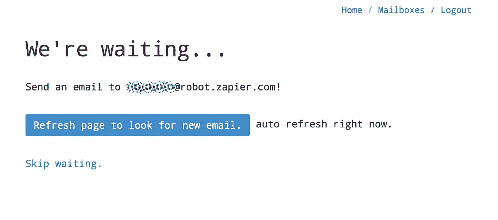

Waiting for our email to arrive Zapier’s Parser service

为了这个演示，我将使用我创建的一个食谱来帮助构建我的个人仪表板。在我的例子中，每当在 [Pivotal Tracker](https://www.pivotaltracker.com) 中有新的故事分配给我时，我想自动创建一个 Airtable 记录。

我触发了这个通知并检查了解析器服务:

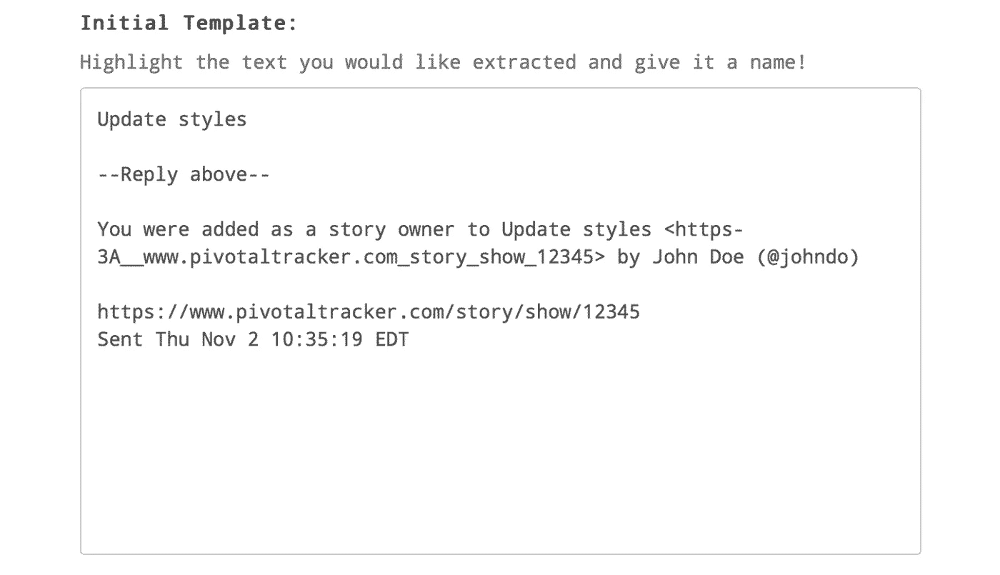

The captured email in Zapier’s Parser service

然后，为了准备 Zapier 食谱的内容，我们突出显示了我们关心的项目，并为它们命名，以创建此类电子邮件的模板:

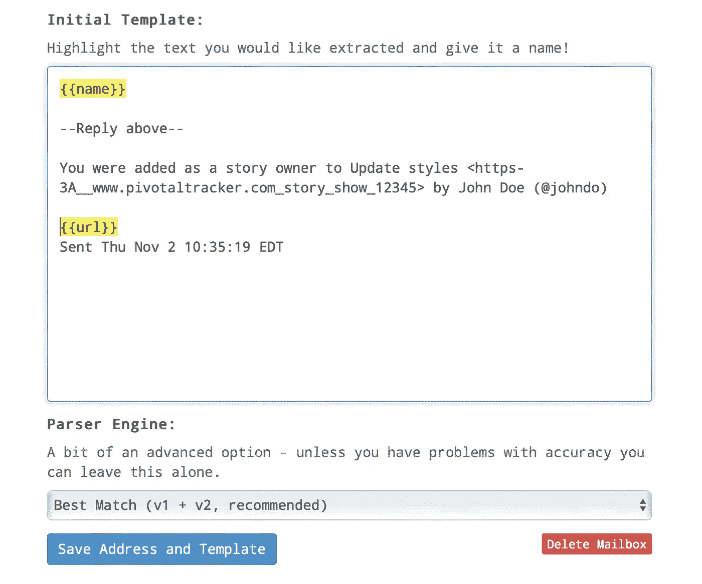

Highlighted items after they’ve been named

一旦完成在你的邮件中添加名字，保存地址和模板。如果解析器输出有问题，给电子邮件地址添加一个额外的模板，使其更加智能。

# 创造我们的食谱

有了我们的模板，我们可以使用 Zapier 配方中的值自动向我们的 [Airtable](https://airtable.com/invite/r/nYHpQu2S) Base 中的表添加行。我们在基地设置了一个表格，可以接受我们从电子邮件中选取的数据:

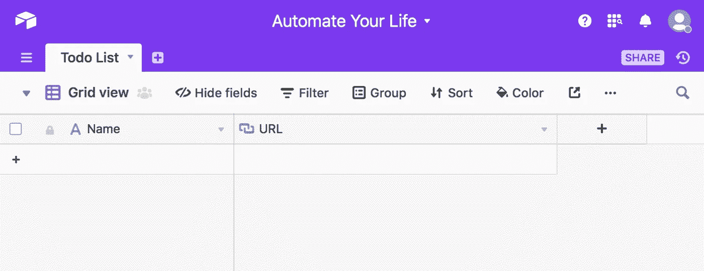

Our initial table with a single line text Name field and a URL field

在我们前往 Zapier 之后，使用 Email Parser 创建一个新的 Zap，作为新电子邮件的触发器，并使用相关的模板选择电子邮件地址:

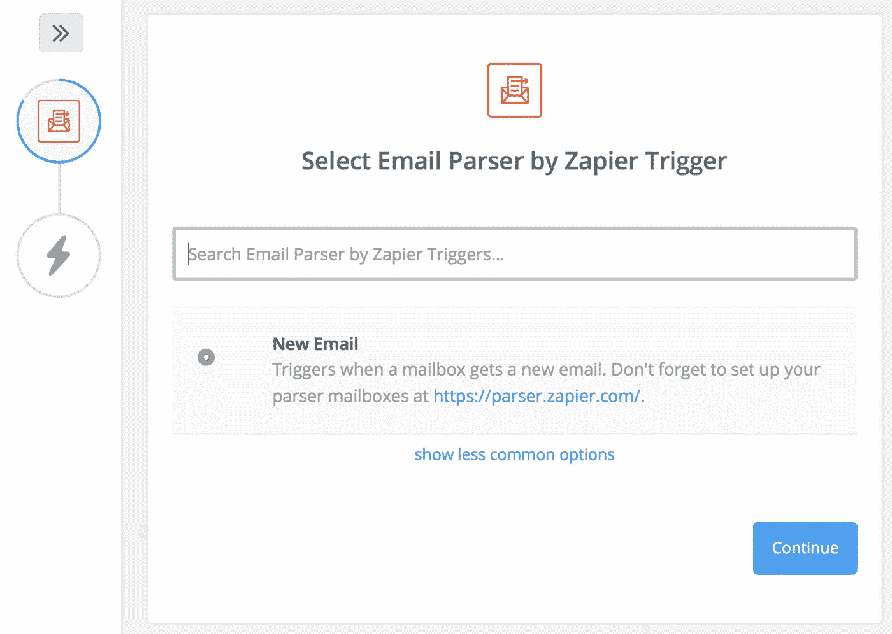

Select Email Parser as the option and the select the associated email address

完成后，运行测试以处理一些测试数据，并进入下一步，选择 Airtable with Create New Record 作为所选选项:

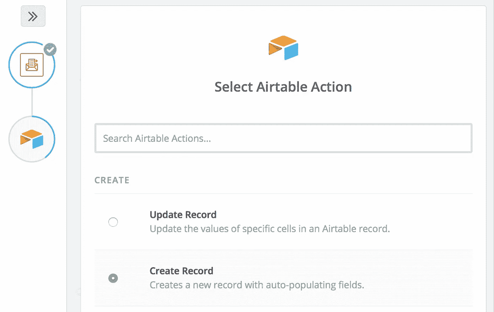

Add Airtable Create Record as your action step

连接到您的数据库，并为表格中的字段选择匹配的电子邮件数据:

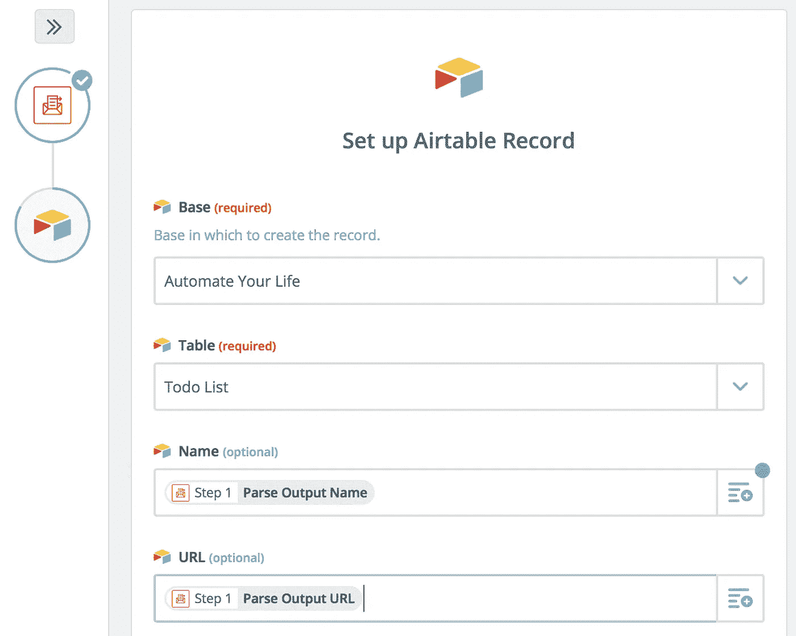

Select the Parse Output for the matching fields in Airtable

然后运行测试并检查您的表:

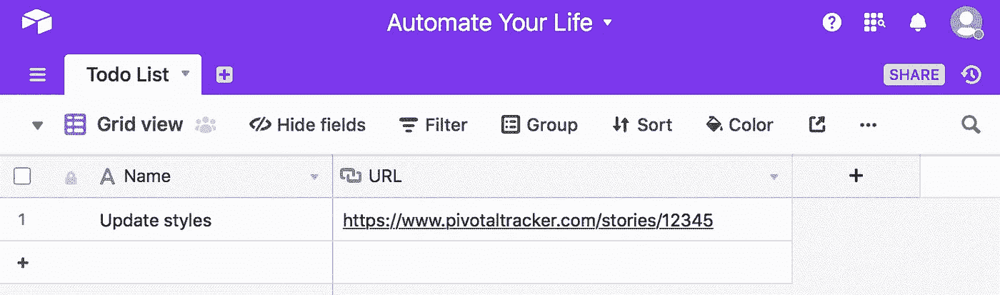

Data should be captured in your table!

# 添加更多数据

在这一点上，你应该能够看到 [Zapier](https://zapier.com) 和 [Airtable](https://airtable.com/invite/r/nYHpQu2S) 的力量，并很好地了解如何创建适合你的工作流程的新食谱，以自动组织你的输入。

我鼓励你看看 [IFTTT](https://ifttt.com) 以及你可以得到很多，它是免费的。你应该能够使用几乎任何现有的服务来自动添加行到你的表中，但是如果你遇到困难，请在评论中寻求帮助。

在这个演示中，我给 IFTTT 和 Zapier 添加了一些食谱:

*   当一个新的拉请求在 [Github](https://github.com) 上打开时，创建一个新记录。
*   我在手机中创建了一个名为“提醒”的联系人，并提供了一个可以过滤的电子邮件地址。创建联系人允许我利用 Siri 来添加语音任务。

New personal items and pull requests added to the backlog.

# 构建您的仪表板

看着我们的气垫底座，我们可以看到它非常简单。为了增强我们的仪表板，我们需要添加一些字段，让我们可以在最适合我们的视图中检查我们的数据。

在我们的例子中，我们希望能够给任务附加一个截止日期，同时给它们一个域和状态，通过这个域和状态可以定义它们。因此，我们创建了一个[多对多表](https://support.airtable.com/hc/en-us/articles/218734758-A-beginner-s-guide-to-many-to-many-relationships)来定义区域，一个截止日期字段用于表示何时需要完成区域，一个单选字段用于表示任务的状态。此外，我们将 Zones 表链接到 Todo 列表。

**注意:**我们也相应地更新了配方以填充这些字段。

The Zones table after being linked to records in the Todo List. **Note:** The Todo List linked column should be set to single selection only.

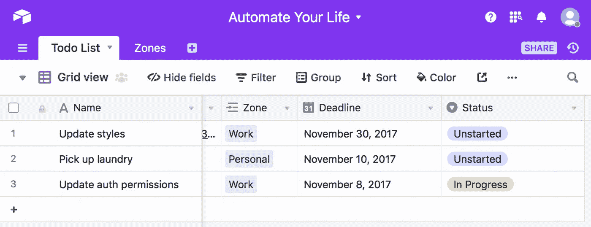

New Deadline calendar and Status single select fields created and assigned to existing stories in our Todo List.

随着这些领域的到位，Airtable 的力量开始闪耀。我们可以按区域和状态对这些字段进行分组:

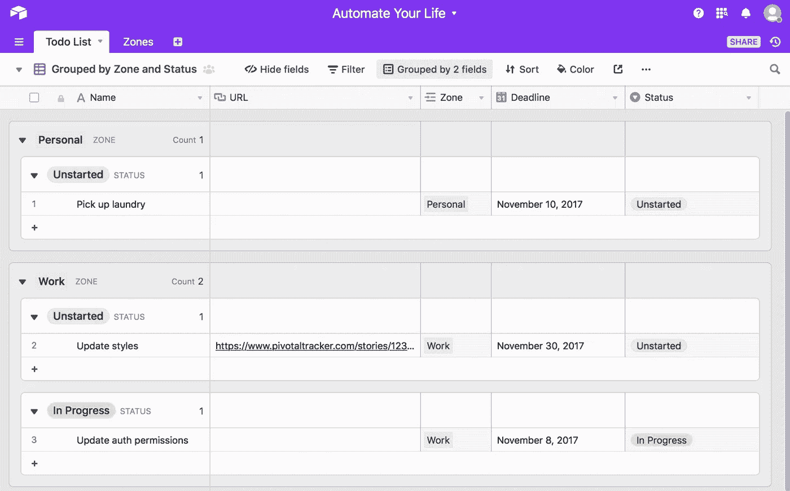

Grid View grouped by Zone and Status

为所有区域创建看板，或按特定区域过滤看板，让我们对当前工作有更清晰的认识。

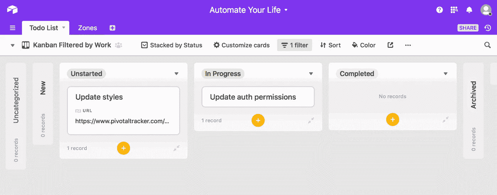

Kanban View filtered by Work Zone

或查看截止日期的日历视图。

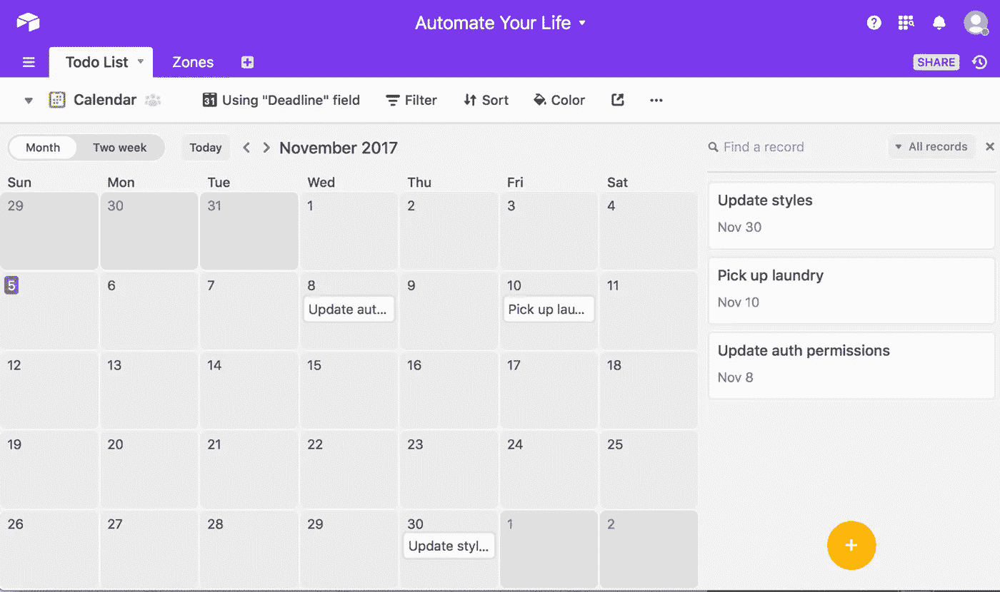

Calendar View on Deadline

为了更好地了解这些观点，请查看我在 Airtable 的 Universe 上发布的[模板，但是如果我已经帮助了你，请仍然通过](https://airtable.com/universe/expG9bMGldFV7ibo5/personal-dashboard)[这个链接](https://airtable.com/invite/r/nYHpQu2S)注册。🙏🏻

# 包扎

我们构建的是一个个人应用程序、助手和仪表板，允许我们自动化所有输入并从一个位置管理它们。这已经改变了我工作流程中的生活，我知道我只是触及了表面。如果你做出了对你的工作方式有深远影响的东西，我很想听听！

关于我目前正在使用的一些食谱的更多例子，我正在用它们来帮助管理我的 [React Native 简讯](http://reactnativecoach.com)和 [React Native 蔻驰博客](https://blog.reactnativecoach.com):

*   将喜欢的推文和中型书签保存到表格中进行管理。
*   自动更新我的待办事项列表中与博客/时事通讯相关的任务的状态。
*   捕捉广告询问，并将其作为记录添加到广告购买者和联系人中。
*   在某些情况下，自动在脸书、Twitter 和媒体上发布。

我希望[航空桌](https://airtable.com/invite/r/nYHpQu2S)、[扎皮尔](https://zapier.com)和 [IFTTT](https://ifttt.com) 能像帮助我一样帮助你。想看 IFTTT 的例子，有问题。还是评论？，把手伸到下面。✌🏻