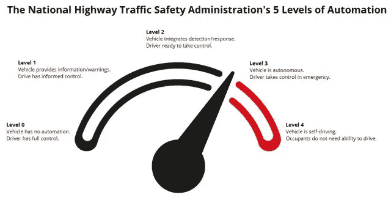
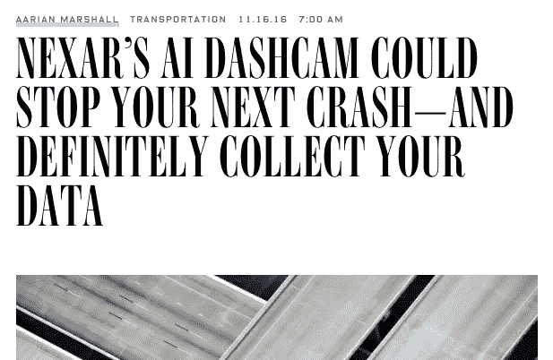
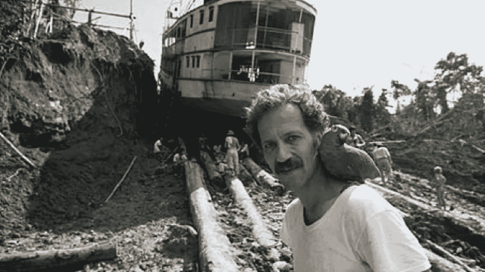
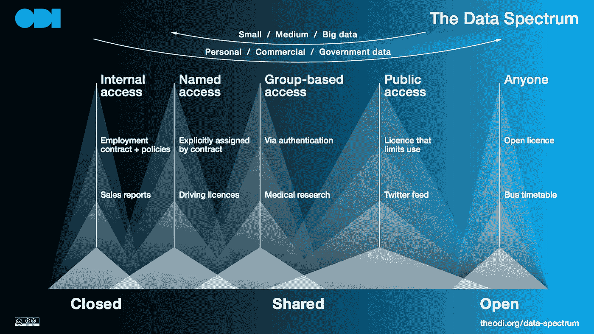

# 自动化汽车和数据

> 原文：<https://medium.com/hackernoon/automated-cars-and-data-786dfb1e3eb4>

每个人都在谈论自动化汽车，以及它们将如何让我们从一个地方到另一个地方变得更便宜、更容易。除了帮助我们出行，它们还将通过释放空间[改变我们的城市](http://www.slate.com/articles/technology/future_tense/2016/10/self_driving_cars_effects_on_cities_depend_on_who_owns_them.html)，[通过减少交通事故数量拯救生命](https://spectator.org/how-driverless-car-technology-can-save-lives/)，并导致[失去数百万个驾驶工作岗位](http://www.latimes.com/opinion/op-ed/la-oe-greenhouse-driverless-job-loss-20160922-snap-story.html)以及对人们和社区的相关影响。

如果你正在读这篇文章，我打赌你已经听过这个演讲了。如果你住在美国、英国、中国等地的某个试验区，你甚至可能会看到试验。有人持怀疑态度，但我认为人们将能够逐渐制造出更安全、自动化程度更高的汽车。一旦他们这样做，许多人会选择使用它们。变革即将到来。

[More Autonomous Cars Coming to Public Roads in 2016](http://www.engineering.com/DesignerEdge/DesignerEdgeArticles/ArticleID/11228/More-Autonomous-Cars-Coming-to-Public-Roads-in-2016.aspx) Copyright © 2016 ENGINEERING.com

让出行变得更容易、更便宜，改变城市，拯救生命，取消一种工作都是复杂的事情。还有很多更多的[副效](https://stratechery.com/2016/the-it-era-and-the-internet-revolution/)。我们的决策者需要考虑风险和收益，以帮助我们实现一个更好的社会，其中包括自动驾驶汽车，并使每个人受益。

但我没有看到关于自动汽车的一个重要方面的足够讨论:数据，以及安全、隐私和开放如何增加其影响。

## 自动化汽车收集了大量数据

除了运送人员和包裹，自动汽车还将收集大量数据。人类司机需要环顾四周，看看街道标志、天气或骑自行车的人。类似的自动化汽车将需要收集数据来做出驾驶决策。

[http://dataconomy.com/how-data-science-is-driving-the-driverless-car/](http://dataconomy.com/how-data-science-is-driving-the-driverless-car/)

自动驾驶汽车收集了大量数据。一名博士生最近计算出一辆现代汽车每小时已经产生 25Gb 的数据。2013 年，据报道，谷歌的自动汽车每秒产生[750 兆字节的数据](https://www.linkedin.com/pulse/20130502024505-9947747-google-s-self-driving-car-gathers-nearly-1-gb-per-second)。今年早些时候，[正在](https://techcrunch.com/2016/10/28/comma-ai-cancels-the-comma-one-following-nhtsa-letter/)研究自动驾驶汽车的公司 Comma.ai 发布了[在 7 . 5 小时的驾驶过程中产生的 80Gb 数据](http://research.comma.ai)。

这些数据包括汽车位置、周围地区的地图和视频镜头、附近交通信息、事故、天气信息、汽车路线以及汽车内任何乘客或包裹的信息。

这是大量的数据，我们如何从中获得最大价值？

## 安全性和隐私

显然需要考虑这些数据的安全性。我们需要保护汽车收集的数据以及汽车完成工作所需的数据。[汽车黑客攻击是一个真正的风险](https://www.wired.com/2016/03/fbi-warns-car-hacking-real-risk/)尽管自动驾驶汽车可能比人类驾驶的汽车更依赖于数据访问。数据已经是一个未被充分认识的关键国家基础设施，自动化汽车只会增加加强数据的[需求](http://theodi.org/blog/an-open-letter-to-the-chair-of-the-new-infrastructure-commission)。

[Silly Wired](https://www.wired.com/2016/11/nexars-ai-dashcam-stop-next-crash-definitely-collect-data/). Nexar, like any camera, isn’t just collecting your data it’s also collecting data about other people.

隐私也是一个重要的考虑因素。如果自动驾驶汽车错误地处理了关于乘坐它们的人或他们的摄像机看到的人和事的个人数据，那么一些人将受到损害，而另一些人可能会失去信任，选择不使用汽车。

其中一些问题将由智能手机应用程序探索，如 [Nexar](https://www.getnexar.com) ，该应用程序使用智能手机的摄像头和麦克风来收集关于汽车司机、乘客、行人和其他汽车的数据。

但是自动驾驶汽车将收集比智能手机摄像头多得多的数据。

## 自动驾驶汽车将使用其他汽车和人收集的数据

自动汽车制造商和政策制定者应该思考设计的安全性、设计的隐私性，以及[开放如何帮助建立信任](https://theodi.org/guides/openness-principles-for-organisations-handling-personal-data)，这是从自动汽车获得最大影响所必需的。开放还可以在其他方面有所帮助。

汽车收集的数据是他们工作所需要的，但自动汽车也会使用其他事物和人提供的数据。

Automated cars won’t be like a starting character in the Civilization games. They’ll be able to see the full map. Civilization made by [Firaxis Games](http://www.firaxis.com), image from [VentureBeat](http://venturebeat.com/community/2010/10/08/game-diary-civilization-5/)

自动化汽车不会在工厂里醒来，睡眼惺忪地眨着前灯，然后像视频游戏玩家一样发现这个世界，不断被新事物惊呆。这辆车将会有一张相当精确的世界地图，将会得到天气数据(什么样的明智的汽车会选择在一场可能会损坏其漆面的冰雹中行驶？)并能够与其他汽车共享数据。

就像我们通过无线电警报或智能手机应用程序(如 [Waze](http://The data is needed by cars to do their job. They will also use other data. An automated car won’t If you dive into the links above you’ll find talk of the data being used to help automated cars do their job.) )从其他人那里听到交通堵塞一样，设计和制造自动汽车的人已经计划让他们能够分享关于交通堵塞或基本地图改进的消息。这些改进至关重要，因为地图数据，就像任何其他数据一样，并不总是 100%准确。事情变了。行驶在街道上的自动谷歌汽车可能会发现道路被封锁，通过与其他谷歌汽车分享这一点，它可以使谷歌的服务更有效。

这听起来像是对数据的良好利用，但还不够好。我们可以而且应该做得更好。

## 数据应该尽可能开放，同时尊重隐私

Werner Herzog’s first automated car looked a lot like [a boat](https://en.wikipedia.org/wiki/Fitzcarraldo).

斯坦福大学的巴斯蒂安·特龙在维尔纳·赫尔佐格的新纪录片*[*中说，每当无人驾驶汽车犯了错误，所有其他汽车都会自动知道，包括未来未出生的汽车。*](http://www.newyorker.com/magazine/2016/08/29/lo-and-behold-and-mia-madre-reviews) *”。*但是，所有自动驾驶汽车“自动”知道所有其他错误的唯一方式难道不是，如果描述这些错误的数据不仅仅是来自一个制造商的自动驾驶汽车吗？*

*在[开放数据研究所](http://theodi.org)我们认为，当[数据在尊重隐私](http://theodi.org/guides/principles-for-strengthening-our-data-infrastructure?goal=0_3391a19d97-df3d86a7d5-101298153&mc_cid=df3d86a7d5&mc_eid=ffc294bb28)的情况下尽可能开放时，我们可以从数据中获得最大价值。*

*在 [OpenStreetMap](http://www.openstreetmap.org/#map=10/51.2727/-0.3962) 的 2016 年愚人节恶搞活动中，团队计划推出他们自己的自动驾驶汽车。他们说:“[我们的无人驾驶汽车通过*根据你的驾驶行为*](https://blog.openstreetmap.org/2016/04/01/osm-driverless-cars/)自动修正 OpenStreetMap 数据，开辟了新的天地”。这个故事是一个恶搞，但这一点——无论是 OpenStreetMap 还是与特定国家或城市相关的其他地图组织/社区——都是汽车相互之间以及与其他人共享数据的方式之一。*

*映射是一个共有的问题。所有汽车，不管是不是自动的，都将受益于更好的地图。行人、骑自行车的人、计划新基础设施投资的地方当局等等也是如此。在所有这些人之间协作维护开放的地图数据可以降低成本和提高质量。脸书很乐意[合作维护开放的地图数据](https://forum.openstreetmap.org/viewtopic.php?id=55220)，因为他们认识到这种方法的价值。自动汽车制造商、地图绘制组织和政策制定者也应该如此。*

*减少事故是另一个共同的问题。将驾驶自动驾驶汽车的机器学习算法将从更多数据中更快、更准确地学习。分享事故发生时现场情况的详细数据将拯救生命。*

*人们会让一辆自动汽车把他们送到某个地址。该地址可能不在当前的地址列表中— [也许是一套新公寓？](https://alpha.openaddressesuk.org/blog/2015/02/09/living-breathing-problem)——这样人就可以教自动车在哪里了。然后，该地址可以被发送到一个[开放地址寄存器](https://gds.blog.gov.uk/2016/03/23/an-open-address-register/)，作为对数据的潜在改进。下一辆自动驾驶汽车将会知道这一点，但地址对许多其他事情至关重要，从送披萨到救护车。我们应该尽可能高效、公开地维护地址。协作维护有助于这一点，开放性意味着任何人都可以使用它。*

*汽车将收集许多其他类型的数据，当以这种方式开放时，将改善交通服务，拯救生命，并使其他部门的事情变得更好。*

*实时天气状况(TransportAPI 的可爱的人们正在研究的东西)。[空气质量](https://theodi.org/blog/how-to-build-the-data-infrastructure-to-tackle-urban-air-pollution)。拥堵数据。城市周围人口的聚集流动。等等。*

*开放这些数据的影响不仅会在更好的自动化汽车服务中感受到，也会在使用相同数据集的其他服务和行业中感受到。自动汽车制造商从事交通运输业务，而不是测绘或空气质量[业务](https://hackernoon.com/tagged/business)。公开发布数据将有助于他们解决共同的问题，并增加数据的影响。每个人都受益于更好更开放的数据。*

## *自动汽车数据在设计上应该是安全、私密和开放的*

**

*The Open Data Institute’s [data spectrum](http://theodi.org/data-spectrum). The most important things about data is who can access and use it. Mapping an automated car’s data against this data spectrum would be very interesting.*

*[交通部门](http://opendatahandbook.org/solutions/en/Public-Transport-Data/)长期以来一直是开放数据的领导者。率先开放这些数据的国家和组织既受益于为人们提供的更好的服务，也受益于创造创新的新服务，如 [GoogleMaps](https://maps.google.com/) 和 [CityMapper](https://theodi.org/news/citymapper-government-open-data-improve-cities) 、 [Transport API](http://www.transportapi.com) 和 [ITOWorld](http://www.itoworld.com) 等公司，它们创造就业机会并帮助获取数据。*

*随着自动化汽车的推出，这一似乎不可避免的下一波变革将会发生，自动化汽车将通过减少事故和影响工作来改善交通、释放空间、拯救生命，让我们确保不要忘记那些汽车完成其工作所必需的数据基础设施，这些数据基础设施可以为我们社会的其他部分创造如此多的价值。*

*通过设计使数据基础设施安全、私密和[开放将使所有人受益。](http://theodi.org/guides/principles-for-strengthening-our-data-infrastructure?goal=0_3391a19d97-df3d86a7d5-101298153&mc_cid=df3d86a7d5&mc_eid=ffc294bb28)*

**如果你想在这个博客里聊聊你的想法，那么* [*发微博*](https://twitter.com/peterkwells) *或者* [*发邮件*](mailto:policy@theodi.org) *给我。**

******

> *[黑客中午](http://bit.ly/Hackernoon)是黑客如何开始他们的下午。我们是阿妹家庭的一员。我们现在[接受投稿](http://bit.ly/hackernoonsubmission)并乐意[讨论广告&赞助](mailto:partners@amipublications.com)的机会。*
> 
> *如果你喜欢这个故事，我们推荐你阅读我们的[最新科技故事](http://bit.ly/hackernoonlatestt)和[趋势科技故事](https://hackernoon.com/trending)。直到下一次，不要把世界的现实想当然！*

**