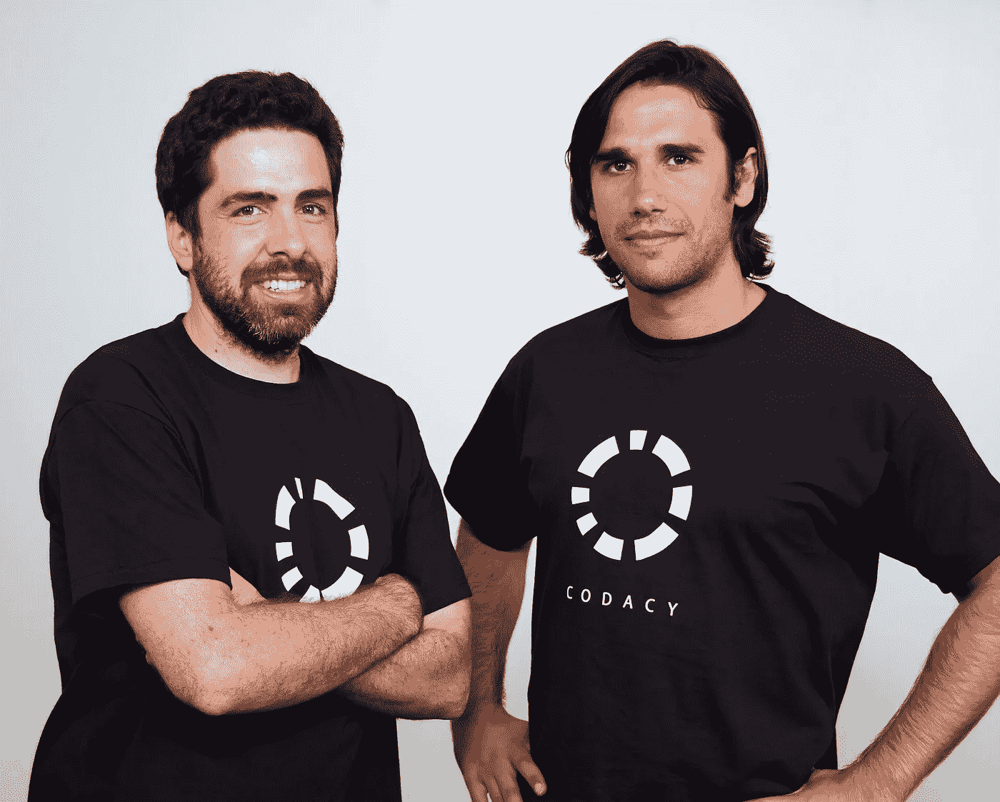
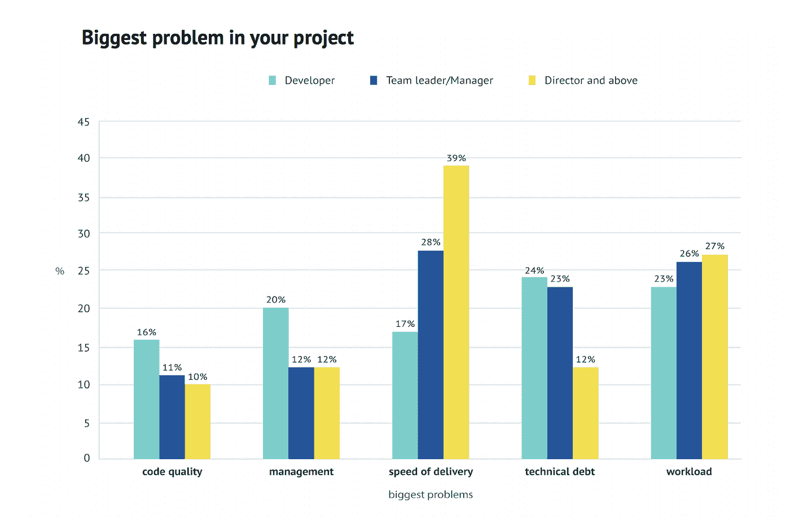

# 自动化代码审查&代码质量的未来

> 原文：<https://medium.com/hackernoon/automated-code-review-the-future-of-code-quality-bbdfbe3c7ebc>

## 创始人访谈

Pictured, CTO João Caxar (left) & CEO Jaime Jorge (right)

> 披露: [**Codacy**](https://goo.gl/SvwMy7) ，自动化代码评审平台，之前赞助过黑客 Noon。对于黑客正午的读者来说，他们的 [**使用这个代码提供 15%的折扣:HACKERNOON**](https://goo.gl/SvwMy7) **。**

今天，我们将了解这家初创公司的现状，并找出是什么让 [Codacy](https://goo.gl/SvwMy7) 创始人& CEO [Jaime Jorge](https://medium.com/u/808f5e0293da?source=post_page-----bbdfbe3c7ebc--------------------------------) 做他所做的事情。

**您能分享一下 Codacy 目前的进展、规模和使用情况吗？**

目前，全球有超过 6 万名开发人员使用 Codacy，包括 Deliveroo、Cancer Research UK、Google、Paypal 等公司，以及业内一些更重要的开源项目。

我们每天分析超过 10 亿行代码。

我们更为自豪的一个数字是，根据我们的统计，Codacy 的用户看到代码交付速度提高了 6%。

8 月份，Codacy 获得了由 EQT Ventures 领投的 510 万美元 A 轮融资。你能详细说明一下你将如何以及何时分配资金吗？以及是什么推动了您的决策(KPI、直觉假设等)。)在公司内部不同部门和项目的资金分配方面？

我们想做两件主要的事情。首要目标是继续推进我们的产品。到目前为止，我们学到的一点是，在我们的行业中，最好的营销和销售策略是拥有一个杀手级的产品。我们希望人们对我们的产品感到满意，并真正帮助他们的日常工作。我们正在雇佣一些业内最优秀的人来帮助我们让开发人员的工作变得更轻松。

第二是尽可能多的接触开发者，这意味着我们将在销售和市场营销上投资。

你认为阻碍工程团队提高代码质量的最常见的原因是什么？如何预防或避免它们？

我们做了一项调查，询问工程团队遇到的最大问题是什么。答案在很大程度上取决于他们的角色。

我们看到的是，技术债务(也可以看作是代码质量)是开发人员的头号问题，而经理和主管说是交付速度。有趣的是，每个人都提到工作负荷(即过于分散)是他们的第二个问题。

所以我认为这归结于时间以及管理和发展之间的期望差异。开发人员理解有时间维护软件的必要性和要求。经理们迫于压力将软件放在门外，所以这种不一致导致了一些紧张。

最后一个有趣的事实是，开发者的第三个问题是管理。

代码审查能真正自动化吗？

我认为代码审查不会完全自动化，我也认为不应该。

除了确保代码看起来不错之外，代码评审还有其他重要的目的。代码评审作为信息共享和决策日志。人们可以在一个拉请求中与其他人共享关于设计决策的信息，这样其他人就可以很容易地了解正在做什么(当您在其他产品中与更大的团队一起工作时，这尤其有用)。

我们在 Codacy 的目的是确保人们专注于正确的事情。讨论你的软件是否在做正确的、最有效的事情比讨论基本的安全性甚至风格偏好更重要。我们提升了代码审查中的讨论，因为我们成为了额外的审查者，寻找数以千计的小主题，这些小主题很重要，但没有你按时顺利交付重要。

**我认为没有人会反对修改莫比·迪克 1984 年的《寻找逝去的时光》或任何其他伟大小说中的任何一句话。这些是永恒的，每天都在消耗。你认为代码像文学一样可以永恒吗？有没有不需要迭代就能继续运行的代码？**

问得好。

我认为编码背后的基本思想是一样的。这就是为什么阅读像[《计算机程序的结构与解释》](https://mitpress.mit.edu/sicp/full-text/book/book.html)这样的精彩书籍是很有意义的。然而，这些想法的文字形式会随着时间的推移而改变，以适应不同的编程语言、范例、框架甚至硬件。

可能有一些用 Cobol 编写的代码将继续运行，不需要迭代，但不是因为它很棒，而是因为害怕破坏东西。

你的推特简历声称对“柔术”感兴趣就我个人而言，我倾向于篮球——这有助于我做生意。例如，传球和得分比运球得分更好——即使它们都值 2 分。柔术如何帮助你更好地开展业务？

我开始练习巴西柔术是因为我在寻找一种没有套路的运动(即没有健身房)。我只上了一堂课，之后就上瘾了。一段时间以来，我一直试图提炼出为什么我这么喜欢它。我相信这对我个人和我在公司的表现都有影响。

首先是策略。当你练习柔术的时候，你会发现自己很多次处于不好的受伤的位置，但是有可能逃脱。这门艺术教你如何忍耐、忍受和坚持度过不适，以便在前方获得更好的位置。

第二是视角。每次我进入 BJJ 的班级，我都带着我正在解决的挑战和问题进来。到下课的时候，我发现我在练习的时候一次都没有想到它们。我相信这与我们人性中最原始的部分有关。当我们面对一个想要假装谋杀你或打断你肢体的人时，我们会停止关注那些小事情，而去看待它们。我不再害怕，我会迎头痛击。

第三个是耐心。BJJ 的进步和发展是缓慢的。需要几年的时间才能基本胜任。没有一夜暴富能让你变得优秀。就像做生意一样，进步是建立在许多微小的进步之上的，这些进步随着时间的推移和坚持不懈地积累，并且不放弃最重要的事情。

**当您想到 Codacy 的整体代码库和技术堆栈时，您认为您在哪些方面最接近前沿创新？**

我们有几件事做得很好，很独特。

一个是我们的代码分析基础设施。我们能够安全地管理代码，并进行规模化和弹性分析。这意味着，在任何给定的时刻，如果人们提交和推送更多的代码，我们可以扩展我们的基础设施，以更快地产生更多的结果。

我们内部开发的另一个重要软件是我们的企业部署系统，它允许公司在防火墙后的云中使用我们已知的相同产品。这包括自动更新、版本管理、数据库和核心代码分离等。

我们的流程也是我引以为豪的。直到最近，我们的 13 人团队还在为 5 万名开发人员和 400 名客户提供服务，其中很多是企业客户。只有通过良好的开发过程，我们才能支持这一点。

**对软件开发的未来有什么大胆的预测吗？**

今天，您已经有了很好的平台，可以帮助您在软件开发上进行协作，并组织一个很好的开发过程。在未来，我相信我们会有智能平台来告诉你什么是好的和坏的代码决策。这些数据自然来自收集了这些数据的公司，Codacy 就是一个很好的例子。

我相信有一天人工智能可以帮助我们以令人羡慕的敏锐度编写软件。这将极大地提高我们作为软件工程师的生产力。

我认为未来每个人都将成为一名编码员。由于软件开发的巨大必要性，开始编码的障碍将继续减少。

如果事情按计划进行，Codacy 作为一个产品和公司，在 5 年或 10 年后会是什么样子？

作为一家公司，我们的使命是通过质量来提高生产力，从而在规模上帮助开发者。根据这一主要愿景，我们的产品和解决方案将继续发展和改进。我们看到了一个未来，我们可以帮助世界上每一家公司发布更好的代码 faser。在 5 年的时间里，我们希望更接近实现这个梦想。

今天，我们专注于为要求最苛刻的软件开发公司提供质量最好的自动化解决方案。如果我们继续这样做，天空就是我们的极限。

**跟上**[乖巧](https://goo.gl/SvwMy7) **上** [**脸书**](https://www.facebook.com/codacy)**&**[**碎碎念**](https://twitter.com/codacy) **。**