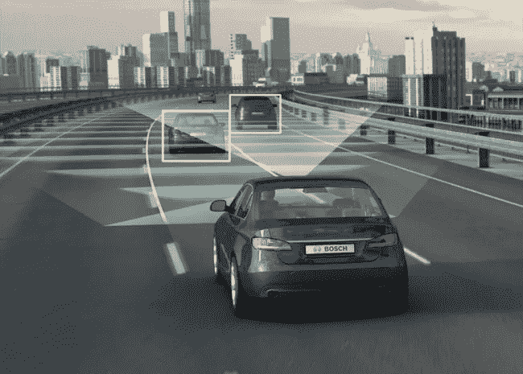
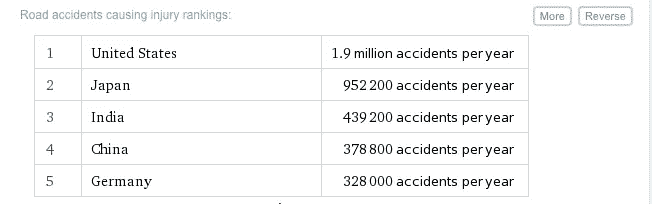
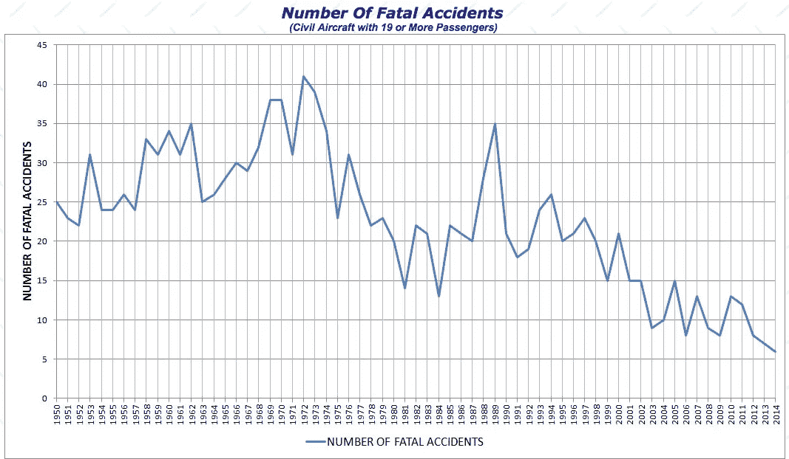

# 自动驾驶:它将带我们走向何方？

> 原文：<https://medium.com/hackernoon/automated-driving-where-will-it-take-us-e4f4487ff3f4>

在生活中，我很少发现自己处于敬畏的境地。这很有趣，它让你想起了你的童年，那时敬畏是一种更常见的经历。我记得当我还是个孩子的时候，大概 10 岁或 11 岁，我的祖父，我确信他可能是世界上最强壮的人，让我打他的肚子。回想起来，这是一个有趣的请求，但我可以想象 65 岁的自己对我未来的孙子提出的请求，以努力保持类似的叙事。

我问了他几次他是否确定，每一次，他都更加自信地向我保证，我可以毫不犹豫地一拳打向他的肚子。所以，我上了发条，发动了一场我认为会是惊天动地、惊天动地的罢工。他甚至没有退缩。我是如此敬畏他的力量，以至于直到 20 多年后的今天，我还记得那种感觉。

这种感觉不常出现，但最近我发现自己又开始敬畏了。

我看了上面的视频，完全肃然起敬。背景故事是，车辆是一辆特斯拉，通过自动驾驶系统在交通中行驶，正如你所见，节省了司机(和其他乘客？)免受严重的身体伤害和潜在的生命危险。

与其说是视觉效果。我认为你实际上需要亲自体验自动驾驶，才能真正感受到创造终身记忆所需的鸡皮疙瘩。更确切地说，我感到的敬畏更多的是对未来的憧憬。即使自动驾驶在 20 年内不会变得司空见惯，也很可能会更快，对吗？—我会记得它是从什么时候开始的。在这个视频中，你可以看到一个新的未来正在你眼前形成。这太棒了。

虽然我敬畏的时刻将留在我的记忆中，但在看完这个视频后，我也想到了未来会发生什么，从法律上来说。[就像医生总是在地铁里走来走去，在他或她目睹咳嗽或发现跛行时，在他或她的脑海中诊断人们一样，律师被训练成通过法律的镜头来看待他们的世界。](http://www.amazon.com/The-Real-Doctor-Will-Shortly/dp/0804138656)

因此，我无法摆脱围绕不可避免的场景的某些想法，这些场景要求我们检查如果在我们新的自动化未来发生事故，谁将是错的，以及这对法律实践的巨大影响。

今天，大多数人身伤害诉讼都涉及到与机动车辆操作有关的过失索赔。[疏忽](https://en.wikipedia.org/wiki/Negligence)的简化定义——也就是说非法律版本——简单来说就是一方在做某事时没有采取适当的注意，由于这种缺乏注意，某人或某物可能已经受到伤害。

关心是一个非常独特的术语。独特之处在于它几乎主要适用于人类。机器，更准确地说是控制它们行动的软件，只是基于规则的系统，基本上通过回答一系列是或否的问题来运行，尽管速度难以想象。这些“是”或“否”(或“1”或“0”)的运算是我们今天在电脑上所做的一切的基础。我应该在这里声明，我不是软件工程师或程序员，但是由于我是苹果公司的技术人员，我在这方面有一点知识。

这些人身伤害诉讼，基于司机的疏忽行为，要求原告律师向陪审团或法官证明被告在驾驶时没有尽到应有的注意才能胜诉。有许多方法可以做到这一点，但是正如你可能想象的那样，通常没有失败的具体和直接的证据。无论电视节目选择描绘什么，都很少有任何类型的法医证据，甚至更好的基于视频的证据，可以直接证明被告的疏忽行为导致了事故。

由于这一现实，律师们花了大部分时间试图通过一连串的间接证据来证明被告的过失行为。原告律师希望在每一个案例中表明，所有间接事实的积累向陪审团表明，除了被告的疏忽之外，对于事故的原因[没有其他合理或“简单”的解释。律师们通常会依靠](https://en.wikipedia.org/wiki/Res_ipsa_loquitur)[奥卡姆剃刀](https://en.wikipedia.org/wiki/Occam%27s_razor)——这种观点认为，在一个事件所有可能的解释中，最简单的解释是最有可能的——并以此来努力说服陪审团。

但是这怎么可能在未来的自动汽车上实现呢？你的标准人身伤害诉讼，起因于机动车事故，看起来会有很大不同。当一方类似于一个设备时，或者当这些设备的故障可以归因于软件或硬件时，如何识别故障方？当我们进入这个新时代时，我想象有两种方法。首先，法律需要更新，以支持我们可能发现自己所处的潜在情景。第二，当事故发生时，诉讼的策略也会改变。

立法者在试图建立一个围绕自动驾驶的法律框架时，将不得不专注于特定场景的分解，这些场景在这种自动系统运行车辆时可能会发生，也可能不会发生。机器不会放弃应有的关注，软件开发人员(或潜在的硬件设计人员)会，但这不是我们要开始的地方。目前以及在可预见的未来，人类将保持超越任何[自动驾驶系统](https://en.wikipedia.org/wiki/Automated_driving_system)(以下简称“ADS”)的能力，因此很有可能继续为未来涉及机动车辆事故的可能事件提供至少一种解释。尽管 ADS 的目标是尽可能多地消除人为驾驶，但人类的行为仍有可能像机动车事故一样发生——尽管需要付出一些认真的努力。

较低水平的广告可以在[自动制动](http://www.forbes.com/sites/joannmuller/2015/09/11/carmakers-promise-to-put-automatic-braking-systems-in-every-car-to-prevent-crashes/#2715e4857a0b6f0dfeee6ebf)、[自适应巡航控制](https://www.google.com/url?sa=t&rct=j&q=&esrc=s&source=web&cd=15&ved=0ahUKEwil176Z5LTKAhULbj4KHQ8eDAYQFghvMA4&url=http%3A%2F%2Fwww.businessinsider.com%2Fi-drove-car-with-adaptive-cruise-control-it-was-amazing-2014-9&usg=AFQjCNF21J1ZkUWHiMi_mI4VpSkEN2dgZQ)和[形式中看到，其他几种形式的新“自动”安全机制](http://www.forbes.com/sites/tanyamohn/2014/12/12/blind-spot-and-lane-departure-systems-get-mixed-reviews-in-new-evaluation/#510fc6bae9fe32305989e9fe)试图通知驾驶员不安全的情况，然后在驾驶员未能做出适当反应时接管。即使一个人，在他们开车的短暂时间里，能够令人惊讶地克服所有旨在避免未来机动车辆事故的安全机制，考虑到新的硬件和软件系统，ADS 可能会使证明这种疏忽行为比以往任何时候都更容易。

不难想象，提供软件或硬件或车辆的公司会建立一个持续的数据流，当然是保存在云上，他们或其他人(通过 [discovery](https://en.wikipedia.org/wiki/Discovery_%28law%29) )可以利用它来获取任何事故发生时车辆运行的同期视图。这将非常类似于飞机现在使用的升级版“黑匣子”,并且可能是未来的要求——由州或联邦当局强制实施——以帮助调查任何 ADS 故障。这对当事人来说是一个巨大的好处(至少对一个人来说),因为他们试图解决任何涉及广告的过失索赔，无论它们是否涉及人类或非人类实体。这也将有助于简化这些案件中的证据发现，并可能带来革命性的变化，因为它特别涉及潜在的责任。这种有益的广告分支可能会揭示我们现在开始看到的[自动化运动的其他潜在革命性方面。](http://www.wired.com/insights/2014/11/the-internet-of-things-bigger/)

可选地，如果可以显示事故发生时没有任何类型的人类交互，则运行自动化系统的软件可以在两种状态之一下运行。首先是一个*受损状态*，其中一个[软件错误](https://en.wikipedia.org/wiki/Software_bug)已经使系统无法执行所有必要的功能来维持安全的驾驶体验，正如设计的那样。这很难想象，因为你不得不认为在任何 ADS 中都会发生预检查，以在离开时验证它的硬件和软件，将自发故障或环境原因作为更可行的替代方案。如果在运输过程中出现这种故障，或者即使没有人，也可能有冗余系统来“传递”或者将驾驶返回给人，额外的软件冗余可以安全地(如果可能)将汽车开到给定环境的安全地点。在这篇文章中，我不会讨论关于如果汽车不能安全行驶该怎么办的道德辩论。

这些冗余还可能是内置的一组额外硬件冗余的基础，以帮助确保在不同的里程数下，任何不太严重的系统范围硬件故障都是可持续的。但是这很难，因为这些故障是不可预测的、不稳定的，并且由于上述内置冗余系统(希望)内置于车辆中，自发的错误几乎是不可预测的，但不一定是不可能的。环境问题，即造成事故的另一辆车或天气条件，造成事故的可能性更大，并且可以测试神经网络和算法的边界，因为它们试图学习和获得关于所有可能的道路条件或由与车辆无关的力造成的无意影响的经验。我想知道广告可能采取的安全行动的限度是什么——但这又是另一篇文章的另一个主题。

第二，软件可能处于*未受损状态*，软件本身按预期运行——然而，鉴于软件设计有缺陷的事实，事故仍然发生。这将是一个更有可能的情况。在围绕软件熟练程度的监管链中，人类也将提供一个误差源，ADS 也不太可能不同。Alpha 和 Beta 测试无疑是严格的，因为它与自动化系统相关，但是完美几乎肯定是无法获得的，并且这个场景提出了一个传统类型的疏忽问题，如前所述。工程师或团队领导是否以应有的谨慎行事？如果一家[大型汽车制造商因其广告而被判过失罪](http://www.pbs.org/newshour/bb/fiat-chrysler-faces-record-fines-failing-recall-unsafe-cars/)，会发生什么，尤其是当人类运输的大部分依赖转向软件的时候？(我真的想知道[开源运动](http://knowledge.wharton.upenn.edu/article/whats-driving-teslas-open-source-gambit/)是否能提供一些喘息的机会)

我并不担心系统本身的缺陷，但这是软件生活中的一个简单事实——没有什么是完美的。真的，在我的经历中，这更像是生活本身的真理。这种不完美不会是午餐时间电池没电的区别，而是可能导致撞车或受伤。我缺乏所有必要的信息和专业知识来起草一份关于如何避免这种情况的论文，但通过合作，寻求广告的公司和监管机构应该能够提供仍然能够产生比现在安全几个数量级的驾驶体验的软件。

这些场景呈现了三种可识别的错误状态(人为、受损和非受损)，可能导致涉及 ADS 的机动车事故。这些情况可以由州和地方当局进行调查、分解和相应的管理，就像今天的疏忽一样。但是，一旦这些新的框架得到确定和管理，在今天的人身伤害民事诉讼中如此普遍的原告将会发生什么？

律师如此适应涉及机动车事故的诉讼的原因之一——也是我立即想到的原因——是发生的机动车事故的绝对数量，然后进展到诉讼。美国每年经历大约[190 万起机动车辆事故，其中有人受伤](http://www.wolframalpha.com/input/?i=Motor+Vehicle+Accident+in+the+US)。自动驾驶未来的现实目标是大幅减少这一数字，而不是保证不再发生事故——尽管这在一定程度上推动了广告的创作。确定成功的真正标准是观察机动车辆使用中涉及的风险被降低到这样一个水平，即事故发生的频率如此之低，以至于它们本身被视为陌生和悲剧——类似于[我们如何看待主要商业航空公司](http://www.planecrashinfo.com/cause.htm)的事故。

全国各地的许多律师如果不是大部分，也是部分专注于与机动车事故相关的诉讼。在自动驾驶减少事故数量的未来，据一些[估计高达 90%](http://www.theatlantic.com/technology/archive/2015/09/self-driving-cars-could-save-300000-lives-per-decade-in-america/407956/) ，这些案件将变得如此罕见，以至于许多律师将在未来看到他们的执业模式发生巨大变化。如果这类案件的市场消失了——看起来是这样——律师们会如何处理？(律师市场的未来变化将不得不留待下次的另一篇博客文章来讨论)。随着对这类服务需求的减少，可以有把握地认为这一领域的业务将会停滞不前，迫使许多律师将注意力转移到其他地方。

随着主要关注点从人为错误转移到软件或硬件故障，甚至需要更多的适应。这些类型的诉讼将很快转变为产品责任索赔，这是它自己的专长。但是，更剧烈的是今天和将来的机动车事故民事诉讼的范围和规模的差异。

当你当地的律师转移他们的焦点时，小型和大型公司将接管他们的角色，成为大部分(如果不是全部的话)机动车事故诉讼的主要律师，[将需要确保这些案件值得他们花费时间](http://www.forbes.com/sites/danielfisher/2013/12/11/with-consumer-class-actions-lawyers-are-mostly-paid-to-do-nothing/#2715e4857a0b33306b8963c0)。集体诉讼的特点是原告众多，通常情况下，鉴于这一事实，复杂程度要高得多，原告的恢复期要长，而且[的赔偿金额要低](http://www.debate.org/opinions/do-class-action-lawsuits-cost-too-much-and-really-benefit-only-the-lawyer-in-the-end)。[今天最可行的推论案例可能是高田公司，以及 2015 年因安全气囊问题面临产品责任索赔的几家汽车制造商](http://www.nytimes.com/2015/07/10/business/takata-says-no-to-fund-for-victims.html?ref=topics&_r=0)。

在自动驾驶领域，复杂性方面尤其重要。从历史上看，根据驾驶的一般经验，解释机动车事故中的疏忽是相对容易的。人们天生就知道，当你看到停车标志或红灯时，你就会停下来。人们也明白四向交叉路口是如何工作的，在拐角处开得太快很容易导致失控。共同的驾驶经历让陪审员很容易理解在标准的机动车事故案件中过失可能是什么样的。

进一步扩展，陪审员通常可以通过专家的仔细和周到的证词理解制造中的缺陷是如何产生的，专家帮助解释特定组件的设计或制造中的问题，它是如何存在的以及它的影响。陪审员通常认为这些信息是可消费的，部分原因是他们能够理解专家们在讨论什么，或者围绕这些部分的系统很容易被普通人吸收。但是，如果您曾经在假期为您的家人提供过即兴的 IT 支持，或者在 Genius Bar 逗留过一段时间，您会很容易发现软件和相关组件(网络、云存储等)的复杂性，即使它们在我们的日常生活中无处不在，也是许多人积极避免胜任的一系列系统的元素。即使在今天，看着律师、法官和非专家证人试图理解甚至当前的消费者技术水平也可能是滑稽的。

但是，超出了现有的复杂系统的理解，这些集体诉讼将有不同程度的损害。人身伤害律师会很乐意承认，在责任问题之后，接下来是证明你的客户的损害。虽然调查事故的原因可能属于上述假设的框架，但损害的性质肯定会开启非常严重的案件的可能性，在这些案件中，不同的原告遭受了不同程度的损失。但是，如果他们转变成标准的集体诉讼方式，[客户们会有兴趣](http://www.tampabay.com/news/perspective/are-class-action-suits-worth-the-trouble/972051)参与上述变革吗？他们会为他们的具体人身伤害获得合理的损害赔偿吗？

即使在上述关于缺陷安全气囊的案例之外，技术公司也经常在产品责任案件中被起诉，这可以提供机动车辆事故诉讼可能走向的准确描述。今天互联网上流传的一个常见标题是“[苹果因‘问题 A’遭遇集体诉讼。](https://www.google.com/url?sa=t&rct=j&q=&esrc=s&source=web&cd=1&ved=0ahUKEwjng-K_67TKAhWDWj4KHXpuD2IQFggdMAA&url=http%3A%2F%2F9to5mac.com%2F2015%2F12%2F29%2Fapple-lawsuit-ios-9-performance%2F&usg=AFQjCNFgQRRZwzklFKx8ruLhrUjSF7rLkg)”[谷歌](https://www.google.com/url?sa=t&rct=j&q=&esrc=s&source=web&cd=2&ved=0ahUKEwi1gJTI67TKAhXLWz4KHWyqAhkQFggoMAE&url=http%3A%2F%2Fwww.thewire.com%2Ftechnology%2F2014%2F05%2Fgoogle-just-got-hit-with-a-major-class-action-lawsuit%2F361600%2F&usg=AFQjCNGsEBhppMGFPynjPuAGKSuekJie0Q&bvm=bv.112064104,d.cWw)、[微软](https://www.google.com/url?sa=t&rct=j&q=&esrc=s&source=web&cd=4&ved=0ahUKEwjTnfvR67TKAhXCFj4KHVpPBiwQFggwMAM&url=http%3A%2F%2Fwww.gamespot.com%2Fforums%2Fxbox-association-1000003%2Fmicrosoft-hit-with-class-action-suit-over-xbox-liv-26041081%2F&usg=AFQjCNFt9qp8mcjQ829R1xGVA4q1pGPLTA&bvm=bv.112064104,d.cWw)和许多其他科技公司都经受过类似的攻击，当不满意的客户遇到他们的软件或设备的问题时。基于事故的诉讼的缺失会被不满用户的以功能为中心的诉讼所取代吗？(另一个话题，在另一个时间，当有人不喜欢他们的广告使用的特定路线或速度时，有多少这样的诉讼会发生？)就连特斯拉也感受到了这种如今几乎成为标准做法的刺痛。

但是，涉及软件漏洞、存储空间、Wi-Fi 或任何其他软件组件或属性的问题很少涉及潜在的严重人身伤害甚至死亡的问题。只要说这些问题值得认真讨论就够了。

这里的重点不是说自动驾驶汽车更有可能伤害乘客，事实上恰恰相反。随着自动驾驶系统自身致力于将机动车事故减少到当前数量的 10%，并假设这些系统利用当前的人工智能先进技术继续得到更大的改进，[随着材料和汽车设计方面的持续安全创新保持当前速度](http://money.cnn.com/2016/01/20/luxury/volvo-no-death-crash-cars-2020/index.html?sr=twCNN012016volvo-no-death-crash-cars-2020/index.html0437PMStoryLink&linkId=20521715)，在不太遥远的未来，使用自动驾驶系统驾驶可能是最安全的交通方式。

但是必须讨论严重身体伤害或死亡的可能性。在这种不太可能发生的事件中，如果当公众听说一个软件错误最糟糕的属性从可能错过你的闹钟变成了受伤甚至死亡，他们会有什么反应？我们如何确保事故中的受害者能够获得行使其合法权利所需的数据和裁决措施？

我不确定未来会发生什么。但是我有很多疑问。收入不平等将如何影响自动驾驶汽车的普及？在这项新技术的成本降下来之前，富人会是 10 年或 20 年内最安全的司机吗？[或者这是一种几乎每个人都会立即使用的革命类型](http://www.theguardian.com/technology/2015/sep/17/uber-well-ease-the-transition-to-self-driving-cars)？

我认为，无处不在的由机动车事故引起的人身伤害诉讼将成为过去。这场革命将引发法律行业的巨大变革，可能有助于以一种前所未见的方式重塑法律行业。在实际事故发生的罕见事件中，来自自动驾驶系统的持续数据流的数据的更大可用性将有助于彻底改变这些案件(以及其他案件——我估计特别是刑事案件)。这场数据积累的革命可能只是开始，这是人工智能在我们世界的扩散带来的另一个即将到来的变化(想想物联网将固有地创造的所有数据)。

我还可以看到，软件、硬件或汽车本身的供应商经常成为集体诉讼的目标，特别是当他们发布和创新产品时，无论实际问题是否存在。真正的问题是，这些类型的诉讼，以及所有已经提到的问题，是否真的提供了一种追索权，让这些罕见事故中的受害者得到公平的赔偿？这是未来的问题。监管者和立法机构会找到一个框架来处理这个令人敬畏的新现实吗？鉴于事故的历史性减少，这还重要吗？

> [黑客中午](http://bit.ly/Hackernoon)是黑客如何开始他们的下午。我们是 [@AMI](http://bit.ly/atAMIatAMI) 家庭的一员。我们现在[接受投稿](http://bit.ly/hackernoonsubmission)，并乐意[讨论广告&赞助](mailto:partners@amipublications.com)机会。
> 
> 如果你喜欢这个故事，我们推荐你阅读我们的[最新科技故事](http://bit.ly/hackernoonlatestt)和[趋势科技故事](https://hackernoon.com/trending)。直到下一次，不要把世界的现实想当然！

