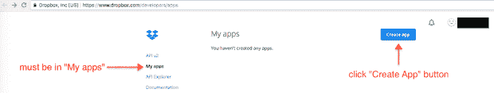
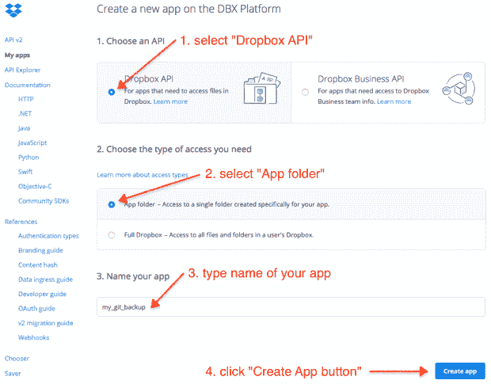
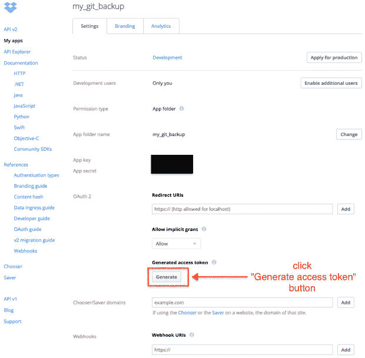
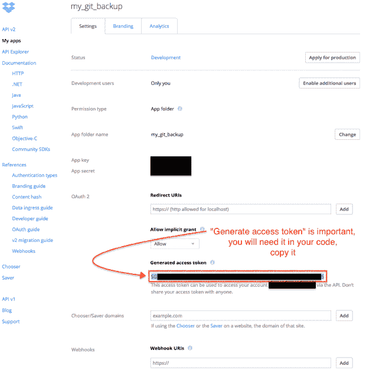
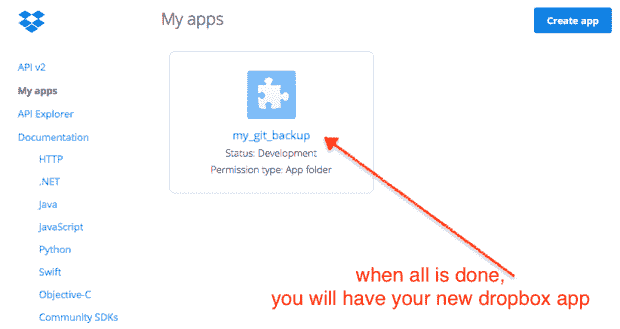

# 使用 Python 将 git 存储库自动备份到 Dropbox

> 原文：<https://medium.com/hackernoon/automatic-backup-of-git-repositories-to-dropbox-with-python-d9840b28bb65>

**Originally Published on:** 01.12.2017

## 介绍

我将展示如何从 [**Python**](https://hackernoon.com/tagged/python) 代码**上传文件到 Dropbox。**

## 我为什么需要这个？

目前，我只使用[web 功能](https://www.webfaction.com/?aid=6600)用于我所有的网络服务，同时也是我的私人 git 服务器。

我想把我的 git 库的自动备份 **到 Dropbox** 。

## Dropbox 应用程序

为了上传文件到 Dropbox，你需要一个**访问令牌**。

而对于访问令牌，你需要在 DBX 平台上注册你的 **app。**

所有这些都必须在 Dropbox 网站上完成。

第一步是转到[https://www.dropbox.com/developers/apps/](https://www.dropbox.com/developers/apps/)并按下“创建应用程序”按钮。

第一步

只需点击“创建应用”按钮

第二步

我们将使用 Dropbox API。

我们将选择“应用程序文件夹”，因为我们将只上传一个备份到 Dropbox，我们不需要完全访问我们所有的文件。

命名您的应用程序，然后单击“创建应用程序”按钮。

第三步

我们将使用默认设置，在这里我们将获得访问令牌，因此，单击“生成访问令牌”按钮。

第四步

现在您有了您的访问令牌，您将在您的代码中需要它，所以复制它。

第五步

现在我们有了我们的“我的 git 备份”Dropbox 应用程序。

## pip 安装

> pip 安装收存箱
> 
> pip 安装结构

总是建议**使用 python 内部的虚拟环境**。

至少我总是使用它们。

# 密码

有关代码示例，请访问[http://buklijas . info/blog/2017/12/01/automatic-backup-of-git-repositories-to-Dropbox-with-python/](http://buklijas.info/blog/2017/12/01/automatic-backup-of-git-repositories-to-dropbox-with-python/)

## 我如何自动运行它

我每天亲自从 crontab 运行这个命令一次。
`35 02 * * * /home/user_name/code/venv/bin/fab -f /home/user_name/code/fabfile git_backup_to_dropbox`

## 结论

这可用于**将任何文件夹自动备份为 zip 文件到收存箱**。

如有任何问题，请写在评论里。

*原载于 2017 年 12 月 1 日*[*buklijas . info*](http://buklijas.info/blog/2017/12/01/automatic-backup-of-git-repositories-to-dropbox-with-python/)*。*