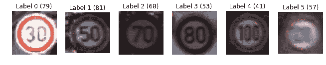
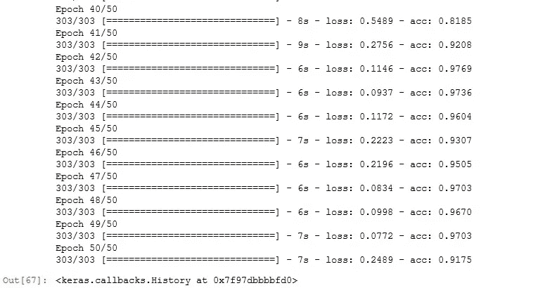
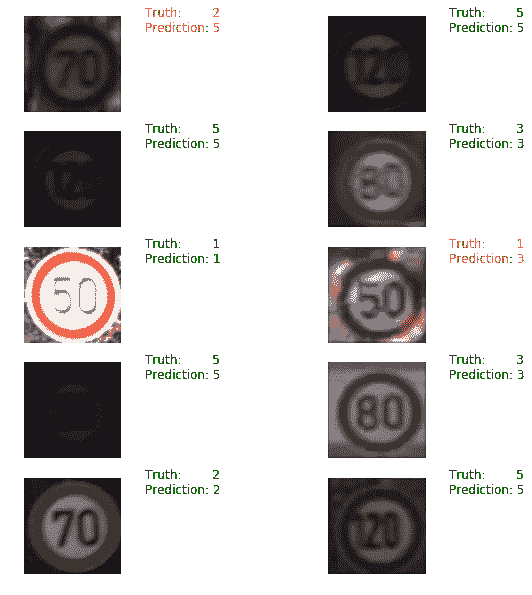

# 限速标志的自动识别 Keras 和 Tensorflow 深度学习

> 原文：<https://medium.com/hackernoon/automatic-recognition-of-speed-limit-signs-deep-learning-with-keras-and-tensorflow-310d90af9826>

在我来德国之前，我对德国道路上没有限速的故事很感兴趣。令我失望的是，限速几乎无处不在。高速公路(autobahn)上只有某些区域被指定为无速度限制区，汽车和其他车辆可以在那里测试其工程极限。

如果一个司机超速行驶，突然进入一个必须遵守一定速度限制的区域，该怎么办？解决这个问题的一种方法，也是最常见的方法，是驾驶员手动刹车，降低加速度。但是，嘿，我们已经到了 2017 年，计算机现在可以识别的不仅仅是猫和狗！所以让我们试着让我们的电脑自动识别限速标志吧！

我的实现基于一篇名为[使用 TensorFlow 和 Keras 的卷积神经网络简介](https://www.youtube.com/watch?v=WIhI1W6NoZ0)的教程，作者是 [Oliver Zeigermann](http://zeigermann.eu/) 。这是一次非常好的演讲，我喜欢他从工程师的角度而不是从研究人员的角度来探讨实现。我一直在积极尝试这两种方法，在这里我学到了一些数学知识，也学到了如何使用各种库来实现它。

我在本教程中发现的一个关键东西是微软 Azure 笔记本。在他的教程中，Zeigermann 要求观众要么在本地运行笔记本电脑，要么在云上运行。他说他更喜欢云，因为云机器比他的机器更强大，规格也更多。我的机器也是如此。在此之前，我一直在我的 CPU 上使用 Jupyter 笔记本电脑，我的机器很快就会发热。所以我决定试用 Azure 笔记本，我有一个非常好的体验。它们速度很快，可以很快安装好。而且他们是免费的！我不得不寻找捕获物，但是没有！对于刚刚开始学习 python 和数据科学的人来说，Azure 笔记本可以帮助他们快速起步。

实施任何数据科学或人工智能项目的首要任务是找到一个合适的数据集。本教程的数据集由主讲人提供。他在视频中提到，该教程是基于[瓦利德·阿卜杜拉](/@waleedka)的[类似项目](/@waleedka/traffic-sign-recognition-with-tensorflow-629dffc391a6)。我假设他从另一个项目中获得了数据。在这种情况下，它基于一个名为[比利时交通标志数据集的数据集。](http://btsd.ethz.ch/shareddata/)

在获得数据之后，我们仍然需要以机器学习模型可以使用的形式准备我们的数据。数据集中的图像为. ppm 格式。我们使用库 skimage 将它转换成可用于分析的形式。下面是执行转换的函数。

```
import os
import skimage.datadef load_data(data_dir):
    directories = [d for d in os.listdir(data_dir)
                  if os.path.isdir(os.path.join(data_dir, d))]
    labels = []
    images = []
    for d in directories:
        label_dir = os.path.join(data_dir, d)
        file_names = [os.path.join(label_dir, f)
                      for f in os.listdir(label_dir) if f.endswith(".ppm")]
        for f in file_names:
            images.append(skimage.data.imread(f))
            labels.append(int(d))
    return images, labels
```

使用 load_data 函数加载数据后，我们尝试查看图像和标签是如何组织的。我们写了一个函数，让我们可以可视化我们的数据。

```
import matplotlib
import matplotlib.pyplot as pltdef display_images_and_labels(images, labels):
    """Display the first image of each label."""
    unique_labels = set(labels)
    plt.figure(figsize=(15, 15))
    i = 1
    for label in unique_labels:
        # Pick the first image for each label.
        image = images[labels.index(label)]
        plt.subplot(8, 8, i)  # A grid of 8 rows x 8 columns
        plt.axis('off')
        plt.title("Label {0} ({1})".format(label, labels.count(label)))
        i += 1
        _ = plt.imshow(image)
    plt.show()
display_images_and_labels(images, labels)
```

这将导致以下结果。



Speed limit images with their respective labels and counts

我们看到我们的数据集有 6 个不同类别的限速图像。我们有图像显示 30，50，70，80，100 和 120，每个类别分别有 79，81，68，53，41 和 57 个样本。这不是一个非常大的数据集，但对于我们的问题来说已经足够好了。

观察了图像的组织方式后，现在让我们看看每张图像的形状，以及它的最小和最大 RGB 颜色值。

```
for image in images[:5]:
    print("shape: {0}, min: {1}, max: {2}".format(image.shape, image.min(), image.max()))Output:shape: (21, 22, 3), min: 27, max: 248
shape: (23, 23, 3), min: 10, max: 255
shape: (43, 42, 3), min: 11, max: 254
shape: (61, 58, 3), min: 3, max: 255
shape: (28, 27, 3), min: 8, max: 65
```

从输出中我们可以清楚地看到，每个图像的形状随着最小和最大 RGB 值分布的大变化而变化。我们的神经网络模型期望我们所有的图像都具有相同的形状。在调整大小时，让我们也将最小和最大 RGB 值归一化到 0 和 1 之间。我们使用 skimage 的转换功能将图像转换为 64x64 像素，RGB 有 3 个通道。

```
import skimage.transform
images64 = [skimage.transform.resize(image, (64,64)) for image in images]
```

最后，我们执行数据准备的最后一步，将图像和标签转换为 numpy 数组。我们还使用 to _ categorical 函数将我们的标签转换为不同的分类数组，如果特定的类别用 else 0 表示，则数组包含 1。

```
import numpy as np
from keras.utils.np_utils import to_categoricaly = np.array(labels)
X = np.array(images64)
num_categories = 6
y = to_categorical(y, num_categories)
```

在这个阶段之后，Zeigermann 解释了他如何通过训练一个简单的 keras 模型进行实验，该模型在训练数据上表现良好，但在测试数据上表现不佳。他还讨论了为什么 RMSProp 与 SGD、Adagrad 等其他方法相比似乎是更好的优化器。

最后，实验将他引向卷积神经网络。卷积神经网络或 CNN 是一种明确假设输入是图像的神经网络。计算机视觉中的许多深度学习革命都是由 CNN 领导的。这是他们建筑的一个例子。


CNN Architecture. Source: [http://cs231n.github.io/convolutional-networks/](http://cs231n.github.io/convolutional-networks/)

因为我们在这里关注的是 CNN 的应用方面，所以我不会详细讨论每一层是什么以及我们如何调整超参数。我们通过使用 Keras 库来运行 CNN。Keras 是基于 Tensorflow 和 Theano(不再维护 Theano)构建的高级 API。现在让我们来看看代码。

```
from keras.models import Model
from keras.layers import Dense, Flatten, Input, Dropout
from keras.layers import Convolution2D, MaxPooling2D
from sklearn.model_selection import train_test_splitinputs = Input(shape=(64,64,3))x = Convolution2D(32, 4,4, border_mode='same', activation='relu')(inputs)
x = Convolution2D(32, 4,4, border_mode='same', activation='relu')(x)
x = Convolution2D(32, 4,4, border_mode='same', activation='relu')(x)
x = MaxPooling2D(pool_size=(2,2))(x)
x = Dropout(0.25)(x)# one more block
x = Convolution2D(64, 4, 4, border_mode='same', activation='relu')(x)
x = Convolution2D(64, 4, 4, border_mode='same', activation='relu')(x)
x = MaxPooling2D(pool_size=(2, 2))(x)
x = Dropout(0.25)(x)x = Flatten()(x)
# fully connected, 256 nodes
x = Dense(256, activation='relu')(x)
x = Dropout(0.50)(x)# softmax activation, 6 categories
predictions = Dense(6, activation='softmax')(x)model = Model(input=inputs, output=predictions)
model.compile(optimizer='rmsprop',
              loss='categorical_crossentropy',
              metrics=['accuracy'])model.fit(X_train, y_train, nb_epoch=50, batch_size=100)
```

该模型现在运行 50 个时期，批量大小为 100。它对之前使用 sklearn 的 train_test_split 函数拆分的总数据的 80%进行训练。这是我们运行 50 个纪元后得到的结果。



CNN output on training data after 50 epochs

该模型收敛，损失为 0.2489，精度约为 92%。对于一个没有在超参数调整上做任何努力的模型来说还不错！让我们看看模型在训练数据集上的准确性。

```
train_loss, train_accuracy = model.evaluate(X_train,y_train, batch_size=32)
train_loss, train_accuracy
```

我们在训练数据上得到 83.49%的准确率，损失 0.41。让我们看看我们的测试数据集的性能。

```
test_loss, test_accuracy = model.evaluate(X_test, y_test, batch_size=32)
test_loss, test_accuracy
```

我们得到大约 68 %的准确度，损失为 1.29。这没那么好。但是这里发生了一些有趣的事情，这也是泽格曼提到的。这是我第二次运行这个模型。在我之前的运行中，我得到了大约 95%的测试准确率。显然，模型输出是不确定的。也许有办法让它更稳定。我将不得不在那上面读更多。

最后，让我们在测试数据集上可视化我们的模型的一些预测。我们从测试数据集中随机抽取 10 幅图像，并使用 matplotlib 来绘制预测。我们显示了预测类及其基础真值。如果我们模型的预测是正确的，我们把它涂成绿色，否则涂成红色。

```
import random
random.seed(3)
sample_indexes = random.sample(range(len(X_test)), 10)
sample_images = [X_test[i] for i in sample_indexes]
sample_labels = [y_test[i] for i in sample_indexes]#get the indices of the array using argmax
ground_truth = np.argmax(sample_labels, axis=1)
X_sample = np.array(sample_images)
prediction = model.predict(X_sample)predicted_categories = np.argmax(prediction, axis=1)# Display the predictions and the ground truth visually.
def display_prediction (images, true_labels, predicted_labels):
    fig = plt.figure(figsize=(10, 10))
    for i in range(len(true_labels)):
        truth = true_labels[i]
        prediction = predicted_labels[i]
        plt.subplot(5, 2,1+i)
        plt.axis('off')
        color='green' if truth == prediction else 'red'
        plt.text(80, 10, "Truth:  {0}\nPrediction:    {1}".format(truth, prediction), 
                 fontsize=12, color=color)
        plt.imshow(images[i])display_prediction(sample_images, ground_truth, predicted_categories)
```

正如您在下面看到的，我们的模型正确预测了测试数据集中 8/10 的随机采样图像。还不错！上次我在测试数据集上获得了 95%的准确率，它正确预测了 10/10 的图像！



这是一个伟大的项目！我确实学到了很多。感谢 Oliver Zeigermann 的教程(和代码)和 Waleed Abdulla 的博客文章。我期待着做更多的演练，探索这个令人惊讶的人工智能的疯狂世界！