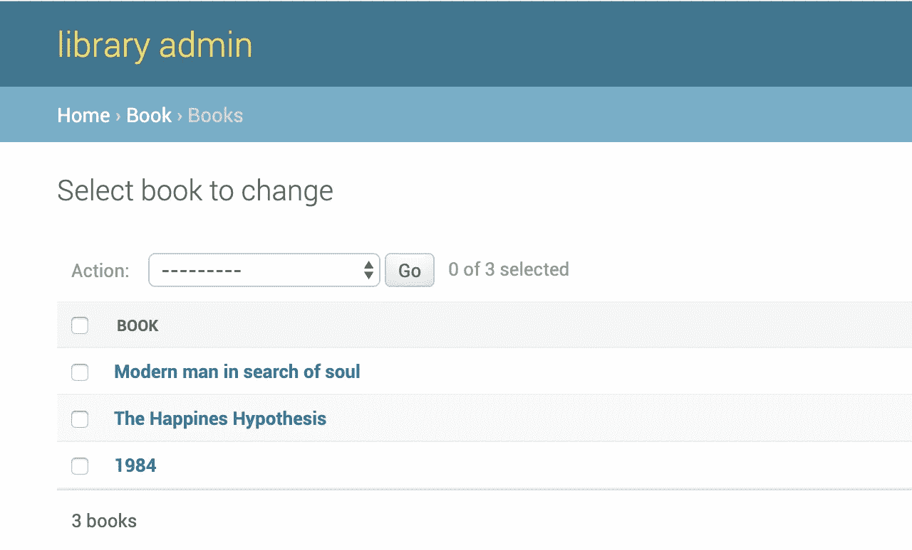
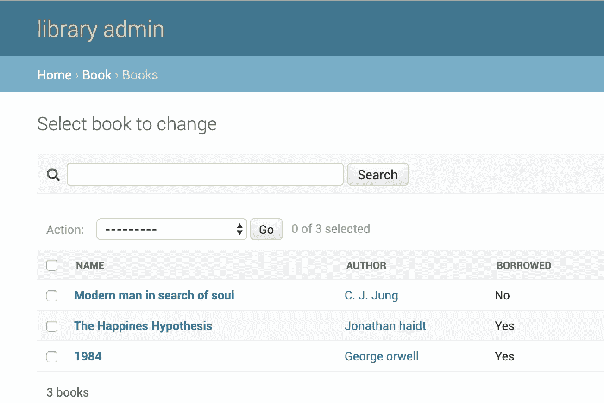

# 如何在 Django Admin 中自动注册所有型号？

> 原文：<https://medium.com/hackernoon/automatically-register-all-models-in-django-admin-django-tips-481382cf75e5>

内置的[管理界面](https://docs.djangoproject.com/en/1.11/ref/contrib/admin/)是 Django 最强大的&流行特性之一。一旦我们创建了模型，我们需要向管理界面注册它们，以便它可以读取元数据并为它填充界面。

如果 Django 项目有太多的模型，或者如果它有一个遗留数据库，那么将所有这些模型添加到 admin 中就变成了一项单调乏味的任务。为了自动化这个过程，我们可以以编程方式获取项目中的所有模型，并在管理界面中注册它们。

打开 admin.py 文件并将此代码添加到其中。

```
from django.apps import apps

models = apps.get_models()

for model in models:
    admin.site.register(model)
```

这将获取所有应用程序中的所有模型，并在管理界面中注册它们。

如果我们自动注册所有的模型，这就很好了。然而，如果我们单独注册一些定制的模型，并试图再次注册我们应用程序中的所有模型，将会出现冲突，因为 Django 不允许注册同一个模型两次。

因此，我们需要确保这段代码运行在`admin.py`文件的末尾，它应该忽略已经注册的模型。我们可以将这段代码添加到 admin.py 文件的末尾。

```
from django.apps import appsfrom book.models import Book class BookAdmin(admin.ModelAdmin):
    list_display = ('name', 'author')*# model registered with custom admin
admin.site.register(Book, BookAdmin)*# all other models
models = apps.get_models()

for model in models:
    try:
        admin.site.register(model)
    except admin.sites.AlreadyRegistered:
        pass
```

现在，手动注册的模型将首先注册，然后自动注册剩余的模型。

```
**class** Book(models.Model):
    name = models.CharField***(***max_length=100***)*** author = models.ForeignKey***(***Author, null=True***)*** borrowed = models.CharField***(***max_length=100, default=**''*)* def** __str__(self):
        **return** self.name
```

如果我们去一个管理模型页面，自动注册的模型只会显示这样一列。



django-admin

对于想要查看数据的用户来说，这个界面并不提供信息。为了改进这一点，我们可以创建一个`ListAdminMixin`，它将用模型中的所有字段填充`list_display`。

我们可以创建一个新的管理类，它将子类化`ListAdminMixin` & `ModelAdmin`。我们可以在注册模型时使用这个 admin 类，这样模型中的所有字段都会显示在 admin 中。

```
from django.apps import apps
from django.contrib import admin

class ListAdminMixin(object):
    def __init__(self, model, admin_site):
        self.list_display = [field.name for field in model._meta.fields]
        super(ListAdminMixin, self).__init__(model, admin_site)

models = apps.get_models()
for model in models:
    admin_class = type('AdminClass', (ListAdminMixin, admin.ModelAdmin), {})
    try:
        admin.site.register(model, admin_class)
    except admin.sites.AlreadyRegistered:
        pass
```

现在，每当我们创建一个新的模型或添加一个新的字段到一个现有的模型，它会自动反映在管理。



这样，每当模型被添加到我们的应用程序时，我们可以避免向管理员注册模型。

— — — — — — — — — — — — — — — — — — — — — — — — — — — — — -

*原载于 2017 年 11 月 24 日*[*https://avilpage.com*](https://avilpage.com/2017/11/django-tricks-auto-register-models-admin.html)*。*

更多 Django 小贴士和技巧在[https://avilpage.com/tags/django.html](https://avilpage.com/tags/django.html)