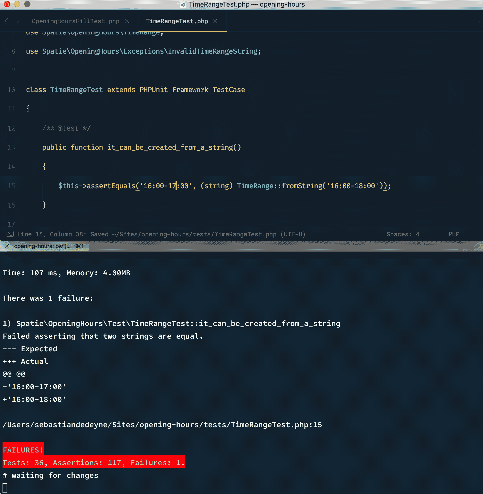

# 用 Watchman 自动运行 PHPUnit

> 原文：<https://medium.com/hackernoon/automatically-running-phpunit-with-watchman-e02757e733e7>

## 一个小的 bash 脚本，用于在文件被更改时运行测试



如果你只是想要一个 *tl:dr* ，这里有一个脚本，你可以把它放入你正在使用的任何`.bashrc`文件中——解释如下。

`pw`函数通过调用`phpunit tests`运行一次测试，监视`src`和`tests`中的每个 [php](https://hackernoon.com/tagged/php) 文件，并在被监视的文件发生变化时再次运行测试。

您可以在`pw`后指定任何 [PHPUnit](https://hackernoon.com/tagged/phpunit) 参数，例如`pw ./tests/Unit/FooTest.php`或`pw --filter test_true_is_true`。

这个脚本使用了脸书的 [Watchman](https://facebook.github.io/watchman/) 库，在 OSX，可以通过[自制软件](https://brew.sh/)安装。

```
brew install watchman
```

Watchman 监视文件，并在文件发生变化时触发操作。选择 Watchman 的理由是:它易于安装，配置简单，并且可靠。

Watchman 附带的`watchman-make`命令是 Watchman 调用构建工具来响应文件更改的专用接口，这正是我们所需要的！

让我们一行一行地回顾一下我们的手表功能。

```
function pw { }
```

函数名决定命令名。我喜欢简短的命令——PHPUnit 在我的机器上别名为`p`——所以一个缩写版本的`phpunit-watch`似乎很合适。

```
run="clear && printf '\e[3J' && vendor/bin/phpunit"
```

因为我们将需要实际的“运行”命令两次，所以让我们将它存储在一个变量中。为了进一步分解它，`clear && printf ‘\e[3J’`清除终端(以防止之前的测试运行扰乱它)，然后`vendor/bin/phpunit`运行测试。

```
[[ -n $@ ]] && args=$@ || args="tests"
```

`watchman-make` **需要**参数才能工作。(我很想在这里被证明是错的，这样我就可以清理这个部分了！)我们将默认 tests 的参数，这意味着我们将运行的实际命令是`vendor/bin/phpunit tests`。如果我们给`pw`提供任何参数，它们将替换`test`，例如`pw —-stop-on-failure`将运行`vendor/bin/phpunit —-stop-on-failure`。

接下来的两个命令将所有内容集合在一起。

```
eval "$run $args"
```

观看前手动触发一次命令。这样我们可以立即看到测试结果，而不必先改变文件。

```
watchman-make \
    -p 'src/**/*.php' 'tests/**/*.php' \
    --make=$run \
    -t "$args"
```

最后，守夜人的时间到了！`-p`参数指定了我们想要监视的文件夹。我个人建立了更多像`app/**/*.php`和`database/**/*.php`这样的 globs，因为我主要是和 Laravel 一起工作。`--make`指定我们将在变更时运行哪个命令，`-t`将传递额外的参数给`--make`命令(记住，我们默认的变量是`tests`)。

我仍然梦想着为 PHPUnit 开发一个类似于 [Jest](https://facebook.github.io/jest/) 的 CLI 工具，它还允许您过滤和重新运行特定的测试，而无需中断监视功能，但是能够在变化时运行测试已经是一个巨大的工作流程提升。

总结一下，下面是完整的`pw`函数:

*这篇文章基于乔纳森·纳普的* [*一篇咖啡和代码文章*](http://blog.coffeeandcode.com/running-tests-automatically-with-watchman/) *。*

[](http://bit.ly/HackernoonFB)[](https://goo.gl/k7XYbx)[](https://goo.gl/4ofytp)

> [黑客中午](http://bit.ly/Hackernoon)是黑客如何开始他们的下午。我们是 T21 家庭的一员。我们现在[接受投稿](http://bit.ly/hackernoonsubmission)并乐意[讨论广告&赞助](mailto:partners@amipublications.com)机会。
> 
> 如果你喜欢这个故事，我们推荐你阅读我们的[最新科技故事](http://bit.ly/hackernoonlatestt)和[趋势科技故事](https://hackernoon.com/trending)。直到下一次，不要把世界的现实想当然！

