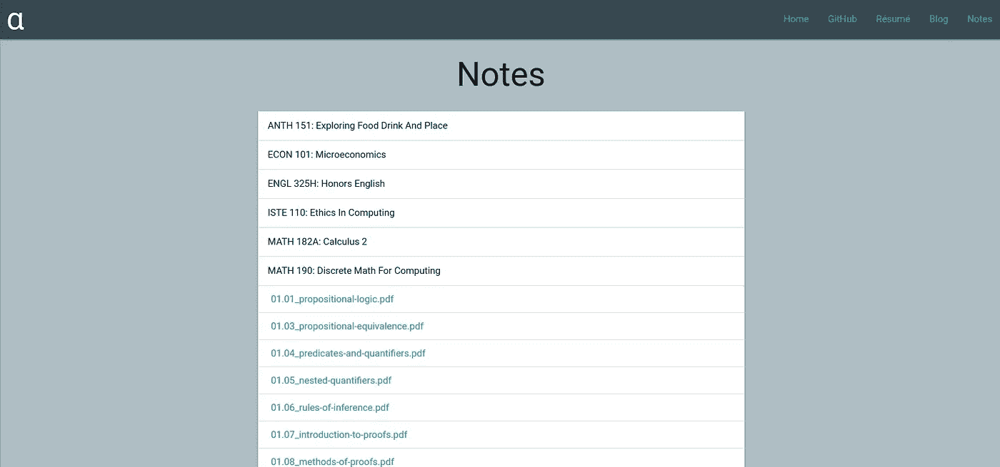
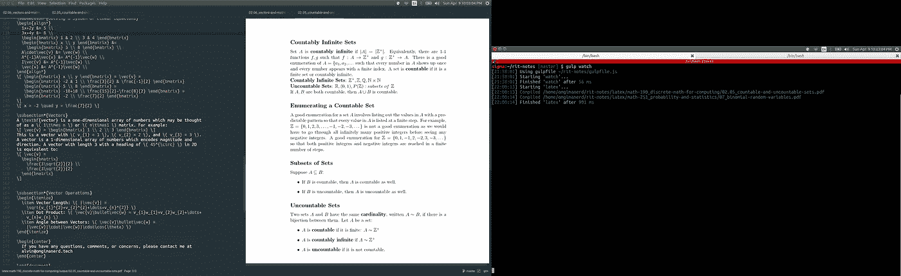
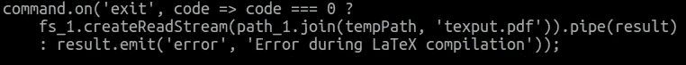
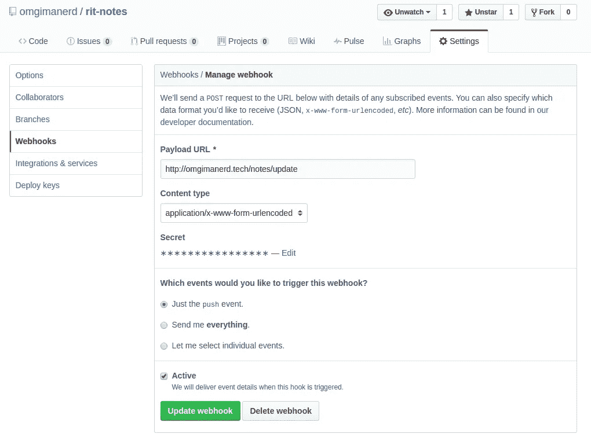

# 自动化我的个人笔记编辑系统

> 原文：<https://medium.com/hackernoon/automating-my-personal-note-taking-compilation-system-415696705657>

罗彻斯特理工学院(RIT)拥有世界上最大的聋人群体之一 NTID(国家聋人技术学院)和重听学生。因此，有无数的服务可用，如字幕，手语翻译和笔记。作为 RIT 的一名学生，我在一些课上做 NTID 笔记。一般来说，我会做笔记，并将 NTID 特有的笔记上传到 RIT 笔记网站，但我也会将所有笔记上传到我的个人网站，这样如果我需要学习的话，我就可以在任何地方访问它们。



A snapshot of the [webpage to access my personal notes](http://omgimanerd.tech/notes).

我用 LaTeX 排版系统做笔记，所以笔记需要通过 pdflatex 命令编译成 PDF。这对我来说有点烦人，因为我每次更新笔记时都需要 SSH 到托管我网站的服务器，以便重新编译它们。因为我是程序员，所以我很懒，不想那么做。让我们自动化这个过程。在这次技术演讲中，我将讨论我是如何做到的。

## 我的工作流程

我把笔记存储在 GitHub 上的一个[独立存储库](https://github.com/omgimanerd/rit-notes)中。我使用一个 [gulpfile](https://github.com/omgimanerd/rit-notes/blob/master/gulpfile.js) 在课堂上记笔记时自动重新编译笔记，这样我就可以使用 Atom 的 [pdf-view 包](https://atom.io/packages/pdf-view)实时查看 [Atom](http://atom.io) (我选择的文本编辑器)中的更新。这是该工作流程的截图。



My note-taking workflow

这对我很有用，因为每次保存文档时，我都能看到我的笔记实时更新。

## 编写我自己的 Gulp 插件

以前，我使用 makefile 来编译。因为我只想编译修改过的文件。我从 gulpfile 中调用 make 命令，这样每当我保存文件时，我就可以使用 gulp 的文件观察器自动完成这项工作，但这被证明是令人费解和过于做作的。在我写这篇文章的时候，我意识到使用 gulpfile 来调用 makefile 进行编译。tex 文件转换成 PDF 文件是愚蠢的。我决定取出 makefile，让编译和更改监控完全在 gulpfile 中完成。

经过一番搜索，我找到了两个现有的 gulp 插件来编译 LaTeX:[gulp-LaTeX](https://www.npmjs.com/package/gulp-latex)和 [gulp-pdflatex](https://www.npmjs.com/package/gulp-pdflatex) 。第一个，gulp-latex，对我来说莫名其妙地出错了，在摆弄了几天它的选项后，我放弃了调试。我试了试 [gulp-pdflatex](https://www.npmjs.com/package/gulp-pdflatex) ，它的效果出奇的好，只要我的。tex 文件没有任何语法错误。

看了一下源代码，发现 [gulp-pdflatex](https://www.npmjs.com/package/gulp-pdflatex) 是依靠一个名为 [node-pdflatex](https://www.npmjs.com/package/node-pdflatex) 的包来做编译的。两个包都是由[同一个作者](https://github.com/kube/)写的。该包似乎没有返回错误数据，而是选择在编译失败时发出“LaTeX 编译期间出错”的消息。



A snippet of the compiled code for [node-pdflatex](https://github.com/kube/node-pdflatex), which was natively written in TypeScript.

该死的。

当。tex 文件没有语法错误，但是如果有语法错误，它提供的信息就不多了。来编译。tex 文件，包在使用 [child_process](https://nodejs.org/api/child_process.html) 节点模块的子流程中调用 pdflatex 命令。它将 pdflatex 输出的文件存储在临时目录中，然后返回包含输出的 PDF 文件内容的 Stream 或 Buffer 对象。

这相对容易逆向工程，所以我为我的笔记记录系统编写了自己版本的 gulp-pdflatex ,添加了将 pdflatex 的 stdout 和 stderr 附加到错误中的功能。我没有将功能分成两个包，而是将它合并成一个包，并作为一个名为 [gulp-pdflatex2](https://www.npmjs.com/package/gulp-pdflatex2) 的 gulp 插件发布。回想起来，我可能应该分叉 [gulp-pdflatex 并发送一个 pull 请求](http://github.com/kube/gulp-pdflatex)。\_(ツ)_/

至于只编译修改过的文件，这很容易用 [gulp-changed](https://www.npmjs.com/package/gulp-changed) 插件完成。

## 在我的网站上自动编译

我通过将我的[笔记库](http://github.com/omgimanerd/rit-notes)克隆到我网站的静态文件夹中，在我的网站上显示了我的笔记。我只需要一种方法来自动拉取和调用 [gulpfile 的](https://github.com/omgimanerd/rit-notes/blob/master/gulpfile.js)编译任务。

GitHub 有一个被称为 [webhook](https://developer.github.com/webhooks/) 的特性，它允许外部服务检测何时发生了诸如推送到存储库之类的事件。我在我的 [notes repository](http://github.com/omgimanerd/rit-notes) 上设置了一个 webhook 来检测我何时向它推送更新，这样它就可以在更新发生时向我的[个人网站](http://omgimanerd.tech)发送 POST 请求。



The webhook management page for my [notes repository](http://github.com/omgimanerd/rit-notes).

现在，我只需要在我的 web 服务器上安装一个处理程序。为了[认证来自 GitHub 的 webhook](https://developer.github.com/webhooks/securing/) 的请求，您需要使用一个双方都知道的秘密令牌为请求计算一个散列。

上面的代码片段 auth_route.js 是一个计算请求散列的中间件。底部的代码片段 router.js 将两者进行比较，并调用命令:

```
git pull
gulp clean
gulp latex
```

这将提取我对 [notes 存储库](http://github.com/omgimanerd/rit-notes)所做的任何更改，清除日志文件和无关文件，并重新编译任何更改的文件。这里有一个到 notes 存储库中 gulpfile 的[链接](https://github.com/omgimanerd/rit-notes/blob/master/gulpfile.js)来查看每个 gulp 任务的细节。

就是这样！我的个人网站现在会在我每次更新 LaTeX 笔记时提取并重新编译它们。

我目前只有这些了。感谢阅读！如果你有更好的方法或者任何改进的想法，请留下回复，如果你喜欢这篇文章，请点击下面的❤按钮:)

在推特上关注我: [@omgimanerd](http://twitter.com/omgimanerd)

[](http://bit.ly/HackernoonFB)[](https://goo.gl/k7XYbx)[](https://goo.gl/4ofytp)

> [黑客中午](http://bit.ly/Hackernoon)是黑客如何开始他们的下午。我们是 [@AMI](http://bit.ly/atAMIatAMI) 家庭的一员。我们现在[接受投稿](http://bit.ly/hackernoonsubmission)，并乐意[讨论广告&赞助](mailto:partners@amipublications.com)机会。
> 
> 如果你喜欢这个故事，我们推荐你阅读我们的[最新科技故事](http://bit.ly/hackernoonlatestt)和[趋势科技故事](https://hackernoon.com/trending)。直到下一次，不要把世界的现实想当然！

