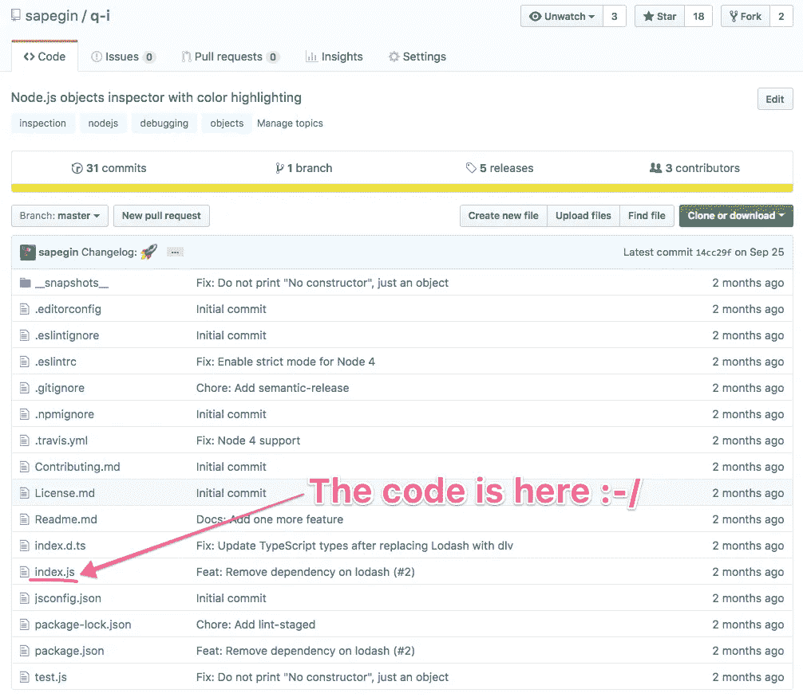
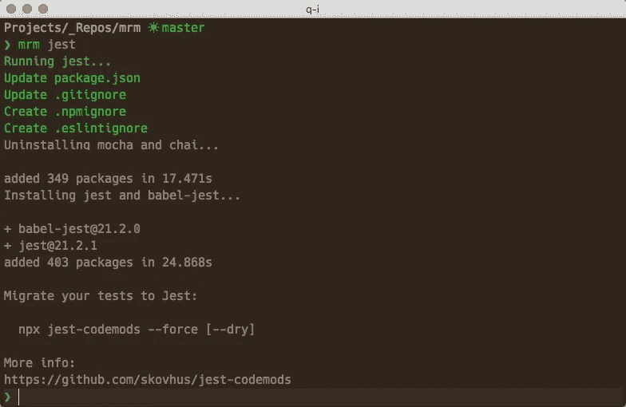
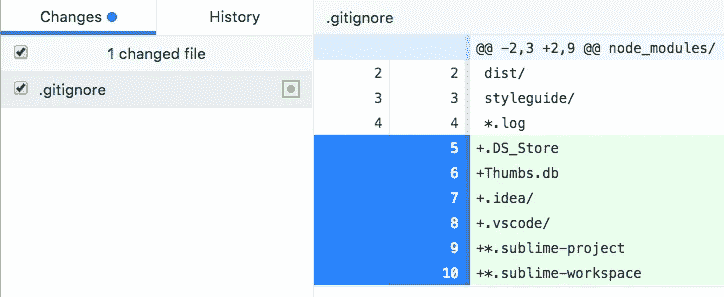

# 使用 Mrm 自动化开源项目配置

> 原文：<https://medium.com/hackernoon/automating-open-source-project-configuration-with-mrm-7f67fd55a9b0>

我们使用许多工具，比如 linters、test runners 和持续集成，让我们作为开发人员的生活变得更加轻松。但是维护这些工具的配置并不容易，尤其是如果您希望所有项目中的配置都是最新的。 [Mrm](https://github.com/sapegin/mrm) 试图解决这个问题。


*Slightly different files. Photo by* [yours truly](http://morning.photos/albums/travel/2009-09-17-0908).

## 有什么问题吗

唯一多次阻止我将一些通用函数提取到一个单独的包中的是需要复制和修改十几个配置文件——所有这些——仅仅是为了发布一个 50 行的函数。



在你所有的项目中，这些支持文件通常只是*略有不同*。例如，一个`.gitignore`文件有`node_modules`和编辑器工件，您希望在所有项目之间共享，但是有些项目有额外的行，您不希望在其他项目中出现。我们需要一种方法来保持同步的共同部分，但允许每个项目的定制。

基于模板的工具，比如 Yeoman，对于初始的项目引导是很好的，但是对于更新就不太好了:它们会用新的版本覆盖一个文件，并且你会丢失你的定制。

## 什么是 Mrm

Mrm 采取了不同的方法。它的工作方式类似于 [codemods](https://www.sitepoint.com/getting-started-with-codemods/) :你用代码描述如何*修改*或创建文件以达到文件的期望状态，而不是覆盖一切的模板。

## 最小的变化

Mrm 试图通过推断缩进样式或从 EditorConfig 中读取，并在 JSON 文件中保留注释来做最小的更改。

## 最低配置

它只需要很少的配置:它将使用来自项目本身或环境的值，比如从 Git 或 npm 配置中读取您的姓名和电子邮件。

## 专注但丰富的 API

Mrm 有一些实用程序可以处理流行的配置文件格式:JSON、YAML、INI 和新行分隔的文本文件；安装 npm 软件包；和文件操作。

这允许您创建智能*任务*，因此结果取决于您的项目需求。

## 可用任务

Mrm 有许多现成的任务:CodeCov、EditorConfig、ESLint。gitignore、Jest、lint-staged、appeller、semantic-release、React Styleguidist、stylelint、Travis CI、TypeScript、package.json、投稿指南、许可证和自述文件。您可以创建自己的任务或使用别名合并多个任务。

例如，[玩笑任务](https://github.com/sapegin/mrm-tasks/tree/master/packages/mrm-task-jest):

*   添加 npm 脚本以运行 Jest
*   如果需要，向`package.json`添加配置；
*   用常用模式更新`.gitignore`、`.npmignore`、`.eslintignore`；
*   根据需要安装 Jest、`babel-jest`、`ts-jest`或酵素；
*   试图摆脱摩卡和 AVA 配置和依赖；
*   建议我们`jest-codemods`项目是否使用其他测试框架。



或者 [gitignore 任务](https://github.com/sapegin/mrm-tasks/tree/master/packages/mrm-task-gitignore)，它将向`.gitignore`文件添加新行，但不会删除每个项目的定制:



## 安装和使用

从 npm 安装 Mrm:

```
npm install -g mrm
```

像这样跑:

```
mrm gitignore
mrm license --config:licenseFile LICENSE
```

或者在不安装的情况下通过 [npx](/@maybekatz/introducing-npx-an-npm-package-runner-55f7d4bd282b) 运行 Mrm:

```
npx mrm gitignore
npx mrm license --config:licenseFile LICENSE
```

可选地，在`~/.mrm/config.json`或`~/dotfiles/mrm/config.json`创建一个配置文件，而不是通过命令行传递值:

```
{
  "github": "sapegin",
  "eslintPreset": "airbnb",
  "aliases": {
    // Aliases to run multiple tasks at once
    "node": ["license", "readme", "editorconfig", "gitignore"]
  }
}
```

在文档中查看更多使用示例和选项[。](https://github.com/sapegin/mrm#usage)

## 创建您自己的任务

Mrm 的真正强大之处在于定制任务和[Mrm-核心库](https://github.com/sapegin/mrm-core)，它为您提供了处理配置文件、依赖项、文件操作等的工具。

最简单的任务可能是这样的:

```
// Mrm module to work with new line separated text files
const { lines } = require('mrm-core');

function task() {
  // Read .gitignore if it exists
  lines('.gitignore')
    // Add lines that do not exist in a file yet,
    // but keep all existing lines
    .add(['node_modules/', '.DS_Store'])
    // Update or create a file
    .save();
}

task.description = 'Adds .gitignore';
module.exports = task;
```

参见文档中的更多示例[。](https://github.com/sapegin/mrm#writing-your-own-tasks)

您可以将您的任务保存在本地，[发布到 npm](https://github.com/sapegin/mrm#sharing-tasks-via-npm) 上，或者将多个任务[合并到一个预置](https://github.com/sapegin/mrm#custom-presets)中。

## 结论

如果您有许多具有相似堆栈的项目或者一个大的多存储库项目，Mrm 可能是管理它们的配置的好方法，并且可以节省您的时间。

从默认任务开始，然后为您的项目或组织编写自己的任务或创建预设。

这个项目还很年轻——让我知道你在评论或 GitHub 问题上的想法。

另外，看看我们关于 [JavaScript 项目维护](https://survivejs.com/maintenance/)的新书。

*感谢* [*安娜·热鲁斯*](https://medium.com/u/82815f6b43dc?source=post_page-----7f67fd55a9b0--------------------------------)*[*卡尔·霍基*](https://medium.com/u/4a0f6a534c55?source=post_page-----7f67fd55a9b0--------------------------------)*[*安德烈·奥科涅奇尼科夫*](https://medium.com/u/5829a67c85f9?source=post_page-----7f67fd55a9b0--------------------------------)*[*奥列格·斯洛博德斯科伊*](https://medium.com/u/7c635fc6907?source=post_page-----7f67fd55a9b0--------------------------------) *、奥尔加·西连科、* [*尤霍·韦普斯莱宁*](https://medium.com/u/a82419fa03ca?source=post_page-----7f67fd55a9b0--------------------------------)***