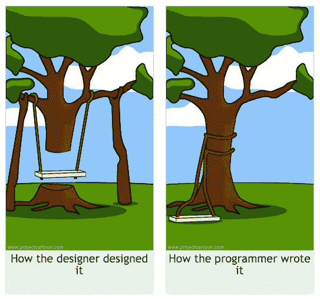
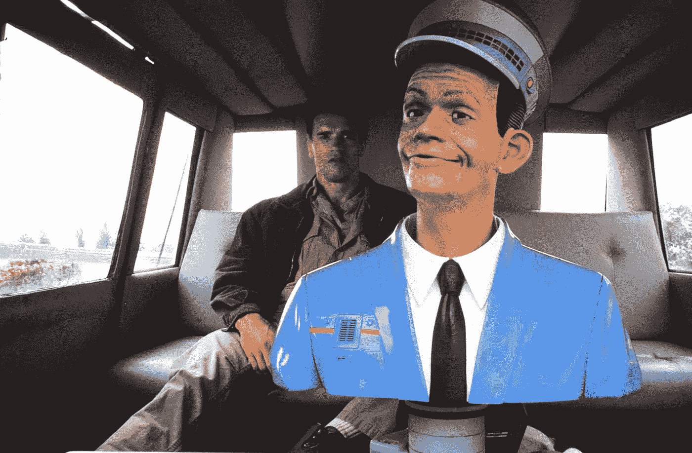

# 自动化将终结前端开发

> 原文：<https://medium.com/hackernoon/automation-will-end-front-end-development-30d5663cae80>

> “一切可以自动化的东西都会自动化”——祖博夫定律

# 自动提高我的平均绩点

在本古里安大学的计算机科学项目中，你可以通过选修一门课程来获得积分。有些课程被认为比其他课程容易，其中有一门被认为是最容易的——数学史。你要做的不是解方程，而是学习一点历史。小菜一碟，提高绩点的简单方法。问题是，既然这门课如此简单，它也是最受欢迎的。

当标志着课程注册期开始的铃声响起时，数百名学生正疯狂地敲击键盘，登录系统，抢到他们能得到的最简单的课程，即作为圣杯的数学史。

与 HFT 的贸易公司类似，那些真正坚持不懈的人会找到一台离大学服务器最近的大学计算机，让他们的注册请求比其他任何人都先到。

[This guy got in](http://www.varchevbrokers.com/13-characteristics-of-a-successful-trader/?lang=en)

毫无疑问，我没有幸运地进入数学史。但是还有希望。接下来的 2 周是所谓的“改变期”，如果学生发现有空位或者需要取消他们的位置，他们可以改变他们的课程。

在那段时间里，只要你有时间，你就会登录，查看是否有人放弃了他们的数学史或者你想要的任何课程。

我突然想到，我可以写一个脚本，当我点击鼠标和键盘时，它将发送与我的浏览器相同的网络流量。

几个小时后，**补丁出现在**。

[The fix was in.](http://splitsider.com/2012/03/listening-to-the-dvd-commentary-for-community-contemporary-american-poultry/)

当我开始一天的工作时，程序会每隔**秒**持续轮询课程注册系统。

在我收到一封电子邮件后不久，我的项目成功地让我注册了数学史！

Success!

在我对 6(！)我的朋友的消息传出去了。当一位助教给我发电子邮件，向我要这个项目时，我想我完了。原来他只是想给他妻子用。

第二年，我的朋友们，他们还是学生，收到了来自管理部门的电子邮件，从那一年开始，在线课程注册需要输入验证码。很高兴我能对本古里安大学的信息技术系有所帮助。

# 经历严重的低效率

一年后，我成为了一名软件工程师。我参与了许多项目——移动应用、网站，主要是消费软件。

这个过程是，一旦 UI 设计准备好了，我就会得到设计的模型和组成它的资产。然后开始基于实体模型编写 UI 的过程，接着是我和设计师之间乏味的来回，直到设计师满意或者交付时间到了，无论哪种情况先出现。

[http://www.projectcartoon.com/](http://www.projectcartoon.com/)

这个过程没有任何创造性。设计已经决定了，我所要做的就是左右推动像素，直到它们与给我的静态照片相匹配。这可不是编程的乐趣所在。

我喜欢编程。我喜欢用创造性的方式解决问题。我不太喜欢阅读像素形式的一组指令并遵循它们。

# 未来的一瞥

现在是 2017 年，设计师分发模型，工程师咕哝和推动像素的过程与当时完全一样，与 20 年前也是一样。

现在我想让你想象一下:

现在是 2020 年。无人驾驶汽车正在街道上漫游。你过去在公路旅行中停下来加油时看到的“禁止空转”的标志不见了。卡车不再停在这些中转站。卡车是完全自动的，没有司机需要休息。

[Photo credit](http://www.emedco.com/signs/parking-signs/no-idle-zones.html?limit=all)

在那个时候，基于模型编写代码也应该成为过去。人类软件工程师仍将有大量的前端工作要做，但这将是创造性的工作。所有的日常工作都将由自动化软件来完成。

大家都会开心。设计师们将在瞬间看到他们像素完美的设计变成现实，工程师们将致力于机器可能永远做不到的事情——创造性。

[Photo credit](https://www.forbes.com/sites/timworstall/2016/11/11/its-president-trump-now-sure-is-and-coal-mining-jobs-are-still-not-coming-back-to-appalachia/#526c4b296838)

在未来，我设想我们不会看到前端工程师举着标语要求重新工作。

# 未来已经开始

事实上，我与[阿维谢·科恩](https://medium.com/u/ec4661591a3a?source=post_page-----30d5663cae80--------------------------------)和[迈克尔·科恩](https://medium.com/u/205b3cd8859f?source=post_page-----30d5663cae80--------------------------------)共同创立的[创业公司](https://hackernoon.com/tagged/startup)正在这么做。

在过去的 6 个月里，我们已经发布了[工具](/sketch-app-sources/introducing-auto-layout-for-sketch-24e7b5d068f9)和[工具](/sketch-app-sources/auto-layout-introducing-stacks-flexbox-for-sketch-c8a11422c7b5)，让设计师能够更好地表达他们的设计。我们把静态设计变成了动态设计。作为用我们的工具表达设计的副作用，我们可以控制输出的样子。能够控制输出意味着我们可以用它作为我们的自动化机器的输入，来输出真正的代码。

以登陆页面为例——通常非常简单，前端工程师不需要花太多时间就能构建好。但是如果他们不需要呢？如果设计师可以直接从他们的工作工具——Sketch——发布登陆页面会怎么样？工程师可以从事实际的产品吗？

有了 [Launchpad](https://www.animaapp.com/joinfree?utm_medium=blog&utm_source=or&utm_content=ef1) 你已经可以做到了。我们使设计师能够发布他们自己设计的完全功能性的网站，而不是模板化或现成的网站；不需要任何开发者。

 [## Twitter 上阿尼玛应用程序的爱之墙

### 来自 Anima App 的最新(@AnimaApp)。赋能设计师。纽约/特拉维夫

twitter.com](https://twitter.com/AnimaApp/timelines/816101989033582593) 

从完全设计到生产就绪代码自动化的旅程就在前方。我们正在为成为一名不穿帽衫的前端工程师打下基础。

[Photo credit](https://gearheads.org/5-important-things-the-movies-teach-us-about-self-driving-cars/)

*感谢您的阅读。*

如果你想加入我们的旅程，请访问:[*https://www.animaapp.com*](https://www.animaapp.com)

> [黑客中午](http://bit.ly/Hackernoon)是黑客如何开始他们的下午。我们是阿妹家庭的一员。我们现在[接受投稿](http://bit.ly/hackernoonsubmission)并乐意[讨论广告&赞助](mailto:partners@amipublications.com)机会。
> 
> 如果你喜欢这个故事，我们推荐你阅读我们的[最新科技故事](http://bit.ly/hackernoonlatestt)和[趋势科技故事](https://hackernoon.com/trending)。直到下一次，不要把世界的现实想当然！

