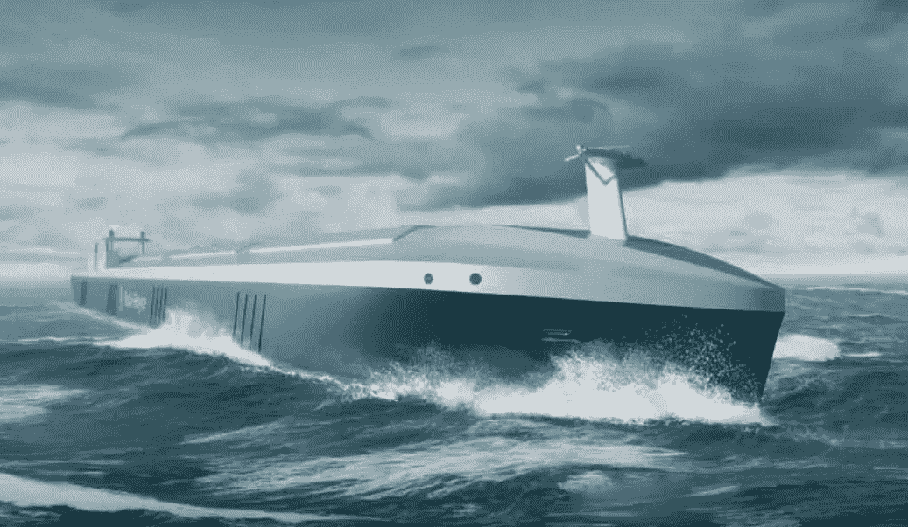
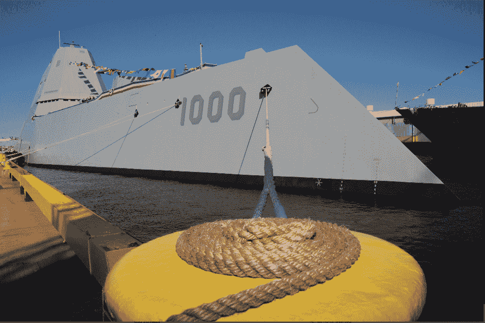
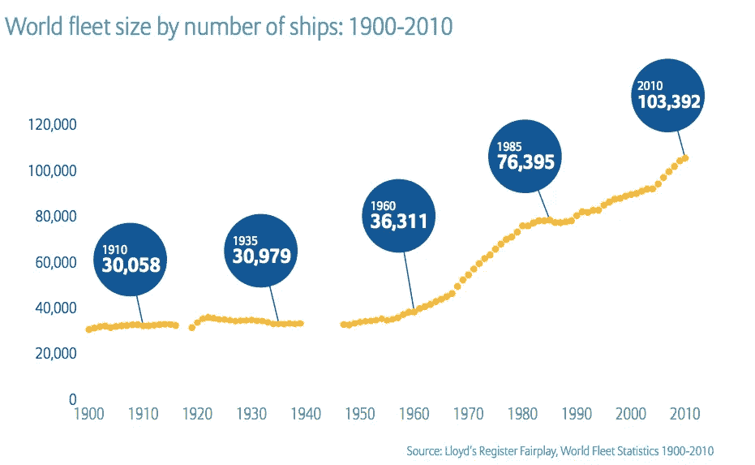
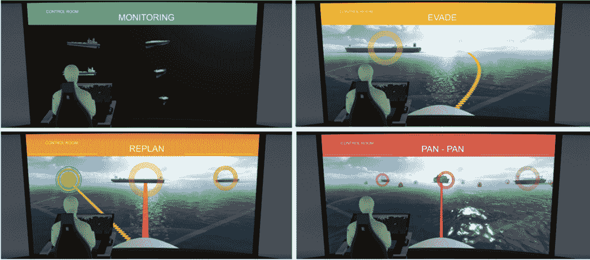
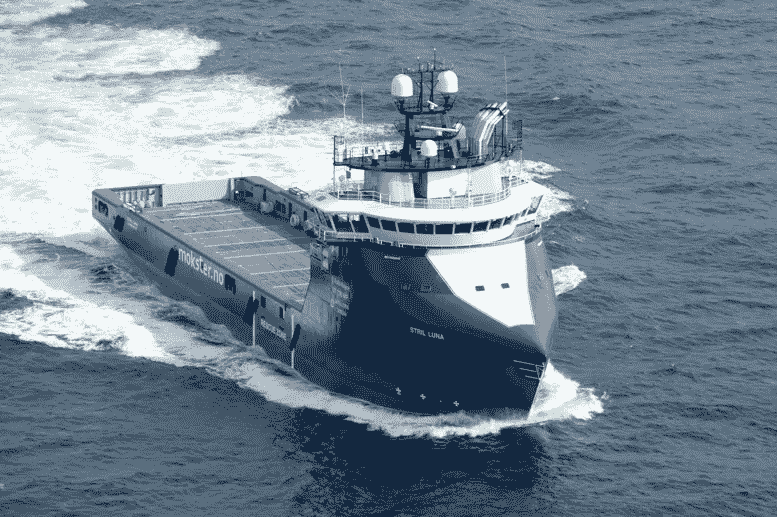
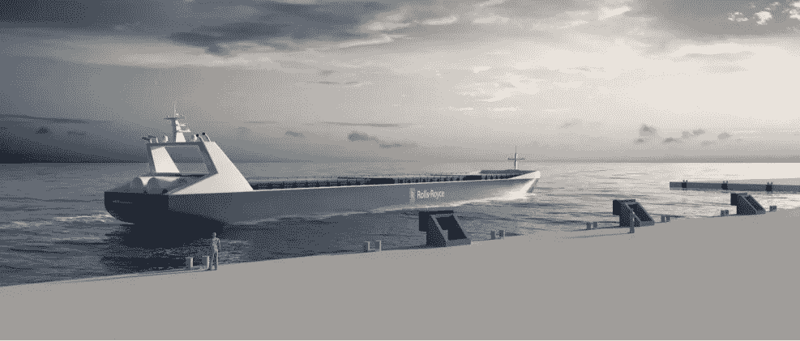

# 2020 年的自主船

> 原文：<https://medium.com/hackernoon/autonomous-boats-by-2020-7929a0d9010f>

本周，我的推特上充斥着关于一艘俄罗斯间谍船在康涅狄格州格罗顿美国海军潜艇基地数英里外的新闻。这将是一个测试海军最新武器的好时机——海洋猎人(Sea Hunter)——一种自主海洋防御系统(如下所示)。自动和手动船只交战的概念很好地隐喻了从国防到能源再到航运等行业的未来冲突。

在过去的 100 年里，海上船只交通增长了三倍。随着海洋变得越来越拥挤，从更大的利润到更高的安全性，对自主解决方案的需求越来越迫切。安联保险[报道](http://www.agcs.allianz.com/assets/PDFs/Reports/AGCS_safety_and_shipping_report.pdf)超过 75%的划船事故是人为错误造成的，通常是疲劳的结果。汽车、航空发动机和海事解决方案的领先制造商罗尔斯·罗伊斯(Rolls-Royce)估计，开放水域上的自主和遥控船只有朝一日可能会在采用速度和实用性上与陆地上的同类船只匹敌。

“自主航运是海运业的未来”,罗尔斯·罗伊斯海运部总裁 Mikael Makinen 在公司发布的[白皮书中说道。“像智能手机一样具有颠覆性，智能船将彻底改变船舶设计和运营的格局。”](http://www.rolls-royce.com/products-and-services/marine/services/ship-intelligence/remote-and-autonomous-operations.aspx)

虽然在过去的我们已经讨论了自主海洋领域的许多新贵，但罗尔斯·罗伊斯现在正通过其全球研究项目[高级自主水上应用](http://www.rolls-royce.com/~/media/Files/R/Rolls-Royce/documents/customers/marine/ship-intel/aawa-whitepaper-210616.pdf) (AAWA)引领行业，在十年内交付完全自主的运输船舶。AAWA 奋进号汇集了欧盟的 [MUNIN](http://www.unmanned-ship.org/munin/about/) (通过网络智能实现海上无人导航)； [DNV GL](https://www.dnvgl.com/) ，以及中国海事局& [武汉理工大学](http://english.whut.edu.cn/)。每个国家集团都带来了自己的专业知识，以评估将完全自主的航运变为商业现实的各种要求，包括:软件(导航、防撞、船外通信)、认证(法律、责任&保险)和社会变革(劳工&业务)。这项研究的一大驱动力是来自航运业的外部压力，包括来自海盗的威胁、货物需求的增加和熟练劳动力的减少。

罗尔斯·罗伊斯负责海洋创新的副总裁 Oskar Levander 对该项目非常乐观，“这正在发生。不是如果，是什么时候。”他解释说，“制造远程和自主船只所需的技术已经存在。AAWA 项目正在芬兰的一系列操作和气候条件下测试传感器阵列，并创建了一个模拟自主船舶控制系统，该系统允许探索整个通信系统的行为。到 2020 年，我们将看到遥控船投入商业使用。”

Levander 的团队正在集成一个完整的情境感知系统，该系统结合了安装在底特律和硅谷自动驾驶汽车上的传感器，如红外摄像机、激光雷达和其他雷达组件。AAWA 小组正在探索利用传感器数据集的两种指挥选择:1)由人类船长领导的远程操作中心；和/或 2)机载计算机/深度学习网络。无论是哪种情况，人类遥控指挥器或其自主导航系统都会利用来自卫星、天气预报、无线电广播和其他船对船报告的其他情况输入。计算机辅助系统的想法并不新鲜，几十年来，船员们已经将电子辅助作为他们日常活动的一部分。已经先进的系统规划路线，协助决策，并监控船舶的机器，以确保关键功能以最佳性能运行。

与陆地交通工具不同，海洋通信受到了水上不稳定宽带通信的阻碍。然而，在 2015 年 8 月， [Inmarsat](http://www.inmarsat.com/) 发射了第三颗全球 Xpress 卫星，几乎可以在世界任何地方提供宽带数据。这对于在海上航行的“无人审查”船只的概念来说是一个游戏规则的改变者。这也意味着来自网络犯罪的风险已经上升到一个新的威胁水平。

罗尔斯·罗伊斯高级副总裁杰伊·麦克法登承认，仍有问题需要解决。"我们还没有处理各种情况的完美方法。"

尽管罗尔斯·罗伊斯一直在制造行业新闻，但它尚未发布完全自主的船只。最接近它的是其“统一桥梁”技术，该技术于 2014 年 8 月在*号宇宙飞船*上展示(见上图)。此后，劳斯莱斯统一驾驶台系统被纳入拖船、巨型游艇、极地考察船和新型游轮。虽然有许多相互竞争的标准，但几乎每个人都同意“机器人幽灵船”需要由大学、船舶设计师、设备制造商、船级社和政府组成的联盟参与。

挪威海事局和挪威海岸管理局已经签署了一项协议，允许自主船只在特隆赫姆峡湾进行海试。与此同时，在芬兰，一个名为芬兰海洋工业的协会、交通和通信部以及 Tekes(芬兰创新资助机构)已经加入了劳斯莱斯和其他公司，在波罗的海开发和探索自主海洋运输。罗尔斯·罗伊斯公司计划在未来三年内推出其第一艘完全自主的船只，并估计到 2015 年它将在公海上司空见惯。

相关消息，福特汽车公司(Ford Motor Co .)上周以 10 亿美元收购了人工智能初创公司 Argo AI50%的股权，以增强其自动驾驶汽车技术。海运业的问题是，这些类型的投资何时会掀起波澜。为了探索这个问题以及它在更大的社会中可能产生的影响，来参加我们的下一个 [#RobotLabNYC](https://twitter.com/hashtag/robotlabnyc?src=hash) 活动，[机器人的社会影响](https://www.meetup.com/RobotLab/events/236268546/)，3 月 2 日下午 6 点。

> [黑客中午](http://bit.ly/Hackernoon)是黑客如何开始他们的下午。我们是 [@AMI](http://bit.ly/atAMIatAMI) 家庭的一员。我们现在[接受投稿](http://bit.ly/hackernoonsubmission)并乐意[讨论广告&赞助](mailto:partners@amipublications.com)机会。
> 
> 如果你喜欢这个故事，我们推荐你阅读我们的[最新科技故事](http://bit.ly/hackernoonlatestt)和[趋势科技故事](https://hackernoon.com/trending)。直到下一次，不要把世界的现实想当然！

