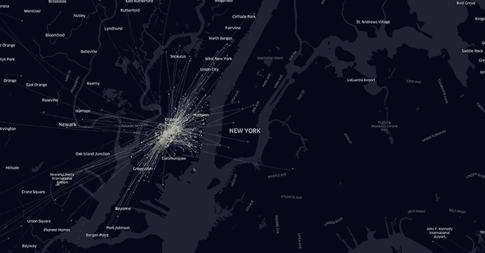
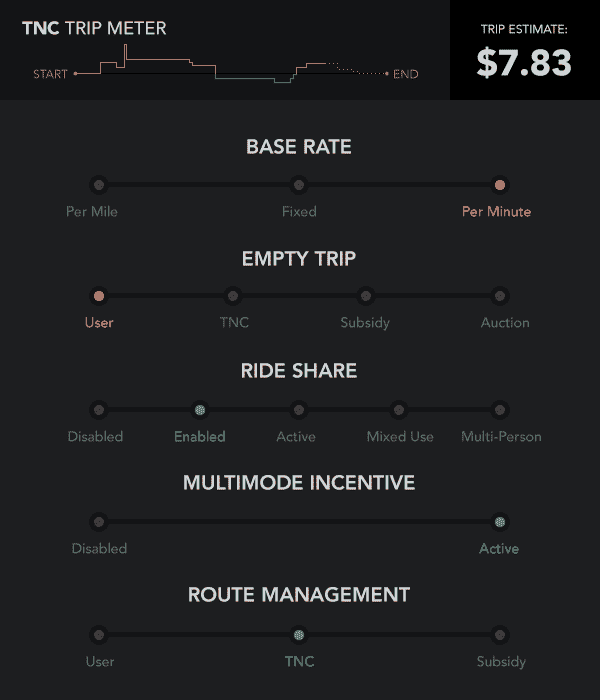
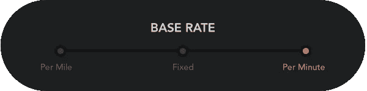
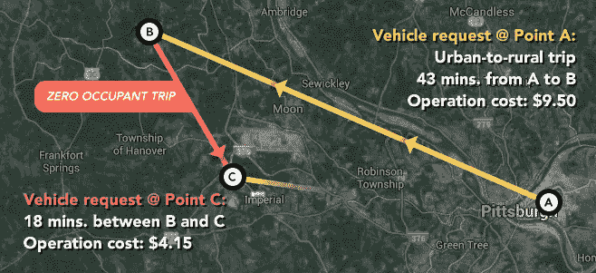

# 自动汽车定价将把你的城镇变成一个科学实验

> 原文：<https://medium.com/hackernoon/autonomous-car-pricing-will-turn-your-town-into-a-science-experiment-a7b797734df6>

在共享自动驾驶汽车驱动的未来，交通成为一种公用事业。这个游戏的名字是效率——你为你使用的东西和你如何使用它付费。没有汽车所有权，没有汽车保险，没有维护，没有汽油，没有车道或车库…你支付了从 A 到 B 的费用，当你下车时，你已经洗手不干了。

但是所有这些都是有成本的，所以这一定意味着其他人在掏钱，对吗？就像优步和 Lyft 这样的现代拼车服务(被称为交通网络公司，或跨国公司)而言，燃料、汽车维护和司机费用等固定成本都包含在你的车费中，而没有具体列出这些费用。有基本票价、预订费、每分钟和每英里费率。除了激增定价外，跨国公司以一种相当不透明的方式限制它们的定价模式。

假设你喜欢这样。知道你的车费中有多少进入了司机的口袋或用于燃料支出是不必要的信息，按需运输的部分便利是这样一个事实，即这是其他一些笨蛋的工作。

很公平。但是想象一下，一个完整的公交网络通过按需共享的资源运行。然后想象管理它的实体可能包括联邦和地方政府、汽车制造商、电信和媒体集团、谷歌、亚马逊等。仅仅是调整你的票价就可以支付一座新桥的税款，或者奖励你在旅途中购买的产品，或者[为美国公民自由联盟](http://thehill.com/blogs/blog-briefing-room/news/316729-lyft-will-donate-1-million-to-aclu-after-trump-immigration-ban)捐款。这就是我们通常作为立法机关起草、通过警察强制执行或教育公众的想法；在这种情况下，你会想知道你的钱去了哪里，对吗？

让我们找出答案。

在任何给定的时刻，未来的交通网格都将有数十次机会，根据它们如何影响网格的效率和管理它的公司的口袋，对你的选择进行收费(或奖励)——后者传统上不会表现出任何透明度。

当考虑到你的交通成本时，也许上面的感人画面超出了你的想象，但是[我是一个透明的人](/@mitchturck/privacy-is-the-enemy-of-progress-b8a813a27c1e#.ootcjncv4)。我相信你应该有信息，更重要的是，有批判性思考的义务。[准备好发挥你的想象力了吗？](https://www.youtube.com/watch?v=5OSwBK6CdVw)

## 保证工资

嘿，看，我们已经从今天实际发生的事情开始了！马萨诸塞州正在考虑一项无人驾驶汽车按英里收费的法案。为什么你认为他们会这么做？

他们是否将自动驾驶汽车等同于电动汽车，因为后者显然不会增加汽油税——这是本文中讨论的一种非常合适的税，因为它考虑得如此糟糕，以至于其资金与驾驶更高效的汽车成反比？自动驾驶汽车很可能由电力等替代燃料驱动，但没有理由它们不能由气体驱动。所以，这是一个奇怪的法案。也许他们在这个法案背后有另一个议程……一个授权他们访问消费者数据的议程。

不管有没有账单，基本利率都有很大的潜力来影响交通的流动。十有八九，每英里和每分钟的某种混合(如跨国公司目前使用的)似乎是最好的办法，但考虑到每英里的费率可能会阻止利益攸关方进行城市开发，而与每分钟运营挂钩的费率会阻止高速公路的开发和城市扩张。

## 空载行程

既然我们在讨论城市的密度和蔓延，那我们肯定应该讨论空行程。也被称为零乘客之旅，这是出租车和跨国公司等共享交通服务产生的主要成本:你要求搭车去东邦布尔福吉，那里不会有人等着招呼你搭车回文明社会。实际上，你创造了两次旅行，但只支付了一次。这就是为什么出租车司机经常拒绝带你去偏僻的地方。在找到新的票价之前，他们将有一次漫长而昂贵的返程。

显然，有比简单拒绝接你更聪明的方法来解决这个问题。但是，决定谁为空行程买单可能是城市发展中最重要的因素，因为…嗯，也许是有史以来。

如果**用户**(也就是你)打算空着去旅行，在偏远的郊区安家可能会很困难，你的大部分行程看起来都像上面的图表，并且要多花 50%或更多的钱来弥补这种低效率。也许这对你来说意味着更多的拼车和公共交通。

另一方面，也许 TNC 会补偿你的空行程。关于哪些公司将拥有网格(以及消费者的信息和他们的注意力)的斗争注定会像 Gmail 是免费赠品一样给用户带来“免费赠品”:只要他们得到回报——给你看广告的权力，或者下载你的车内对话，或者强迫你在骑行时使用他们的信息服务……谁知道山谷中那些疯狂的孩子会想出什么主意。公司可以取代运动队成为当地的宗教，底特律农村的所有居民都将他们的低成本交通效忠于福特，而奥斯汀的郊区则充满了谷歌的忠诚者。

或者，这可能是你的地方政府补贴空行程，作为打击市中心高租金的一种手段，或者扩大城市的足迹，以吸引房地产开发商。也许房地产开发商自己会提供补贴。无论是哪种情况，郊区的发展都将得到极大的促进…至少，直到这些人改变主意。

最后，也可能是最有趣的，你可能会发现自己处于这样一种情况，沃尔玛或当地的披萨店神奇地免除了你的空路费。你不知道的是，在空行程中有一场拍卖，在你的下车点附近经营运输服务的每家企业都有一个自动投标张贴到拍卖上，希望抓住一个低成本的送货司机，将他们的包裹带到下一个目的地。披萨又一次拯救了世界。

## 乘车共享

乘车共享！我已经能听到所有不住在旧金山的人发出的集体叹息。

不管你喜不喜欢，把私人车辆变成公共交通工具是运输效率革命的重要组成部分。如果你真的“忍受”，那么这篇文章是给你的。

记住，我们在这里谈论的是电网运行的效率——但这并不意味着每个人都尽可能高效地生活。这只意味着低效率会让你付出代价。讨厌分享旅行的想法？你的用户资料可能会要求禁用拼车服务，这反过来会让你付出更高的费用。更愿意拼车的乘客可以选择拼车，这样每一英里都可以省钱，即使车里没人。

更进一步？为什么不呢？如果你愿意和一只宠物、一堆包裹或一群去上学的孩子共乘一辆车，你会在旅途中节省更多。你需要的隐私和空间越少，你付出的就越少。这是温顺的人将继承财富的几个例子之一，而富裕的地位象征变得更少抱负和更卑鄙。

## 拥挤

交通拥堵是谁造成的？拿一面镜子，接受暗示。

你在路上的存在，更不用说你的行为，导致了拥堵…而拥堵是效率的克星。

与拼车一样，拥堵费是一种有用的方式，可以教育用户他们的选择会对整个社会产生怎样的影响。驾驶员今天做出的许多决定都可能被扔进这个桶里(因此图中出现了一个乘数。)

如果你想在快车道上骑行，电网可以让其他车让开，并按秒收取你的不便费用——反过来，奖励其他车的乘客你给他们造成的不便。

也许对你来说，让所有车辆在十字路口停下来，以便你的车可以根据你提供的新方向瞬间掉头，这样做的成本更高。这完全取决于你愿意为你的优先需求付出多少。见鬼，在未来的自动交通中，我们不需要道路上的专用车道。你可以选择一条逆流而上的路线，如果这是你到达 b 点的最快路线，这样做的费用会很高，但你可以这样做。

所有这些都假设你是支付拥堵费的人，但这只是硬币的一面。

你真的想在周二下午 6:12 还在路上吗？不，你这么做是因为你的工作让你这么做。在一个交通成本可以归因于可量化的[小额费用水平](/@mitchturck/uber-surge-pricing-and-the-future-of-human-behavior-fcbcfe4e287d#.58cekuapl)的世界里，你的政府不会因为要求标准的 9-6 小时而处罚公司。对造成交通拥堵的企业征收费用的可能性，可能会在远程工作、停车、营业时间甚至招聘实践方面做出非常有趣的决定。

## 多模式激励

当自动驾驶汽车大踏步前进时，在网格上运行的服务将超越手段。汽车、豆荚车、班车、公共汽车、火车、自行车、滑板车，甚至可能是无人机……它们都是服务模式的组成部分。如果你愿意，这是合适的工具。

因此，让人们走出汽车，进入公共交通或零排放交通将是一个主要的优先事项。目前推动人们使用混合交通方式的激励措施相当笨拙，但随着实时定价的引入，这种情况将会改变。

如果你需要一辆送货上门的车，你将支付全额费用——甚至可能会因为过度使用系统而被罚款。然而，如果你愿意骑自行车去一个乘车点或火车，网格会知道，并可能在你跳上火车后以较低的费率奖励这种行为。为了更大的利益，你可以改变路线和延误，这样你可以节省更多的钱。

这种功能的价值在于能够验证替代交通市场，而无需前期基础设施投资。在美国，这是巨大的，因为，嗯…我们真的讨厌公共交通。

与其在一个交通项目上花费几十年时间来争取资金、开发基础设施并推销其可行性，多模式激励可以在项目开始前就衡量公众利益。在项目规划的路线上提供步行、骑自行车或共乘的票价折扣，人数会说明一切。冲洗并重复。

如果你想知道美国的交通项目是否可行，你不需要成立焦点小组——你要知道如何让人们走出汽车。

## 路线管理

太好了，所以我们有一百万种方法可以根据效率来削减运输成本。但是谁在切片呢？

科技公司、企业、政府和投资者都想在这个数万亿美元的市场中分一杯羹，而且大多数原因都不仅仅是利润。当然，允许一家公司完全控制网格有一种内在的不信任；另一方面，由于管理分散，信息访问受到影响，这降低了洞察力的数量和质量。

我们真正需要看到的是在现代社会中很少看到的东西:利益相关者之间完全透明、无私的合作。这不是一场战斗——如果是的话，这是一场我们都在与低效率作斗争的战斗。让自己和他人对产生透明度的选择负责，交通革命就会蓬勃发展。不要满足于现状…它没有想象力。

> [黑客中午](http://bit.ly/Hackernoon)是黑客如何开始他们的下午。我们是 [@AMI](http://bit.ly/atAMIatAMI) 家庭的一员。我们现在[接受投稿](http://bit.ly/hackernoonsubmission)并乐意[讨论广告&赞助](mailto:partners@amipublications.com)机会。
> 
> 如果你喜欢这个故事，我们推荐你阅读我们的[最新科技故事](http://bit.ly/hackernoonlatestt)和[趋势科技故事](https://hackernoon.com/trending)。直到下一次，不要把世界的现实想当然！

