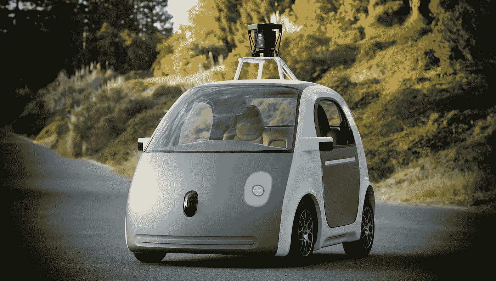

# 自动驾驶汽车:给未来自己的一封信

> 原文：<https://medium.com/hackernoon/autonomous-cars-a-letter-to-my-future-self-e10875efa46>

尽管我们的星球上发生了一些不好的事情(例如，世界范围内的恐怖主义，独裁者很容易获得大规模杀伤性武器)，如果有什么事情让我对不远的未来真正感到兴奋的话，那就是[自动驾驶](https://hackernoon.com/tagged/autonomous)汽车。

我现在正在写这篇博文，时间是 2016 年 9 月，我真的很期待在不太远的将来，比如说 10 到 15 年后，再读一遍。

# 老人

你知道，当你还是个孩子的时候，你的父母告诉你(取决于你的年龄——我不做任何假设。几乎):

*“我在你这个年纪的时候，我们连彩电都没有”*或者

*“我们没有互联网，不得不去图书馆打开百科全书学习知识”*或者

*“我们通过 14400 位调制解调器连接到其他计算机，下载一些非常小的文件或进行一些基本的聊天，希望线路不会中断”*或

*“当人们计划在某个地方见面时，他们不能打电话/发短信给对方，他们只能出现并希望对方也会在那里”*

# 年轻人

我的孩子现在分别是 12 岁和 9 岁。我知道他们会告诉他们的孩子:

> “当我在你这个年龄时，人们实际上自己开车。手动！他们驾驶方向盘，他们必须寻找行人，其他汽车，危险。你知道有多少人因为人为失误、酒后驾车、人们在开车时睡着或使用手机而丧生吗？”

和

> 既然人们不得不开车，那么一辆车在一天中的大部分时间里都会停在某个地方——在这段时间里，它的主人会做其他事情，比如睡觉或工作。哦，你通常拥有一辆车，因为你需要它的时候，它就在你需要的地方，对吗？”

事实是，我怀疑这个对话会比我的孩子有自己的孩子来谈论这个话题的时间早得多。

# 为什么自动驾驶汽车迫在眉睫，不可避免

以下是一些基本事实

1.  人类会犯错
2.  计算机(编程正确！)通常不会。
3.  驾驶是一项有点系统性的任务；是的，驾驶时现实中有许多变化，但对这些变化的反应都可以编程，因此计算机可以以适当的方式做出反应。
4.  计算机软件，包括人工智能，机器学习和计算机视觉变得非常非常好，并保持快速发展。

谷歌几年前开始试验[自动驾驶汽车](https://www.google.com/selfdrivingcar/)一辆；特斯拉[稳定地从其汽车的真实驾驶员那里捕获](https://www.quora.com/How-does-a-Tesla-car-do-machine-learning/answer/Ed-Post-1?srid=ijAv)真实生活数据，以输入其[机器学习过程](http://fortune.com/2015/10/16/how-tesla-autopilot-learns/)，因此在不久的将来，其汽车的无线软件更新将具有[完全自动驾驶功能](https://electrek.co/2016/08/03/elon-musk-tesla-fully-autonomous-car-blows-mind/)，这一切仍在进行一些研发，但就在上周，总部位于新加坡的 nuTonomy [开始运营自动驾驶出租车，真的](http://www.wsj.com/articles/worlds-first-self-driving-taxis-hit-the-road-in-singapore-1472102747)——因此自动驾驶汽车实际上开始成为现实。

然后我们还在谈论自动驾驶的[公共汽车](https://techcrunch.com/2016/08/17/autonomous-buses-take-to-the-busy-streets-of-helsinki/)和[卡车](https://techcrunch.com/2016/08/20/paving-the-way-for-the-autonomous-truck/)，沃尔沃表示将在 2020 年前推出[一款完全无人驾驶的汽车](http://www.techinsider.io/volvos-first-self-driving-car-is-coming-in-2020-2016-5)，特斯拉已经为[提供了一款不断改进的自动驾驶系统](http://www.wired.com/2015/10/tesla-self-driving-over-air-update-live/)，是的——该系统[仍然不是 100%可信的](http://www.teslacentral.com/autopilot-amazing-you-shouldnt-trust-it-your-life)，但是他们的自动测试汽车[已经比人类制造的事故](https://www.tesla.com/blog/tragic-loss)要少。

# 预言；预测；预告

现在，自动驾驶汽车有一些有趣的社会和法律问题，但社会和立法者肯定会解决它，因为它必须工作，所以人们会找出并解决技术问题。**这只是一种必然:**如果软件能比人类犯更少的错误，生命就有救了。如果软件可以驾驶汽车，你就不需要停车——只要从哪里召唤它，它就会来。如果一辆车可以在你睡觉/工作/玩耍/任何时候的任何地方，那么你可以每小时租一辆。如果汽车被租出去——需要真正拥有汽车的人会少得多。

有趣的是汽车市场和整个行业将会发生什么:

*   真的会有更少的人拥有汽车，只是把它们租出去吗？汽车将不再为私人所有，我们将最终拥有自主车队来驾驶它吗？
*   如果因事故造成人身伤害和财产损失，您会起诉谁:
*   作为一个行人(如果你对事故有很大的贡献，而汽车没有机会避开碰撞怎么办？)
*   作为自动驾驶汽车中的乘客
*   作为汽车中的乘客被自动驾驶汽车撞了(然后是谁的错？你能看看汽车数据记录吗？日志可以伪造吗？)
*   在某些国家，道路交通法只是一个建议，或者司机本能地“想出”该做什么，违反常规规则和逻辑，自动驾驶汽车行业将面临多快和什么挑战？

此外，驾驶不会很快完全消失；四轮驱动、赛车、豪华轿车、旅游——它们在未来一段时间内仍将占据一席之地。但是其中一些会急剧减少。

非常确定的是(我会在 10-15 年后再读一遍，看看我离现实有多远)这是一个全新的时代。这就像互联网之前和之后的生活一样，只是互联网彻底改变了信息的获取和通信速度，自动驾驶汽车将:

*   几乎完全停止机动车辆死亡和伤害；
*   减少地铁拥堵，因为更多的人将使用一辆车，而且自动驾驶汽车可以以更小的间距行驶，将以更有效的方式加速和刹车，防止出现[交通波](http://www.smartmotorist.com/traffic-and-safety-guideline/traffic-jams.html)；
*   大幅减少对停车位的需求，因为汽车会把人放下，然后开到下一个需要停车位的乘客那里

# 摘要

的确，这是一个非常光明的未来。这不是科幻小说。它就在这里，而且以非常快的速度到来。我想，未来的我，15 年后再读，一定会嘲笑我当初是多么的短视。

你怎么看？你如何预测自动驾驶汽车的未来会是什么样子？你看到的障碍是什么？我提到 10-15 年的时间表是不是太保守了？

*原载于 2016 年 9 月 2 日*[*full stack . info*](http://fullstack.info/autonomous-cars-letter-future-self/)*。*

*帖子的图片(谷歌的原型自动驾驶汽车的早期版本(AP Photo/Google))是由*[*smooth groover 22*](https://www.flickr.com/photos/smoothgroover22/15104006386)*提供的一张图片的修改版，并在* [*CC BY-SA 2.0 许可*](https://creativecommons.org/licenses/by-sa/2.0/) *下。*

> [黑客中午](http://bit.ly/Hackernoon)是黑客如何开始他们的下午。我们是阿美族家庭的一员。我们现在[接受投稿](http://bit.ly/hackernoonsubmission)并乐意[讨论广告&赞助](mailto:partners@amipublications.com)机会。
> 
> 如果你喜欢这个故事，我们推荐你阅读我们的[最新科技故事](http://bit.ly/hackernoonlatestt)和[趋势科技故事](https://hackernoon.com/trending)。直到下一次，不要把世界的现实想当然！

