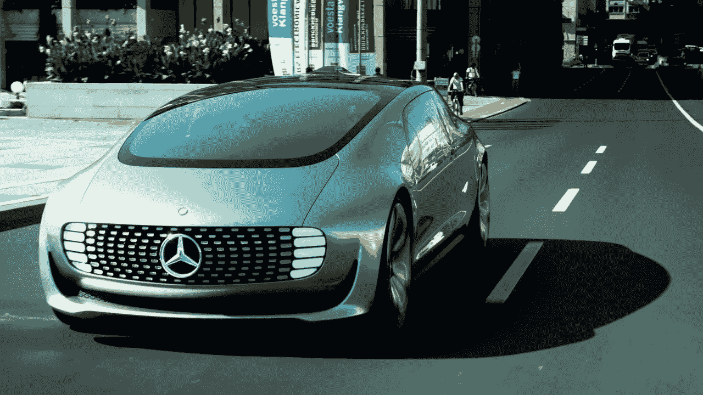
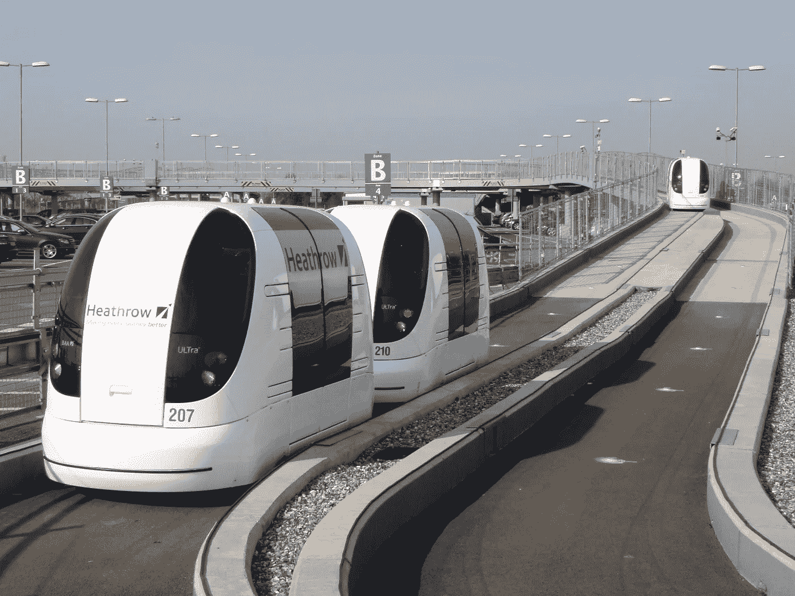

# 自动驾驶汽车:带着我们到处跑——还是让我们发疯？

> 原文：<https://medium.com/hackernoon/autonomous-cars-driving-us-around-or-driving-us-crazy-50d55e428069>

我们都已经看到了 2017 年的未来主义描述，充满了飞行汽车、皮革网络哥特装备、星际互动和时间旅行。想到我们过去的几代人真的相信这种技术壮举现在可能实现，这是相当滑稽的。然而，也许说我们还没有超越过去十年的技术并不完全正确。虽然我们没有时间旅行，但我们现在能够认识到时间旅行在理论上是如何可能的，尽管我们还没有星际间的相互作用，但我们已经发现了一个完全未被发现的新宇宙，它显示了希望。

同样，虽然我们可能不会都穿得像*奶奶的男孩* 中的 [JP，但时尚已经发生了变化，相信我，我们做的错误决定和他们认为的一样多。最后，虽然我们可能还没有全功能的飞行汽车，但谁能忘记《我是机器人》和自动驾驶奥迪 RSQ](https://youtu.be/a2Th8JGsJuo) 中的史诗场景呢？

虽然我们现在回头看那个场景，可能会觉得特效有点老套，但我们可能要感谢这部电影，因为埃隆·马斯克最近参与了自主特斯拉的创作。尽管多家公司声称今年将把自动驾驶汽车推向市场，但马斯克的特斯拉似乎可能是第一个有效做到这一点的公司。考虑到这一点，也许过去几代人所希望的未来并不像我们之前计划的那样遥远。然而，随着自动驾驶汽车在过去几年中变得越来越受欢迎，关于这些汽车的安全问题仍然存在，如果从一开始就没有正确处理，一个充满汽车的城市连接到一个不安全的网络的结果只能是混乱。

A Real Life Watch Dogs at Our Doorstep?

**是什么让不安全的自动驾驶汽车如此危险？**

在过去的几年中，物联网(IoT)已经占据了技术世界，并使设备与网络的连接变得更加容易和高效。然而，随着这种新形式的云连接，对数据不安全和网络攻击的担忧开始上升，似乎没有什么连接到物联网的东西是真正安全的。例如，仅去年一年，连接到物联网的不安全设备就对雅虎、Spotify、亚马逊、Krebs on Security 等公司造成了无数次 DDoS 攻击。这些设备带来的主要担忧实际上甚至不是汽车本身，而是安全性较低的设备，如手机和可穿戴设备，它们被提议与汽车一起连接在同一个网络中。这种入口点允许黑客进入网络并进行破坏，而不必篡改拟议中的自动驾驶汽车可能具有的强大安全措施。

反过来，这些汽车远非安全，即使他们的个人安全措施似乎是。在过去的几年里，人们对物联网的安全性及其在我们日常生活中的重要元素(包括水泵、汽车、交通灯和火车等)的使用产生了相当多的怀疑。这种恐惧在自动驾驶汽车世界中非常普遍，就像一个能够操纵汽车的黑客可以非常容易地在不同城市的公民身上制造自己的[恐怖袭击](http://www.sfchronicle.com/business/article/How-self-driving-cars-could-become-weapons-of-9958541.php)，而不必亲自到场或驾驶一辆汽车。因此，操纵这些汽车的安全性的能力不仅会给车内的人带来灾难，也会给受其脆弱性影响的外部世界带来灾难。

尽管大多数公司推测，连接到云不会立即发生，汽车的安全措施将最终确保它是安全的，但对容易受到网络攻击转变为真正的恐怖袭击的恐惧足以让人们希望放慢这些汽车的生产速度，并确保它们在销售前完全安全。然而，[第一辆自动驾驶汽车](http://www.businessinsider.com/report-10-million-self-driving-cars-will-be-on-the-road-by-2020-2015-5-6)的发布可能会比我们之前想象的更快，随着它们的出现，物联网在日常生活中应用的第一个迹象将会开始。

这些汽车离市场还有多远？

尽管之前曾表示这些自动驾驶汽车要到 2018 年才会向公众开放，但 NHTSA 和得克萨斯州交通部的新声明称，[自动驾驶汽车将很快进入得克萨斯州](https://www.elephant.com/blog/car-insurance/autonomous-vehicles-are-coming-to-texas)，并允许官员们在一段时间内仔细检查这些汽车的性能，看看它们是否能够从现在开始使用。

尽管对汽车技术安全性的担忧令人担忧，但许多人认为，自动驾驶汽车将大大减少每年的车祸数量，并在此过程中提高道路安全和保险费率。事实上，在 T2，94%的车祸都是由人为错误引起的。因此，通过从混合中去除这些个体，许多人相信道路将会更加安全，并且受所述人为错误的影响也更小。

2015 年，马斯克表示，他距离创造一辆完全自动驾驶的汽车还有大约三年时间，第一辆自动驾驶汽车已经展示出来也就不足为奇了，因为马斯克肯定是一个以一次又一次提高标准而闻名的人。然而，随着这些汽车如此接近市场，一些人表示，手机和[可穿戴设备](http://www.pcworld.com/article/3150801/security/privacy-protections-for-wearable-devices-are-weak-study-says.html)等各种其他设备的安全性比汽车本身的安全性更重要，而且，随着远非脆弱的设备连接到具有高质量安全性的汽车，不仅有一种更简单的方式将您的设备连接到云，而且还有一种更安全的方式。事实上，随着越来越多的交通方式选择研究自动替代方案，这些电影多年来描绘的世界可能比以往任何时候都更近，我们知道这对文明的影响将是巨大的。

**自动驾驶汽车对于交通工具的自主化意味着什么？**

随着第一批自动驾驶汽车仅在今年内分发，自动驾驶技术在交通领域的应用可能会继续增加。事实上，一些人推测，不仅仅是汽车中人为错误的减少实际上可能会带来一个更加稳定和安全的世界。尽管安全隐患以及将人类从特定驾驶工作中移除无疑是值得关注的，但使用这些自主交通工具可以导致每年更少的死亡和更有效的程序，包括运送重要货物的火车始终准时，车祸死亡率降低，以及将病人运送到医院同样是更有利的情况。

特别是对于医疗保健行业来说，这种权宜之计和道路上没有人为错误同样意味着每年可以挽救成千上万的生命。无论是与自动驾驶汽车互动的救护车轻松地在它们周围移动，还是[空中救护车](https://www.amrairambulance.com/about-us)能够在没有典型人为错误的情况下直接巡航到医院并每次都高效着陆，在这些设备中使用自动化绝对是高效的。

同样，对于卡车运输公司和货运列车来说，以高效方式运输产品的能力可能意味着更有利可图和更富裕的经济，这不会让司机离开乘客座位，而只是将他们的职业从危险的驾驶技术转变为在整个旅程中监控自动驾驶程序的[。反过来，这将向更多的人开放这个行业，让他们有能力赚取高质量的工资，而没有随时死亡的风险。](https://www.trucks.com/2016/10/06/autonomous-trucks-future-truckers/)

最后，使用自动驾驶汽车有很多好处，但它面临的问题也同样巨大。然而，如果以真正有效的方式谨慎处理和解决，这些自动驾驶汽车可能意味着人类预期寿命、汽车保险费率、工作转型和机会、技术以及技术在日常生活中的应用的新时代的到来。最终，这些汽车会带着我们到处跑，而不应该在这个过程中把我们逼疯。如果在德克萨斯州和其他 10 个被选择参与试验的州的研究证明这些汽车正如他们声称的那样安全，我们可能会在现在就开始看到未来，反过来，告别充满颠簸的过去。

> [黑客中午](http://bit.ly/Hackernoon)是黑客如何开始他们的下午。我们是 [@AMI](http://bit.ly/atAMIatAMI) 家庭的一员。我们现在[接受投稿](http://bit.ly/hackernoonsubmission)并乐意[讨论广告&赞助](mailto:partners@amipublications.com)机会。
> 
> 如果你喜欢这个故事，我们推荐你阅读我们的[最新科技故事](http://bit.ly/hackernoonlatestt)和[趋势科技故事](https://hackernoon.com/trending)。直到下一次，不要把世界的现实想当然！

