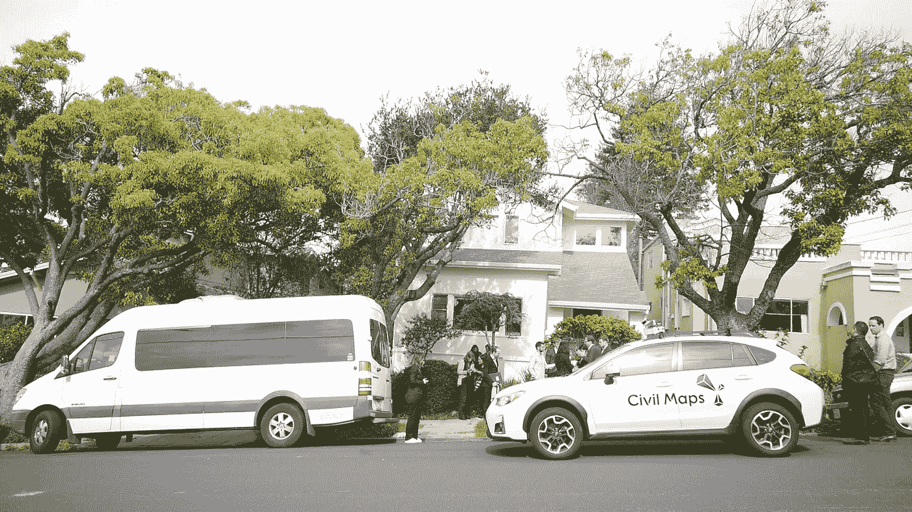

# 自动驾驶监管机构就在我们家门口

> 原文：<https://medium.com/hackernoon/autonomous-driving-regulators-at-our-doorstep-42b2690a2deb>

公民地图公司的联合创始人兼研发副总裁杨奇煜·克雷芒

Visit to Civil Maps HQ by Alexander Dobrindt, Federal Secretary of Transport and Digital Infrastructure, Germany

上周，我们招待了一些尊贵的客人。

到目前为止，我们的邻居已经习惯了来自世界各地的汽车高管和 R&D 类型的稳定流，但这个特殊的群体是由立法者组成的，任务纯粹是学习和讨论。德国联邦运输和数字基础设施部长 Alexander Dobrindt 及其随行人员抵达 SFO 后，他们的第一站是我们位于加利福尼亚州奥尔巴尼的[总部](/@CivilMaps/so-long-dev-house-were-on-the-move-514ef731a9f4)。乘坐一辆奔驰 sprinter 面包车和一辆大型黑色 SUV，外交官们纷纷下车，记者们聚集在我们的前院，这一景象吸引了一些居民走出家门，查看发生了什么。

多布林特部长的代表在几周前进行了接触，表达了了解民用地图的愿望，以便更好地了解自动驾驶的未来。我们公司致力于这项任务的关键技术；我们赋予汽车认知能力，使它们能够获得驾驶环境的背景信息，并众包动态 3D 地图。虽然这个小组表现得很像好学生，专注地听并问了很多问题，但他们实际上是关于自动驾驶汽车立法的政策*领导者*。

1 月 25 日，德国成为第一个通过立法为自动和半自动车辆研究和驾驶提供初步框架的国家。多布林特和他的团队起草了这项立法，他们想让德国汽车制造商放心，联邦政策将支持他们的研究计划。2016 年，德国汽车制造商总共生产了全球 8.6%的汽车。部长表示，未来这可能需要使用“黑匣子”来记录无人驾驶系统何时处于活动状态。

“需要满足某些先决条件，”多布林特部长对聚集在我们家/办公室进行访问的记者说。例如，车辆装有一个黑匣子，它能随时知道是车辆还是人在控制车辆，或者电脑是否一直运转良好

在我们的车道上互致问候后，这群人挤进了房子。我们的会议室以前是索诺玛大街 1605 号过去租户的主卧室，里面挤满了记者、政策制定者和我们自己团队的一些成员。我很高兴能够主持涵盖以下主题的讨论:

*   什么是汽车的[认知](https://drive.google.com/open?id=0Bzm3Wu3FUSBfQkdCamdMTnZzZHM) — Civil Maps 赋予汽车上下文感知能力，使自动驾驶汽车能够为更安全的驾驶和 3D 地图数据的众包做出更好的决策。
*   理解传感器数据——从点云到使用 [Civil Maps 基于签名的定位在 5 厘米精度内进行六维定位](https://drive.google.com/file/d/0Bzm3Wu3FUSBfU3VmanBsVzA3V00/view?usp=sharing)
*   [增强现实地图](https://drive.google.com/file/d/0Bzm3Wu3FUSBfS0tibm1FVjNzeTQ/view?usp=sharing)s——投影 3D 高清语义地图数据(车道标志、标牌等。)实时进入汽车传感器的视野。我们的目标是:在促进自动驾驶汽车的可靠导航和安全的同时，让乘客信任我们。
*   通过互联车辆群进行地图众包
*   自动驾驶汽车 R&D 高成本的潜在解决方案——低计算和高成本效益的传感设备
*   模拟引擎如何加速开发
*   与全球汽车 OEM 合作伙伴合作

在一些问答之后，Dobrindt 先生出去观看了我们的增强现实地图和定位技术的演示。使用低处理能力和高度先进的实时传感器数据压缩，汽车在六个维度上定位自己，并呈现给机器可读的地图。有了这些信息，汽车就知道它在哪里，以及在驾驶时在场景中应该关注什么。这种清晰减少了对车辆的认知负荷。演示展示了汽车看到的东西，这只是它导航和安全所需的信息。

在代表团出发前往下一个目的地之前，我们给了他们大量的民用地图，并迅速道别。他们那天的下一站是斯坦福汽车研究中心。在两天行程的最后一天，他们计划参观奥托(优步)。大约三年前，多布林特部长和他的团队对美国进行了一次类似的学习之旅。当时，他访问了脸书和谷歌。

> [黑客中午](http://bit.ly/Hackernoon)是黑客如何开始他们的下午。我们是 [@AMI](http://bit.ly/atAMIatAMI) 家庭的一员。我们现在[接受投稿](http://bit.ly/hackernoonsubmission)，并乐意[讨论广告&赞助](mailto:partners@amipublications.com)机会。
> 
> 如果你喜欢这个故事，我们推荐你阅读我们的[最新科技故事](http://bit.ly/hackernoonlatestt)和[趋势科技故事](https://hackernoon.com/trending)。直到下一次，不要把世界的现实想当然！

