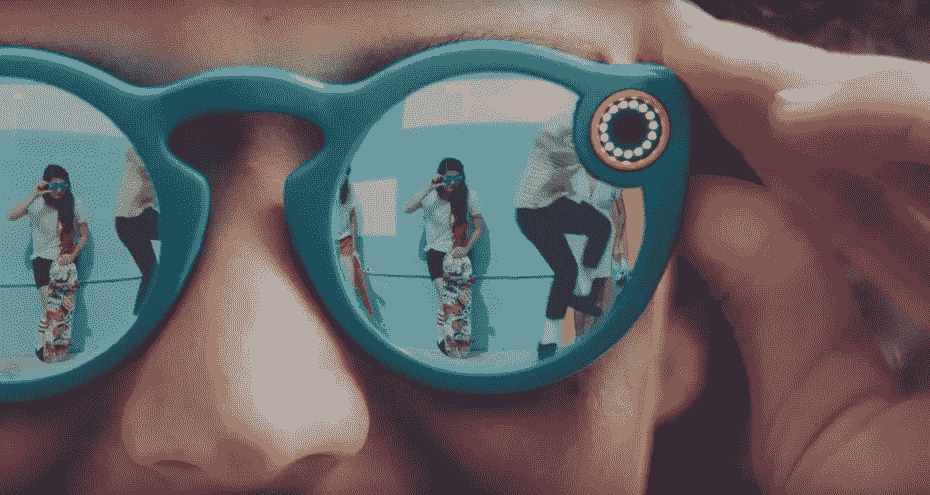
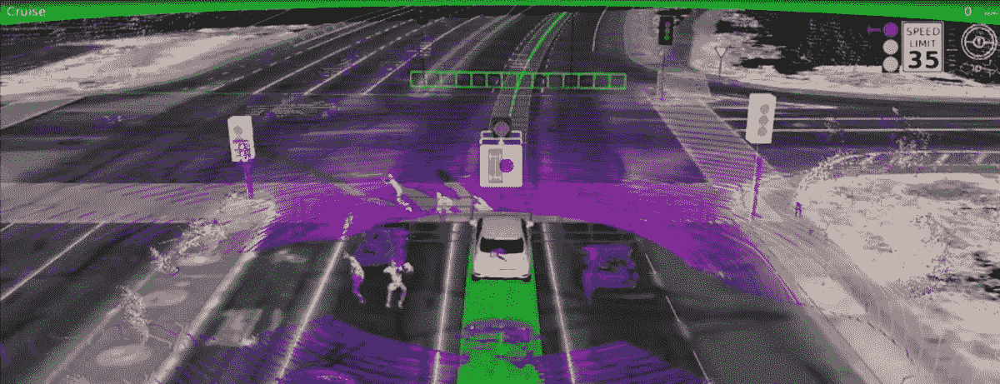
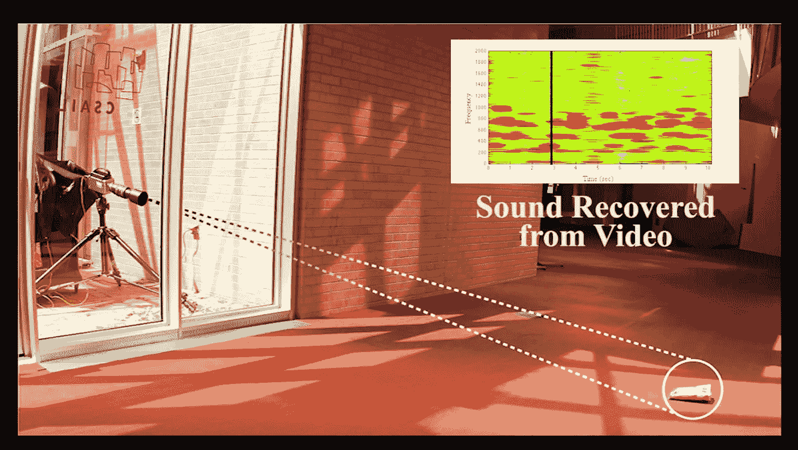
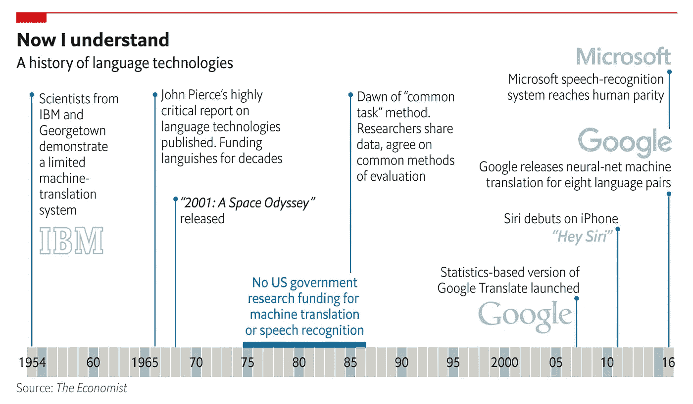
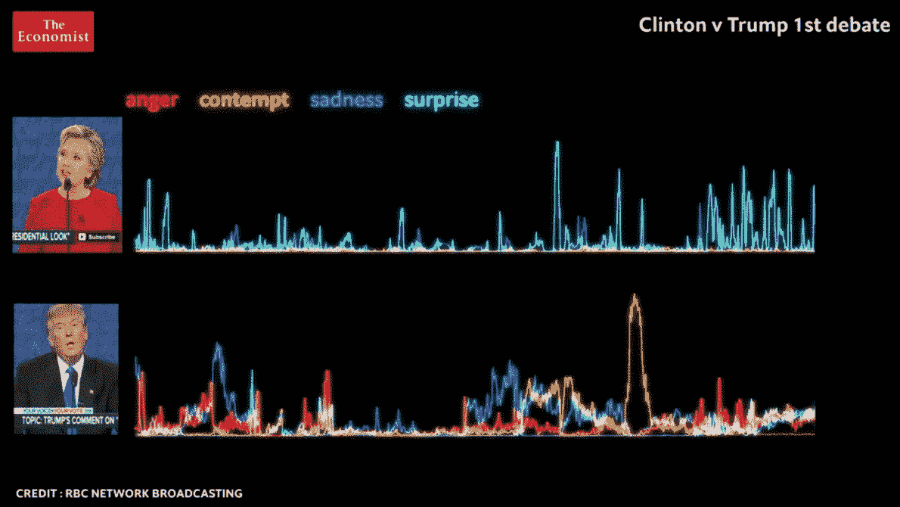
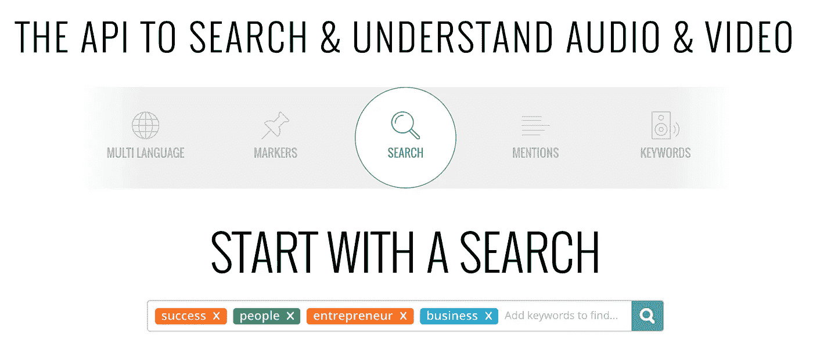
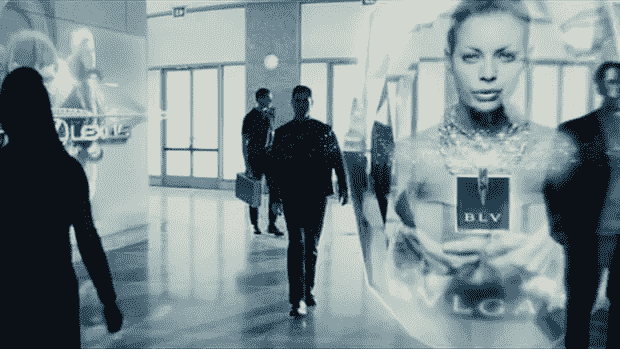
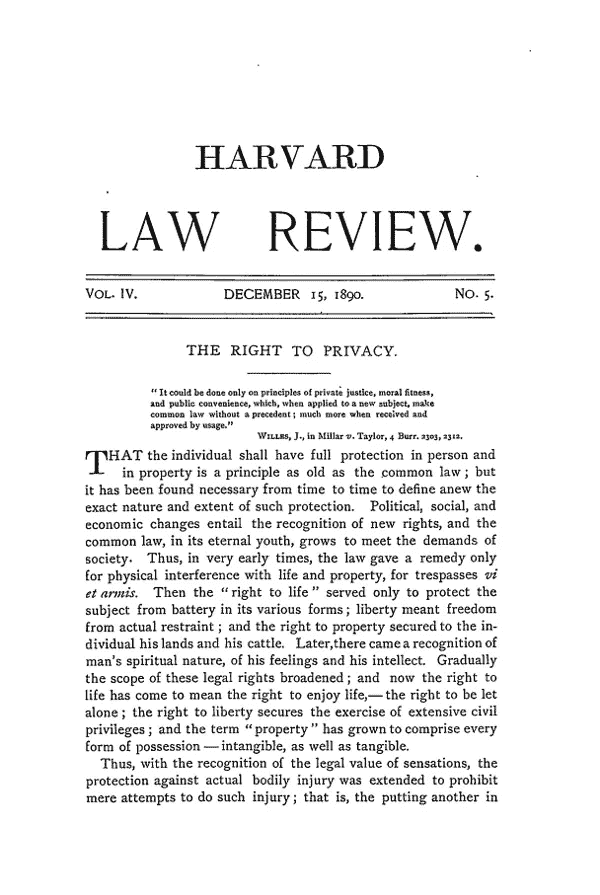
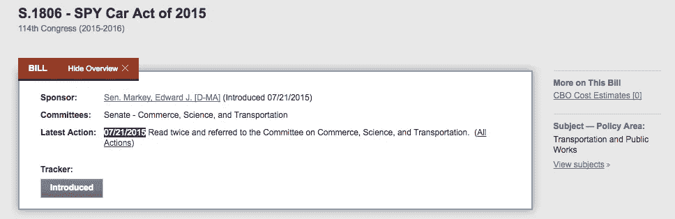

# 自动驾驶汽车和隐私的终结

> 原文：<https://medium.com/hackernoon/autonomous-vehicles-and-the-end-of-privacy-9c3712f3494f>

*任何地方的任何事情，很快都会被连续记录下来，上传到互联网上。这将从人口密集的城市地区开始，但随着时间的推移，地球上每一部分的每一平方米都将被记录下来。计算机视觉人工智能的进步意味着这些数据可以大规模使用，这将彻底改变广告和执法，并将我们带回前隐私时代。*

*(是的，你猜对了，和这篇文章配对的电影是《少数派报告》)*

Photo Courtesy of Tesla

# 视频无处不在

这是我们今天的情况:

*   **卫星** **&无人机**记录地球上任何地方的视频。例如，这使得谷歌的子公司 Terra Bella 能够销售地球上任何地方的高清视频，用于商业应用。在大多数情况下，分辨率仍然很低——例如，您可以从太空中监控一辆卡车是否在建筑工地上，但看不到它的牌照。
*   **CCTV&家庭摄像系统**随着传感器成本的下降以及国家安全层面和个人层面(家庭安全、婴儿摄像机等)监控需求的增加而激增。英国有 600 多万台闭路电视([来源](http://www.wired.co.uk/article/one-nation-under-cctv))。
*   **消费视频**录制量增加的离谱。举个数量级的例子:每天有超过 400 万个小时的视频被上传到 Youtube 上。随着全球 50%尚未拥有智能手机的人开始使用智能手机，以及脸书直播、Twitter 的潜望镜和 Snapchat 等产品促使当前的智能手机用户拍摄更多(现在是“直播”)视频，这一趋势并没有放缓。

但真正的变革即将到来:

*   **增强现实“谷歌”**将成为大众市场，将需要不断记录用户所看到的视频，以便能够用软件增强视图..今天，微软 Hololens 和 Snapchat Spectacles 处于领先地位，渗透率非常低。但许多聪明、资金充足的人正在努力让 AR 发挥作用，带头的是 50 亿美元的资金和 700 多名员工的秘密创业公司 Magic Leap。

Photo courtesy of Snap Inc

*   自动驾驶汽车(AVs)将成为大众市场，并将捕捉连续、高清、高帧率、360°视频。当你考虑到作为今天所有汽车的**替代品的这一 AV 革命的规模时，这是巨大的，但当你考虑到 AV 在一个更大的市场——物流——中的作用时，这更令人震惊。随着市场对“按需”商品的需求日益增加([亚马逊现在提供 1 小时送达](http://www.wsj.com/articles/amazon-com-launches-superfast-delivery-in-nyc-1418903192) ) AVs(包括无人机)将是公司满足这一需求的经济有效的途径。如果驾驶汽车是免费的，为汽车提供动力也几乎是免费的(随着电动引擎效率和太阳能的进步)——为什么不把 10 件衬衫送到你的门口让你试穿，并退回你不喜欢的 9 件呢？(更多相关信息:我的朋友亚历克斯·弗拉芒在伦敦未来主义者会议上就这个话题做了一个有先见之明的演讲。)**

[Source: Google Self-Driving Car Project Monthly Report](https://static.googleusercontent.com/media/www.google.com/en//selfdrivingcar/files/reports/report-0316.pdf)

## 随着这些技术的进步，我们越来越接近连续高清视频记录地球上每一个角落的每一平方米。

现在。尽管有些视频很棒([这里有一个有趣的](https://www.youtube.com/watch?v=dQw4w9WgXcQ&feature=youtu.be))，但没有人会耐着性子看完所有这些东西…

# 从视频到洞察

在视频数据爆炸的推动下，计算机视觉在过去 20 年里取得了令人难以置信的进步。

让我们从你可能没有意识到的事情开始:

*   **视频作为麦克风:**超高清*无声*视频馈送现在可以通过算法进行处理，以重建拍摄区域的声音。其工作原理是能够识别由周围物体的声音引起的微小振动(一些同样的技术使我们能够从视频中获得某人的心率)。在这个视频中有一个惊人的例子**研究人员能够通过从隔音玻璃后面拍摄一包薯片来恢复一段对话**。恢复得很好，可以理解人们在说什么，*而且根本没有录音！虽然 AVs、CCTVs 等没有理由不*录音，但这些技术可能有助于获得更好的声音清晰度，尤其是在远距离和嘈杂的地方…

Hearing through a pack of crisps. [The Visual Microphone: Passive Recovery of Sound from Video](https://www.youtube.com/watch?v=FKXOucXB4a8&feature=youtu.be)

*   自然语言处理:今天，你笨拙的 Google Now 或 Siri 可能会背叛这一点，但在研究实验室中，我们可以可靠地将声音转换为文本。与面部识别一样，用于训练 NLP 算法的数据爆炸(来自智能手机、机器人和亚马逊 Alexa/谷歌家庭扬声器的对话界面)刺激了这一创新。2016 年，微软打破了语音识别的人类基准。不久之后，谷歌展示了为 8 种语言对进行实时翻译的新方法，表明这项创新完全可以轻松超越(大多数)人类所能做到的！

[Finding a Voice — The Economist](http://www.economist.com/technology-quarterly/2017-05-01/language)

*   **面部识别**可以认为解决了。2015 年 6 月，[脸书的人工智能负责人 Yann LeCun 宣布](https://www.newscientist.com/article/dn27761-facebook-can-recognise-you-in-photos-even-if-youre-not-looking?utm_content=buffer0c0ac&utm_medium=social&utm_source=twitter.com&utm_campaign=buffer#.VYtyb75l_Gt)在 Flickr 的一组 40 000 张*图片*中，脸书的算法能够在 83%的情况下正确识别人脸。有趣的是，人们的脸不一定总是在照片中——有了足够的用户数据，算法可以使用服装等其他线索来识别他们(“马克似乎穿了很多灰色 t 恤……”)随着照片的爆炸以及用户在照片中标记他们的朋友时脸书和谷歌获得的持续反馈，基于照片的识别不断得到改善。有了视频，以及每个用户的习惯、服装风格和位置的历史记录，这些算法在识别谁是谁方面将很容易超越人类。(还记得上一次你努力想认出几年不见的人吗？).他们也可能比你更善于接受视觉提示:

## **从草堆中取出针**

人工智能系统能够从原始数据中推断出更高层次的概念(“特征”)。例如，面部是从形成视频馈送的原始像素中推断出的特征。这有效地使所有的视频和声音都可以搜索。以 Clarify.io 为例，说明一家公司提供了这样的服务:

Clarify.io (seems to work — the top result was an Elon Musk video!)

## 但人工智能远不止让人类能够搜索。它可以有效地为您执行所有可能的搜索，并返回更高层次的“特征”:有趣的模式、异常事件。

它还在尽可能多的可用数据源上这样做，在它们之间的公共标识符上连接数据集。**所以这不是“在这个视频中有一张脸”，这也是脸后面的名字，这个人的互联网“面包屑”** ( *包括* *这张脸曾经出现过的所有其他位置*，所有浏览活动、所有消息、所有社交网络意见等**以及任何其他可能可用的数据集。**

这些 AI 系统会不断改进，**每个改进的版本都会对原始数据进行再处理**。假设英国警方运行一个算法，通过上周所有的公共闭路电视录像，寻找罪犯的脸。今天的算法可能找不到它，但未来的版本会找到。

那么，这些进步意味着什么呢？

# 商业影响

**广告客户、保险公司、零售商、银行将会享受这些新数据，就像他们迄今对所有其他互联网数据所做的那样。**我们的目标仍然是建立你的详细资料，向你推销更多的东西，并量化你所代表的风险/责任。

**无处不在的视频结合不断改进的人工智能系统提供:**

*   **你的社会经济状况:**你住在哪里，在哪里工作，工资多少，你是否送孩子上学，你和谁在一起，在哪里，多久一次
*   你的购物习惯:你在哪里购物，你穿什么，你的朋友穿什么，你上班必须穿什么
*   你的健康状况:你有多活跃，你是否吸烟/喝酒，你去哪种餐馆吃饭或点餐，你去看了多少次医生

truly 121 advertising with a side of leather jackets and guns (Minority report)

它还在更宏观的层面上带来了一些有趣的预测机会:

> 当半打 100 美元的静态相机可以告诉你今年在肖尔迪奇任何人穿的所有东西时，当你可以通过社交和街头摄影从开始到大众市场追踪一个趋势，然后寻找下一个新兴模式时，时装业会发生什么？

— Benedict Evans，[相机、电子商务和机器学习](http://ben-evans.com/benedictevans/2016/11/20/ku6omictaredoge4cao9cytspbz4jt)

这些来源于视频的见解似乎不可避免地会被反病毒公司转售，就像谷歌和脸书出售基于浏览历史和喜好的定位一样。商业机会是巨大的。

这种情况是否会正式发生，将取决于围绕这些视频数据使用的监管的性质。非正式地，考虑到互联网安全的不稳定性，这些数据将被用于商业目的。

# 隐私影响

*“The Right To Privacy” ~ December 15, 1890, Harvard Law Review*

正如格雷戈里·费伦斯坦在《T2》中精彩地描述的那样，《T4》中的《隐私的生与死》，完全透明是人类的自然状态。隐私作为一个概念只有大约 150 年的历史。

很长一段时间，我们今天所认为的任何形式的隐私在物质上是不可能存在的。部落社区都住在洞穴里，罗马人都住在单间房子里，中世纪的家庭和仆人都睡在同一张床上——没有私人空间或个人亲密关系的实际概念。

随着私人生活成为可能——在物理上有独立的房子、房间、床，以及通过像写作和电话这样的新技术进行交流——对隐私的渴望出现了。美国第一部以隐私为导向的法律是 1710 年的《邮局法案》,该法案禁止邮政员工分拣邮件。

尽管如此，隐私始终是便利性和成本的次要问题。这解释了为什么新技术会被持续、广泛地采用，这些新技术会侵犯我们的隐私，但却被认为是值得的。

今天，自动驾驶汽车是这些新技术中的一种。今天我们让人们以每小时 100 英里的速度驾驶一吨钢铁，只是有几个标志告诉他们不要踩太多踏板，这难道不疯狂吗？是的——在美国，它每年导致 3 万人死亡(每 17 分钟就有一人死亡)。对于自动驾驶汽车，这一数字将显著下降，这本身就使这项技术非常有吸引力。但是隐私的含义是什么呢？

## **这一次，你不能选择退出**

智能手机和互联网革命也是一场深刻的变革，但你可以选择没有智能手机，或者不使用脸书、谷歌或任何其他以收集和出售你的数据为生的服务。

## **在视频无处不在的世界里，追踪完全离线进行。当你走出去的时候，你所有的动作都会被传输到数据库，打上时间戳，进行地理定位，并添加到你的数字档案中。你不能退出。**

*(为了尽可能地推迟这一天，你可以(1)确保你的脸不在互联网上，(2)住在一个将会有 AVs 的地方，例如朝鲜，(3)住在一个多云的地方，这样无人机和卫星很难从远处看到你。从好的方面来看，我打赌你在那里的房租会更便宜*

## 100%可执行性

众所周知，美国首创的无授权监视状态目前很流行，例如最近[英国的“窥探宪章”法案成为法律](https://www.theguardian.com/world/2016/nov/29/snoopers-charter-bill-becomes-law-extending-uk-state-surveillance)，或者[紧急状态在法国被保留](https://www.nytimes.com/2016/07/25/opinion/frances-permanent-emergency-state.html)。

无处不在的视频可能意味着又多了一个发现异常公民行为的数据源。这将被情报机构用于防御目的，但它直接影响到你我手中的普通检察官。

## **法律变得 100%可执行。**如果检察官可以在视频处理算法中编纂所有违法行为——比如说乱穿马路(以一项特别荒谬的法律为例)——并在美国所有拍摄的公共生活视频中运行，那么它就可以立即起诉所有乱穿马路的人。

> 我认为最重要的一点是要记住，在美国历史上，有时正确和合法是不一样的
> 
> —爱德华·斯诺登

另一个需要考虑的因素是**更多的数据收集，尤其是视频数据，导致网络犯罪**的广度和有效性增加。随着跟踪转移到线下的物理世界，目标也在转移——例如，你可以想象一架无人机被劫持去伤害某个人，该人是通过入侵 AV 的视频源而被识别的。

# 😬。现在怎么办？

今天，关于自动驾驶汽车和人工智能的公共辩论集中在最紧迫的问题上:自动化数百万个工作岗位的经济和社会影响(例如卡车司机，这是美国最受欢迎的工作。)这是选民们最担心的。

然而，自动驾驶汽车的隐私影响也需要在这场公共辩论中占据一席之地。

## 自动驾驶汽车应该是在仔细权衡利弊(包括隐私影响)后做出的深思熟虑的社会选择。

这场辩论的结果应该是明确的监管，解决以下问题:

*   可以从 AV 摄像机中收集哪些数据，以何种格式收集，哪些数据应该匿名，如何匿名？
*   这些数据将在哪里存储、共享和保护，存储多长时间，公众对这些数据有什么控制？
*   谁将控制处理视频信息的算法，我们如何评估它们的有效性和法规遵从性？(法官需要学习编码吗？法律会变成代码吗…？)

随着这项技术的最终应用( [Elon Musk 预计第一台完全自主的 Telsa 将于 2018 年](http://www.driverless-future.com/?page_id=384))是时候让政策辩论认真考虑隐私的影响了。

到目前为止，在我的研究中，我在美国看到的是两名民主党参议员提出的一项法案，名为“2015 年汽车安全和隐私法案”

Introduced in July 2015, crickets since. ([Bill Tracker at Congress.gov](https://www.congress.gov/bill/114th-congress/senate-bill/1806/actions))

该法案旨在:

> 防止未经授权访问:(1)电子控制或驾驶数据，包括关于车辆位置、速度、所有者、驾驶员或乘客的信息；或者(2)由内置于车辆中的电子系统收集的驾驶数据，而该数据存储在车辆上、从车辆运输到另一个位置、或者随后在车辆外存储或使用。

正如本文所报道的，该法案于 2015 年 7 月出台，来自谷歌、通用汽车、德尔福和 Lyft 的高管于 2015 年 3 月 15 日出席美国参议院委员会讨论该法案。高管们被问及是否应该有隐私和网络安全的最低标准，除了一名参与者之外，所有人都拒绝回答是或否。自那以后，该法案没有得到进一步讨论。

## 自动驾驶汽车可能会给公共跟踪和监控带来一个巨大的变化——任何地方的任何事情都会被连续记录，这一次没有办法选择退出。

## 我很乐意被证明是错误的，但在推动我们的无人驾驶未来的过程中，隐私似乎完全是一个事后想法。

感谢您的阅读——请在这里回复或在我的推特上回复[来表达您的想法👋](http://twitter.com/ernopp)

*感谢*[*Christian Moroy*](https://twitter.com/ChristianMoroy)*，*[*Alex Flamant*](https://twitter.com/AlexCFlamant)*，以及*[*Gabriel oppe tit*](https://twitter.com/ChristianMoroy)*对所有这些令人兴奋的东西进行了精彩的对话(并耐心地评论了这篇文章)。)*

> [黑客中午](http://bit.ly/Hackernoon)是黑客如何开始他们的下午。我们是阿美族家庭的一员。我们现在[接受投稿](http://bit.ly/hackernoonsubmission)并乐意[讨论广告&赞助](mailto:partners@amipublications.com)机会。
> 
> 如果你喜欢这个故事，我们推荐你阅读我们的[最新科技故事](http://bit.ly/hackernoonlatestt)和[趋势科技故事](https://hackernoon.com/trending)。直到下一次，不要把世界的现实想当然！

