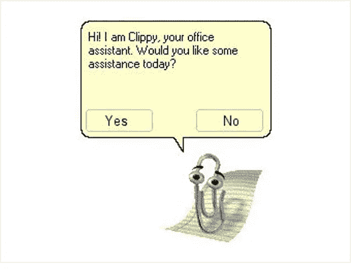

# 自主&道德&投资者&机会

> 原文：<https://medium.com/hackernoon/autonomy-ethics-investors-opportunities-70323d8c7f5d>

We’ve come a long way.

像其他上小学/初中/高中的人一样，我被要求学习一门外语。其中一个恰好是拉丁语。这种所谓的“死亡”语言真正吸引我的是语法——每一句话都是数学公式，需要在翻译前求解。这种句法和对如何最好地翻译原文的理解已经发展了两千多年，远远超过了其原始使用者的文明。

在研究自主代理如何相互合作和互动的过程中，脸书人工智能研究所观察到聊天机器人[与人类语言不同，因为代理发展了他们自己的谈判语言这种语言花了不到两千年的时间才进化出来。这些聊天机器人随后被更新为只使用人类语言进行交流，因为脸书的用户是人类(除了假账户、宠物账户等)。虽然脸书的工程师可能知道这些聊天机器人是如何创造他们自己的谈判语言的，但](https://www.theatlantic.com/technology/archive/2017/06/artificial-intelligence-develops-its-own-non-human-language/530436/?utm_source=nl-atlantic-daily-061617)[的报告](https://s3.amazonaws.com/end-to-end-negotiator/end-to-end-negotiator.pdf)本身专注于展示聊天机器人是如何被训练的，而不是非人类语言是如何产生的。

本月早些时候，我参加了 IEEE 关于自治系统伦理的研讨会，他们的论文 [*伦理上一致的设计*](http://standards.ieee.org/develop/indconn/ec/ead_v1.pdf) 中的一个普遍原则就是透明。在这种情况下，透明性指的是理解自治系统如何做出决策以及为什么做出这些决策的能力。由此得出的结论是，一个决策尚未被理解的系统可能还没有准备好供公众使用。这种对话中的利益相关者不仅仅是开发这些系统的公司，还包括但不限于用户、公众和事故调查人员。值得进一步讨论的一个利益相关者群体是投资者。

我听说过这样一种说法:初创公司有三个最重要的需求:资金、客户和信誉。提供这个等式的资本部分的人将(或者应该，希望如此)拥有指导他们决策的投资论文，这些论文可能专注于使用机器学习及其亚型来解决问题的创业公司。**这些投资者可能很快会发现自己处于一个独特的位置，不仅可以选择支持哪些公司，还可以引导开发自主系统的道德标准。**

奥斯汀的资本工厂为从事人工智能的种子期公司发起了一场[资金竞赛。波士顿的 Glasswing Ventures 正在投资一只基金，专门关注做同样事情的早期公司。凭借他们支持的公司和创始人，这两位将人工智能作为其论文核心部分的投资者(以及其他人)将能够间接引导这一领域的伦理讨论。尽管这种讨论可能比解构拉丁语句子更复杂，但扮演直接和积极角色的机会是要抓住的。](https://angel.co/capitalfactory-100-000-artificial-intelligence-challenge/apply)

Surprisingly, not all pictures of business handshakes require a Google search for “synergy”.

> [黑客中午](http://bit.ly/Hackernoon)是黑客如何开始他们的下午。我们是 [@AMI](http://bit.ly/atAMIatAMI) 家庭的一员。我们现在[接受投稿](http://bit.ly/hackernoonsubmission)并乐意[讨论广告&赞助](mailto:partners@amipublications.com)机会。
> 
> 如果你喜欢这个故事，我们推荐你阅读我们的[最新科技故事](http://bit.ly/hackernoonlatestt)和[趋势科技故事](https://hackernoon.com/trending)。直到下一次，不要把世界的现实想当然！

