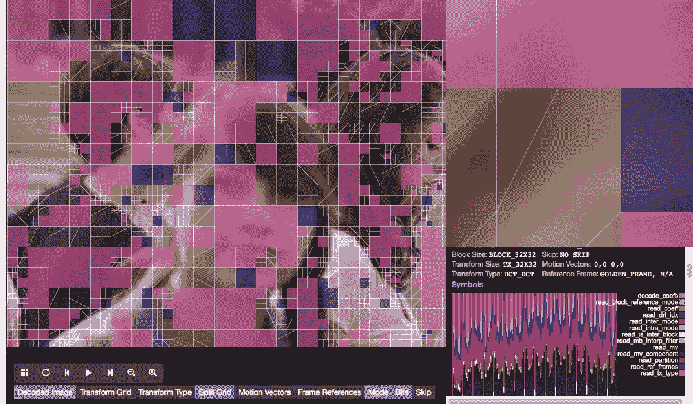
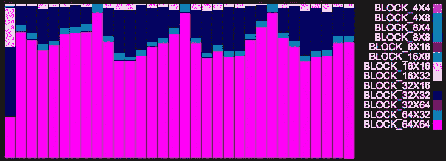
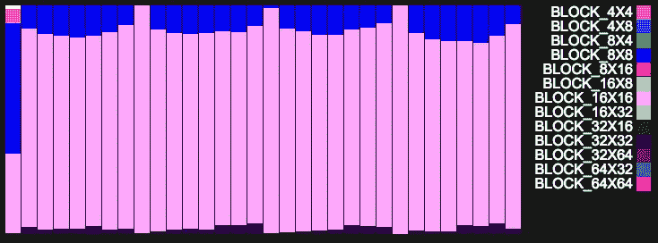
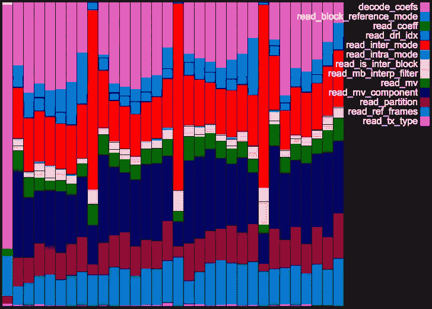

# AV1 比特流分析器

> 原文：<https://medium.com/hackernoon/av1-bitstream-analyzer-d25f1c27072b>



在 Mozilla，我们一直在努力开发新的 [AV1](https://en.wikipedia.org/wiki/AOMedia_Video_1) 视频编解码器。AV1 旨在比 HEVC (h.265)和 VP9 提高 25%的编码效率，由开放媒体联盟开发，Mozilla 是其中的一员。

AV1 是 VP9 的衍生版本，现在包括大量从[达拉](https://xiph.org/daala/)、[托尔](https://github.com/cisco/thor/commits/master)和 VP10 导入的附加编码工具和实验。这些实验以错综复杂和意想不到的方式相互作用，必须在各种各样的内容上仔细测试。这可能需要很长时间才能完成。单个视频帧有时可能需要一个多小时来编码，作为我们例行测试的一部分，我们编码了 30 个片段，每个片段包含 60 帧。编码过程是大规模并行的，并且在大量 AWS 实例上运行，但是即使有所有这些硬件，运行一个测试任务也可能需要几个小时甚至几天。

这种计算成本使得开发者在本地编码和分析视频变得不方便。但这也揭示了一个有趣的问题。如果我们所有的测试和构建基础设施都在云中运行，为什么不也在云中运行我们所有的分析工具呢？

我们在这方面的第一次尝试是比特流分析器。分析器解码 AV1 比特流，并显示关于比特流的各种细节。这些信息可以帮助编解码器工程师更容易地识别和修复错误。分析器的输入通常很小(一个编码的比特流)，但是输出非常大。例如，单个 1080p 视频帧会产生 4MB 的原始图像数据和大量的分析器元数据。如果分析器在本地运行，这通常不是问题，但是如果分析器在服务器上远程运行，那么带宽和延迟就成了大问题。

理想的解决方案是直接在浏览器中运行分析器，这样就不需要下载分析器的输出。要做到这一点，我们需要将分析器和编解码器移植到 [JavaScript](https://hackernoon.com/tagged/javascript) (幸运的是，我们有一个工具可以做到这一点，多亏了 [Alon Zakai](https://medium.com/u/649eac8108d2?source=post_page-----d25f1c27072b--------------------------------) 和许多其他工具，我们有了 [Emscripten](http://kripken.github.io/emscripten-site/) ，并在浏览器中运行它。

分析器由两个组件组成: *decoder.js* 它是编解码器的 Emscripten 编译版本和一个基于 HTML 的 UI 前端*。*

要分析一个视频，我们需要做的就是指定一个视频文件(在 **中)。试管婴儿*格式。)和一个合适的 *decoder.js* 文件对其进行解码。

```
analyzer.html?decoder=decoder.js&file=a.ivf&file=b.ivf
```

在上面的链接中，*analyzer.html*加载解码器，用它解码 2 个比特流 *a.ivf* 和 *b.ivf* 。或者，可以使用多个解码器来分析视频:

```
analyzer.html?decoder=aDec.js&file=a.ivf&decoder=bDec.js&file=b.ivf
```

这种方法的美妙之处在于，你可以轻松地分享解码视频的链接，所有这些都在浏览器中运行，不需要维护任何服务器基础设施。为提交给[AreWeCompressedYet.com](https://arewecompressedyet.com/)(AWCY)的编解码器的每个修订版自动生成解码器 JavaScript 文件，因此它们是可公开访问的。

# 瞧，点击我！

或者，你当然可以:

1.  按照这里的指示:[http://aomedia.org/contributor-guide/](http://aomedia.org/contributor-guide/)(如果你想帮忙，我推荐你这么做。)
2.  检查与您想要分析的编码视频兼容的特定编解码器版本。
3.  构建并运行假设的本地分析器。
4.  如果您想分享一些分析结果，请截图并分享，或请同事重复步骤 1 至 3。当然，他们不太可能这么做，因为这不仅仅是一次点击。

> 我在一家浏览器公司工作，所以我可能有偏见，但我认为这是网络最美好的一面。

Emscripten 通常用于将游戏或 C/C++库移植到 web，这确实没有什么不同，但这是一个稍微不同的用例，我以前没有见过。我们使用 Emscripten 来使我们的持续集成构建工件可运行和可共享，这多酷啊？打那个方便，土著！

# 摆弄分析器

所以让我们把比特流分析器拿出来转一转。下面，我们将比较两个比特流: *crosswalk_10.ivf* 和 *crosswalk_60.ivf.* 这两个视频使用相同的编码器版本进行编码，但采用两种不同的质量级别，分别为 10 和 60 QP(数字越低，质量越高)。分析器将块细节可视化为一组相互堆叠的层。


Crosswalk, Frame 1 @ 10 QP


Crosswalk, Frame 1 @ 60 QP

## 块分离层

AV1 中的最大块大小为 64x64，最小块大小为 4x4。(有实验扩大这个范围。)编码器使用大量因素来决定如何递归划分 64×64 块。但一般来说，我们可以从下面的图片中看到，细节较多的区域块大小较小，而细节较少的区域块大小较大。在较低质量的设置中，平均块大小较大，但同样的一般规则适用。块的大小很重要，因为这是编码器信号跳过信息、运动向量、预测模式、变换类型和其他类型信息的级别。块越小，编码器可以发送的细节就越多，但这也意味着编码器花费更多的比特来发送这些细节。下图显示了第一帧在两种质量水平下的块分割决策。


Block Split Decisions — Crosswalk, Frame 1 @ 10 QP


Block Split Decisions — Crosswalk, Frame 1 @ 60 QP

视频的第一帧是一个[帧内帧](https://en.wikipedia.org/wiki/Intra-frame_coding)，这意味着每个块都是从其周围的块(顶部和左侧)进行空间预测的。视频的第二帧是一个[帧间帧](https://en.wikipedia.org/wiki/Inter_frame)，这意味着它是从它之前(或之后)的帧预测的。第二帧(下图)的块分割决策很有趣，它们只反映了两帧之间发生变化的图像区域。前景中两个人的头部向右平移，因此变化的区域在头部轮廓周围。虽然脸部向右移动，但它不需要细粒度的块，因为它可以从先前的帧中粗略预测，而头部周围的区域则不能。


Block Split Decisions — Crosswalk, Frame 2 @ 60 QP

分析器可以将每个块大小覆盖的区域绘制成堆叠条形图。第一帧是这个视频序列是唯一的，因为它是一个帧内帧。它使用大致相等数量的 16×16、32×32、64×64 块。剩余的帧都是帧间帧，并且大部分使用 64×64 块。有趣的是，这里有一个重复出现的模式。在帧 8、16、24 等中似乎没有 32×32 块。我想知道为什么？这些都是分析器想要揭示的问题。这可能是编解码器的正常操作行为，也可能是一个错误。



Block Split Decisions — Crosswalk, 32 Frames @ 60 QP

在 QP 10 号，这看起来不同，但很相似。



Block Split Decisions — Crosswalk, 32 Frames @ 10 QP

## 预测模式层

每个块都有一个预测模式。对于帧内帧，这些包括方向预测模式，它们在每个块内被绘制为细线。彩色块使用 DC _ 预解码(粉红色)和 TM _ 预解码(蓝色)。


Intra Prediction Modes — Crosswalk, Frame 1 @ 60 QP

如果我们通过点击放大中心女士的眼睛，我们可以清楚地看到预测模式和最终由这些编码决策产生的编码伪像。


Intra Prediction Modes — Crosswalk, Frame 1 @ 60 QP


Intra Prediction Modes Artifacts— Crosswalk, Frame 1 @ 60 QP

帧间没有方向预测模式:白色(NEWMV)、蓝色(NEARMV)、酒红色(NEARESTMV)和紫色(ZEROMV)。


Inter Prediction Modes — Crosswalk, Frame 2 @ 60 QP

## 阻止信息详细信息

您可以通过单击某个块来获得该块的附加信息。例如，单击上面左上方的块(0x0)会显示以下块的详细信息。

```
Block:           0x0
Block Size:      BLOCK_64X64
Transform Size:  TX_32X32
Transform Type:  DCT_DCT
Mode:            ZEROMV
Skip:            NO SKIP
Motion Vectors:  0,0 | 0,0
Reference Frame: ALTREF_FRAME, N/A
```

这是判断颜色含义的简便方法。

## 运动矢量层

可以从其他帧预测帧间的块。每个块可以有 2 个运动矢量，这里显示为红线和蓝线的组合。颜色的强度代表矢量的大小。每个向量都是一个偏移量，从该偏移量可以预测块的内容。向量越长，运动越多。


Motion Vectors — Crosswalk, Frame 2 @ 60 QP

## 比特会计层

在 AV1 中，每当从比特流中读取符号时，解码器都会跟踪用于表示该符号的比特数。位核算信息具有块级上下文，这意味着分析器可以准确计算出每种符号类型在一个块中花费了多少位。在下表中，该比特计数信息是在整个帧上汇总的:读取了 458 个 *read_mv_component* 符号，总共 537 个比特，即花费在编码该帧上的所有比特的 28.5%。

```
Symbol                    Bits     %  Samples
read_mv_component          537  28.5      458
decode_coefs               393  20.8      431
read_inter_mode            315  16.7      538
read_partition             177   9.4      269
read_mv                    126   6.7       77
read_ref_frames            115   6.1      261
read_drl_idx                72   3.8       73
read_block_reference_mode   67   3.6      230
read_is_inter_block         40   2.1      236
read_mb_interp_filter       28   1.5      230
read_tx_type                 7   0.4        7
read_intra_mode              6   0.3       12
```

分析器还可以显示几帧的总比特信息。这在比较两个不同的比特流时很有用。这些图表是特意布置的，以便在视频之间切换时不会移动，从而更容易发现差异。



位核算信息也可以显示为一个层。突出显示的紫色区域表示帧内的位分布。


Bits Layer — Crosswalk, Frame 1 @ 60 QP

禁用图像会使 bit accounting 图层更加清晰可见。


Bits Layer — Crosswalk, Frame 1 @ 60 QP

如果我们看第二帧，我们会看到更亮的颜色区域。默认情况下，色阶和强度是根据相对于帧中最大比特/像素数的比特/像素数计算的。*位刻度*可调；

*   帧相对:默认情况下，这在分析单个帧内的位分布时很有用。
*   视频相关:计算视频序列中所有帧的最大比特/像素数。这在分析整个序列中的位分布时非常有用。
*   视频相对(全部):与视频相对相同，但所有当前加载的视频序列都用于计算比例。这在比较两个序列之间的帧时很有用。

如果我们看第二帧，我们看到它有更亮的颜色区域。这并不意味着它使用了更多的位，只是意味着帧中的大部分位花费在图像的较小区域中。

还可以调整颜色比例，默认情况下，分析仪使用带透明度的热图比例。蓝色多为半透明，红色区域为不透明。

*   单色:带透明度的单色。


*   热点图:默认，带透明度的热点图色阶。


Bits Layer — Crosswalk, Frame 2 @ 60 QP

*   热点图(不透明):没有透明度的热点图色标。


Bits Layer — Heat Map Opaque — Crosswalk, Frame 2 @ 60 QP

位核算层还允许您基于符号类型进行过滤。这有助于深入了解特定符号的位分布。例如，下面我们可以看到“read_mv”(读取运动矢量)符号的位分布。


Bits Layer — Heat Map Opaque — Filtered by “read_mv” — Crosswalk, Frame 2 @ 60 QP

## 跳过标志层

跳过标志用于指示一个块没有系数。跳过的块被绘制为蓝色，从下图中可以明显看出，跳过的块出现在图像中大多数为空的区域。如果我们还覆盖了位核算层，我们可以看到大多数位都用在了非跳过区域，这是意料之中的。


## 下一步是什么？

Emscripten 解码器足够快，可以使用，当然它还可以更快。在高位深度模式下，编解码器使用需要在 asm.js 中模拟的 64 位数学，因为它缺少 64 位整数数学。这目前会影响 10%到 20%的性能。WebAssembly 支持 64 位数学，一旦准备就绪，我们将切换到 WebAssembly。

可以想象，AV1 有大量的 SIMD 码路径。目前，我们禁用了分析器版本中的所有 SIMD。

如果你不想在你的浏览器中测量 raw 解码性能，你可以试试这个 [**基准链接**](https://beta.arewecompressedyet.com/analyzer.html?decoder=https://beta.arewecompressedyet.com/runs/av1_ref_off_intra_trellis_15f@2017-02-09T02:25:04.372Z/js/decoder.js&file=https://beta.arewecompressedyet.com/runs/av1_ref_off_intra_trellis_15f@2017-02-09T02:25:04.372Z/objective-1-fast/Netflix_Crosswalk_1920x1080_60fps_8bit_420_60f.y4m-63.ivf&benchmark=1) 。在我的机器上，火狐解码 15 帧需要 512 毫秒，Chrome 719 和 Safari 1044。

另一个性能问题是 YUV2RGB 转换。这段代码使用浮点数学，需要优化。

如果你想了解开放媒体联盟的进展，请看这个:

[](http://bit.ly/HackernoonFB)[](https://goo.gl/k7XYbx)[](https://goo.gl/4ofytp)

> [黑客中午](http://bit.ly/Hackernoon)是黑客如何开始他们的下午。我们是 [@AMI](http://bit.ly/atAMIatAMI) 家庭的一员。我们现在[接受投稿](http://bit.ly/hackernoonsubmission)并乐意[讨论广告&赞助](mailto:partners@amipublications.com)机会。
> 
> 如果你喜欢这个故事，我们推荐你阅读我们的[最新科技故事](http://bit.ly/hackernoonlatestt)和[趋势科技故事](https://hackernoon.com/trending)。直到下一次，不要把世界的现实想当然！

