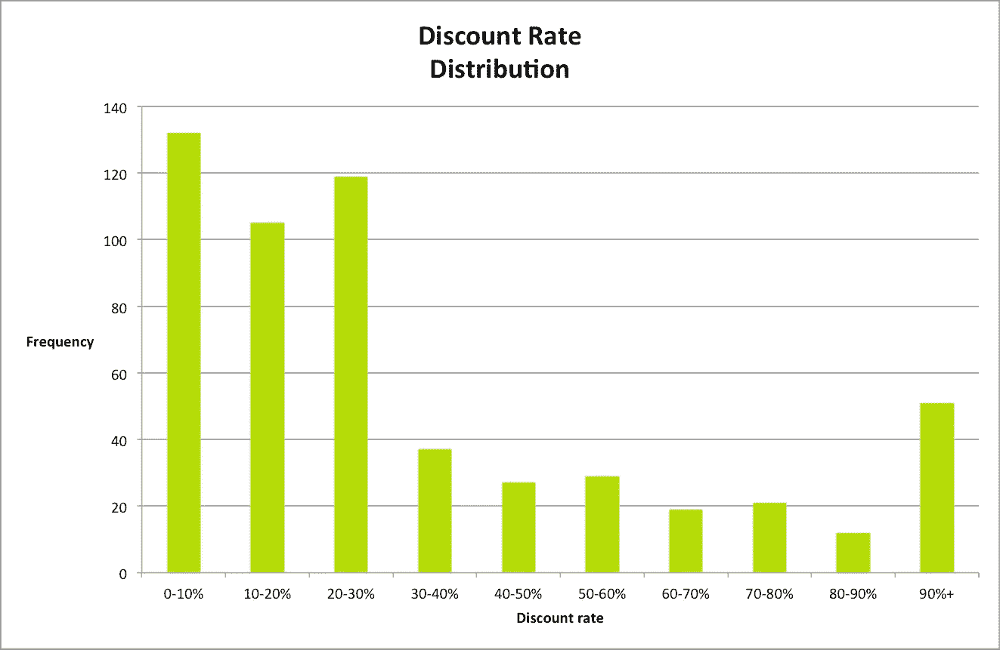
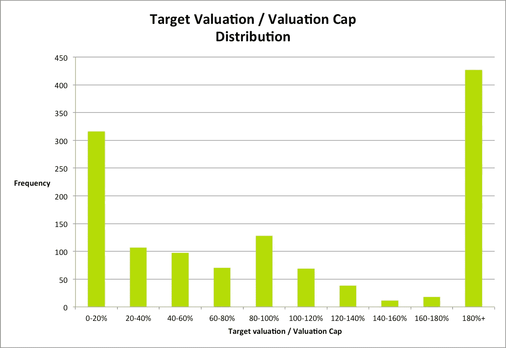

# 我们从计算器中学到的关于可兑换纸币的两件事

> 原文：<https://medium.com/hackernoon/average-discount-rate-for-a-convertible-note-928cecaadc04>

几周前，我们开发并发布了一款可兑换纸币计算器。这有助于制定方案和预测你的股票结果，但我们给了它一个扭曲。大多数计算器都是静态的，它们执行的是你在没有多少金融知识的情况下，用 excel 一个小时就能完成的工作。我们的是动态的，它将数据智能反馈给用户。

该工具提供了所有使用它的人的平均折扣率和估值/资本比率，因此提供了一个非常有趣的统计样本。

我想在下面总结一下我们用更批判性的眼光看待这些数据时发现的事情。

## 可转换票据的平均贴现率

当我们创造计算器时，我们有一个大问题。

**如果你必须给可转换债券定价，你会给投资者多少折扣？**

似乎是一个公平的问题。在这些谈判中，公平至关重要。那么，对你的投资者来说，什么是公平的折扣呢？或者市场对这些术语的看法是什么？发行可转换票据和转换之间的时间长度是多少？

事不宜迟，可转换票据的平均贴现率为 32.59%。

在 552 名用户的样本中，结果相当稳定，只有 35.51%的人在 30 岁到 90 岁之间，异常值会给投资者 100%的折扣(…)

我们可以看到，实际中值为 24.5%，分布向左倾斜，这意味着低折扣比大折扣更有可能。

Distribution of discount rates by users on Equidam’s Convertible Note Calculator

这些结果符合我们最初的想法，也符合你能在互联网上找到的少量信息。我们对此感到非常高兴。Equidam 的内部讨论和我们与其他创始人的会谈中都提到了可转换票据折扣率的问题。我们的希望是，这些平均统计数据将有助于许多创始人和投资者在为可转换债券定价时达成公平的妥协。

但我们不想就此止步，好吧，折扣很重要，但它不是敞篷车的唯一参数。

当与团队讨论这个问题时，我们对估值上限也有些疑惑。

## 人们如何给他们的可兑换纸币瓶盖定价？

我们很想研究这个问题，因为它可能有几种解释。看起来可转换债券要么被用于一轮即将到来的快速过渡融资，要么被用于避免种子阶段的估值讨论(在我们看来，这是选择可转换债券的一个很好的理由，更多信息请点击此处)。在这两种情况下，人们会如何设置上限？真的会接近目标估值吗？还是会低很多，从而给种子投资者更高的“溢价”？

数据再次帮助了我们。从下面的图表可以很容易地理解，人们倾向于做两件事——要么给上限定价远远高于他们的目标估值(10%到 20%的目标/上限)，要么在大约相同的价格(100%)。

有趣的是，这两种行为很可能与人们使用可转换债券的方式相吻合。

当用于过渡性贷款时，上限应设定在预测估值左右(因此为 100%)。可转换债券持有人将成为几个月的债务人，但不会长到对后续估值有很高的不确定性。

当用于种子资金时，上限的主要用途是防止公司增长极快时的大量种子损失，并以较高的估值筹集资金。在这种情况下，设定 5 或 10 倍于目标估值(10-20%)的上限正是这个目标。

> *你对这些比率有什么想法？你是如何给你的可转换票据定价的？您也可以随意尝试该工具，并在此查看实时图表***！**

*有趣的是，这些结果也符合初创企业领域的猜测，而且，如果我们是对的，可转换债券在很大程度上被用作种子资金。实际上，假设我们有一个全球创业公司的代表性样本，可转换票据似乎有 33.02%的时间用于种子资金，62.53%的时间用于过渡融资。*

# *结论*

*可转换票据仍主要用于早期融资。他们的平均贴现率(根据我们的数据)是 32.59%，基于 552 个数据点。我们希望这些信息对创业者和投资者的谈判有所帮助，我们也很想听听你的想法！*

**原载于 2016 年 2 月 25 日 www.equidam.com***。***

************

> **[黑客中午](http://bit.ly/Hackernoon)是黑客如何开始他们的下午。我们是 [@AMI](http://bit.ly/atAMIatAMI) 家庭的一员。我们现在[接受投稿](http://bit.ly/hackernoonsubmission)，并乐意[讨论广告&赞助](mailto:partners@amipublications.com)机会。**
> 
> **如果你喜欢这个故事，我们推荐你阅读我们的[最新科技故事](http://bit.ly/hackernoonlatestt)和[趋势科技故事](https://hackernoon.com/trending)。直到下一次，不要把世界的现实想当然！**

****