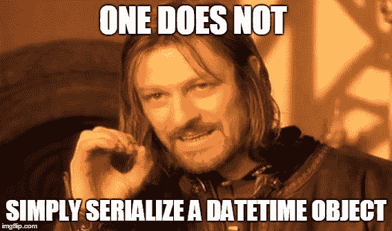
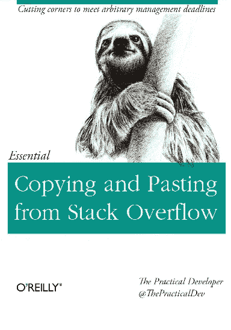

# 避免糟糕的约会，享受美好时光

> 原文：<https://medium.com/hackernoon/avoid-a-bad-date-and-have-a-good-time-423792186f30>


声明:这个帖子是针对编程中的 datetime 的。对于正常人的其他类型的约会，我完全没有建议(就像图片中的那个)

我使用术语“日期/时间”来表示从 Jon Skeet 的博客帖子中检索的“任何类型的时序信息”

向任何程序员询问他们处理日期和时间的经验，他们可能会分享一些战争故事。我记得在大学的头几年，我听说日期会让开发人员头疼，就像 c 语言中的指针一样。那时我还没有经历过，因为我还没有进入软件行业。后来我作为一名开发人员实习了一年，在那里我遇到了这些问题。我记得有一天，因为一个日期错误，我和我的主管(公司的一名高级开发人员)很晚才下班。最糟糕的是代码已经部署在实际环境中。这不是我加入公司以来遇到的第一个日期/时间问题，但却是最糟糕的一个。这促使我开设了一个问题帖 [Quora](https://www.quora.com/What-are-the-best-practices-when-working-with-datetime-to-avoid-bugs-and-errors-for-any-programming-language) ，试图从其他有经验的开发者那里获得最佳实践，以避免将来出现这样的问题。

从远古时代开始，日期时间就一直困扰着科学家。这是因为时间是复杂的，如果你认为我在说谎，试着理解相对论。


Time as interpreted by the master of time

日期一直是程序员的眼中钉，也许是因为他们通常不喜欢其他日期🙍。


证明就是千年虫。2000 年问题是一个计算机缺陷，或错误，可能在处理 1999 年 12 月 31 日以后的日期时造成问题。全世界的计算机程序员和用户在 2000 年 1 月 1 日面临的这个缺陷也被称为“千年虫”。它们是许多不太出名的其他日期错误。

关于解析和格式化日期/时间值，堆栈溢出有很多很多问题。这里的大多数参考资料都是用 python 编写的，但是大多数问题对于大多数处理 web 上的日期时间的编程语言来说都是通用的。避免此类陷阱的最佳方式是遵循编码最佳实践。开发人员的[实践](https://www.quora.com/What-are-the-best-practices-when-working-with-datetime-to-avoid-bugs-and-errors-for-any-programming-language)可能有所不同，但大多数都是相同的。

**日期时间面临的常见问题是由**造成的

*   时区问题
*   不一致的日期时间格式/模式
*   部署服务器和本地开发计算机上的不同区域设置
*   日期运算
*   传递给数据库的值与数据库中的实际类型不一致
*   日期时间序列化

避免日期时间错误最常见也是最好的方法是不要搬起石头砸自己的脚。


不要搬起石头砸自己的脚，我的意思是总是阅读你正在使用的框架或语言的文档。也要知道你所在的时区。我将简要地研究一些问题。其中大部分都有其他博客文章来解决这些问题。

## 时区

**时区**是地球上出于法律、商业和社会目的遵守统一[标准时间](https://en.wikipedia.org/wiki/Standard_time)的一个区域。时区倾向于遵循国家及其分支机构的边界，因为这样便于商业或其他交流密切的地区保持相同的时间。这让程序员很头疼，因为他们必须跟踪每个用户的不同时区。您的应用程序不应该处理没有时区信息的时间戳。对于 python 来说,[数据时间](https://docs.python.org/3.4/library/datetime.html)模块有两个日期时间对象，它们是天真的和有意识的。一个感知对象对适用的算法和政治时间调整有足够的了解，例如时区，以相对于其他感知对象定位自身。简单对象不包含足够的信息来明确地定位自己相对于其他日期/时间对象的位置。一个简单对象是表示协调世界时(UTC)、本地时间还是其他时区的时间完全取决于程序。简单的对象很容易理解和使用。对于时区感知对象，将 tzinfo 属性设置为抽象`[**tzinfo**](https://docs.python.org/3.4/library/datetime.html#datetime.tzinfo)` 类的子类的实例。标准库没有定义任何时区(至少没有很好地定义)。你可以在这里看到完整的博客文章。最好的处理方式是使用其他库，比如 dateutil 或 [pytz](http://pytz.sourceforge.net/) 。

```
>>import pytz
>>import datetime as dt
**>>def** **utcnow**():
    **return** dt**.**datetime**.**now(tz**=**pytz**.**utc)
>>utcnow()**.**isoformat()
'2017-06-06T14:45:21.982600+02:00'
```

如果您需要解析包含 ISO 8601 格式时间戳的字符串，您可以依靠 [*iso8601*](https://pypi.python.org/pypi/iso8601) ，它会返回带有正确时区信息的时间戳

对于 Django 应用程序，如果启用了对时区的支持，Django 会在数据库中以 UTC 格式存储日期时间信息，在内部使用支持时区的日期时间对象，并在模板和表单中将它们转换为最终用户的时区。要启用时区，请在设置文件中设置`[**USE_TZ = True**](https://docs.djangoproject.com/en/1.11/ref/settings/#std:setting-USE_TZ)`，并设置 TIME_ZONE = 'UTC '。

```
**from** **django.utils** **import** timezone

now = timezone.now()
```

## 不一致的日期时间格式/模式

日期时间的其他问题是由不一致的格式引起的。这种错误来自客户端。为用户创建日期输入字段时，不要让用户采用日期格式。为 U.I .使用一个 datepicker 库是明智的。他们有相当多的 datepicker 库，只选择一个你喜欢使用的。如果你不是美国人，我会建议你使用 dd/mm/yy 或 yy/mm/dd ISO 格式，因为美国人只是通过做不同的事情来寻求关注😒(随便说说)。我建议在整个平台上使用相同格式，即服务器端和客户端都使用相同的格式。

## 日期和时间序列化



近年来，JSON 已经成为一种相当流行的序列化格式，而且它确实是一种很好的格式。大多数原始数据类型很容易用 JSON 序列化。int 和 Strings 大多比较容易。约会吗？一场噩梦。因为日期是复杂的对象，所以它们总是如此。JSON 和 JavaScript 中日期的问题是 JavaScript 没有日期文字。为了在 JavaScript 中表示日期，JSON 使用特定的字符串格式 [ISO 8601](http://www.w3.org/TR/NOTE-datetime) 将日期编码为字符串。序列化部分非常简单，但是反序列化时会出现问题。

要用 JSON 对日期进行编码，可以使用 JSON 序列化程序的 stringify()方法。

```
var date = new Date();
console.log(date);   //Thu Jun 08 2017 16:25:36 GMT+0200 (South Africa Standard Time)

var json = JSON.stringify(date);
console.log(json);    //"2017-06-08T14:25:36.005Z"
```

当反序列化日期时，返回日期的字符串表示形式。

```
var dateStr = JSON.parse(json);  
console.log(dateStr); // "2017-06-08T14:25:36.005Z"
```

然而，通过将字符串传递给 JavaScript 日期构造函数，可以将日期转换回 JavaScript 日期。

```
var date = new Date(dateStr);
console.log(date);  //Thu Jun 08 2017 16:25:36 GMT+0200 (South Africa Standard Time)
```

我还记得第一次遇到这个问题是在从。Net WebForm 并在我的 ajax 调用后得到了`/Date(1245398693390)/` 。幸运的是,[斯达克弗洛](https://stackoverflow.com/questions/1016847/converting-net-datetime-to-json)在那里拯救了我们。



I had to do something somewhat similar to this to solve the issue

事实证明，这个有趣的输出实际上是从 epoch 开始的毫秒数。

使用 python 序列化 datetime 对象会引发 TypeError。

>>>导入 json
> > >导入日期时间
> > >现在= datetime . datetime . now(datetime . time zone . utc)
>>>JSON . dumps(现在)

type error:datetime . datetime(2017，6，9，8，27，26，832835，tzinfo=datetime.timezone.utc)不是 JSON 可序列化的

要解决这个问题，请将 datetime 解析为 isoformat 对象，因为 json 日期是 ISO 字符串。

now =日期时间.日期时间. now(日期时间.时区. utc)。等格式()

## 结论

这些是初级开发人员在开始时面临的一些日期问题。我没有穷尽所有的列表，但是下面是一些其他的博客文章和视频，可以帮助你了解更多关于 datetime 的内容。

*   [马里奥·科切罗 2017 年 PyCon 日期时间到了](https://www.youtube.com/watch?v=2BRdKf6WYIQ&t=1041s)
*   [时区和 Python](https://julien.danjou.info/blog/2015/python-and-timezones)
*   [JavaScript JSON 日期解析和真实日期](https://weblog.west-wind.com/posts/2014/jan/06/javascript-json-date-parsing-and-real-dates)
*   [日期/时间格式和解析中的常见错误](https://codeblog.jonskeet.uk/2015/05/05/common-mistakes-in-datetime-formatting-and-parsing/)

[](http://bit.ly/HackernoonFB)[](https://goo.gl/k7XYbx)[](https://goo.gl/4ofytp)

> [黑客中午](http://bit.ly/Hackernoon)是黑客如何开始他们的下午。我们是 [@AMI](http://bit.ly/atAMIatAMI) 家庭的一员。我们现在[接受投稿](http://bit.ly/hackernoonsubmission)并乐意[讨论广告&赞助](mailto:partners@amipublications.com)机会。
> 
> 如果你喜欢这个故事，我们推荐你阅读我们的[最新科技故事](http://bit.ly/hackernoonlatestt)和[趋势科技故事](https://hackernoon.com/trending)。直到下一次，不要把世界的现实想当然！

